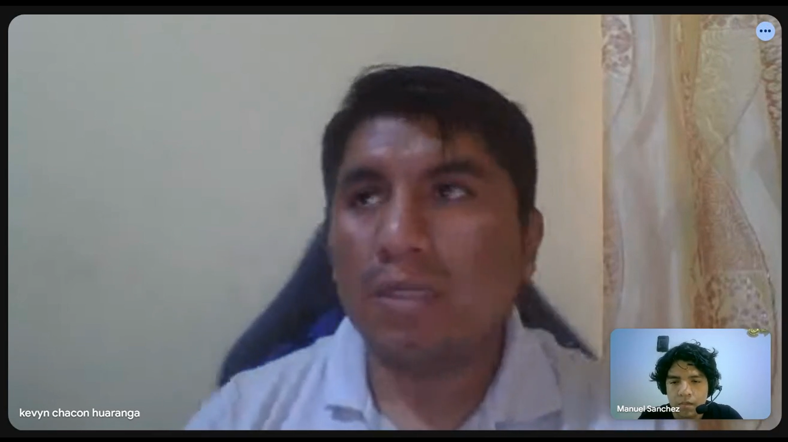
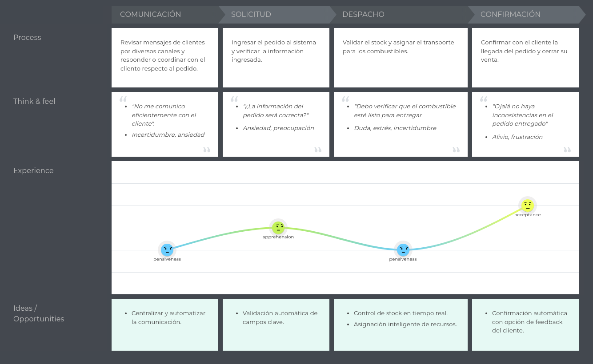

# Capítulo II: Requirements Elicitation & Analysis 
## 2.1. Competidores.

PetroApp es una plataforma digital que facilita la compra y venta de combustible, principalmente orientada a consumidores finales y estaciones de servicio. Permite ubicar estaciones cercanas, gestionar pagos electrónicos y controlar el consumo desde una app. Esta enfocada principalmente en el uso personal, pero también ofrece soluciones para empresas, con funcionalidades que permiten cierta trazabilidad y control, aunque con menos enfoque en el flujo completo del pedido corporativo.

FuelCloud es una solución tecnológica centrada en el control del despacho de combustible mediante una combinación de hardware y software. Este ofrece monitoreo en tiempo real, control de acceso al combustible, reportes detallados de consumo y ubicación, lo que la hace ideal para empresas con tanques propios. Además, se enfoca más en el control físico del combustible que en la gestión administrativa o logística del pedido entre proveedor y cliente.

Wialon es una plataforma global de gestión de flotas que incluye funcionalidades para el control de combustible, seguimiento de vehículos por GPS, y análisis de consumo. Ofrece herramientas de visualización en tiempo real, alertas automatizadas y reportes avanzados. Si bien no gestiona directamente el flujo de pedidos entre proveedores y solicitantes, es altamente utilizada por empresas distribuidoras y logísticas que transportan combustible, lo que la convierte en un competidor indirecto pero funcionalmente cercano a FuelTrack.

### 2.1.1. Análisis competitivo.

| Competitive Analysis Landscape | 
--------------------------------------------|
| **¿Por qué llevar a cabo este análisis?** |
|Este análisis se está llevando a cabo porque queremos conocer las ventajas y desventajas de nuestra aplicación frente a la competencia, y cómo nos diferenciamos de ellas.

| **Categoría** | **FuelTrack** | **Zavgar** |  **FuelCloud** | **Wialon** |
| ------------- |----------------- |------------------|------------------|------------------------|
| **Overview** | Plataforma web que digitaliza y estructura el proceso completo de pedido de combustible entre empresas y proveedores. | SaaS para la gestión de consumo de combustible de flotas, con enfoque en eficiencia, monitoreo y costos. | Solución con hardware/software para el control físico del despacho de combustible.| Plataforma de gestión de flotas con control de combustible, GPS y reportes operativos. |
| **Ventaja competitiva** | Especialización en el flujo completo de pedido, despacho y análisis; integración de pagos y logística; UI intuitiva. | No requiere hardware; ofrece métricas, control de gastos y reportes sobre consumo. | Control físico preciso del combustible, monitoreo en tiempo real. | Seguimiento en tiempo real, visualización de rutas, integración con sensores de combustible. |
| **¿Qué valor ofrece al cliente?** | Trazabilidad total, eficiencia operativa, reportes de consumo y validación segura de pedidos. | Optimización de costos y control sobre el uso de combustible en flotas. | Seguridad y precisión operativa en el control de combustible. | Trazabilidad de flotas, alertas automáticas, análisis de rutas y consumo de combustible. |
| **Mercado objetivo** | Empresas que solicitan combustible a proveedores. | Empresas con flotas vehiculares que desean monitorear y reducir el consumo de combustible. | Empresas con tanques de combustible propios. | Empresas logísticas, distribuidoras y de transporte de combustible. |
| **Estrategias de marketing**| Alianzas con proveedores, demostraciones de ahorro, marketing de contenido enfocado en eficiencia. | Enfoque digital, contenido técnico, integración con proveedores de tarjetas de combustible. | Ferias industriales, distribuidores, venta consultiva entre empresas. | Alianzas con distribuidores de GPS, marketing técnico, ferias de transporte. |
| **Productos & Servicios** | Plataforma para gestión completa de pedidos, seguimiento, reportes, validación y alertas. | Plataforma web con módulo de abastecimiento, reportes de consumo, integración GPS y tarjetas. | Hardware IoT y software para gestión, y control de combustible. | Plataforma SaaS + app móvil con monitoreo, alertas, mapas y módulos personalizables. |
| **Precios & Costos** | Modelo SaaS con suscripción escalable según volumen y servicios. | SaaS con modelos por flota activa o vehículos monitoreados. | Venta e instalación de hardware + licencias de software. | Modelo SaaS modular, basado en vehículos activos y funcionalidades activadas. |
| **Canales de distribución** | Web app responsive, potencial app móvil futura. | Web app, marketing digital y comunidad de flotas. | Plataforma web + hardware instalado en sitio. | Red de partners global, distribuidores locales e integradores de sistemas GPS. |
| **Fortalezas** | Enfoque especializado, experiencia de usuario optimizada, integraciones clave, análisis avanzado de consumo. | Implementación ágil, sin hardware, fácil adopción en empresas medianas. | Control físico riguroso, solución probada en industrias exigentes.| Plataforma robusta, cobertura internacional, integración con más de 2,400 dispositivos GPS. |
| **Debilidades** | Nueva en el mercado, menor reconocimiento de marca, necesita consolidar confianza. | No gestiona el flujo completo del pedido, enfoque parcial en flotas. | Alto costo, dependencia de hardware, menor adaptabilidad en mercados emergentes. | No gestiona pedidos entre proveedor y solicitante, requiere configuración técnica inicial. |
| **Oportunidades** | Alta informalidad en el sector, digitalización creciente en logística, necesidad de trazabilidad y control. | Mayor conciencia en eficiencia de flotas y digitalización de costos operativos. | Nuevos mercados industriales con enfoque en seguridad y control. | Creciente necesidad de control logístico y monitoreo de distribución en países en desarrollo. |
| **Amenazas**  | Aparición de soluciones similares, resistencia al cambio en empresas tradicionales, competencia ERP. | SaaS especializados con mayor cobertura funcional (ERP, proveedores, logística). | SaaS ágiles y sin hardware físico, que ofrecen soluciones más accesibles. | SaaS más específicos y ligeros, enfocados exclusivamente en la trazabilidad de entregas. |

### 2.1.2. Estrategias y tácticas frente a competidores.

#### a. Diferenciación a través de especialización
Una de las principales estrategias de **FuelTrack** es la **especialización en el flujo completo de pedido de combustible**. A diferencia de soluciones como **Zavgar**, que están orientadas principalmente al control y análisis del consumo de combustible en flotas, nuestra plataforma se enfoca en las **interacciones B2B** entre empresas solicitantes y proveedores. Esto nos permite ofrecer un **control dedicado del pedido**, **gestión de la logística**, y **reportes detallados de consumo y entregas**, lo cual no está presente en la mayoría de las plataformas competidoras.

- **Táctica**: Desarrollar funcionalidades para la **validación automática de pagos**, **gestión de stock en tiempo real** y la **optimización del transporte** logrando la automatización de procesos que solo eran logrados de forma manual. Esto crea una ventaja frente a competidores como **FuelCloud**, que se centran más en el control físico del combustible y menos en la administración a nivel operativo.

#### b. Innovación en la interfaz de usuario y experiencia

El sistema de **FuelTrack** está diseñado para ofrecer una **experiencia de usuario optimizada**, algo que **Wialon**, **FuelCloud** y la propia **OSINERGMIN** no abordan en sus plataformas. Al ser una solución especializada y dirigida a una tarea específica, podemos dedicar más recursos en crear una interfaz intuitiva y procesos bien definidos brindando comodidad y seguridad a nuestros usuarios.

- **Táctica**: Diseñar una **interfaz intuitiva y consistente** que permita a los usuarios acceder a reportes de consumo, validar pedidos y coordinar logística con facilidad. Además, ofrecer **soporte y formación continua** para asegurar que los usuarios aprovechen al máximo todas las funcionalidades del sistema.

#### c. Flexibilidad en precios y modelo SaaS escalable
El modelo de precios de **FuelTrack** ofrece **planes escalables basados en suscripción**, lo que hace que sea más accesible para medianas y grandes empresas. Esto es más competitivo frente a **Wialon**, que puede no ser una opción viable para empresas que solo requieren una solución de pedidos de combustible. También es más asequible que **FuelCloud**, que requiere una inversión considerable en hardware, instalación y mantenimiento.

- **Táctica**: Ofrecer un modelo de suscripción flexible y **precios competitivos**, con **múltiples niveles de suscripción** adaptados a las necesidades de diferentes empresas. Esto permitirá que empresas de menor tamaño puedan acceder a la plataforma sin comprometer su presupuesto, a la vez que se asegura el crecimiento a largo plazo a medida que la empresa crece.

#### d. Aprovechamiento de la digitalización en la logística
El sector de la logística está experimentando una transformación digital acelerada. **FuelTrack** se aprovechará de esta tendencia buscando la integración de la plataforma con otras soluciones logísticas (como los sistemas de gestión de vehículos o flotas). De esta forma podemos ofrecer una solución más completa y eficiente.

- **Táctica**: Colaborar con empresas de **gestión de flotas** para optimizar el proceso de asignación de vehículos, cisternas y choferes. También se considerará la posibilidad de integrar **sensores IoT** en los camiones de reparto para un control más preciso sobre el combustible transportado y la entrega.

#### e. Expansión hacia mercados internacionales
Si bien **FuelTrack** está inicialmente orientada a empresas locales, el modelo de negocio y la flexibilidad de la plataforma la hacen ideal para expandirse a **mercados internacionales**. Competidores como **Wialon** ya tienen presencia en mercados globales, pero su enfoque en empresas grandes y sus altos costos de implementación pueden ser una barrera para empresas de menor tamaño, limitando su alcance.

- **Táctica**: Iniciar la expansión en mercados emergentes donde la digitalización en la logística es una necesidad creciente. Esto incluirá la **localización de la plataforma** (idioma, moneda, regulaciones locales) para facilitar la adaptabilidad de los nuevos mercados.

## 2.2. Entrevistas.
### 2.2.1. Diseño de entrevistas.

Para comprender mejor a nuestros segmentos objetivo y construir arquetipos precisos, se han definido dos entrevistas diferenciadas según el segmento objetivo:
1. Proveedores de combustible
2. Empresas solicitantes con contratos de suministro (clientes corporativos)

##### A. Proveedores de Combustible
- Preguntas principales:
1. ¿Cómo gestionan actualmente los pedidos de las empresas clientes? ¿Utilizan un sistema específico para gestionarlos? ¿Cómo es el flujo desde la solicitud hasta la entrega?
2. ¿Utilizan algún sistema digital para registrar pedidos o todo se maneja de manera manual? ¿Qué herramientas usan actualmente (si aplican)?
3. ¿Cuáles son los pasos que siguen desde que un cliente hace un pedido hasta que se entrega? ¿Cuánto tiempo toma todo el proceso?
4. ¿Cómo controlan que lo despachado coincida con lo solicitado por el cliente? ¿Tienen algún tipo de verificación o control de calidad?
5. ¿Qué tipo de reportes necesitan generar para el seguimiento de pedidos? Ejemplo: volúmenes, facturación, entregas, incidencias, etc.
6. ¿Tienen un sistema para validar el stock antes de preparar el despacho de un pedido? ¿Cómo gestionan las existencias?
7. ¿Cómo hacen el seguimiento de los pedidos? ¿Informan al cliente en tiempo real sobre el estado de su pedido? ¿Qué sistema o metodología usan para actualizar al cliente?
8. ¿Qué problemas suelen ocurrir durante el proceso de atención de pedidos empresariales? Ejemplo: retrasos, errores en la entrega, problemas con la facturación.
9. ¿Cómo se realiza la conciliación de pagos con los clientes? ¿Tienen un proceso automatizado o lo hacen manualmente?
10. ¿Estarían dispuestos a integrar su sistema actual con una plataforma SaaS que unifique y centralice estos procesos? ¿Por qué? ¿Qué beneficios ven en esta integración?

- Preguntas complementarias:
1. ¿Qué canales de comunicación prefieren utilizar (correo, llamadas telefónicas, WhatsApp, etc.)?
2. ¿Qué dispositivos utilizan para gestionar los pedidos (PC, móvil, tablet)?
3. ¿Quién dentro de su equipo gestiona y valida los pedidos y entregas?
4. ¿Qué tan frecuente es el contacto con los clientes para resolver problemas o inquietudes con las entregas?
5. ¿Qué tan abierta están a utilizar una plataforma digital que centralice la gestión de pedidos y la comunicación con los clientes?

##### Datos demográficos y psicográficos a recolectar:
- Demográficos:

  - Edad, género.
  - Distrito o ciudad de operación.
  - Tamaño y cobertura de la empresa.
  - Cargo del entrevistado dentro de la empresa.

- Psicográficos:

  - Nivel de familiaridad con herramientas digitales.
  - Canales de comunicación más usados y preferidos.
  - Frustraciones actuales con el proceso de pedidos.
  - Objetivos operativos y prioridades en el servicio a clientes.
  - Nivel de satisfacción con el sistema actual de gestión de pedidos.
  - Disposición a adoptar nuevas tecnologías.

##### B. Empresas Solicitantes de Combustible
- Preguntas principales:
1. ¿Cómo solicitan actualmente combustible a su proveedor? ¿Qué sistema o canal usan (llamadas, correo, WhatsApp, etc.)?
2. ¿Utilizan algún sistema propio para realizar los pedidos o prefieren canales informales como correo, WhatsApp, etc.? ¿Qué tan eficiente consideran este proceso?
3. ¿Cómo verifican que lo entregado coincida con lo solicitado? ¿Tienen un sistema de control o verificación?
4. ¿Tienen problemas frecuentes con entregas incompletas o fuera de tiempo? ¿Qué impacto tiene esto en su operación?
5. ¿Con qué frecuencia necesitan reportes de consumo, entregas o pagos? ¿Qué tipo de reportes y con qué frecuencia los requieren?
6. ¿Qué tan importante es para ustedes tener trazabilidad de cada entrega (por ejemplo, saber el tiempo de despacho, cantidad exacta entregada)? ¿Qué valor le dan a la trazabilidad en el proceso?
7. ¿Quiénes dentro de su empresa son responsables de validar los pedidos y autorizar los pagos? ¿Es un proceso centralizado o distribuido?
8. ¿Cómo gestionan las reprogramaciones o cancelaciones de pedidos? ¿Cuál es el procedimiento en caso de cambios de último minuto?
9. ¿Qué herramientas utilizan para monitorear el consumo mensual de combustible? ¿Existen sistemas o aplicaciones para monitorear consumo?
10. ¿Qué mejoras desearían ver en el proceso actual de pedidos y seguimiento de entregas? ¿Qué aspectos mejorarían en la trazabilidad, tiempos o comunicación?

- Preguntas complementarias:
1. ¿Qué dispositivos prefieren usar para gestionar los pedidos y pagos (PC, tablet, móvil)?
2. ¿Cuál es su experiencia con plataformas digitales para pedidos o gestión de servicios?
3. ¿Qué canales prefieren para recibir confirmaciones o actualizaciones sobre los pedidos (notificaciones push, correos electrónicos, llamadas, etc.)?
4. ¿Cómo se gestionan internamente los reportes y la facturación del consumo de combustible?
5. ¿Qué tan abiertas están a integrar una nueva solución tecnológica para mejorar la trazabilidad y eficiencia de los pedidos?

##### Datos demográficos y psicográficos a recolectar:
- Demográficos:

  - Edad, género.
  - Distrito o ciudad de operación.
  - Tamaño y cobertura de la empresa.
  - Cargo del entrevistado dentro de la empresa.

- Psicográficos:

  - Nivel de experiencia con herramientas digitales.
  - Canales preferidos para la gestión de pedidos y comunicaciones.
  - Frustraciones actuales con el proceso de solicitud y entrega de combustible.
  - Objetivos operativos a corto y largo plazo (optimización de tiempos, reducción de costos, etc.).
  - Influencia de factores externos en el proceso de compra (presupuesto, normativas, expectativas de los clientes).
  - Disposición a adoptar nuevas tecnologías.

---

### 2.2.2. Registro de entrevistas.

En esta sección se incluyen las fichas de User Persona elaboradas con base en el análisis detallado de las entrevistas realizadas a los segmentos identificados y el estudio de la competencia directa e indirecta. A partir de la información recolectada, se han identificado las principales características objetivas como edad, ocupación, nivel educativo, ubicación geográfica, estado civil, uso de dispositivos tecnológicos, canales de interacción digital y navegadores preferidos; así como características subjetivas como personalidad, habilidades, frustraciones, objetivos, marcas de preferencia e influencias. Estos perfiles representan de forma precisa a los usuarios reales del sistema, permitiendo que las decisiones de diseño, funcionalidades y experiencia de usuario estén enfocadas en resolver sus verdaderas necesidades, comportamientos y motivaciones.

#### Entrevista N°1 – Segmento: Proveedores
 
- Nombres: Jorge Luis
- Apellidos: Binda
- Edad: 27 años
- Distrito: Lima
- URL Entrevista: https://tinyurl.com/EntrevistasGrupo4
- Duración: 00:06:00 minutos - minuto de inicio: 00:00:00
- Resumen: 
    Jorge menciona que tiene más de 10 años de experiencia en el área de logística. Indica que utiliza plataformas como Excel, WhatsApp y Outlook para desempeñar su rol, y de esta manera realiza el seguimiento de los pedidos a sus clientes, aunque no en tiempo real. Jorge también señala algunos problemas que afectan su puesto, como la falta de comunicación con el cliente y fallos en el stock. Además, considera que una plataforma como la nuestra podría reducir los errores y facilitar todo el proceso, siempre y cuando no sea muy complicada de implementar.

---

#### Entrevistado N°2 - Segmento: Empresas solicitantes
 
- Nombre: Javier
- Apellidos: Hernandez
- Edad: 23 años
- Distrito: Lima
- URL Entrevista: https://tinyurl.com/EntrevistasGrupo4
- Duración: 00:07:49 minutos - minuto de inicio: 00:06:00
- Resumen: 
   Javier comenta que trabaja en el área de logística, función en la que se encarga del inventario, así como de organizar el suministro de combustible para las diferentes maquinarias que requiere la empresa. Menciona que no cuentan con un sistema propio y, al tratarse de grandes cantidades de combustible, necesitan que un representante de la empresa esté presente, lo cual retrasa las operaciones. Además, comenta que esto les ha generado problemas legales debido a la falta de confirmación de identidad y de comunicación, por lo que considera que un software de gestión sería de gran ayuda.
---

#### Entrevistado N°3
 
- Nombres: Zahir
- Apellidos: Sanchez
- Edad: 19 años
- Distrito: Lima
- URL Entrevista: https://tinyurl.com/EntrevistasGrupo4
- Duración: 00:05:35 - minuto de inicio: 00:13:50
- Resumen: 
    Zahir es encargado del registro de pedidos de Petromax, que se dedica a la venta de combustible. Maneja los pedidos de forma semimanual ya que estos llegan primero a través de correo y luego su información pasa a su sistema interno. Tiene la necesidad de generar reportes tanto mensualmente como diariamente, y principalmente deben mostrar datos de ventas y consumo. Siente que es un gran problema el registro de pedidos, ya que cuando identifican un error de información, el pedido se encuentra en estado avanzado. Siente que seríal ideal centralizar todos estos procesos, principallmente por el registro y la conciliación de pagos.
    

---

#### Entrevistado N°4
 
- Nombres: Kevyn
- Apellidos: Chacon
- Edad: 31 años
- Distrito: Lima
- URL Entrevista: https://tinyurl.com/EntrevistasGrupo4
- Duración: 00:07:06 - minuto de inicio: 00:19:26
- Resumen: 
    Kevyn es un parte del area de operaciones de Energex que utiliza combustible para sus vehículos. Recibe los pedidos por correo y usa Excel para su registro y gestión. Se siente frustrado por la dificultad para hacer una gestión de las solicitudes de combustible. Es necesaria la comunicación con sus clientes para que estén al tanto del despacho de sus pedidos. Cree que una solución como FuelTrack podría ayudar a mejorar la comunicación con los proveedores y optimizar el proceso de pedidos.

---

#### Entrevistado N°5
 
- Nombres: Grover
- Apellidos: Manosalva
- Edad: 33 años
- Distrito: Lima
- URL Entrevista: https://tinyurl.com/EntrevistasGrupo4
- Duración: 00:15:43 - minuto de inicio: 00:26:33
- Resumen: 
    Grover menciona que trabaja en Petroperú y que requieren un suministro constante de combustible para la maquinaria. Explica que actualmente utilizan una plataforma interna para gestionar los pedidos, la cual permite que estos pasen por diferentes etapas de aprobación y seguimiento. Sin embargo, señala que cuando trabaja en provincias, en ocasiones el suministro no llega hasta su lugar de trabajo, lo que genera inconvenientes en las operaciones. A pesar de contar con un sistema, considera que aún hay oportunidades de mejora en cuanto a la logística y cobertura del servicio.

---

#### Entrevistado N°6
 
- Nombres: Aleskha
- Apellidos: Fernandez
- Edad: 32
- Distrito: San Borja
- URL Entrevista: https://tinyurl.com/EntrevistasGrupo4
- Duración: 00:05:09 - minuto de inicio: 00:42:15
- Resumen: 
      Aleskha menciona que utiliza herramientas de Microsoft para realizar su trabajo, apoyándose principalmente en Excel para llevar un control interno. Sin embargo, señala que no cuentan con un sistema propio, por lo que realiza los pedidos a su proveedor mediante WhatsApp. Entre los principales problemas que enfrenta se encuentran la falta de confirmación, los retrasos en los tiempos de entrega y la necesidad de estar constantemente dando seguimiento para obtener los informes. Asimismo, a veces tienen fallos en el contenido del pedido siendo este menos de lo solicitado.
  
---

### 2.2.3. Análisis de entrevistas.

#### <u>SEGMENTO 1: Empresas solicitantes de combustible</u>

#### Características objetivas:

| Variable | Porcentaje | Observaciones |
|----------|------------|---------------|
| Edad entre 30 y 45 años | 100% | Todos los entrevistados tienen entre 33 y 45 años. |
| Cargo relacionado a logística | 100% | Los tres pertenecen a áreas de operaciones o logística. |
| Usa computadora y celular | 100% | Todos usan laptop/PC y móvil para sus actividades. |
| Utiliza WhatsApp para coordinar | 66% | 2 de 3 lo usan como canal principal con el proveedor. |
| Manejo de hojas Excel o Google | 100% | Todos gestionan sus pedidos manualmente en planillas. |
| Nivel medio de familiaridad digital | 100% | Dominan software básico (Drive, correo, hojas de cálculo). |

#### Características subjetivas:

| Variable | Porcentaje | Observaciones |
|----------|------------|---------------|
| Necesita trazabilidad del pedido | 100% | Todos demandan claridad en el estado y avance del pedido. |
| Frustración por depósitos no validados | 66% | 2 de 3 se quejan de retrasos debido a validación manual. |
| Deseo de un sistema unificado | 100% | Los 3 expresaron querer centralizar todo el proceso. |
| Receptividad positiva a tecnología | 100% | Todos están abiertos a soluciones digitales con buena UX. |

#### <u>SEGMENTO 2: Proveedores de combustible</u>

#### Características objetivas:

| Variable | Porcentaje | Observaciones |
|----------|------------|---------------|
| Edad entre 39 y 48 años | 100% | Todos en este rango. |
| Cargo en operaciones/logística | 100% | Incluye jefes de planta, despacho o ventas. |
| Utiliza laptop/PC y celular | 100% | Equipamiento estándar en planta o administración. |
| Nivel de digitalización medio | 66% | 2 de 3 usan sistemas propios o ERPs básicos. |
| Gestión mediante correo y llamadas | 100% | El proceso actual es altamente manual. |

#### Características subjetivas:

| Variable | Porcentaje | Observaciones |
|----------|------------|---------------|
| Problemas con conciliación bancaria | 100% | Todos mencionan validación lenta de pagos como cuello de botella. |
| Necesidad de validar stock antes de liberar | 66% | 2 de 3 destacaron esto como un punto crítico. |
| Dificultades en la asignación de vehículos | 66% | Errores de programación y disponibilidad afectan la entrega. |
| Deseo de automatización de procesos | 100% | Todos visualizan mejoras en eficiencia si se digitalizan etapas clave. |

## 2.3. Needfinding.
### 2.3.1. User Personas.

a. User Persona 1: Empresas solicitantes de combustible

b. User Persona 2: Proveedores de combustible

### 2.3.2. User Task Matrix.

| **Tarea**                                      | **David Miller – Frecuencia** | **David Miller – Importancia** | **Ana Pérez – Frecuencia** | **Ana Pérez – Importancia** |
|------------------------------------------------|-------------------------------|---------------------------------|-----------------------------|------------------------------|
| Revisar nivel de stock de combustible          | Alta | Alta | Baja | Baja |
| Realizar pedido de combustible                 | Media | Alta | Alta | Alta |
| Validar confirmación de pedido                 | Alta | Alta | Alta | Alta |
| Hacer seguimiento a la entrega                 | Alta | Alta | Alta | Alta |
| Supervisar descarga y recepción                | Media | Alta | Media | Media |
| Evaluar proceso post-servicio                  | Baja | Media | Alta | Alta |
| Gestionar atención al cliente                  | Media | Alta | Alta | Alta |
| Revisar encuestas o feedback                   | Baja | Media | Media | Alta |

### 2.3.3. User Journey Mapping.

En el caso del **solicitante**, el recorrido empieza con la generación de un pedido por correo o llamada, seguido por la validación manual del depósito, la espera de aprobación por parte del proveedor, la coordinación del despacho, y finalmente el registro manual de la entrega.

En el caso del **proveedor**, el flujo parte desde la recepción del pedido, luego incluye la verificación del estado de cuenta, la aprobación manual, la asignación de planta y vehículo, y en muchos casos, la reprogramación por problemas de disponibilidad.

a. User Persona 1: User Persona 1 - Solicitante de Combustible

b. User Persona 2: User Persona 2 - Proveedor de Combustible

## 2.3.4. Empathy Mapping.

## 2.3.5. As-is Scenario Mapping.

### Escenario As-is (Segmento: proveedores de combustible)

### Escenario As-is (Segmento: Solicitantes de combustible)

## 2.4. Ubiquitous Language.

| Término | Definición | Segmentos relacionados |
|---------|------------|------------------------|
| **Requester (Solicitante)** | Usuario representante de una empresa requiere abastecimiento de combustible | Solicitante |
| **Supplier (Proveedor)** | Empresa que ofrece combustibles al por mayor y compite mediante precios, descuentos y promociones. | Proveedor |
| **Fuel (Combustible)** | Recurso energético que es ofertado por los proveedores. Ejemplos: gasohol, diésel, GNV. | Solicitante, Proveedor |
| **Plant (Planta)** | Punto de distribución del combustible perteneciente a al proveedor. | Solicitante, Proveedor |
| **Price per gallon (Precio por galón)** | Valor económico que el proveedor establece por cada galón de combustible. Puede variar según planta, tipo de combustible, etc. | Solicitante, Proveedor |
| **Discount (Descuento)** | Reducción aplicada sobre el precio ofrecido, ya sea por volumen, fidelización u otras condicioens. | Solicitante, Proveedor |
| **Quotation (Cotización)** | Propuesta formal que un proveedor genera detallando precios, productos, entre otras condiciones | Solicitante, Proveedor |
| **Price Table (Tabla de precios)** | Grilla o tabla que muestra los precios ofrecidos por planta, proveedor y tipo de combustible. | Solicitante |
| **Negotiation (Negociación)**   | Intercambio de condiciones entre solicitante y proveedor para alcanzar un acuerdo favorable para ambas partes. | Solicitante, Proveedor |
| **Consumption Volume (Volumen de consumo)** | Cantidad de combustible estimada que una empresa solicita regularmente en un periodo determinado. | Solicitante |
| **Purchase History (Historial de compras)** | Registro de cotizaciones y compras o pedidos previos hechos por el solicitante dentro del sistema. | Solicitante |
