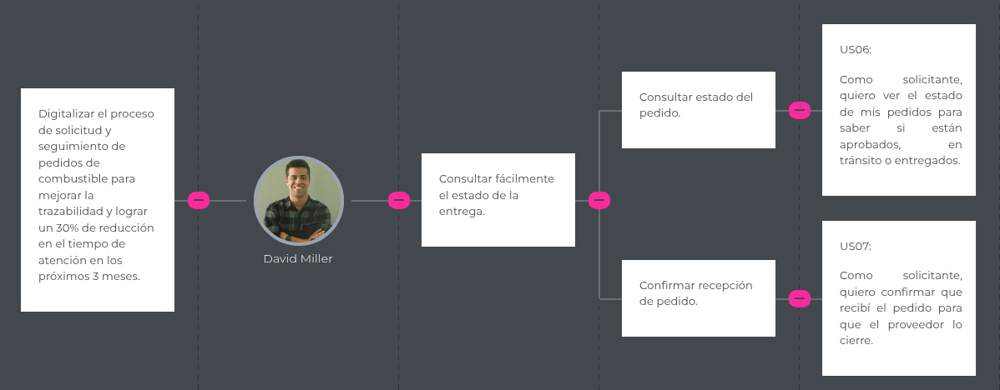
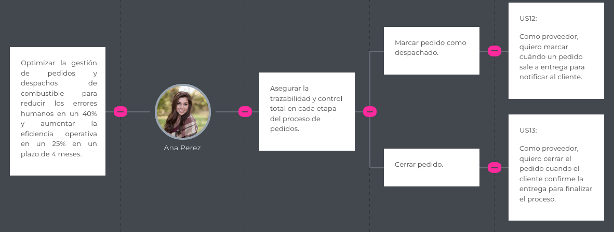

# Capitulo III: Requirements Specifications
## 3.1 To-Be Scenario Mapping
### Escenario To-Be (Segmento: Proveedor de combustible)

### Escenario To-Be (Segmento: Empresa Solicitante)

## 3.2 User Stories

| User Story ID | Título                | Descripción                                   | Criterios de Aceptación                                                              | Epic ID |
|---------------|-----------------------|-----------------------------------------------|--------------------------------------------------------------------------------------|---------|
| US01 | Ver sección Home | Como visitante, quiero ver una sección de inicio que resuma el valor de FuelTrack para comprender rápidamente el objetivo del sistema. | **Escenario 1:**   Dado que el visitante accede al sitio, Cuando se encuentra en la sección Home, Entonces puede ver un resumen claro del sistema.   **Escenario 2:**  Dado que el visitante revisa la sección, Cuando desliza hacia abajo, Entonces encuentra un botón que lo invita a conocer más.   | EP01 |
| US02 | Ver sección About Us | Como visitante, quiero conocer quiénes están detrás de FuelTrack para confiar en el sistema. | **Escenario 1:**   Dado que el visitante accede a About Us, Cuando se carga la sección, Entonces puede leer una descripción del equipo o empresa detrás del sistema.   | EP01 |
| US03 | Ver sección How it works? | Como visitante, quiero entender cómo funciona FuelTrack paso a paso para evaluar si se ajusta a mis necesidades. | **Escenario 1:**   Dado que el visitante accede a How it works?, Cuando lee la sección, Entonces entiende el flujo de pedido desde solicitud hasta entrega.  **Escenario 2:**   Dado que el visitante busca claridad, Cuando revisa la sección, Entonces puede comprender cómo interactúan solicitante y proveedor.   | EP01 |
| US04 | Enviar mensaje de contacto | Como visitante, quiero enviar un mensaje desde Contact Us para solicitar más información. | **Escenario 1:**   Dado que el visitante completa el formulario, Cuando presiona enviar  Entonces el mensaje debe ser registrado para revisión.  **Escenario 2:**   Dado que algún campo está vacío, Cuando intenta enviar, Entonces el sistema indica que debe completarlo.   | EP01 |
| US05 | Registrar nuevo pedido | Como solicitante, quiero registrar un pedido con tipo y cantidad de combustible para que el proveedor lo procese. | **Escenario 1:**   Dado que el solicitante accede a la sección de pedidos, Cuando completa los campos requeridos, Entonces puede enviar un nuevo pedido.  **Escenario 2:**   Dado que el pedido es enviado, Cuando el proveedor lo apruebe o rechace, Entonces su estado cambiará.   | EP02 |
| US06 | Consultar estado del pedido | Como solicitante, quiero ver el estado de mis pedidos para saber si están aprobados, en tránsito o entregados. | **Escenario 1:**   Dado que el solicitante accede a su panel, Cuando revisa la lista de pedidos, Entonces ve el estado actualizado.  **Escenario 2:**   Dado que un pedido cambia de estado, Cuando recarga el panel, Entonces el cambio debe reflejarse.   | EP02 |
| US07 | Confirmar recepción de pedido | Como solicitante, quiero confirmar que recibí el pedido para que el proveedor lo cierre. | **Escenario 1:**   Dado que el pedido fue entregado, Cuando el solicitante lo confirma, Entonces su estado cambia a “Entregado”.  **Escenario 2:**   Dado que el pedido ya fue confirmado, Cuando intenta volver a confirmarlo, Entonces el sistema no lo permite.   | EP02 |
| US08 | Subir comprobante de pago | Como solicitante, quiero subir el comprobante para validar el pedido ante el proveedor. | **Escenario 1:**   Dado que el usuario carga un archivo válido, Cuando lo envía, Entonces queda vinculado al pedido.  **Escenario 2:**   Dado que el archivo supera el límite, Cuando se intenta subir, Entonces muestra un mensaje de error.   | EP02 |
| US09 | Ver historial de pedidos | Como solicitante, quiero ver mis pedidos anteriores para tener control sobre mi consumo. | **Escenario 1:**   Dado que el usuario accede al historial, Cuando se listan los pedidos, Entonces puede ver fecha, tipo y estado.  **Escenario 2:**   Dado que no hay pedidos anteriores, Cuando se ejecuta la acción, Entonces se muestra un mensaje indicando que aún no ha realizado pedidos.   | EP02 |
| US10 | Ver pedidos pendientes | Como proveedor, quiero ver todos los pedidos pendientes para analizarlos y tomar acción. | **Escenario 1:**   Dado que el proveedor accede al panel, Cuando ve los pedidos pendientes, Entonces puede revisar sus detalles.   | EP03 |
| US11 | Aprobar o rechazar pedido | Como proveedor, quiero aceptar o rechazar pedidos según el stock disponible para evitar conflictos de distribución. | **Escenario 1:**   Dado que el proveedor tiene stock suficiente, Cuando aprueba el pedido, Entonces el estado cambia a “Aprobado”.  **Escenario 2:**   Dado que el stock es insuficiente, Cuando rechaza, Entonces el estado cambia a “Rechazado” con razón registrada.   | EP03 |
| US12 | Marcar pedido como despachado | Como proveedor, quiero marcar cuándo un pedido sale a entrega para notificar al cliente. | **Escenario 1:**   Dado que el vehículo ha salido, Cuando el proveedor marca el pedido como despachado, Entonces el estado cambia.   | EP03 |
| US13 | Cerrar pedido | Como proveedor, quiero cerrar el pedido cuando el cliente confirme la entrega para finalizar el proceso. | **Escenario 1:**   Dado que el pedido ha sido confirmado por el solicitante, Cuando el proveedor lo cierra, Entonces ya no puede modificarse.  **Escenario 2:**   Dado que no ha sido confirmado, Cuando intenta cerrarlo, Entonces el sistema lo impide.   | EP03 |
| US14 | Generar reporte de ventas | Como proveedor, quiero generar reportes de ventas para tener registro de operaciones realizadas. | **Escenario 1:**   Dado que el proveedor selecciona un rango de fechas, Cuando solicita el reporte, Entonces se genera un archivo con los datos.  **Escenario 2:**   Dado que no hay ventas en ese rango, Cuando genera el reporte, Entonces se indica que no hay resultados.   | EP03 |
| US15 | Iniciar sesión | Como usuario registrado, quiero iniciar sesión con correo y contraseña para acceder a mi cuenta. | **Escenario 1:**   Dado que los datos son correctos, Cuando el usuario inicia sesión, Entonces es redirigido a su dashboard.  **Escenario 2:**   Dado que los datos son incorrectos, Cuando intenta iniciar sesión, Entonces se muestra un mensaje de error.   | EP04 |
| US16 | Recuperar contraseña | Como usuario registrado, quiero recuperar mi contraseña para volver a acceder si la olvidé. | **Escenario 1:**   Dado que el usuario ingresa su correo, Cuando se valida, Entonces recibe un enlace de recuperación.  **Escenario 2:**   Dado que el correo no existe, Cuando lo ingresa, Entonces se le notifica que no se encuentra registrado.   | EP04 |
| US17 | Cerrar sesión | Como usuario, quiero poder cerrar sesión para mantener segura mi cuenta. | **Escenario 1:**   Dado que el usuario está autenticado, Cuando selecciona cerrar sesión, Entonces se cierra la sesión actual y se redirige a login.   | EP04 |
| US18 | Ver resumen de pedidos (Solicitante) | Como solicitante, quiero ver un resumen de mis pedidos para identificar cuántos están en proceso o completados. | **Escenario 1:**   Dado que el solicitante entra al dashboard, Cuando la información se carga, Entonces visualiza el número de pedidos en los siguientes estados: pendientes, aprobados, despachados, finalizados y rechazados.  **Escenario 2:**   Dado que el solicitante no tiene pedidos registrados, Cuando se carga el dashboard, Entonces se muestra un mensaje indicando "No hay pedidos registrados".  **Escenario 3:**   Dado que ocurre un error al cargar el resumen, Cuando el sistema intenta obtener la información, Entonces se muestra un mensaje de error e intenta recargar automáticamente.   | EP05 |
| US19 | Ver resumen de pedidos (Proveedor) | Como proveedor, quiero ver un resumen de pedidos gestionados y pendientes para organizar a los clientes. | **Escenario 1:**   Dado que el proveedor entra al dashboard, Cuando la información se carga, Entonces visualiza los siguientes KPIs: número de pedidos pendientes, aprobados, rechazados, despachados y finalizados.  **Escenario 2:**   Dado que no hay pedidos en el sistema, Cuando se carga el dashboard, Entonces se muestran todos los KPIs con valor cero y un mensaje informativo.  **Escenario 3:**   Dado que ocurre un error de conexión, Cuando se intenta cargar el resumen, Entonces el sistema muestra una alerta de error con opción para reintentar.   | EP05 |
| US20 | Endpoint: Login | Como developer, quiero un endpoint POST /api/login para autenticar usuarios. | **Escenario 1:**   Dado que el request contiene credenciales válidas, Cuando se procesa, Entonces retorna un token JWT y el status 200.  **Escenario 2:**   Dado que las credenciales no son válidas, Cuando se procesa, Entonces retorna status 401 con un mensaje de error.  **Escenario 3:**   Dado que hay un error interno en el servidor, Cuando se realiza el login, Entonces retorna status 500 con un mensaje genérico de error.   | EP06 |
| US21 | Endpoint: Recuperar contraseña | Como developer, quiero un endpoint POST /api/password-reset para que permita enviar correo de recuperación. | **Escenario 1:**   Dado que el correo existe en base de datos, Cuando se envía el request, Entonces el sistema genera un token y envía el correo de recuperación.  **Escenario 2:**   Dado que el correo no está registrado, Cuando se envía el request, Entonces retorna status 404 y no envía ningún correo.  **Escenario 3:**   Dado que hay un fallo en el envío de correo, Cuando se intenta ejecutar la acción, Entonces retorna status 500 y se registra el error en los logs.   | EP06 |
| US22 | Endpoint: Logout | Como developer, quiero un endpoint POST /api/logout para cerrar sesión. | **Escenario 1:**   Dado que se envía el token de sesión activo, Cuando se llama al endpoint, Entonces la sesión se invalida y retorna status 200.  **Escenario 2:**   Dado que el token ha expirado o es inválido, Cuando se llama al endpoint, Entonces retorna status 401 y no realiza ninguna acción.  **Escenario 3:**   Dado que ocurre un error interno, Cuando se procesa la solicitud de logout, Entonces retorna status 500 con un mensaje de error.   | EP06 |
| US23 | Endpoint: Crear pedido | Como developer, quiero un endpoint POST /api/pedidos para registrar un nuevo pedido de combustible. | **Escenario 1:**   Dado que se recibe una petición POST válida con datos completos, Cuando se procesa, Entonces retorna status 201 con el ID del pedido.  **Escenario 2:**   Dado que faltan campos obligatorios, Cuando se envía el request, Entonces retorna status 400 con mensaje de error.   | EP07 |
| US24 | Endpoint: Consultar pedidos por usuario | Como developer, quiero un endpoint GET /api/pedidos?usuario_id=123 para obtener todos los pedidos de un usuario. | **Escenario 1:**   Dado que el usuario tiene pedidos registrados, Cuando se llama al endpoint con su ID, Entonces retorna un array con los pedidos.  **Escenario 2:**   Dado que no tiene pedidos, Cuando se llama el endpoint, Entonces retorna un array vacío con status 200.   | EP07 |
| US25 | Asignar vehículo a pedido | Como proveedor, quiero asignar un vehículo a un pedido aprobado para organizar la logística. | **Escenario 1:**   Dado que el pedido está aprobado, Cuando el proveedor selecciona un vehículo disponible, Entonces el vehículo queda asignado al pedido.  **Escenario 2:**   Dado que el proveedor intenta asignar un vehículo ya ocupado, Cuando selecciona el vehículo, Entonces el sistema muestra un mensaje de que no está disponible y no permite la asignación.  **Escenario 3:**   Dado que ocurre un error en la asignación, Cuando el proveedor realiza la acción, Entonces se muestra un mensaje de error y no se vincula ningún vehículo.   | EP08 |
| US26 | Asignar conductor a pedido | Como proveedor, quiero asignar un conductor para completar la información de despacho. | **Escenario 1:**   Dado que el pedido tiene un vehículo asignado, Cuando el proveedor selecciona un conductor disponible, Entonces el sistema vincula al conductor con el pedido.  **Escenario 2:**   Dado que se selecciona un conductor asignado a otro pedido en la misma franja horaria, Cuando se intenta asignarlo, Entonces el sistema muestra un mensaje indicando la incompatibilidad.  **Escenario 3:**   Dado que ocurre un error al guardar la asignación, Cuando el proveedor realiza la acción, Entonces se muestra un mensaje de error y no se vincula el conductor.   | EP08 |
| US27 | Validar disponibilidad de transporte | Como proveedor, quiero saber qué vehículos están disponibles antes de asignarlos para vincularlos correctamente. | **Escenario 1:**   Dado que el proveedor visualiza el listado de vehículos, Cuando un vehículo está asignado a otro pedido para la misma fecha y hora estimada, Entonces el sistema lo muestra como no disponible.  **Escenario 2:**   Dado que un vehículo está disponible, Cuando el proveedor visualiza el listado, Entonces el sistema lo presenta como seleccionable.  **Escenario 3:**   Dado que ocurre un conflicto en tiempo real (por ejemplo, se asignó desde otra sesión), Cuando se intenta seleccionar ese vehículo, Entonces el sistema bloquea la acción y muestra un mensaje de actualización en tiempo real.   | EP08 |
| US28 | Ver perfil de usuario | Como usuario, quiero ver mis datos de perfil para revisar mi información registrada. | **Escenario 1:**   Dado que el usuario accede a su perfil, Cuando se carga la vista, Entonces puede visualizar su nombre, correo y rol.  **Escenario 2:**   Dado que hay un error en la carga del perfil, Cuando el sistema no puede acceder a los datos, Entonces muestra un mensaje de error general y sugiere intentar más tarde.  **Escenario 3:**   Dado que el usuario tiene sesión activa, Cuando se accede al perfil, Entonces solo se pueden ver los datos del usuario autenticado.   | EP09 |
| US29 | Editar datos de perfil | Como usuario, quiero editar mis datos para mantener mi información actualizada. | **Escenario 1:**   Dado que el usuario modifica uno o más campos del formulario, Cuando la información ingresada es válida, Entonces el sistema guarda los cambios correctamente.  **Escenario 2:**   Dado que el usuario deja un campo obligatorio vacío (por ejemplo, el nombre), Cuando intenta guardar, Entonces el sistema muestra un mensaje de validación indicando el campo requerido.  **Escenario 3:**   Dado que ocurre un error de servidor al guardar los cambios, Cuando se realiza la acción, Entonces el sistema muestra un mensaje de error general sin perder los datos ya ingresados.   | EP09 |
| US30 | Ver sección de preguntas frecuentes | Como visitante, quiero acceder a una sección de preguntas frecuentes para resolver dudas rápidamente. | **Escenario 1:**   Dado que el visitante accede al sitio, Cuando hace clic en la sección de preguntas frecuentes, Entonces puede leer respuestas claras a las preguntas más comunes.  **Escenario 2:**   Dado que hay una gran cantidad de preguntas, Cuando el visitante navega en la sección, Entonces puede verlas organizadas por categorías.  **Escenario 3:**   Dado que ocurre un error en la carga de contenido, Cuando el visitante accede a la sección, Entonces el sistema muestra un mensaje de error o sección vacía con fallback.   | EP10 |
| US31 | Acceder a información de contacto rápido | Como usuario, quiero ver datos de contacto directo (teléfono o correo) para hacer consultas urgentes. | **Escenario 1:**   Dado que el usuario accede a la sección de soporte, Cuando se carga la página, Entonces puede visualizar claramente el correo de soporte y número telefónico.  **Escenario 2:**   Dado que el usuario desea escribir desde su cliente de correo, Cuando hace clic en el correo, Entonces se abre automáticamente su aplicación de correo predeterminada.  **Escenario 3:**   Dado que los datos de contacto no están configurados correctamente, Cuando la página se carga, Entonces el sistema muestra un mensaje genérico invitando a volver a intentar más tarde.   | EP10 |
| US32 | Buscar pedido por código | Como usuario, quiero buscar un pedido específico por su código para encontrarlo rápidamente. | **Escenario 1:**   Dado que el usuario escribe el código, Cuando existe un pedido con ese código, Entonces se muestra el resultado.  **Escenario 2:**   Dado que no existe el código ingresado, Cuando se completa la búsqueda, Entonces se indica que no hay coincidencias.   | EP11 |
| US33 | Filtrar pedidos por estado | Como usuario, quiero filtrar mis pedidos por estado (pendiente, aprobado, entregado) para facilitar la revisión. | **Escenario 1:**   Dado que el usuario selecciona un estado, Cuando se aplica el filtro, Entonces solo se muestran los pedidos con ese estado.   | EP11 |
| US34 | Recibir notificación de aprobación | Como solicitante, quiero recibir una notificación cuando un pedido sea aprobado o rechazado para estar informado. | **Escenario 1:**   Dado que el proveedor cambia el estado del pedido, Cuando el solicitante inicia sesión, Entonces ve una notificación del evento.   | EP12 |
| US35 | Notificación de pedido despachado | Como solicitante, quiero recibir una notificación cuando un pedido haya sido despachado para estar informado. | **Escenario 1:**   Dado que el proveedor marca el pedido como despachado, Cuando el solicitante consulta su cuenta, Entonces puede ver la notificación correspondiente.   | EP12 |
| US36 | Ver listado de empresas | Como proveedor, quiero ver una lista de empresas solicitantes para identificar a mis clientes frecuentes. | **Escenario 1:**   Dado que el proveedor accede al módulo de empresas, Cuando se lista, Entonces puede ver nombre, pedidos activos y total histórico.   | EP13 |
| US37 | Ver detalles de empresa | Como proveedor, quiero ver información detallada de una empresa solicitante para analizar su historial de pedidos. | **Escenario 1:**   Dado que el proveedor selecciona una empresa, Cuando carga el detalle, Entonces ve pedidos realizados, cantidades totales y fechas.   | EP13 |
| US38 | Ver gráfico de consumo (Solicitante) | Como solicitante, quiero ver un gráfico de mi consumo mensual para tener control sobre el uso del combustible. | **Escenario 1:**   Dado que el usuario accede al módulo de reportes, Cuando se visualiza el gráfico, Entonces puede ver los galones consumidos por mes.   | EP14 |
| US39 | Ver gráfico de ventas (Proveedor) | Como proveedor, quiero ver un gráfico de ventas por mes para monitorear el rendimiento del negocio. | **Escenario 1:**   Dado que el proveedor visualiza el panel analítico, Cuando se carga el gráfico, Entonces se muestran ventas totales por mes.   | EP14 |
| US40 | Descargar reporte PDF | Como usuario, quiero descargar un resumen de pedidos o ventas en formato PDF para archivarlo o compartirlo. | **Escenario 1:**   Dado que el usuario hace clic en "Descargar", Cuando hay datos, Entonces se genera un archivo PDF descargable.  **Escenario 2:**   Dado que no hay datos en el periodo seleccionado, Cuando se quiere descargar, Entonces el sistema notifica que no hay contenido para exportar.   | EP14 |

## 3.3 Impact Mapping
Solicitantes:

Proveedores:

## 3.4 Product Backlog

| #Orden |   ID   | Título | Descripción | Story Points |
|--------|--------|--------|-------------|--------------|
| 01 | US-01 | Ver sección Home | Como visitante, quiero ver una sección de inicio que resuma el valor de FuelTrack para comprender rápidamente el objetivo del sistema | 3 |
| 02 | US-02 | Ver sección About Us | Como visitante, quiero conocer quiénes están detrás de FuelTrack para confiar en el sistema | 2 |
| 03 | US-03 | Ver sección How it works? | Como visitante, quiero entender cómo funciona FuelTrack paso a paso para evaluar si se ajusta a mis necesidades | 3 |
| 04 | US-30 | Ver sección de preguntas frecuentes | Como visitante, quiero acceder a una sección de preguntas frecuentes para resolver dudas rápidamente | 3 |
| 05 | US-04 | Enviar mensaje de contacto | Como visitante, quiero enviar un mensaje desde Contact Us para solicitar más información | 5 |
| 06 | US-31 | Acceder a información de contacto rápido | Como usuario, quiero ver datos de contacto directo (teléfono o correo) para hacer consultas urgentes | 2 |
| 07 | US-05 | Registrar nuevo pedido | Como solicitante, quiero registrar un pedido con tipo y cantidad de combustible para que el proveedor lo procese | 5 |
| 08 | US-06 | Consultar estado del pedido | Como solicitante, quiero ver el estado de mis pedidos para saber si están aprobados, en tránsito o entregados | 3 |
| 09 | US-09 | Ver historial de pedidos | Como solicitante, quiero ver mis pedidos anteriores para tener control sobre mi consumo | 3 |
| 10 | US-18 | Ver resumen de pedidos (Solicitante) | Como solicitante, quiero ver un resumen de mis pedidos para identificar cuántos están en proceso o completados | 5 |
| 11 | US-34 | Recibir notificación de aprobación | Como solicitante, quiero recibir una notificación cuando un pedido sea aprobado o rechazado para  estar informado | 2 |
| 12 | US-35 | Notificación de pedido despachado | Como solicitante, quiero recibir una notificación cuando un pedido haya sido despachado para estar informado | 2 |
| 13 | US-08 | Subir comprobante de pago | Como solicitante, quiero subir el comprobante para validar el pedido ante el proveedor | 3 |
| 14 | US-07 | Confirmar recepción de pedido | Como solicitante, quiero confirmar que recibí el pedido para que el proveedor lo cierre | 2 |
| 15 | US-10 | Ver pedidos pendientes | Como proveedor, quiero ver todos los pedidos pendientes para analizarlos y tomar acción | 2 |
| 16 | US-11 | Aprobar o rechazar pedido | Como proveedor, quiero aceptar o rechazar pedidos según el stock disponible para evitar conflictos de distribución | 5 |
| 17 | US-12 | Marcar pedido como despachado | Como proveedor, quiero marcar cuándo un pedido sale a entrega para notificar al cliente | 2 |
| 18 | US-13 | Cerrar pedido | Como proveedor, quiero cerrar el pedido cuando el cliente confirme la entrega para finalizar el proceso | 3 |
| 19 | US-25 | Asignar vehículo a pedido | Como proveedor, quiero asignar un vehículo a un pedido aprobado para organizar la logística | 5 |
| 20 | US-26 | Asignar conductor a pedido | Como proveedor, quiero asignar un conductor para completar la información de despacho | 5 |
| 21 | US-27 | Validar disponibilidad de transporte | Como proveedor, quiero saber qué vehículos están disponibles antes de asignarlos para vincularlos correctamente | 8 |
| 22 | US-19 | Ver resumen de pedidos (Proveedor) | Como proveedor, quiero ver un resumen de pedidos gestionados y pendientes para organizar a los clientes | 5 |
| 23 | US-14 | Generar reporte de ventas | Como proveedor, quiero generar reportes de ventas para tener registro de operaciones realizadas | 3 |
| 24 | US-36 | Ver listado de empresas | Como proveedor, quiero ver una lista de empresas solicitantes para identificar a mis clientes frecuentes | 3 |
| 25 | US-37 | Ver detalles de empresa | Como proveedor, quiero ver información detallada de una empresa solicitante para analizar su historial de pedidos | 3 |
| 26 | US-38 | Ver gráfico de consumo (Solicitante) | Como solicitante, quiero ver un gráfico de mi consumo mensual para tener control sobre el uso del combustible | 5 |
| 27 | US-39 | Ver gráfico de ventas (Proveedor) | Como proveedor, quiero ver un gráfico de ventas por mes para monitorear el rendimiento del negocio | 5 |
| 28 | US-40 | Descargar reporte PDF | Como usuario, quiero descargar un resumen de pedidos o ventas en formato PDF para archivarlo o compartirlo | 3 |
| 29 | US-32 | Buscar pedido por código | Como usuario, quiero buscar un pedido específico por su código para encontrarlo rápidamente | 2 |
| 30 | US-33 | Filtrar pedidos por estado | Como usuario, quiero filtrar mis pedidos por estado (pendiente, aprobado, entregado) para facilitar la revisión | 2 |
| 31 | US-28 | Ver perfil de usuario | Como usuario, quiero ver mis datos de perfil para revisar mi información registrada | 2 |
| 32 | US-29 | Editar datos de perfil | Como usuario, quiero editar mis datos para mantener mi información actualizada | 3 |
| 33 | US-15 | Iniciar sesión | Como usuario registrado, quiero iniciar sesión con correo y contraseña para acceder a mi cuenta | 3 |
| 34 | US-16 | Recuperar contraseña | Como usuario registrado, quiero recuperar mi contraseña para volver a acceder si la olvidé | 3 |
| 35 | US-17 | Cerrar sesión | Como usuario, quiero poder cerrar sesión para mantener segura mi cuenta | 1 |
| 36 | US-20 | Endpoint: Login | Como developer, quiero un endpoint POST /api/login para autenticar usuarios | 3 |
| 37 | US-21 | Endpoint: Recuperar contraseña | Como developer, quiero un endpoint POST /api/password-reset para que permita enviar correo de recuperación | 3 |
| 38 | US-22 | Endpoint: Logout | Como developer, quiero un endpoint POST /api/logout para cerrar sesión | 2 |
| 39 | US-23 | Endpoint: Crear pedido | Como developer, quiero un endpoint POST /api/pedidos para registrar un nuevo pedido de combustible | 3 |
| 40 | US-24 | Endpoint: Consultar pedidos por usuario | Como developer, quiero un endpoint GET /api/pedidos?usuario_id=123 para obtener todos los pedidos de un usuario | 3 |
