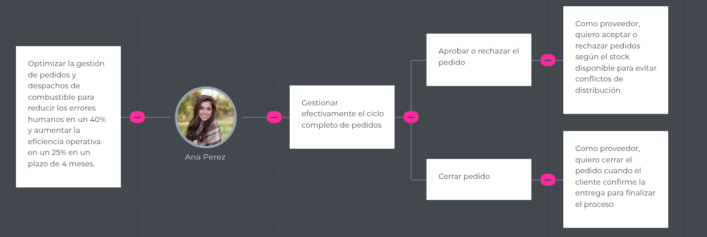

# Capitulo III: Requirements Specifications
## 3.1 To-Be Scenario Mapping
### Escenario To-Be (Segmento: proveedores de combustible)

| FASES             | Comunicación                                     | Solicitar pedido                                   | Seguimiento                                     | Entrega                                      |
|-------------------|--------------------------------------------------|----------------------------------------------------|------------------------------------------------|---------------------------------------------|
| **DOING**         | Todo se centraliza en la app/web de FuelTrack, lo que permite gestionar múltiples clientes desde un solo lugar. | Los pedidos se ingresan de manera clara, con todos los detalles necesarios para una entrega eficiente. | Los proveedores pueden ver en tiempo real el estado de cada pedido, incluyendo ubicación y estimación de entrega. | La entrega se confirma digitalmente con una firma o verificación en la plataforma, garantizando precisión y trazabilidad. |
| **THINKING**      | "Ahora puedo gestionar todos los pedidos desde una sola plataforma, sin perder información." | "El pedido ha sido registrado correctamente y no hay lugar para malentendidos." | "Sé exactamente dónde está cada pedido, puedo anticiparme a cualquier problema." | "La confirmación digital asegura que el pedido fue entregado correctamente, sin necesidad de llamar." |
| **FEELING**       | Confianza en la automatización, control total de las operaciones. | Seguridad en el proceso de pedido, reducción de errores. | Tranquilidad al ver el avance, reducción del estrés logístico. | Alivio por la confirmación digital, satisfacción por un proceso sin problemas. |

### Escenario To-Be (Segmento: empresas solicitantes)

| FASES             | Comunicación                                 | Solicitar pedido                                 | Seguimiento                                     | Entrega                                      |
|-------------------|----------------------------------------------|--------------------------------------------------|------------------------------------------------|---------------------------------------------|
| **DOING**         | Todo se centraliza en la app/web de FuelTrack. | Se llena un formulario estructurado que deja claro como se realiza el pedido             | Seguimiento en tiempo real con notificaciones. | Confirmación digital en la plataforma.       |
| **THINKING**      | "Todo está en un solo lugar."                | "El pedido quedó registrado correctamente."       | "Puedo ver el progreso del pedido fácilmente." | "Ya tengo la confirmación de que llegó nuestro pedido."          |
| **FEELING**       | Tranquilidad, control.                       | Confianza, seguridad.                            | Satisfacción, reducción del estrés.            | Alivio, certeza.                             |

## 3.2 User Stories

| User Story ID | Título                | Descripción                                   | Criterios de Aceptación                                                              | Epic ID |
|---------------|-----------------------|-----------------------------------------------|--------------------------------------------------------------------------------------|---------|
| US01          | Ver sección Home      | Como visitante, quiero ver una sección de inicio que resuma el valor de FuelTrack para comprender rápidamente el objetivo del sistema. | **Escenario 1:**   Dado que el visitante accede al sitio, Cuando se encuentra en la sección Home, Entonces puede ver un resumen claro del sistema.   **Escenario 2:**  Dado que el visitante revisa la sección, Cuando desliza hacia abajo, Entonces encuentra un botón que lo invita a conocer más.   | EP01 |
| US02          | Ver sección About Us  | Como visitante, quiero conocer quiénes están detrás de FuelTrack para confiar en el sistema. | **Escenario 1:**   Dado que el visitante accede a About Us, Cuando se carga la sección, Entonces puede leer una descripción del equipo o empresa detrás del sistema.   | EP01 |
| US03          | Ver sección How it works? | Como visitante, quiero entender cómo funciona FuelTrack paso a paso para evaluar si se ajusta a mis necesidades. | **Escenario 1:**   Dado que el visitante accede a How it works?, Cuando lee la sección, Entonces entiende el flujo de pedido desde solicitud hasta entrega.  **Escenario 2:**   Dado que el visitante busca claridad, Cuando revisa la sección, Entonces puede comprender cómo interactúan solicitante y proveedor.   | EP01 |
| US04          | Enviar mensaje de contacto | Como visitante, quiero enviar un mensaje desde Contact Us para solicitar más información. | **Escenario 1:**   Dado que el visitante completa el formulario, Cuando presiona enviar  Entonces el mensaje debe ser registrado para revisión.  **Escenario 2:**   Dado que algún campo está vacío, Cuando intenta enviar, Entonces el sistema indica que debe completarlo.   | EP01 |
| US05          | Registrar nuevo pedido | Como solicitante, quiero registrar un pedido con tipo y cantidad de combustible para que el proveedor lo procese. | **Escenario 1:**   Dado que el solicitante accede a la sección de pedidos, Cuando completa los campos requeridos, Entonces puede enviar un nuevo pedido.  **Escenario 2:**   Dado que el pedido es enviado, Cuando el proveedor lo apruebe o rechace, Entonces su estado cambiará.   | EP02 |
| US06          | Consultar estado del pedido | Como solicitante, quiero ver el estado de mis pedidos para saber si están aprobados, en tránsito o entregados. | **Escenario 1:**   Dado que el solicitante accede a su panel, Cuando revisa la lista de pedidos, Entonces ve el estado actualizado.  **Escenario 2:**   Dado que un pedido cambia de estado, Cuando recarga el panel, Entonces el cambio debe reflejarse.   | EP02 |
| US07          | Confirmar recepción de pedido | Como solicitante, quiero confirmar que recibí el pedido para que el proveedor lo cierre. | **Escenario 1:**   Dado que el pedido fue entregado, Cuando el solicitante lo confirma, Entonces su estado cambia a “Entregado”.  **Escenario 2:**   Dado que el pedido ya fue confirmado, Cuando intenta volver a confirmarlo, Entonces el sistema no lo permite.   | EP02 |
| US08          | Subir comprobante de pago | Como solicitante, quiero subir el comprobante para validar el pedido ante el proveedor. | **Escenario 1:**   Dado que el usuario carga un archivo válido, Cuando lo envía, Entonces queda vinculado al pedido.  **Escenario 2:**   Dado que el archivo supera el límite, Cuando se intenta subir, Entonces muestra un mensaje de error.   | EP02 |
| US09          | Ver historial de pedidos | Como solicitante, quiero ver mis pedidos anteriores para tener control sobre mi consumo. | **Escenario 1:**   Dado que el usuario accede al historial, Cuando se listan los pedidos, Entonces puede ver fecha, tipo y estado.  **Escenario 2:**   Dado que no hay pedidos anteriores, Cuando se ejecuta la acción, Entonces se muestra un mensaje indicando que aún no ha realizado pedidos.   | EP02 |
| US10          | Ver pedidos pendientes | Como proveedor, quiero ver todos los pedidos pendientes para analizarlos y tomar acción. | **Escenario 1:**   Dado que el proveedor accede al panel, Cuando ve los pedidos pendientes, Entonces puede revisar sus detalles.   | EP03 |
| US11          | Endpoint: Crear pedido | Como developer, quiero un endpoint POST /api/pedidos para registrar un nuevo pedido de combustible. | **Escenario 1:**   Dado que se recibe una petición POST válida con datos completos, Cuando se procesa, Entonces retorna status 201 con el ID del pedido.  **Escenario 2:**   Dado que faltan campos obligatorios, Cuando se envía el request, Entonces retorna status 400 con mensaje de error.   | EP04 |
| US12          | Endpoint: Consultar pedidos por usuario | Como developer, quiero un endpoint GET /api/pedidos?usuario_id=123 para obtener todos los pedidos de un usuario. | **Escenario 1:**   Dado que el usuario tiene pedidos registrados, Cuando se llama al endpoint con su ID, Entonces retorna un array con los pedidos.  **Escenario 2:**   Dado que no tiene pedidos, Cuando se llama el endpoint, Entonces retorna un array vacío con status 200.   | EP04 |

## 3.3 Impact Mapping
Solicitantes:

Proveedores:

## 3.4 Product Backlog

| #Orden |   ID   | User Story | Story Points |
|:------|:------|:----------|:--------------|
|01|US-01|Ver información del sistema|2|
|02|US-02|Formulario de contacto|3|
|03|US-03|Diseño adaptable (responsive)|5|
|04|US-04|Botón de acceso a plataforma|1|
|05|US-05|Inicio de sesión|5|
|06|US-06|Registrar nuevo pedido|8|
|07|US-07|Consultar estado del pedido|5|
|08|US-08|Confirmar entrega del pedido|3|
|09|US-09|Ver pedidos pendientes|3|
|10|US-10|Aprobar o rechazar pedido|5|
|11|US-11|Marcar pedido como despachado|3|
|12|US-12|Cerrar pedido|2|
