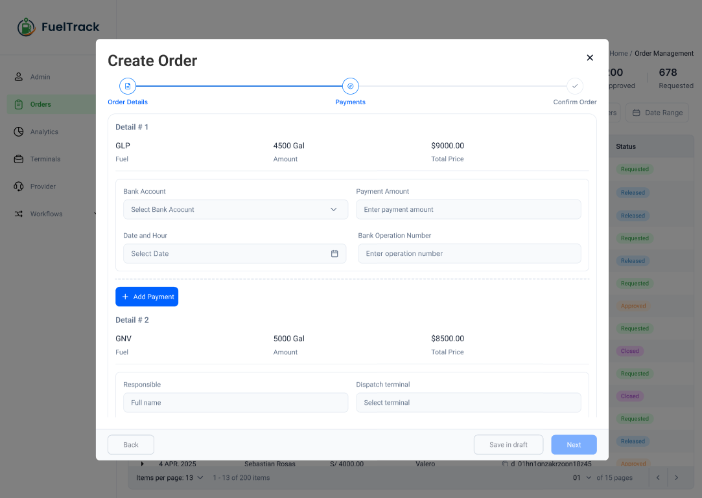
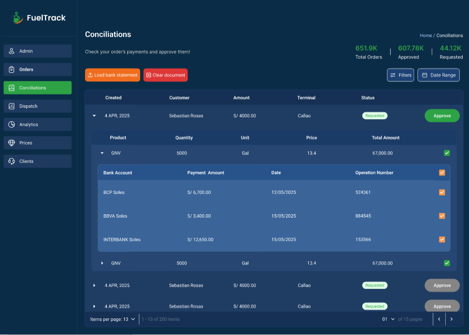
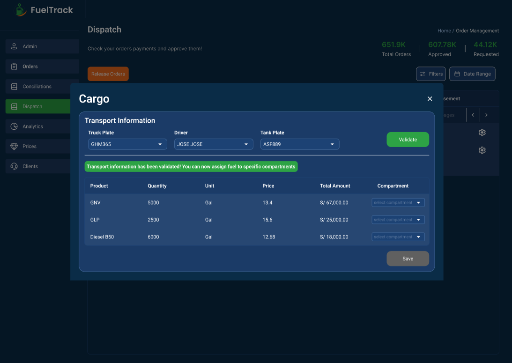

# Capítulo IV: Product Design
En la realización de este capitulo, abordaremos el diseño integral de la startup, cubriendo aspectos clave como el estilo visual, los diagramas C4 para la arquitectura del sistema, los diagramas de clases, y los modelos de base de datos, proporcionando una visión clara y estructurada de la infraestructura y el funcionamiento del proyecto.

## 4.1. Style Guidelines
En esta sección se presentan los estándares que definen el formato y el diseño de la solución, asegurando la calidad en su implementación.

### 4.1.1. General Style Guidelines
Con estas decisiones en el diseño visual buscamos reflejar innovación que incentive a la formalidad en los procesos de comercialización, es asi como demostramos modernidad y calidad, valores que van alineados a nuestro proyecto

**Color**

Seleccionamos esta gama de colores porque armoniza con el diseño del logo y refleja la temática de nuestra aplicación, asegurando la identidad de la marca.

**Tipografia**

Seleccionamos esta tipografía por su excelente legibilidad en diversos entornos, lo que nos permite diferenciarnos frente a la competencia y aportar una identidad única a nuestra marca.

**Branding**

El nombre de nuestro producto es FuelTrack, contamos con un logo que representa claramente nuestro rubro, dandole un toque moderno y simple, ademas usar colores que seran caractristicos en nuestra empresa y amigables a la vista de nuestros clientes

### 4.1.2. Web Style Guidelines
Nuestra página web ha sido diseñada para brindar una navegación cómoda y accesible desde cualquier dispositivo. Para lograrlo, utilizamos un diseño basado en el patrón en Z, el cual dirige de forma natural la atención del usuario hacia los elementos más importantes de la interfaz, facilitando la comprensión rápida de la información clave.

## 4.2. Information Architecture
La arquitectura de información se diseñó para guiar al usuario de forma lógica a través de las funciones esenciales de FuelTrack, facilitando la navegación y reduciendo la curva de aprendizaje.

### 4.2.1. Organization Systems
El Sistema de Organización de FuelTrack tiene como objetivo facilitar la interacción fluida entre los usuarios (compradores y proveedores) y la plataforma mediante una **jerarquía visual clara**. Esta jerarquía destaca las funciones clave —como la **gestión de pedidos de combustible**, el **registro de depósitos** y la **carga de documentos**— permitiendo que los usuarios accedan rápidamente a las acciones más importantes desde la pantalla principal.

- **Agrupación lógica de funciones**: Las funcionalidades están organizadas por bloques temáticos (“Record Deposits”, “Upload Documents”, “Track Orders”), lo que permite a los usuarios identificar rápidamente las opciones disponibles y su propósito.
  
- **Accesibilidad inmediata**: La interfaz principal resalta las opciones más utilizadas mediante una disposición vertical y centrada, optimizada tanto para escritorio como para dispositivos móviles.
  
- **Menú de navegación**: Se mantiene fijo en la parte superior para facilitar el acceso constante a secciones clave como "How it Works", "Pricing" y "Sign Up".
  
- **Reducción de fricción**: Al minimizar la cantidad de clics necesarios para ejecutar acciones comunes, el sistema organiza la información de forma que prioriza la eficiencia y la experiencia del usuario.

Este sistema organizativo asegura que tanto usuarios nuevos como recurrentes puedan navegar por FuelTrack con facilidad, incrementando la productividad y reduciendo los errores de operación.

### 4.2.2. Labeling Systems
### 4.2.3. SEO Tags and Meta Tag

Landing Page:
- Title (SEO Tag): FuelTrack | Simplify Fuel Order Management
- Description (Meta Tag): Optimize your fuel ordering process with FuelTrack — a centralized platform for buyers and suppliers to record deposits, upload documents, and track orders.
- Keywords (Meta Tag): Fuel, Track, Ordering, Fuel management, Supplier platform, Track fuel orders, Fuel deposits, Order management software
- Author (Meta Tag): FuelTrack Team

Web Application:
- Title (SEO Tag): FuelTrack | Manage Fuel Orders and Deposits
- Description (Meta Tag): Access your dashboard to record deposits, manage documents, and monitor fuel order status in real time.
- Keywords (Meta Tag): Fuel order tracking, Deposit management, Supplier dashboard, Fuel logistics, FuelTrack Web App
- Author (Meta Tag): FuelTrack Team

### 4.2.4. Searching Systems
Para garantizar una navegación fluida y centrada de nuestra plataforma, vamos a implementar las siguientes acciones y técnicas tanto para la pagina como la aplicación web:

- Menú de navegación: En la pagina, utilizaremos el Navigation Bar donde contiene enlaces visibles a las secciones más importantes de la plataforma, principalmente de sus caracteristicas y para el registro o ingreso de la cuenta. De esta forma, los nuevos usuarios se informarán rápidamente y a los usuarios existentes les permitirán acceder a sus cuentas fácilmente.
- Navegación Visual Guiada: El contenido está organizado en bloques visuales de las secciones determinadas en la barra principal, permitiendo al usuario desplazarse verticalmente para descubrir las funcionalidades de manera fluida.
- Responsive Design: Esta será construida para que se adapte al tipo de dispositivos del usuario. Por ejemplo, la resolución de la pagina estará optimizada según como sea redimensionada, tendrá compatibilidad tanto en dispositivos de escritorio como en portatiles. De esta forma, los usuarios realizarán sus tareas sin que el cambio de maquina sea un problema.

### 4.2.5. Navigation Systems
Para la plataforma, implementamos un sistema de búsqueda por texto y por categorias para que los usuarios, especialmente para los proveedores, puedan localizar los pedidos que sean realizado o se están llevando a cabo. Se incluirá filtros de la siguiente manera:

Busqueda por texto: El usuario tendrá una tabla de pedidos donde en cada categoria, razón social, numero de pedido, nombre de banco y demás, del pedido tendra un mini buscador estandár para buscar sus pedidos registrados o pendientes y entregará los resultados según el tipo de información que detecte automaticamente. Además, habrá un boton llamado "Busqueda avanzada" donde se realizará una busqueda más especifica siempre y cuando complete todas las categorias.

Busqueda por categoris: El usuario se le brindará un sistema automatico de filtro de datos de las categorias ya existentes para que pueda optimizar su tiempo en tareas de mayor importancia. Por ejemplo, el sistema se encargará de filtrar todas las ubicaciones detectadas de tus pedidos registrados o pendientes y se podrá seleccionar las que quieras aplicar.

## 4.3. Landing Page UI Design

En esta sección se detalla la estructura y el diseño de la landing page. Se analizan los principales componentes que la conforman, como encabezados, botones, imágenes y formularios, explicando su función dentro del recorrido del usuario.

Además, se revisa cómo cada elemento contribuye a que la navegación sea clara, rápida y eficiente, con el fin de facilitar que el usuario complete una acción específica. Se hace especial énfasis en la organización visual y la disposición estratégica de los contenidos para mejorar la experiencia general de uso.

### 4.3.1. Landing Page Wireframe

El wireframe de la landing page de **FuelTrack** es una representación simplificada de la estructura de la página, que permite visualizar cómo se dispondrán los elementos clave para optimizar la experiencia del usuario. A continuación, se detallan las secciones del diseño:

### Primera Pantalla: Encabezado Principal

En esta sección se ubican los elementos de navegación y la propuesta principal de la página. Se incluye el **logo de FuelTrack**, el **menú de navegación** y una **llamada a la acción (CTA)** clara para captar la atención del usuario.  

### Segunda Pantalla: Sobre Nosotros

Esta sección proporciona información general sobre **FuelTrack**, destacando lo que ofrece la empresa y sus características clave. El diseño busca crear una conexión con el usuario mediante un mensaje claro y conciso.  

### Tercera Pantalla: ¿Qué Ofrecemos?

Aquí se detallan los principales servicios ofrecidos por FuelTrack. Se utilizan iconos o elementos visuales sencillos para resaltar las ventajas y características de cada servicio, con un botón de llamada a la acción para incentivar la interacción.  

### Cuarta Pantalla: Principales Proveedores

Se presenta una serie de **logos de los proveedores principales** de FuelTrack, distribuidos de forma ordenada para transmitir solidez y confiabilidad.  

### Quinta Pantalla: Nuestros Clientes

Sección dedicada a mostrar **testimonios de clientes**. Cada testimonio está acompañado por una imagen de perfil del cliente y una cita breve que refuerza la credibilidad de FuelTrack.  

### Sexta Pantalla: Invitación a Solicitantes de Combustible

En esta sección se invita a los usuarios a unirse a FuelTrack, proporcionando un espacio con una **llamada a la acción** clara para captar nuevos clientes interesados en solicitar combustible.

### Séptima Pantalla: Formulario de Contacto

Se incluye un formulario básico que permite a los usuarios realizar consultas o solicitudes. El formulario está compuesto por campos sencillos como **nombre**, **correo electrónico** y **mensaje**.  

### Pie de Página

En esta última sección se agrupan los enlaces de navegación adicionales, los **datos de contacto** y los **enlaces a redes sociales**, presentados de forma accesible y organizada para facilitar la interacción del usuario.  

## Nota

También se incluye la versión mobile correspondiente para cada sección mostrada, siguiendo el mismo orden y adaptándose a las dimensiones y experiencia de uso en dispositivos móviles.

Para una mejor visualización de los wireframe (versión desktop y mobile), se adjunta el siguiente enlace de Figma:  
[https://www.figma.com/design/Ikz9yUtR1XthBJ1ViO6gVc/LP-and-CTA?node-id=0-1&t=WJtigb6RJ2HtjPPw-1](https://www.figma.com/design/Ikz9yUtR1XthBJ1ViO6gVc/LP-and-CTA?node-id=0-1&t=WJtigb6RJ2HtjPPw-1)

### 4.3.2. Landing Page Mock-up

## PANTALLA 1

La primera pantalla presenta un encabezado claro con logo, menú de navegación y un botón de "Contact us" destacado, mostrando una jerarquía visual efectiva y buena arquitectura de información. La sección hero combina una imagen de trabajadores del sector industrial y un mensaje directo sobre la eficiencia en la gestión de pedidos de combustible. El primer call to action es visible y contrasta bien, guiando al usuario de forma intuitiva. Se aplican principios de alineamiento y énfasis para centrar la atención en la propuesta de valor.

## PANTALLA 2

Aquí se presenta la sección "About us" con un texto breve y claro que explica los objetivos de la empresa. Se complementa con una imagen de profesionales en reunión, que refuerza el mensaje de confianza y colaboración. Se utiliza la proximidad para agrupar visualmente la información importante y los íconos de bullet points facilitan la lectura rápida, manteniendo una estructura limpia y accesible.

## PANTALLA 3

La sección "How it works?" muestra de manera sencilla los pasos del proceso mediante pestañas destacadas y un apoyo visual de un camión cisterna, reforzando la temática de la industria de combustibles. La arquitectura de la información facilita la comprensión del proceso paso a paso. Adicionalemnte se invita al usuario a ver un video explicativo para mayor comprensión.

## PANTALLA 4

Se presentan los logotipos de los principales proveedores (REPSOL, Shell, BR, Exxon) en una sección limpia y espaciosa. El uso de espacio negativo permite que cada logo se distinga de manera clara, transmitiendo confianza mediante prueba social. El formato minimalista facilita una lectura rápida y genera credibilidad.

## PANTALLA 5

La sección "Our clients" muestra testimonios de clientes en tarjetas individuales, incluyendo imagen de la persona, nombre, y un breve comentario sobre su experiencia. El diseño aplica proximidad y alineación para facilitar la lectura, y las fotos aportan autenticidad y diversidad. Esto fortalece la credibilidad del servicio y conecta emocionalmente con el visitante.

## PANTALLA 6

En esta pantalla se invita a los solicitantes de combustible a unirse, usando una imagen de dos trabajadores estrechando la mano en señal de acuerdo. El mensaje es claro y profesional, reforzado por el diseño visual que destaca nuevamente un llamado a la acción. La jerarquía visual dirige la atención de inmediato hacia la invitación a registrarse.

## PANTALLA 7

Aquí se presenta un formulario de contacto sencillo bajo el título "Contact us", solicitando datos básicos como nombre, correo y mensaje. El formulario es de fácil acceso, y su diseño es limpio y funcional, pensado para una experiencia sin barreras. Esta sección se integra con el pie de página, que ofrece enlaces de navegación, redes sociales y el resumen corporativo de la empresa, cerrando la experiencia de navegación de manera coherente y accesible.

## Nota

También se incluye la versión mobile correspondiente para cada sección mostrada, siguiendo el mismo orden y adaptándose a las dimensiones y experiencia de uso en dispositivos móviles.

Para una mejor visualización de los mock up (versión desktop y mobile), se adjunta el siguiente enlace de Figma:  
[https://www.figma.com/design/Ikz9yUtR1XthBJ1ViO6gVc/LP-and-CTA?node-id=0-1&t=WJtigb6RJ2HtjPPw-1](https://www.figma.com/design/Ikz9yUtR1XthBJ1ViO6gVc/LP-and-CTA?node-id=0-1&t=WJtigb6RJ2HtjPPw-1)

## 4.4. Web Applications UX/UI Design
### 4.4.1. Web Applications Wireframes

### **Wireframes - Segmento Cliente**
- Descripción: Vista diseñada exclusivamente para mostrar las ordenes de la empresa solicitante. Para ello optamos por una grilla que muestra fácilmente los atributos de cada orden.

  

- Descripción: Para mostrar losdetalles de cada pedido, optamos por una vista desplegable en cada fila de la grilla. De esta forma, el usuario podrá observar los detalles de cada uno, como el producto solicitado, la cantidad y el monto total.

  

- Descripción: Para la creación del pedido, decidimos usar un modal que se muestra al hacer clic en el botón "Crear nuevo pedido". En este modal, el usuario podrá crear sus pedidos paso a paso con un  stepper implementado. El primer paso es llenar los detalles del nuevo pedido como el producto, cantidad, etc.

  

- Descripción: Para el segundo paso, usamos una lista desplegable de detalles, donde en cada uno de ellos el usuario podrá asignar información de pagos a cada detalle del pedido, como el monto, la cuenta bancaria y el número de operación, todo mediante un pequeño formulario.

  

- Descripción: Para el paso final, mostramos toda la información del pedido, incluyendo sus detalles y la información de los pagos. El usuario podrá revisar todo antes de confirmar el pedido.

### **Wireframes - Segmento Proveedor**
- Descripción: Esta vistafue diseñada para darle protagonismo a los pedidos y sus detalles meidante una grilla. Además, facilitamos la clasificación de los pedidos por estado a través de etiquetas ubicadas en la parte superior de la grilla que expone los pedidos.

  

- Descripción: En el segundo modulo de nuestro sistema, ubicamos una vistade conciliaciones que muestra una tabla con registros seleccionables. Aquí, la información principal es la de los pagos realizados a los pedidos. Para ello, el proveedor cuenta con un botón en la parte superior para subir una lista de movimientos de cuentas bancarias.

  

- Descripción: Diseñamos un modal muy sencillo que permite subir multiples archivos con movimientos de cuentas bancarias. Una vez subidos, el proveedor solo debe hacer click en el botón comparar y el sistema se encargará de hacer la conciliación con los pedidos realizados por los clientes.

  

- Descripción: Para el utlimo modulo principal, presentamos la vista de Despacho. Aqui podremos configurar la información de despacho a través de un botón de configuración en cada fila de la grilla, que representa un pedido. Una vez con información válida de despacho, el pedido será marcado con un check, dando a entender al usuario que el pedido está listo para ser liberado. Para ayudar al usuario, también facilitamos chekcboxes para seleccionar los pedidos que se desean liberar, si es que son varios.

  

- Descripción: Al hacer click en el botón de configuración, se abrirá un modal donde el proveedor podrá llenar la información de despacho del pedido. El proveedor podrá seleccionar el vehiculo, el chofer y la cisterna que se utilizará para el despacho del pedido.

  

- Descripción: La tabla para asignar compartimientos a los detalles del pedido se desbloquea unavez que la información del transporte es validada. En esta tabla, el proveedor podrá asignar los compartimientos de la cisterna a cada detalle del pedido.

  

### 4.4.2. Web Applications Wireflow Diagrams

### **Wireflow 1 - Registro de Pedido de Combustible**
- User Persona: Solicitante de combustible
- User Goal: Como solicitante de combustible, deseo registrar un nuevo pedido de combustible. Para ello, debo llenar la información del pedido y los detalles de pago.

### **Wireflow 2 - Visualización de Pedidos**
- User Persona: Solicitante de combustible
- User Goal: Como solicitante de combustible, quiero poder visualizar la información de mis pedidos organizada en dashboards.

### **Wireflow 3 - Conciliación de Pagos**
- User Persona: Proveedor de combustible
- User Goal: Como proveedor de combustible, deseo gestionar los pedidos, iniciando por la conciliación de los pagos. Para ello, debo subir una lista de movimientos de cuentas bancarias y el sistema se encargará de hacer la conciliación con los pedidos realizados por los clientes.

### **Wireflow 4 - Liberación de Pedidos**
- User Persona: Proveedor de combustible
- User Goal: Como proveedor de combustible, debo liberar los pedidos para su despacho. Para ello, debo seleccionar pedidos que tengan información de despacho válida, como placa de vehículo, cisterna y chofer.

### **Wireflow 5 - Filtrado y Orden de Pedidos**
- User Persona: Proveedor de combustible | Solicitante de combustible
- User Goal: Como proveedor y solicitante de combustible, debo ser capaz de aplicar filtros a mis pedidos por diferentes criterios y ordenarlos por diferentes atributos.

### 4.4.3. Web Applications Mock-ups
---

- Objetivo: Vista general de las ordenes de la empresa solicitante, donde se puede ver el estado de cada pedido y la opción de crear un nuevo pedido.
---

- Objetivo: Desplegamos cada pedido para observar los detalles de cada uno, como el producto solicitado, la cantidad y el monto total.
---

- Objetivo: Mostramos el modal para registrar un nuevo pedido, donde el usuario puede especificar los detalles del nuevo pedido como el producto, cantidad, etc.
---

- Objetivo: En el segundo paso del registro de un nuevo pedido, el usuario puede asignar información de pagos a cada detalle del pedido, como el monto, la cuenta bancaria y el número de operación.
---

- Objetivo: Finalmente mostraremos la vista previa de todo el pedido, donde el usuario puede revisar todos los detalles antes de confirmar el pedido.
---

- Objetivo: Vista general de las ordenes de los clientes del proveedor, donde se puede ver el estado de cada pedido y observar los detalles de cada uno. Es posible filtrar por estado de pedido, cliente o fecha.
---

- Objetivo: Mostramos una vista para conciliaciones. Es decir, podremos subir una lista de movimientos de cuentas bancarias y el sistema se encargará de hacer la conciliación con los pedidos realizados por los clientes.
---

- Objetivo: Mostramos el modal para subir los archivos de los movimientos. Una vez hechas las conciliaciones, el sistema pasará el pedido a la siguiente fase: Aprobación.
---

- Objetivo: Vista de despacho. En esta vista los pedidos deberán ser liberados. Para ello, el proveedor deberá seleccionar pedidos que tengan información de despacho válida, como placa de vehículo, cisterna, y chofer
---

- Objetivo: Mostramos el modal para llenar la información de despacho del pedido. El proveedor podrá seleccionar el vehiculo, el chofer y la cisterna que se utilizará para el despacho del pedido. Para su confirmación, el sistema deberpa validar esta información evaluando su disponibilidad. Hasta no llenarse, no podremos asignar compartimientos a los detalles del pedido.
---

- Objetivo: Con la información del transporte validada, podremos asignar los compartimientos de la cisterna a cada detalle del pedido.
---
### 4.4.4. Web Applications User Flow Diagrams

### **Userflow 1 - Creación de Pedido**
- User Persona: Solicitante de combustible
- User Goal: Como solicitante de combustible, deseo registrar un nuevo pedido de combustible. Para ello, debo llenar la información del pedido y los detalles de pago.
- Happy Paths:
    - El sistema muestra un mensaje indicando que el pedido fue creado exitosamente.
    - El sistema guarda automáticamente la información del registro en un borrador que también puede realizar el usuario manualmente.
- Unhappy Paths:
    - El sistema muestra un mensaje indicando que el pedido no fue registrado.

### **Userflow 2 - Gestión y Conciliación de Pagos**
- User Persona: Proveedor de combustible
- User Goal: Como proveedor de combustible, deseo gestionar los pedidos, iniciando por la conciliación de los pagos. Para ello, debo subir una lista de movimientos de cuentas bancarias y el sistema se encargará de hacer la conciliación con los pedidos realizados por los clientes.
- Happy Paths:
    - El sistema habilita la selección automáticamente los pedidos cuyos depósitos coinciden con el estado de cuenta del proveedor.
- Unhappy Paths:
    - El sistema muestra un listado de pedidos si no se encuentra pagos para ciertos pedidos con una antigüedad específica.

### **Userflow 3 - Liberación para Despacho**
- User Persona: Proveedor de combustible
- User Goal: Como proveedor de combustible, debo liberar los pedidos para su despacho. Para ello, debo seleccionar pedidos que tengan información de despacho válida, como placa de vehículo, cisterna y chofer.
- Happy Paths:
    - El sistema muestra un mensaje indicando que el transporte es válido para el pedido.
    - El sistema desbloquea la tabla de asignación de compartimientos.
- Unhappy Paths:
    - El sistema muestra un mensaje indicando la indisponibilidad de transporte, cisterna o chofer.

## 4.5. Web Applications Prototyping

#### Desktop Web Application ####

Link: https://upcedupe-my.sharepoint.com/:v:/g/personal/u202310129_upc_edu_pe/Edy1alDH_alNlZjFMNxoDc8BBoMO6nXS4bQS2VoDvZNCXw?e=koelSR&nav=eyJyZWZlcnJhbEluZm8iOnsicmVmZXJyYWxBcHAiOiJTdHJlYW1XZWJBcHAiLCJyZWZlcnJhbFZpZXciOiJTaGFyZURpYWxvZy1MaW5rIiwicmVmZXJyYWxBcHBQbGF0Zm9ybSI6IldlYiIsInJlZmVycmFsTW9kZSI6InZpZXcifX0%3D

#### Mobile Web Application ####

Link: https://upcedupe-my.sharepoint.com/:v:/g/personal/u202310129_upc_edu_pe/ERIXuDHFrCZFr14xw48-U18BI1lKdcBvtNsYy7u5GATkqw?e=Qw4caQ&nav=eyJyZWZlcnJhbEluZm8iOnsicmVmZXJyYWxBcHAiOiJTdHJlYW1XZWJBcHAiLCJyZWZlcnJhbFZpZXciOiJTaGFyZURpYWxvZy1MaW5rIiwicmVmZXJyYWxBcHBQbGF0Zm9ybSI6IldlYiIsInJlZmVycmFsTW9kZSI6InZpZXcifX0%3D
## 4.6. Domain-Driven Software Architecture
Esta sección expone la arquitectura de software orientada al dominio, una metodología que enfoca el diseño y desarrollo del sistema en el conocimiento profundo del entorno de negocio. Este enfoque busca lograr una mayor coherencia entre el software y los procesos empresariales, promoviendo una comunicación más efectiva entre los desarrolladores y los especialistas del dominio. Seguidamente, se describen los distintos diagramas y contextos delimitados que estructuran la arquitectura del proyecto.

### 4.6.1. Software Architecture Context Diagram
El diagrama de contexto del sistema muestra la relación entre el sistema y los actores externos, proporcionando una visión general de la arquitectura del sistema y sus interacciones con el entorno externo.

### 4.6.2. Software Architecture Container Diagrams
Los diagramas de contenedores representan los distintos elementos que conforman el sistema, como aplicaciones web, bases de datos o microservicios, y muestran cómo se relacionan entre ellos. Ofrecen una perspectiva general de la arquitectura, resaltando las funciones de cada contenedor y la forma en que interactúan.

### 4.6.3. Software Architecture Components Diagrams
En esta sección, se presentan los diagramas de componentes de la arquitectura de software. Estos diagramas detallan los diferentes componentes que conforman el sistema, sus responsabilidades y cómo interactúan entre sí.

#### Bounded Context: Analytics

Este bounded context contiene todo lo relacionado al control y seguimiento de los pedidos, asimismo como el estados de los pedidos

#### Bounded Context: Control

Este bounded context separa todo lo relacionado con el control de producto que en este caso es combustible de los diferentes proveedores, por lo que el feature de inventario de los proveedores está considerado dentro de este bounded context.

#### Bounded Context: Planning

Este bounded context sirve para alojar el feature de ordenes que se realicen, este feature requiere de instrucciones y analisis de recursos por lo cual está alojado dentro de este bounded context.

#### Bounded Context: Sales

Dentro de este bounded context se alojará nuestro sistema de suscripción el cual seria la principal fuente de ingresos, donde tanto los solicitantes como los proveedores tendran que estar suscritos a nuestra pagina web

## 4.7. Software Object-Oriented Design
### 4.7.1. Class Diagrams

#### Inventory

Este diagrama de clases modela la estructura del sistema de inventario de FuelTrack. La clase InventoryItem representa cada unidad o tipo de combustible almacenado, incluyendo atributos como cantidad, tipo y ubicación. La clase InventoryRepository actúa como capa de acceso a datos, permitiendo operaciones de consulta, almacenamiento y actualización de los items en la base de datos. Por su parte, InventoryService encapsula la lógica de negocio del sistema, gestionando operaciones como validación de stock, actualización de cantidades y coordinación con otros módulos del sistema. Las relaciones entre estas clases reflejan una arquitectura basada en responsabilidades separadas, facilitando el mantenimiento, la escalabilidad y las pruebas del sistema.

#### Order

Este diagrama de clases representa la estructura del módulo de gestión de pedidos en FuelTrack. La clase OrderDetails almacena la información principal de cada pedido, incluyendo datos como el cliente solicitante, el tipo y la cantidad de combustible, así como la fecha y estado del pedido. La clase OrderPayment gestiona los aspectos relacionados al pago del pedido, como el monto, el método de pago y la validación del mismo. Finalmente, OrderService actúa como la capa de lógica de negocio, orquestando la creación de pedidos, el procesamiento de pagos y la validación de reglas del sistema. Las relaciones entre estas clases reflejan una arquitectura bien definida, que permite una gestión eficiente y controlada del ciclo completo de una orden, desde su creación hasta su confirmación y pago.

### 4.7.2. Class Dictionary
### Clase: deliveries

Descripción: Registra la información de las entregas de pedidos.
- id (int, PK)
- delivery_at (datetime2)
- received_by (varchar)
- location (varchar)
- orders_id (int, FK)
- transports_id (int, FK)

### Clase: orders

Descripción: Gestiona los pedidos realizados por los clientes.
- id (int, PK)
- unit (varchar)
- price (decimal)
- quantity (decimal)
- status (varchar)
- request_at (datetime2)
- users_id (int, FK)

### Clase: monitoring

Descripción: Lleva el control de actualizaciones del estado de los pedidos.
- id (int, PK)
- status_update (varchar)
- time (datetime2)
- orders_id (int, FK)

### Clase: clients

Descripción: Almacena la información de los clientes.
- id (int, PK)
- name (varchar)
- address (varchar)
- contact (varchar)

### Clase: suppliers

Descripción: Contiene los datos de los proveedores.
- id (int, PK)
- name (varchar)
- ruc (varchar)
- address (varchar)
- contact (varchar)

### Class: clients_users
Descripcion: Relación de datos entre las clases clientes y usuarios
- id (int, PK)
- clients_id (int, FK)
- users_id (int, FK)

### Class: suppliers_users
Descripcion: Relación de datos entre las clases proveedores y usuarios
- id (int, PK)
- suppliers_id (int, FK)
- users_id (int, FK)

### Clase: inventory

Descripción: Administra el inventario de combustibles.
- id (int, PK)
- fuel_type (varchar)
- available_qt (decimal)
- last_update (datetime2)
- suppliers_id (int, FK)

### Clase: transactions

Descripción: Registra las transacciones de pagos de pedidos.
- id (int, PK)
- amount (decimal)
- method (varchar)
- operation_n (int)
- status (varchar)
- processed_at (datetime2)
- orders_id (int, FK)

### Clase: users

Descripción: Guarda la información de los usuarios que acceden al sistema.
- id (int, PK)
- name (varchar)
- email (varchar)
- password_hash (varchar)
- created_at (datetime2)
- profiles_id (int, FK)

### Clase: notifications

Descripción: Administra las notificaciones enviadas a los usuarios.
- id (int, PK)
- message (text)
- already_read (bit)
- created_at (datetime2)
- users_id (int, FK)
- orders_id (int, FK)

### Clase: profiles

Descripción: Define los perfiles de usuario y sus permisos.
- id (int, PK)
- permissions (text)
- rol (varchar)

### Clase: transports

Descripción: Contiene los datos de los transportes encargados del pedido
- id (int, PK)
- plate (varchar)
- driver (varchar)
- tank (varchar)

## 4.8. Database Design
### 4.8.1. Database Diagram

