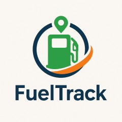

# Capítulo IV: Product Design
En la realización de este capitulo, abordaremos el diseño integral de la startup, cubriendo aspectos clave como el estilo visual, los diagramas C4 para la arquitectura del sistema, los diagramas de clases, y los modelos de base de datos, proporcionando una visión clara y estructurada de la infraestructura y el funcionamiento del proyecto.

## 4.1. Style Guidelines
En esta sección se presentan los estándares que definen el formato y el diseño de la solución, asegurando la calidad en su implementación.

### 4.1.1. General Style Guidelines
Con estas decisiones en el diseño visual buscamos reflejar innovación que incentive a la formalidad en los procesos de comercialización, es asi como demostramos modernidad y calidad, valores que van alineados a nuestro proyecto

**Color**

Seleccionamos esta gama de colores porque armoniza con el diseño del logo y refleja la temática de nuestra aplicación, asegurando la identidad de la marca.

**Tipografia**

Seleccionamos esta tipografía por su excelente legibilidad en diversos entornos, lo que nos permite diferenciarnos frente a la competencia y aportar una identidad única a nuestra marca.

**Branding**

El nombre de nuestro producto es FuelTrack, contamos con un logo que representa claramente nuestro rubro, dandole un toque moderno y simple, ademas usar colores que seran caractristicos en nuestra empresa y amigables a la vista de nuestros clientes

### 4.1.2. Web Style Guidelines
Nuestra página web ha sido diseñada para brindar una navegación cómoda y accesible desde cualquier dispositivo. Para lograrlo, utilizamos un diseño basado en el patrón en Z, el cual dirige de forma natural la atención del usuario hacia los elementos más importantes de la interfaz, facilitando la comprensión rápida de la información clave.

## 4.2. Information Architecture
La arquitectura de información se diseñó para guiar al usuario de forma lógica a través de las funciones esenciales de FuelTrack, facilitando la navegación y reduciendo la curva de aprendizaje.

### 4.2.1. Organization Systems
El Sistema de Organización de FuelTrack tiene como objetivo facilitar la interacción fluida entre los usuarios (compradores y proveedores) y la plataforma mediante una **jerarquía visual clara**. Esta jerarquía destaca las funciones clave —como la **gestión de pedidos de combustible**, el **registro de depósitos** y la **carga de documentos**— permitiendo que los usuarios accedan rápidamente a las acciones más importantes desde la pantalla principal.

- **Agrupación lógica de funciones**: Las funcionalidades están organizadas por bloques temáticos (“Record Deposits”, “Upload Documents”, “Track Orders”), lo que permite a los usuarios identificar rápidamente las opciones disponibles y su propósito.
  
- **Accesibilidad inmediata**: La interfaz principal resalta las opciones más utilizadas mediante una disposición vertical y centrada, optimizada tanto para escritorio como para dispositivos móviles.
  
- **Menú de navegación**: Se mantiene fijo en la parte superior para facilitar el acceso constante a secciones clave como "How it Works", "Pricing" y "Sign Up".
  
- **Reducción de fricción**: Al minimizar la cantidad de clics necesarios para ejecutar acciones comunes, el sistema organiza la información de forma que prioriza la eficiencia y la experiencia del usuario.

Este sistema organizativo asegura que tanto usuarios nuevos como recurrentes puedan navegar por FuelTrack con facilidad, incrementando la productividad y reduciendo los errores de operación.

### 4.2.2. Labeling Systems
### 4.2.3. SEO Tags and Meta Tag

Landing Page:
- Title (SEO Tag): FuelTrack | Simplify Fuel Order Management
- Description (Meta Tag): Optimize your fuel ordering process with FuelTrack — a centralized platform for buyers and suppliers to record deposits, upload documents, and track orders.
- Keywords (Meta Tag): Fuel, Track, Ordering, Fuel management, Supplier platform, Track fuel orders, Fuel deposits, Order management software
- Author (Meta Tag): FuelTrack Team

Web Application:
- Title (SEO Tag): FuelTrack | Manage Fuel Orders and Deposits
- Description (Meta Tag): Access your dashboard to record deposits, manage documents, and monitor fuel order status in real time.
- Keywords (Meta Tag): Fuel order tracking, Deposit management, Supplier dashboard, Fuel logistics, FuelTrack Web App
- Author (Meta Tag): FuelTrack Team

### 4.2.4. Searching Systems
Para garantizar una navegación fluida y centrada de nuestra plataforma, vamos a implementar las siguientes acciones y técnicas tanto para la pagina como la aplicación web:

- Menú de navegación: En la pagina, utilizaremos el Navigation Bar donde contiene enlaces visibles a las secciones más importantes de la plataforma, principalmente de sus caracteristicas y para el registro o ingreso de la cuenta. De esta forma, los nuevos usuarios se informarán rápidamente y a los usuarios existentes les permitirán acceder a sus cuentas fácilmente.
- Navegación Visual Guiada: El contenido está organizado en bloques visuales de las secciones determinadas en la barra principal, permitiendo al usuario desplazarse verticalmente para descubrir las funcionalidades de manera fluida.
- Responsive Design: Esta será construida para que se adapte al tipo de dispositivos del usuario. Por ejemplo, la resolución de la pagina estará optimizada según como sea redimensionada, tendrá compatibilidad tanto en dispositivos de escritorio como en portatiles. De esta forma, los usuarios realizarán sus tareas sin que el cambio de maquina sea un problema.

### 4.2.5. Navigation Systems
Para la plataforma, implementamos un sistema de búsqueda por texto y por categorias para que los usuarios, especialmente para los proveedores, puedan localizar los pedidos que sean realizado o se están llevando a cabo. Se incluirá filtros de la siguiente manera:

Busqueda por texto: El usuario tendrá una tabla de pedidos donde en cada categoria, razón social, numero de pedido, nombre de banco y demás, del pedido tendra un mini buscador estandár para buscar sus pedidos registrados o pendientes y entregará los resultados según el tipo de información que detecte automaticamente. Además, habrá un boton llamado "Busqueda avanzada" donde se realizará una busqueda más especifica siempre y cuando complete todas las categorias.

Busqueda por categoris: El usuario se le brindará un sistema automatico de filtro de datos de las categorias ya existentes para que pueda optimizar su tiempo en tareas de mayor importancia. Por ejemplo, el sistema se encargará de filtrar todas las ubicaciones detectadas de tus pedidos registrados o pendientes y se podrá seleccionar las que quieras aplicar.

## 4.3. Landing Page UI Design

En esta sección se detalla la estructura y el diseño de la landing page. Se analizan los principales componentes que la conforman, como encabezados, botones, imágenes y formularios, explicando su función dentro del recorrido del usuario.

Además, se revisa cómo cada elemento contribuye a que la navegación sea clara, rápida y eficiente, con el fin de facilitar que el usuario complete una acción específica. Se hace especial énfasis en la organización visual y la disposición estratégica de los contenidos para mejorar la experiencia general de uso.

### 4.3.1. Landing Page Wireframe

El wireframe de la landing page de **FuelTrack** es una representación simplificada de la estructura de la página, que permite visualizar cómo se dispondrán los elementos clave para optimizar la experiencia del usuario. A continuación, se detallan las secciones del diseño:

### Primera Pantalla: Encabezado Principal

En esta sección se ubican los elementos de navegación y la propuesta principal de la página. Se incluye el **logo de FuelTrack**, el **menú de navegación** y una **llamada a la acción (CTA)** clara para captar la atención del usuario.  

### Segunda Pantalla: Sobre Nosotros

Esta sección proporciona información general sobre **FuelTrack**, destacando lo que ofrece la empresa y sus características clave. El diseño busca crear una conexión con el usuario mediante un mensaje claro y conciso.  

### Tercera Pantalla: ¿Qué Ofrecemos?

Aquí se detallan los principales servicios ofrecidos por FuelTrack. Se utilizan iconos o elementos visuales sencillos para resaltar las ventajas y características de cada servicio, con un botón de llamada a la acción para incentivar la interacción.  

### Cuarta Pantalla: Principales Proveedores

Se presenta una serie de **logos de los proveedores principales** de FuelTrack, distribuidos de forma ordenada para transmitir solidez y confiabilidad.  

### Quinta Pantalla: Nuestros Clientes

Sección dedicada a mostrar **testimonios de clientes**. Cada testimonio está acompañado por una imagen de perfil del cliente y una cita breve que refuerza la credibilidad de FuelTrack.  

### Sexta Pantalla: Invitación a Solicitantes de Combustible

En esta sección se invita a los usuarios a unirse a FuelTrack, proporcionando un espacio con una **llamada a la acción** clara para captar nuevos clientes interesados en solicitar combustible.

### Séptima Pantalla: Formulario de Contacto

Se incluye un formulario básico que permite a los usuarios realizar consultas o solicitudes. El formulario está compuesto por campos sencillos como **nombre**, **correo electrónico** y **mensaje**.  

### Pie de Página

En esta última sección se agrupan los enlaces de navegación adicionales, los **datos de contacto** y los **enlaces a redes sociales**, presentados de forma accesible y organizada para facilitar la interacción del usuario.  

### 4.3.2. Landing Page Mock-up

### **PANTALLA 1: Encabezado Principal**

La primera pantalla de la landing page de **FuelTrack** presenta un encabezado claro con el **logo** de la empresa, el **menú de navegación** y un **botón de acceso** visible para facilitar la interacción del usuario. Justo debajo, en la **sección hero**, se utiliza una imagen representativa del servicio, mostrando camiones de combustible y el mensaje directo que resalta la propuesta de valor de FuelTrack. El primer **botón de llamada a la acción (CTA)** está enfocado en los **suppliers** que quieren manejar sus órdenes de combustible, con un contraste adecuado para destacar sin distracciones. El diseño utiliza principios de alineación y jerarquía visual para guiar al usuario de manera clara hacia la acción deseada, de forma fluida y eficiente.

### **PANTALLA 2: ¿Qué Ofrecemos?**

En esta sección, se explican de manera concisa los servicios clave que **FuelTrack** ofrece a sus usuarios. Con **tres tarjetas visuales** que incluyen íconos representativos de cada servicio (por ejemplo, gestión de órdenes, seguimiento de combustibles y seguridad en las entregas), la página utiliza **proximidad** para agrupar la información de manera coherente. La jerarquía visual también resalta el **segundo CTA**, dirigido a los **requesters** de combustible, para facilitar su acceso a la plataforma. La disposición sencilla y clara permite a los usuarios captar rápidamente los beneficios sin sobrecargar la vista, asegurando que la información sea accesible para todos los usuarios, incluidos aquellos con dificultades de lectura.

### **PANTALLA 3: Planes y Precios**

Esta pantalla presenta una **comparativa de planes** para ambos tipos de usuarios (suppliers y requesters), con **tarjetas individuales** para cada plan. Cada tarjeta contiene detalles como el **precio**, las **características principales** y un icono visual que resalta la opción más popular. La estructura facilita la comparación entre los diferentes planes, utilizando **jerarquía visual** para hacer que los precios y beneficios sean fácilmente accesibles. Las imágenes y textos son inclusivos, mostrando una variedad de perfiles de usuarios, lo que permite que la plataforma se conecte emocionalmente con una audiencia diversa.

### **PANTALLA 4: Nuestros Proveedores y Partners**

En esta sección, se presentan los **logos de los proveedores** y **partners clave de FuelTrack**, dispuestos de manera ordenada y con suficiente espacio negativo para garantizar la claridad visual. El diseño es minimalista, lo que permite que cada logo destaque sin sobrecargar la vista. Esta organización genera **confianza** a través de la **prueba social**, mostrando que FuelTrack trabaja con marcas confiables y reputadas. El diseño limpio y accesible permite que los usuarios identifiquen fácilmente las empresas asociadas con FuelTrack.

### **PANTALLA 5: Testimonios de Usuarios**

Esta sección presenta **testimonios** de usuarios reales, acompañados de sus **fotos de perfil** y citas breves que validan la experiencia positiva con FuelTrack. La disposición en bloques y el uso de **proximidad** facilita la lectura, haciendo que cada testimonio sea fácil de escanear. Las imágenes representan una variedad de usuarios, asegurando que el diseño sea inclusivo y que todos los perfiles puedan sentirse identificados con la experiencia. Esta sección añade **autenticidad** y **credibilidad** al sitio, ayudando a los nuevos usuarios a confiar en la plataforma.

### **PANTALLA 6: Invitación a Proveedores**

En esta sección se hace un llamado a los **proveedores** de combustible para unirse a **FuelTrack** y comenzar a gestionar sus órdenes. Se utiliza una **imagen profesional** de un proveedor con un **mensaje claro** y un **botón de registro destacado**, todo en un diseño de jerarquía visual que facilita la acción. La imagen y el mensaje destacan el profesionalismo de FuelTrack, mientras que el **primer CTA** resalta para atraer a los proveedores interesados en administrar sus entregas de combustible.

### **PANTALLA 7: Preguntas Frecuentes**

Esta sección está diseñada para resolver las inquietudes de los usuarios mediante **preguntas frecuentes (FAQs)**. Utiliza un formato de **bloques plegables** que permite a los usuarios expandir solo lo que necesitan saber, evitando sobrecargar la vista. El lenguaje es sencillo y accesible para todos los tipos de usuarios. La organización de la información es clara y estructurada, lo que hace que la experiencia de navegación sea más eficiente, mejorando la experiencia del usuario al acceder a la información relevante.

## 4.4. Web Applications UX/UI Design
### 4.4.1. Web Applications Wireframes
### 4.4.2. Web Applications Wireflow Diagrams
### 4.4.2. Web Applications Mock-ups
### 4.4.3. Web Applications User Flow Diagrams

## 4.5. Web Applications Prototyping

## 4.6. Domain-Driven Software Architecture
Esta sección expone la arquitectura de software orientada al dominio, una metodología que enfoca el diseño y desarrollo del sistema en el conocimiento profundo del entorno de negocio. Este enfoque busca lograr una mayor coherencia entre el software y los procesos empresariales, promoviendo una comunicación más efectiva entre los desarrolladores y los especialistas del dominio. Seguidamente, se describen los distintos diagramas y contextos delimitados que estructuran la arquitectura del proyecto.

### 4.6.1. Software Architecture Context Diagram
El diagrama de contexto del sistema muestra la relación entre el sistema y los actores externos, proporcionando una visión general de la arquitectura del sistema y sus interacciones con el entorno externo.

### 4.6.2. Software Architecture Container Diagrams
Los diagramas de contenedores representan los distintos elementos que conforman el sistema, como aplicaciones web, bases de datos o microservicios, y muestran cómo se relacionan entre ellos. Ofrecen una perspectiva general de la arquitectura, resaltando las funciones de cada contenedor y la forma en que interactúan.

### 4.6.3. Software Architecture Components Diagrams
En esta sección, se presentan los diagramas de componentes de la arquitectura de software. Estos diagramas detallan los diferentes componentes que conforman el sistema, sus responsabilidades y cómo interactúan entre sí.

#### Bounded Context: Analytics

Este bounded context contiene todo lo relacionado al control y seguimiento de los pedidos, asimismo como el estados de los pedidos

#### Bounded Context: Control

Este bounded context separa todo lo relacionado con el control de producto que en este caso es combustible de los diferentes proveedores, por lo que el feature de inventario de los proveedores está considerado dentro de este bounded context.

#### Bounded Context: Planning

Este bounded context sirve para alojar el feature de ordenes que se realicen, este feature requiere de instrucciones y analisis de recursos por lo cual está alojado dentro de este bounded context.

## 4.7. Software Object-Oriented Design
### 4.7.1. Class Diagrams
### 4.7.2. Class Dictionary

## 4.8. Database Design
### 4.8.1. Database Diagram

