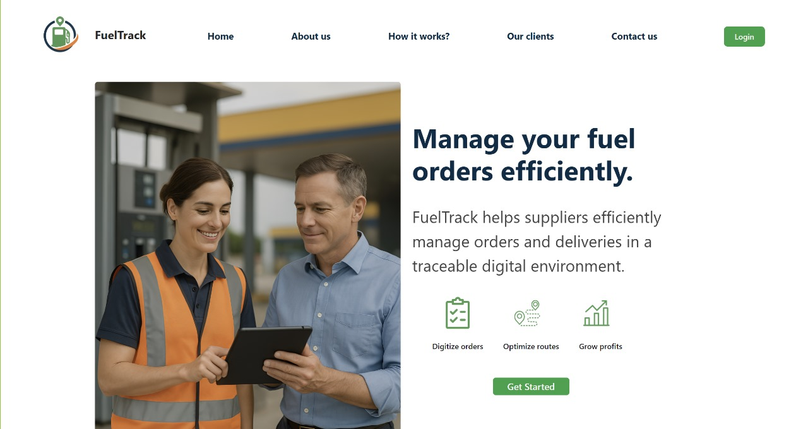
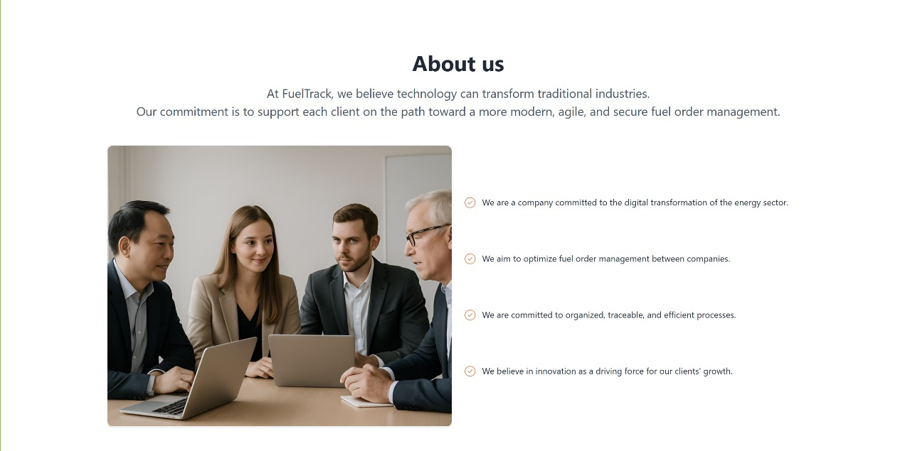
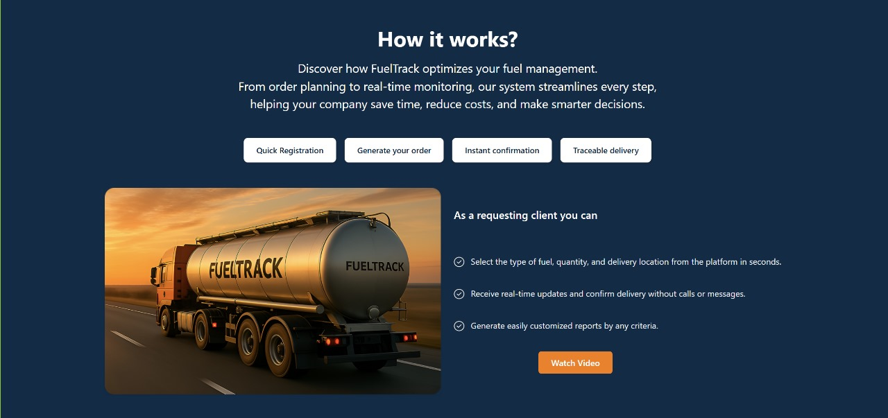
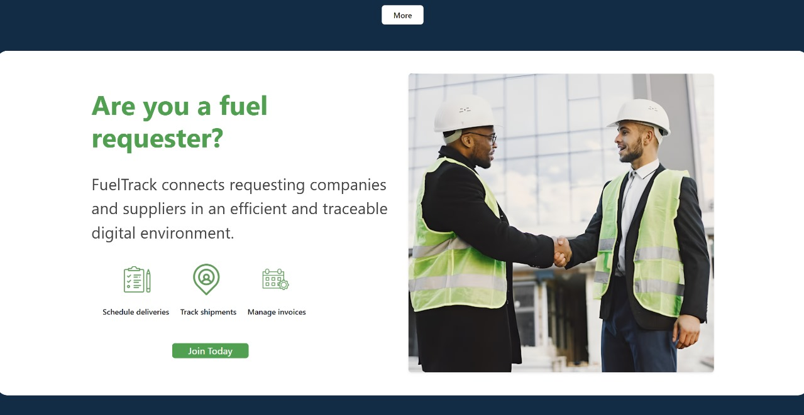
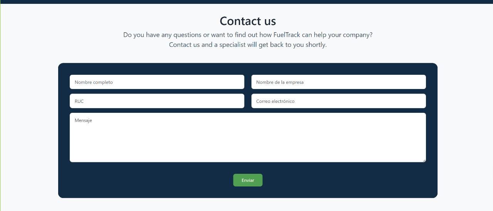
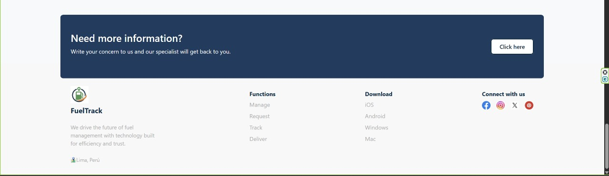

# 5.1. Software Configuration Management
## 5.1.1. Software Development Environment Configuration

**Project Management:**
- WhatsApp: Es una aplicación de mensajería instantánea propiedad de Meta, en la cual coordinamos las tareas del equipo y facilitamos el intercambio de ideas y el apoyo continuo durante el desarrollo del proyecto.
- Google Meet: Es una herramienta de videoconferencias de Google, en la cual mantenemos una comunicación más verbal y directa, permitiendo planificar las tareas de manera colaborativa.
- Google Drive: Es un servicio de almacenamiento en la nube de Google, que utilizamos para compartir archivos de mayor tamaño e información relevante entre los integrantes del equipo.

**Requirements Management:**
- UXPressia: Utilizada para la elaboración de User Personas, User Journey Maps e Impact Maps, lo que nos permite entender mejor a nuestros usuarios y planificar funcionalidades centradas en ellos.
- Zoom: Herramienta empleada para la realización de entrevistas a posibles usuarios, facilitando la obtención de información directa y valiosa para la definición de requisitos.

**Product UX/UI Design:**
- Figma: Plataforma utilizada para el diseño de wireframes, wireflows, mockups y prototipos interactivos, asegurando una visión clara y colaborativa de la interfaz del producto.
Software Development:
- Vertabelo: Herramienta usada para el diseño del modelo de base de datos, permitiendo una estructura clara y visual de las entidades y sus relaciones.
- Google Chrome: Navegador empleado para realizar pruebas de visualización y funcionalidad de la landing page, garantizando su correcto comportamiento en entornos reales.
- Visual Studio Code: Editor de código utilizado para programar en lenguajes como JavaScript y Gherkin, y para integrar funcionalidades mediante herramientas como GitHub.

**Software Documentation:**
- Google Docs: Documento colaborativo para registrar de manera detallada los informes, decisiones y evolución del proyecto.
- Structurizr: Utilizado para el diseño de diagramas C4, lo cual nos permite representar visualmente la arquitectura del software a distintos niveles de abstracción.

## 5.1.2. Source Code Management
En el proyecto, tenemos un repositorio de GitHub para la administrar y estructurar los avances del proyecto por medio de la creación de ramas. Para ello, implementamos el flujo de trabajo de Gitflow expuesta por Vincent Driessen, de tal forma que se puedan realizar las modificaciones entre todos los integrantes de manera segura entre versiones.

**Main branch:** Esta es la rama principal del proyecto, donde se mantiene el código en producción. Solo se actualiza cuando se ha completado y probado una nueva versión estable del sistema.

**Develop branch:** Es la rama de integración donde se fusionan las funcionalidades desarrolladas en las ramas feature antes de ser consideradas para producción. Todo el trabajo colaborativo se integra aquí para ser probado y revisado antes de pasar a la rama "main".

**Feature branches:** Estas ramas se crean a partir de la rama "develop" para trabajar en mejoras específicas, por ello estan divididas en diferentes secciones. Cada una de ellas se desarrolla en su propia rama con el fin de mantener el trabajo organizado y separado del resto del código. Una vez finalizada y probada, la rama se fusiona de nuevo en la rama "develop".

**Conventional commits:** Estos mensajes de confirmación se utilizan para mantener un historial de versiones claro, coherente y comprensible. Este formato establece una convención estructurada que facilita la lectura y el análisis de los cambios realizados en el repositorio. Cada mensaje se describe que tipo de cambios estamos realizando en su respectiva rama, y realizar un "pull request" para fusionar las ramas y establecer los cambios respectivos. Esta práctica no solo mejora la trazabilidad del desarrollo, sino que también permite automatizar procesos como la generación de registros de cambios y la comprensión del historial de versiones.

## 5.1.3. Source Code Style Guide & Conventions
Nuestro equipo adoptó las siguientes convenciones y guías de estilo para garantizar un código fuente coherente, legible y mantenible en los diferentes lenguajes y tecnologías utilizados en nuestra solución. Estas prácticas permiten una colaboración eficiente entre desarrolladores, reducen la deuda técnica y facilitan la escalabilidad de la plataforma.

**HTML:**

Seguimos las convenciones descritas en la guía oficial HTML Style Guide and Coding Conventions para fomentar una estructura limpia, semántica y predecible:

- Usar nombres de elementos en minúsculas.
- Cerrar todos los elementos HTML, incluso los que son opcionales.
- Usar nombres de atributos en minúsculas.
- Incluir siempre los atributos requeridos en elementos clave, especialmente en imágenes (alt) y formularios (name, id, etc.).
- Evitar líneas de código largas para mejorar la legibilidad.
- Utilizar sintaxis simplificada y estándar para hojas de estilo (link) y scripts externos (script).

**CSS:**

Aplicamos las siguientes convenciones para lograr un estilo consistente, ordenado y fácil de mantener:

- Usar minúsculas y guiones para los nombres de clases y selectores.
- Escribir un espacio después de los dos puntos y cerrar cada declaración con punto y coma.
- Agrupar reglas CSS relacionadas y separarlas con una línea en blanco para mejorar la claridad visual.
- Utilizar nombres de clases descriptivos, que reflejen la función o apariencia del elemento.
- Organizar el CSS por bloques lógicos o módulos.

**JavaScript:**

Definimos las siguientes convenciones para asegurar un código robusto, eficiente y comprensible:

- Declarar las variables al inicio del ámbito correspondiente, evitando la redeclaración innecesaria.
- Preferir el uso de const y let en lugar de var para controlar mejor el ámbito y la mutabilidad de las variables.
- Incluir comentarios descriptivos para explicar la funcionalidad de componentes, servicios, validaciones y lógica compleja.
- Mantener las funciones pequeñas y con una única responsabilidad.
- Aplicar principios de programación funcional y reactiva, así como patrones de diseño adecuados.

## 5.1.4. Software Deployment Configuration
**Entorno de Desarrollo**

Tecnologías utilizadas:

- HTML5
- CSS3
- Angular

Gestor de paquetes:

- npm para Angular

**Estrategia de Deployment**

- GitHub Pages
- Repositorio principal en GitHub

Flujo Gitflow:

- main: rama principal de producción
- develop: rama de integración principal
- feature/*: desarrollo de nuevas funcionalidades sobre develop
- Pull Requests se realizan desde feature/* hacia develop

# 5.2. Landing Page, Services & Applications Implementation
## 5.2.1. Sprint 1
En este primer sprint se desarrolló el landing page.

### 5.2.1.1. Sprint Planning 1
<table>
    <tr align="center">
        <td><strong>Sprint #</strong></td>
        <td><strong>Sprint 1</strong></td>
    </tr>
    <tr>
        <td colspan="2" align="center"><strong>Sprint Planning Background</strong></td>
    </tr>
    <tr align="center">
        <td>Date</td>
        <td>10/04/2025</td>
    </tr>
    <tr align="center">
        <td>Time</td>
        <td>11:00 PM</td>
    </tr>
    <tr align="center">
        <td>Location</td>
        <td>Meet</td>
    </tr>
    <tr align="center">
        <td>Prepared by</td>
        <td>Manuel Sanchez</td>
    </tr>
    <tr align="center">
        <td>Attendess (to planning meeting)</td>
        <td>Manuel Angel Sanchez Arenas - U201817507 
        Adrián Emanuel Valerio Garcia - U202210334 
        Luciana Carolina Choquehuanca Nuñez - U202319431 
        César Augusto Navarro Correa - U202310129 
        Franz Jair La Torre Valle - U202012378</td>
    </tr>
    <tr align="center">
        <td>Sprint 0 Review Summary</td>
        <td>No hubo sprint previo</td>
    </tr>
    <tr align="center">
        <td>Sprint 0 Retrospective Summary</td>
        <td>No hubo sprint previo</td>
    </tr>
    <tr>
        <td colspan="2" align="center"><strong>Sprint Goal & User Stories</strong></td>
    </tr>
    <tr align="center">
        <td>Sprint 1 Goal</td>
        <td>Desarrollar el landing page para agregar a repositorio grupal</td>
    </tr>
    <tr align="center">
        <td>Sprint 1 Velocity</td>
        <td>16</td>
    </tr>
    <tr align="center">
        <td>Sum of Story Point</td>
        <td>16</td>
    </tr>
</table>

### 5.2.1.2. Aspect Leaders and Collaborators
| Team Member | GitHub Username | Landing Page | Documentation |
|-------------|-----------------|--------------|---------------|
| Sanchez Arenas, Manuel Angel | manuels7a | C | C |
| Valerio Garcia, Adrián Emanuel | adrianvalerio | C | C |
| Choquehuanca Nuñez, Luciana Carolina | Lucianxaaa | C | L |
| Navarro Correa, César Augusto | csr555-ui | L | C |
| La Torre Valle, Franz Jair | FranzJairLTV | C | C |

### 5.2.1.2. Sprint Backlog 1
<table>
    <tr align="center">
        <td colspan="2"><strong>Sprint #</strong></td>
        <td colspan="6"><strong>Sprint 1</strong></td>
    </tr>
    <tr align="center">
        <td colspan="2"><strong>User Story</strong></td>
        <td colspan="6"><strong>Work-Item / Task</strong></td>
    </tr>
    <tr align="center">
        <td><strong>Id</strong></td>
        <td><strong>Title</strong></td>
        <td><strong>Id</strong></td>
        <td><strong>Title</strong></td>
        <td><strong>Description</strong></td>
        <td><strong>Estimation (Hours)</strong></td>
        <td><strong>Assigned to</strong></td>
        <td><strong>Status (To do / In process / To review / Done)</strong></td>
    </tr>
    <tr align="center">
        <td>US-01</td>
        <td>Ver sección Home</td>
        <td>W-01</td>
        <td>Sección Home</td>
        <td>Como visitante, quiero ver una sección de inicio que resuma el valor de FuelTrack para comprender rápidamente el objetivo del sistema</td>
        <td>5 horas</td>
        <td>Frezzia</td>
        <td>Done</td>
    </tr>
    <tr align="center">
        <td>US-02</td>
        <td>Ver sección About Us</td>
        <td>W-02</td>
        <td>Sección About Us</td>
        <td>Como visitante, quiero conocer quiénes están detrás de FuelTrack para confiar en el sistema</td>
        <td>3 horas</td>
        <td>Franz</td>
        <td>Done</td>
    </tr>
    <tr align="center">
        <td>US-03</td>
        <td>Ver sección How it Works?</td>
        <td>W-03</td>
        <td>Sección How it works?</td>
        <td>Como visitante, quiero entender cómo funciona FuelTrack paso a paso para evaluar si se ajusta a mis necesidades</td>
        <td>5 horas</td>
        <td>César</td>
        <td>Done</td>
    </tr>
    <tr align="center">
        <td>US-30</td>
        <td>Ver sección de preguntas frecuentes</td>
        <td>W-04</td>
        <td>Preguntas frecuentes</td>
        <td>Como visitante, quiero acceder a una sección de preguntas frecuentes para resolver dudas rápidamente</td>
        <td>4 horas</td>
        <td>Luciana</td>
        <td>In Process</td>
    </tr>
    <tr align="center">
        <td>US-04</td>
        <td>Enviar mensaje de contacto</td>
        <td>W-05</td>
        <td>Contacto</td>
        <td>Como visitante, quiero enviar un mensaje desde Contact Us para solicitar más información</td>
        <td>5 horas</td>
        <td>Adrián</td>
        <td>Done</td>
    </tr>
    <tr align="center">
        <td>US-31</td>
        <td>Acceder a información de contacto rápido</td>
        <td>W-06</td>
        <td>Información de contacto</td>
        <td>Como usuario, quiero ver datos de contacto directo (teléfono o correo) para hacer consultas urgentes</td>
        <td>2 horas</td>
        <td>Manuel</td>
        <td>Done</td>
    </tr>
</table>

### 5.2.1.3. Development Evidence for Sprint Review
Durante el Sprint 1, el equipo de desarrollo de FuelTrack avanzó en la construcción de la Landing Page, cumpliendo con las User Stories priorizadas. Se trabajó en la maquetación de las secciones principales, implementación de estilos CSS, diseño responsive para diferentes dispositivos y subida de los cambios al repositorio grupal. Los commits fueron realizados en ramas feature/ y luego integrados a la rama develop mediante Pull Requests.

### 5.2.1.5. Execution Evidence for Sprint Review
En el sprint 1 se diseñó el primer modelo de la landing page. Esta cuenta con diferentes secciones para acceso de los usuarios. Algunas evidencias son:
- **Home:** Presenta de manera rápida el propósito y valor de FuelTrack para captar la atención del visitante.

- **About Us:** Explica quiénes somos y nuestra misión para generar confianza.

- **How it works?:** Describe de forma sencilla y visual el funcionamiento de FuelTrack paso a paso.

- **Our CLients:** Muestra algunas de las empresas o usuarios que confían en FuelTrack como referencia de credibilidad.

- **Join:** Invita a nuevos usuarios o empresas a registrarse o solicitar información para unirse a FuelTrack.

- **Contact Us:** Ofrece un formulario y datos de contacto directo para resolver dudas o solicitar soporte.

- **Footer:** Contiene información adicional como redes sociales y enlaces de interés.

### 5.2.1.6. Services Documentation Evidence for Sprint Review
Durante el Sprint 1, el equipo se enfocó en el desarrollo del Landing Page de FuelTrack, por lo cual no se implementaron ni documentaron endpoints relacionados a Web Services. Los trabajos de desarrollo backend, integración de API y documentación con OpenAPI están planificados para Sprints posteriores.

### 5.2.1.7. Software Deployment Evidence for Sprint Review
Durante este Sprint, nos enfocamos en asegurar un proceso de Deployment eficiente y efectivo, tanto para nuestra aplicación principal como para la Landing Page asociada y los Web Services que soportan la infraestructura de la aplicación. Este enfoque no solo buscó mejorar la experiencia de usuario final, sino también optimizar nuestro flujo de trabajo de desarrollo y despliegue continuo.

### 5.2.1.8. Team Collaboration Insights during Sprint

## Conclusiones 

- El proyecto FuelTrack planteó una solución clara y concreta para optimizar la gestión de pedidos de combustible, basada en una comprensión real del mercado y de las necesidades de los usuarios.

- Se validó la propuesta de valor a través de métodos ágiles como Lean UX, entrevistas y análisis de competencia, logrando definir un producto que resuelve problemas reales de eficiencia y comunicación.

- Se diseñó una experiencia de usuario consistente y accesible, destacando especialmente la *Landing Page*, que comunica de forma clara la oferta del servicio, apoya la conversión mediante call to actions estratégicos y genera confianza a través de testimonios y prueba social.

- El diseño de la plataforma web combinó buenas prácticas de arquitectura de información, navegación intuitiva y guías de estilo que garantizan una imagen profesional y coherente en toda la experiencia digital.

- A nivel técnico, se construyó una base sólida de arquitectura de software y base de datos, asegurando escalabilidad, mantenibilidad y alineación con los objetivos de negocio.

- El desarrollo del producto se organizó mediante una planificación iterativa, permitiendo construir, validar y mejorar de manera progresiva, asegurando que el resultado final responda tanto a las expectativas de los usuarios como a las metas de FuelTrack.

## Bibliografia

Interaction Design Foundation. (s.f.). *A simple introduction to Lean UX*. Recuperado de [https://www.interaction-design.org/literature/article/a-simple-introduction-to-lean-ux](https://www.interaction-design.org/literature/article/a-simple-introduction-to-lean-ux)

Baymard Institute. (s.f.). *The best practices and key principles of UX design*. Recuperado de [https://baymard.com/learn/ux-design-principles](https://baymard.com/learn/ux-design-principles)

Laubheimer, P. (2022, abril 10). *Information architecture: Study guide*. Nielsen Norman Group. Recuperado de [https://www.nngroup.com/articles/ia-study-guide/](https://www.nngroup.com/articles/ia-study-guide/)

UXPin. (2024, agosto). *Design consistency guide: UI and UX best practices*. Recuperado de [https://www.uxpin.com/studio/blog/guide-design-consistency-best-practices-ui-ux-designers/](https://www.uxpin.com/studio/blog/guide-design-consistency-best-practices-ui-ux-designers/)

CareerFoundry. (2023, enero 5). *A beginner’s guide to information architecture in UX*. Recuperado de [https://careerfoundry.com/en/blog/ux-design/a-beginners-guide-to-information-architecture/](https://careerfoundry.com/en/blog/ux-design/a-beginners-guide-to-information-architecture/)

Contentsquare. (2024, octubre). *What is Lean UX? The 3 key phases of Lean UX design*. Recuperado de [https://contentsquare.com/guides/ux/lean/](https://contentsquare.com/guides/ux/lean/)

UX Design Institute. (2022, noviembre 15). *What is Lean UX and why does it matter? A complete guide*. Recuperado de [https://www.uxdesigninstitute.com/blog/what-is-lean-ux/](https://www.uxdesigninstitute.com/blog/what-is-lean-ux/)

Windmill Digital. (2023, septiembre 10). *10 UX best practices for optimal user experience in 2024*. Recuperado de [https://windmill.digital/ten-ux-best-practices-for-optimal-user-experience-in-2024/](https://windmill.digital/ten-ux-best-practices-for-optimal-user-experience-in-2024/)

Smashing Magazine. (2020, julio 21). *Information and information architecture: The big picture*. Recuperado de [https://www.smashingmagazine.com/2020/07/information-architecture-big-picture/](https://www.smashingmagazine.com/2020/07/information-architecture-big-picture/)

UXAX. (2023, junio 18). *The Lean UX process: Streamlining user-centered design*. Recuperado de [https://www.uxax.org/post/the-lean-ux-process-streamlining-user-centered-design](https://www.uxax.org/post/the-lean-ux-process-streamlining-user-centered-design)

