# 5.1. Software Configuration Management
## 5.1.1. Software Development Environment Configuration

### Project Management
- **WhatsApp**: Aplicación de mensajería instantánea propiedad de Meta, utilizada para coordinar tareas del equipo, facilitar el intercambio de ideas y brindar soporte continuo durante el desarrollo del proyecto.
- **Google Meet**: Herramienta de videoconferencias de Google empleada para mantener una comunicación verbal y directa, permitiendo la planificación colaborativa de actividades y la toma de decisiones en tiempo real.
- **Google Drive**: Servicio de almacenamiento en la nube que facilita el intercambio de archivos de gran tamaño e información relevante entre los miembros del equipo.
- **Notion**: Plataforma utilizada para la organización, asignación y seguimiento de tareas, centralizando la gestión de actividades y documentación del proyecto.

### Requirements Management
- **UXPressia**: Herramienta utilizada para la elaboración de User Personas, User Journey Maps e Impact Maps, lo que permite comprender mejor las necesidades de los usuarios y definir funcionalidades centradas en ellos.
- **Zoom**: Aplicación empleada para la realización de entrevistas a potenciales usuarios, facilitando la recopilación de información valiosa para la definición y validación de requisitos.

### Product UX/UI Design
- **Figma**: Plataforma colaborativa utilizada para el diseño de wireframes, wireflows, mockups y prototipos interactivos, garantizando una visión clara y alineada de la interfaz del producto.

### Software Development
- **Vertabelo**: Herramienta empleada para el diseño del modelo de base de datos, permitiendo una representación visual y estructurada de las entidades y sus relaciones.
- **Google Chrome**: Navegador utilizado para la ejecución de pruebas de visualización y funcionalidad de la landing page y el frontend, asegurando su correcto comportamiento en entornos reales.
- **JetBrains WebStorm**: Entorno de desarrollo integrado empleado para la implementación del frontend de la aplicación.
- **JetBrains IntelliJ IDEA**: Entorno de desarrollo integrado utilizado para la implementación y gestión del backend de la aplicación.

### Software Deployment
- **GitHub Pages**: Servicio de hosting utilizado para el despliegue de la landing page del proyecto.

### Software Documentation
- **Google Docs**: Herramienta de edición colaborativa utilizada para documentar de manera detallada informes, decisiones y avances del proyecto.
- **Structurizr**: Plataforma empleada para la creación de diagramas C4, permitiendo representar visualmente la arquitectura del software en distintos niveles de abstracción.
- **GitHub**: Plataforma utilizada para la gestión de repositorios de código y documentación del proyecto, incluyendo la landing page, el frontend, el backend y los documentos técnicos, facilitando el trabajo colaborativo y el control de versiones.

### Gestión de Versiones con Git y GitFlow

En el proyecto, utilizamos GitHub como repositorio central para gestionar y estructurar los avances del desarrollo. Para mantener un flujo de trabajo organizado, colaborativo y seguro, aplicamos el modelo de trabajo **GitFlow**, propuesto por Vincent Driessen. Este modelo nos permite gestionar versiones, trabajar en paralelo y mantener el control sobre cada fase del desarrollo.

#### Estructura de ramas utilizada

- **`main`**: Contiene la versión estable del sistema en producción. Solo se actualiza tras haber pasado por pruebas en otras ramas.
- **`develop`**: Rama principal de integración donde se concentran las funcionalidades antes de pasar a producción.
- **`feature/*`**: Ramas creadas desde `develop` para trabajar en funcionalidades específicas.  
  Ejemplos: `feature/login`, `feature/perfil-usuario`, `feature/ajuste-filtro`.
- **`release/*`**: Ramas creadas antes de una entrega importante para realizar pruebas finales, ajustes y validaciones.  
  Ejemplo: `release/v1.0.0`.
- **`hotfix/*`**: Ramas creadas desde `main` para solucionar errores críticos en producción de forma inmediata.  
  Ejemplo: `hotfix/arreglo-footer`.

#### Flujo de trabajo aplicado

1. Cada nueva funcionalidad se desarrolla en una rama `feature/nombre-funcionalidad` a partir de `develop`.
2. Al finalizar, se realiza un Pull Request para fusionarla nuevamente en `develop`, previa revisión.
3. Antes de cada entrega oficial, se crea una rama `release/` desde `develop` para realizar pruebas finales.
4. Una vez validada, la `release/` se fusiona a `main` (producción) y a `develop` (para mantener consistencia).
5. En caso de errores críticos detectados en producción, se crea una rama `hotfix/` desde `main`, se corrige, y se hace merge a `main` y `develop`.

#### Uso de Conventional Commits

Empleamos el estándar de **Conventional Commits** para mantener un historial claro y comprensible. Este formato permite identificar rápidamente el tipo de cambio realizado (funcionalidad, corrección, refactorización, etc.), facilitando la trazabilidad y automatización del proyecto.

Ejemplo:
- `feat: agregar formulario de registro`
- `fix: corregir error de navegación en el login`

#### Evidencia del uso de GitFlow

Durante el desarrollo se ha aplicado GitFlow de forma progresiva en todos los repositorios. El historial de ramas, commits y Pull Requests puede verificarse directamente en la pestaña de ramas y solicitudes de extracción del repositorio. Esta implementación ha permitido un trabajo más ordenado, seguro y colaborativo entre todos los integrantes del equipo.

## 5.1.3. Source Code Style Guide & Conventions
Nuestro equipo adoptó las siguientes convenciones y guías de estilo para garantizar un código fuente coherente, legible y mantenible en los diferentes lenguajes y tecnologías utilizados en nuestra solución. Estas prácticas permiten una colaboración eficiente entre desarrolladores, reducen la deuda técnica y facilitan la escalabilidad de la plataforma.

**HTML:**

Seguimos las convenciones descritas en la guía oficial HTML Style Guide and Coding Conventions para fomentar una estructura limpia, semántica y predecible:

- Usar nombres de elementos en minúsculas.
- Cerrar todos los elementos HTML, incluso los que son opcionales.
- Usar nombres de atributos en minúsculas.
- Incluir siempre los atributos requeridos en elementos clave, especialmente en imágenes (alt) y formularios (name, id, etc.).
- Evitar líneas de código largas para mejorar la legibilidad.
- Utilizar sintaxis simplificada y estándar para hojas de estilo (link) y scripts externos (script).

**CSS:**

Aplicamos las siguientes convenciones para lograr un estilo consistente, ordenado y fácil de mantener:

- Usar minúsculas y guiones para los nombres de clases y selectores.
- Escribir un espacio después de los dos puntos y cerrar cada declaración con punto y coma.
- Agrupar reglas CSS relacionadas y separarlas con una línea en blanco para mejorar la claridad visual.
- Utilizar nombres de clases descriptivos, que reflejen la función o apariencia del elemento.
- Organizar el CSS por bloques lógicos o módulos.

**JavaScript:**

Definimos las siguientes convenciones para asegurar un código robusto, eficiente y comprensible:

- Declarar las variables al inicio del ámbito correspondiente, evitando la redeclaración innecesaria.
- Preferir el uso de const y let en lugar de var para controlar mejor el ámbito y la mutabilidad de las variables.
- Incluir comentarios descriptivos para explicar la funcionalidad de componentes, servicios, validaciones y lógica compleja.
- Mantener las funciones pequeñas y con una única responsabilidad.
- Aplicar principios de programación funcional y reactiva, así como patrones de diseño adecuados.

## 5.1.4. Software Deployment Configuration
#### Entorno de Desarrollo

Tecnologías utilizadas:

- HTML5
- CSS3
- Angular

Gestor de paquetes:

- npm para Angular

#### Estrategia de Deployment

- GitHub Pages
- Repositorio principal en GitHub

Flujo Gitflow:

- main: rama principal de producción
- develop: rama de integración principal
- feature/*: desarrollo de nuevas funcionalidades sobre develop
- Pull Requests se realizan desde feature/* hacia develop

# 5.2. Landing Page, Services & Applications Implementation
## 5.2.1. Sprint 1
En este primer sprint se desarrolló el landing page.

### 5.2.1.1. Sprint Planning 1
<table>
    <tr align="center">
        <td><strong>Sprint #</strong></td>
        <td><strong>Sprint 1</strong></td>
    </tr>
    <tr>
        <td colspan="2" align="center"><strong>Sprint Planning Background</strong></td>
    </tr>
    <tr align="center">
        <td>Date</td>
        <td>10/04/2025</td>
    </tr>
    <tr align="center">
        <td>Time</td>
        <td>11:00 PM</td>
    </tr>
    <tr align="center">
        <td>Location</td>
        <td>Meet</td>
    </tr>
    <tr align="center">
        <td>Prepared by</td>
        <td>Manuel Sanchez</td>
    </tr>
    <tr align="center">
        <td>Attendess (to planning meeting)</td>
        <td>
          Manuel Angel Sanchez Arenas - U201817507 
          Adrián Emanuel Valerio Garcia - U202210334 
          Luciana Carolina Choquehuanca Nuñez - U202319431 
          César Augusto Navarro Correa - U202310129 
          Franz Jair La Torre Valle - U202012378 
          Frezzia Eldaa Isabel Espinoza Paredes - U815121
        </td>
    </tr>
    <tr align="center">
        <td>Sprint 0 Review Summary</td>
        <td>No hubo sprint previo</td>
    </tr>
    <tr align="center">
        <td>Sprint 0 Retrospective Summary</td>
        <td>No hubo sprint previo</td>
    </tr>
    <tr>
        <td colspan="2" align="center"><strong>Sprint Goal & User Stories</strong></td>
    </tr>
    <tr align="center">
        <td>Sprint 1 Goal</td>
        <td>Desarrollar una landing page funcional y visualmente clara que comunique efectivamente la propuesta de valor de FuelTrack a nuestros dos segmentos clave de usuarios: proveedores de combustible y solicitantes de combustible. La página debe incluir secciones estratégicas como: 
•	Home, con un call to action para captar proveedores interesados. 
•	Are you a fuel requester?, con un call to action dirigido a potenciales solicitantes. 
•	Secciones informativas como About Us y How it works?, para explicar el funcionamiento del sistema. 
•	Secciones de validación social como Main Suppliers y Our Clients, para generar confianza mostrando empresas reales que ya usan el servicio. 
•	Una sección de contacto directo (Contact Us) para atención inmediata. 
•	Soporte de idioma bilingüe (español e inglés) para mayor accesibilidad.
</td>
    </tr>
    <tr align="center">
        <td>Sprint 1 Velocity</td>
        <td>12</td>
    </tr>
    <tr align="center">
        <td>Sum of Story Point</td>
        <td>22</td>
    </tr>
</table>

### 5.2.1.2. Aspect Leaders and Collaborators

| Team Member                                 | GitHub Username    | Landing Page  | Documentation  |
|---------------------------------------------|--------------------|---------------|----------------|
| Manuel Angel Sanchez Arenas                 | manuels7a          | C             | C              |
| Adrián Emanuel Valerio Garcia               | adrianvalerio      | C             | C              |
| Luciana Carolina Choquehuanca Nuñez         | Lucianxaaa         | C             | L              |
| César Augusto Navarro Correa                | csr555-ui          | L             | C              |
| Franz Jair La Torre Valle                   | FranzJairLTV       | C             | C              |
| Frezzia Eldaa Isabel Espinoza Paredes       | fflushh            | C             | C              |

### 5.2.1.3. Sprint Backlog 1
<table>
    <tr align="center">
        <td colspan="2"><strong>Sprint #</strong></td>
        <td colspan="6"><strong>Sprint 1</strong></td>
    </tr>
    <tr align="center">
        <td colspan="2"><strong>User Story</strong></td>
        <td colspan="6"><strong>Work-Item / Task</strong></td>
    </tr>
    <tr align="center">
        <td><strong>Id</strong></td>
        <td><strong>Title</strong></td>
        <td><strong>Id</strong></td>
        <td><strong>Title</strong></td>
        <td><strong>Description</strong></td>
        <td><strong>Estimation (Hours)</strong></td>
        <td><strong>Assigned to</strong></td>
        <td><strong>Status (To do / In process / To review / Done)</strong></td>
    </tr>
    <tr align="center">
        <td>US-01</td>
        <td>Ver sección Home</td>
        <td>W-01</td>
        <td>Sección Home</td>
        <td>Como visitante (proveedor), quiero ver una sección de inicio que resuma el valor de FuelTrack para comprender rápidamente el objetivo del sistema</td>
        <td>5 horas</td>
        <td>Frezzia</td>
        <td>Done</td>
    </tr>
    <tr align="center">
        <td>US-02</td>
        <td>Ver sección About Us</td>
        <td>W-02</td>
        <td>Sección About Us</td>
        <td>Como visitante de ambos segmentos, quiero conocer quiénes están detrás de FuelTrack para confiar en el sistema</td>
        <td>4 horas</td>
        <td>Franz</td>
        <td>Done</td>
    </tr>
    <tr align="center">
        <td>US-03</td>
        <td>Ver sección How it Works?</td>
        <td>W-03</td>
        <td>Sección How it works?</td>
        <td>Como visitante de ambos segmentos, quiero entender cómo funciona FuelTrack paso a paso para evaluar si se ajusta a mis necesidades</td>
        <td>5 horas</td>
        <td>César</td>
        <td>Done</td>
    </tr>
    <tr align="center">
        <td>US-41</td>
        <td>Ver sección Main Suppliers</td>
        <td>W-04</td>
        <td>Sección Main Suppliers</td>
        <td>Como visitante de ambos segmentos, quiero conocer los principales proveedores de combustible que trabajan con FuelTrack para confiar en la plataforma</td>
        <td>4 horas</td>
        <td>Luciana</td>
        <td>Done</td>
    </tr>
    <tr align="center">
        <td>US-42</td>
        <td>Ver sección Our Clients</td>
        <td>W-05</td>
        <td>Sección Our Clients</td>
        <td>Como visitante de ambos segmentos, quiero conocer a las empresas que utilizan FuelTrack para tener confianza en la plataforma y saber que otras empresas ya la están usando</td>
        <td>6 horas</td>
        <td>Frezzia</td>
        <td>Done</td>
    </tr>
    <tr align="center">
        <td>US-04</td>
        <td>Enviar mensaje de contacto</td>
        <td>W-06</td>
        <td>Contacto</td>
        <td>Como visitante de ambos segmentos, quiero enviar un mensaje desde Contact Us para solicitar más información</td>
        <td>5 horas</td>
        <td>Adrián</td>
        <td>In Process</td>
    </tr>
    <tr align="center">
        <td>US-43</td>
        <td>Ver sección Are You A Fuel Requester?</td>
        <td>W-07</td>
        <td>Are You A Fuel Requester?</td>
        <td>Como visitante (solicitante), quiero saber si cumplo con los requisitos de solicitante de combustible para poder iniciar un proceso de registro o solicitud</td>
        <td>6 horas</td>
        <td>Manuel</td>
        <td>Done</td>
    </tr>
    <tr align="center">
        <td>US-44</td>
        <td>Cambiar idioma</td>
        <td>W-08</td>
        <td>Idioma</td>
        <td>Como visitante de ambos segmentos, quiero poder cambiar entre inglés y español para entender la plataforma en mi idioma preferido</td>
        <td>8 horas</td>
        <td>César</td>
        <td>In Process</td>
    </tr>
</table>

### 5.2.1.4. Development Evidence for Sprint Review
Durante el Sprint 1, el equipo de desarrollo de FuelTrack avanzó en la construcción de la Landing Page, cumpliendo con las User Stories priorizadas. Se trabajó en la maquetación de las secciones principales, implementación de estilos CSS, diseño responsive para diferentes dispositivos y subida de los cambios al repositorio grupal. Los commits fueron realizados en ramas feature/ y luego integrados a la rama develop mediante Pull Requests.

<table border="1" cellspacing="0" cellpadding="6">
  <thead>
    <tr>
      <th>Repositorio</th>
      <th>Rama</th>
      <th>ID de Commit</th>
      <th>Mensaje de Commit</th>
      <th>Descripción del Commit</th>
      <th>Fecha de Commit</th>
    </tr>
  </thead>
<tbody>
  <tr><td>1ASI0730-2510-4374-G4-FuelTrack/landing-page</td><td>main</td>
  <td>9182d59</td>
  <td>First version of landing page</td>
  <td>-</td>
  <td>27/04/2025</td></tr>
  <tr><td>1ASI0730-2510-4374-G4-FuelTrack/landing-page</td><td>main</td>
  <td>9182d59</td>
  <td>fix(landing page): feat update navbar</td>
  <td>-</td>
  <td>27/04/2025</td></tr>
</tbody>

</table>

### 5.2.1.5. Execution Evidence for Sprint Review
En el sprint 1 se diseñó el primer modelo de la landing page. Esta cuenta con diferentes secciones para acceso de los usuarios. Algunas evidencias son:
- **Home:** Presenta de manera rápida el propósito y valor de FuelTrack para captar la atención del visitante.

- **About Us:** Explica quiénes somos y nuestra misión para generar confianza.

- **How it works?:** Describe de forma sencilla y visual el funcionamiento de FuelTrack paso a paso.

- **Our Clients:** Muestra algunas de las empresas o usuarios que confían en FuelTrack como referencia de credibilidad.

- **Join:** Invita a nuevos usuarios o empresas a registrarse o solicitar información para unirse a FuelTrack.

- **Contact Us:** Ofrece un formulario y datos de contacto directo para resolver dudas o solicitar soporte.

- **Footer:** Contiene información adicional como redes sociales y enlaces de interés.

### 5.2.1.6. Services Documentation Evidence for Sprint Review
Durante el Sprint 1, el equipo se enfocó en el desarrollo del Landing Page de FuelTrack, por lo cual no se implementaron ni documentaron endpoints relacionados a Web Services. Los trabajos de desarrollo backend, integración de API y documentación con OpenAPI están planificados para Sprints posteriores.

### 5.2.1.7. Software Deployment Evidence for Sprint Review
Durante este Sprint, nos enfocamos en asegurar un proceso de Deployment eficiente y efectivo, tanto para nuestra aplicación principal como para la Landing Page asociada y los Web Services que soportan la infraestructura de la aplicación. Este enfoque no solo buscó mejorar la experiencia de usuario final, sino también optimizar nuestro flujo de trabajo de desarrollo y despliegue continuo.

**Link:** 

### 5.2.1.8. Team Collaboration Insights during Sprint
Dividimos las tareas según las secciones acordadas durante las reuniones de planificación, ello nos permitió trabajar de manera eficiente y centrarnos en áreas específicas para optimizar el tiempo y los recursos. Dicha participación de los miembros del equipo se ve reflejado en los commits realizados en el repositorio de trabajo.

## 5.2.2. Sprint 2
En este segundo sprint se desarrollo el frontend para nuestra pagina web

### 5.2.2.1. Sprint Planning 2
En esta siguiente etapa de proyecto, nuestra principal objetivo sera desarrollar el frontend de nuestra pagina web mediante WebStorm como nuestro entorno de desarrollo

Repositorio Github: https://github.com/1ASI0729-2510-4317-G4-FuelTrack/FuelTrack-front-end

<table>
    <tr align="center">
        <td><strong>Sprint #</strong></td>
        <td><strong>Sprint 2</strong></td>
    </tr>
    <tr>
        <td colspan="2" align="center"><strong>Sprint Planning Background</strong></td>
    </tr>
    <tr align="center">
        <td>Date</td>
        <td>8/05/2025</td>
    </tr>
    <tr align="center">
        <td>Time</td>
        <td>8:00 PM</td>
    </tr>
    <tr align="center">
        <td>Location</td>
        <td>Discord</td>
    </tr>
    <tr align="center">
        <td>Prepared by</td>
        <td>Adrian Emanuel Valerio Garcia</td>
    </tr>
    <tr align="center">
        <td>Attendess (to planning meeting)</td>
        <td>
          Manuel Angel Sanchez Arenas - U201817507 
          Adrián Emanuel Valerio Garcia - U202210334 
          Luciana Carolina Choquehuanca Nuñez - U202319431 
          César Augusto Navarro Correa - U202310129 
          Franz Jair La Torre Valle - U202012378 
          Frezzia Eldaa Isabel Espinoza Paredes - U815121
        </td>
    </tr>
    <tr align="center">
        <td>Sprint 1 Review Summary</td>
        <td>En este primer sprint se desarrolló el landing page y el informe</td>
    </tr>
    <tr align="center">
        <td>Sprint 1 Retrospective Summary</td>
        <td>En este primer sprint se desarrolló el landing page y el informe</td>
    </tr>
    <tr>
        <td colspan="2" align="center"><strong>Sprint Goal & User Stories</strong></td>
    </tr>
    <tr align="center">
        <td>Sprint 2 Goal</td>
        <td>Desarrollar el FrontEnd para agregarlo al repositorio</td>
    </tr>
    <tr align="center">
        <td>Sprint 2 Velocity</td>
        <td>16</td>
    </tr>
    <tr align="center">
        <td>Sum of Story Point</td>
        <td>76</td>
    </tr>
</table>

### 5.2.2.2. Aspect Leaders and Collaborators

| Team Member                                 | GitHub Username    | Landing Page | Documentation  | Frontend | Correcciones TB1 |
|---------------------------------------------|--------------------|--------------|----------------|----------|------------------|
| Manuel Angel Sanchez Arenas                 | manuels7a          | C            | C              | C        | L                |
| Adrián Emanuel Valerio Garcia               | adrianvalerio      | C            | C              | L        | C                |
| Luciana Carolina Choquehuanca Nuñez         | Lucianxaaa         | C            | L              | C        | L                |
| César Augusto Navarro Correa                | csr555-ui          | L            | C              | C        | C                |
| Franz Jair La Torre Valle                   | FranzJairLTV       | C            | C              | L        | C                |
| Frezzia Eldaa Isabel Espinoza Paredes       | fflushh            | C            | C              | C        | C                |

### 5.2.2.3. Sprint Backlog 2

<table>
    <tr align="center">
        <td colspan="2"><strong>Sprint #</strong></td>
        <td colspan="6"><strong>Sprint 2</strong></td>
    </tr>
    <tr align="center">
        <td colspan="2"><strong>User Story</strong></td>
        <td colspan="6"><strong>Work-Item / Task</strong></td>
    </tr>
    <tr align="center">
        <td><strong>Id</strong></td>
        <td><strong>Title</strong></td>
        <td><strong>Id</strong></td>
        <td><strong>Title</strong></td>
        <td><strong>Description</strong></td>
        <td><strong>Estimation (Hours)</strong></td>
        <td><strong>Assigned to</strong></td>
        <td><strong>Status (To do / In process / To review / Done)</strong></td>
    </tr>
    <tr align="center">
        <td>US-04</td>
        <td>Enviar mensaje de contacto</td>
        <td>W-09</td>
        <td>Implementar formulario de contacto</td>
        <td>Como visitante de ambos segmentos, quiero enviar un mensaje desde Contact Us para solicitar más información.</td>
        <td>5 horas</td>
        <td>Frezzia</td>
        <td>Done</td>
    </tr>
   <tr align="center">
        <td>US-05</td>
        <td>Registrar nuevo pedido</td>
        <td>W-10</td>
        <td>Crear formulario de registro de pedido</td>
        <td>Como solicitante, quiero registrar un pedido con tipo y cantidad de combustible para que el proveedor lo procese.</td>
        <td>6 horas</td>
        <td>Cesar</td>
        <td>Done</td>
    </tr>
    <tr align="center">
        <td>US-06</td>
        <td>Consultar estado del pedido</td>
        <td>W-11</td>
        <td>Mostrar estado de pedidos del usuario</td>
        <td>Como solicitante, quiero ver el estado de mis pedidos para saber si están aprobados, en tránsito o entregados.</td>
        <td>4 horas</td>
        <td>Adrián</td>
        <td>Done</td>
    </tr>
    <tr align="center">
        <td>US-07</td>
        <td>Confirmar recepción de pedido</td>
        <td>W-12</td>
        <td>Confirmar recepción desde interfaz</td>
        <td>Como solicitante, quiero confirmar que recibí el pedido para que el proveedor lo cierre.</td>
        <td>5 horas</td>
        <td>Franz</td>
        <td>Done</td>
    </tr>
    <tr align="center">
        <td>US-08</td>
        <td>Registrar información de pago</td>
        <td>W-13</td>
        <td>Formulario de ingreso de pagos</td>
        <td>Como solicitante, quiero ingresar la información de los pagos correspondientes para validar el pedido ante el proveedor.</td>
        <td>4 horas</td>
        <td>Luciana</td>
        <td>Done</td>
    </tr>
    <tr align="center">
        <td>US-09</td>
        <td>Ver historial de pedidos</td>
        <td>W-14</td>
        <td>Mostrar el listado de pedidos y su información</td>
        <td>Como solicitante, quiero ver mis pedidos anteriores para tener control sobre mi consumo.</td>
        <td>4 horas</td>
        <td>Frezzia</td>
        <td>Done</td>
    </tr>
    <tr align="center">
        <td>US-10</td>
        <td>Ver pedidos pendientes</td>
        <td>W-15</td>
        <td>Mostrar pedidos pendientes al proveedor</td>
        <td>Como proveedor, quiero ver todos los pedidos pendientes para analizarlos y tomar acción.</td>
        <td>4 horas</td>
        <td>Cesar</td>
        <td>Done</td>
    </tr>
    <tr align="center">
        <td>US-11</td>
        <td>Aprobar pedido</td>
        <td>W-16</td>
        <td>Aprobar pedidos desde panel proveedor</td>
        <td>Como proveedor, quiero aprobar pedidos según los depósitos hechos a mis cuentas bancarias.</td>
        <td>4 horas</td>
        <td>Adrian</td>
        <td>In Process</td>
    </tr>
    <tr align="center">
        <td>US-15</td>
        <td>Iniciar sesión</td>
        <td>W-17</td>
        <td>Implementar el ingreso de usuarios</td>
        <td>Como usuario registrado, quiero iniciar sesión con correo y contraseña para acceder a mi cuenta.</td>
        <td>5 horas</td>
        <td>Frezzia</td>
        <td>Done</td>
    </tr>
    <tr align="center">
        <td>US-16</td>
        <td>Recuperar contraseña</td>
        <td>W-18</td>
        <td>Formulario de recuperación de clave por correo</td>
        <td>Como usuario registrado, quiero recuperar mi contraseña para volver a acceder si la olvidé.</td>
        <td>5 horas</td>
        <td>Luciana</td>
        <td>In Process</td>
    </tr>
    <tr align="center">
        <td>US-17</td>
        <td>Cerrar sesión</td>
        <td>W-19</td>
        <td>Funcionalidad de cierre de sesión</td>
        <td>Como usuario registrado, quiero poder cerrar sesión para mantener segura mi cuenta.</td>
        <td>5 horas</td>
        <td>Franz</td>
        <td>In Process</td>
    </tr>
    <tr align="center">
        <td>US-18</td>
        <td>Ver resumen de pedidos (Solicitante)</td>
        <td>W-20</td>
        <td>Mostrar resumen de pedidos enviados del solicitante</td>
        <td>Como solicitante, quiero ver un resumen de mis pedidos para identificar cuántos están en proceso o completados.</td>
        <td>5 horas</td>
        <td>Luciana</td>
        <td>Done</td>
    </tr>
    <tr align="center">
        <td>US-19</td>
        <td>Ver resumen de pedidos (Proveedor)</td>
        <td>W-21</td>
        <td>Mostrar resumen de pedidos gestionados del proveedor</td>
        <td>Como proveedor, quiero ver un resumen de pedidos gestionados y pendientes para organizar a los clientes.</td>
        <td>5 horas</td>
        <td>Franz</td>
        <td>Done</td>
    </tr>
    <tr align="center">
        <td>US-38</td>
        <td>Ver gráfico de consumo (Solicitante)</td>
        <td>W-22</td>
        <td>Generar gráfico de consumo mensual</td>
        <td>Como solicitante, quiero ver un gráfico de mi consumo mensual para tener control sobre el uso del combustible.</td>
        <td>5 horas</td>
        <td>Adrián</td>
        <td>Done</td>
    </tr>
    <tr align="center">
        <td>US-39</td>
        <td>Ver gráfico de ventas (Proveedor)</td>
        <td>W-23</td>
        <td>Generar gráfico de ventas mensuales</td>
        <td>Como proveedor, quiero ver un gráfico de ventas por mes para monitorear el rendimiento del negocio.</td>
        <td>5 horas</td>
        <td>Franz</td>
        <td>Done</td>
    </tr>
</table>

### 5.2.2.4. Development Evidence for Sprint Review
Durante el Sprint 2, el equipo de desarrollo frontend de FuelTrack avanzó en la implementación de interfaces clave de la plataforma, cumpliendo con las User Stories priorizadas. Se trabajó en el diseño y maquetación de la página de login, así como en las vistas correspondientes a la creación de órdenes, desarrolladas inicialmente como pantallas estáticas para definir la estructura y la navegación del sistema.

Se aplicaron estilos CSS personalizados y componentes de Angular Material para asegurar una apariencia moderna, coherente y responsive en distintos dispositivos. Además, se estableció una estructura de carpetas modular dentro del proyecto Angular para mantener una organización clara del código.

<table border="1" cellspacing="0" cellpadding="6">
  <thead>
    <tr>
      <th>Repositorio</th>
      <th>Rama</th>
      <th>ID de Commit</th>
      <th>Mensaje de Commit</th>
      <th>Descripción del Commit</th>
      <th>Fecha de Commit</th>
    </tr>
  </thead>
<tbody>
<tr><td>1ASI0730-2510-4374-G4-FuelTrack/FuelTrack-front-end</td>
  <td>develop</td>
  <td>34ff8c2</td>
  <td>Initial commit - frontend Angular</td>
  <td>-</td>
  <td>14/05/2025</td></tr>
<tr>
  <td>1ASI0730-2510-4374-G4-FuelTrack/FuelTrack-front-end</td>
  <td>develop</td>
  <td>0b8c5bd</td>
  <td>feat(footer): add footer component</td>
  <td>the content shown is download column, connect with us column, functions column</td>
  <td>14/05/2025</td>
</tr>
<tr>
  <td>1ASI0730-2510-4374-G4-FuelTrack/FuelTrack-front-end</td>
  <td>develop</td>
  <td>10e3ccd</td>
  <td>feat(header): add header component</td>
  <td>add toolbar that shows navigation and login</td>
  <td>14/05/2025</td>
</tr>
<tr>
  <td>1ASI0730-2510-4374-G4-FuelTrack/FuelTrack-front-end</td>
  <td>develop</td>
  <td>55b866e</td>
  <td>feat(app): add imports</td>
  <td>
added header component, footer component

changed to standalone
</td>
  <td>14/05/2025</td>
</tr>
<tr>
  <td>1ASI0730-2510-4374-G4-FuelTrack/FuelTrack-front-end</td>
  <td>develop</td>
  <td>0ee6d75</td>
  <td>refactor(app.html): erase default content html and add components imported</td>
  <td>-</td>
  <td>14/05/2025</td>
</tr>
<tr>
  <td>1ASI0730-2510-4374-G4-FuelTrack/FuelTrack-front-end</td>
  <td>develop</td>
  <td>f66a88c</td>
  <td>refactor(components): remove header and footer files</td>
  <td>-</td>
  <td>14/05/2025</td>
</tr>
<tr>
  <td>1ASI0730-2510-4374-G4-FuelTrack/FuelTrack-front-end</td>
  <td>develop</td>
  <td>7feed79</td>
  <td>feat(assets): add images in assets file</td>
  <td>-</td>
  <td>14/05/2025</td>
</tr>
<tr>
  <td>1ASI0730-2510-4374-G4-FuelTrack/FuelTrack-front-end</td>
  <td>develop</td>
  <td>f7432c7</td>
  <td>feat(pages): add register page</td>
  <td>add standalone file for register that shows method for client or supplier</td>
  <td>14/05/2025</td>
</tr>
<tr>
  <td>1ASI0730-2510-4374-G4-FuelTrack/FuelTrack-front-end</td>
  <td>develop</td>
  <td>2ec138b</td>
  <td>feat(pages): add login page</td>
  <td>add standalone file for login that shows login method for client or supplier</td>
  <td>14/05/2025</td>
</tr>
<tr>
  <td>1ASI0730-2510-4374-G4-FuelTrack/FuelTrack-front-end</td>
  <td>develop</td>
  <td>455a6df</td>
  <td>feat(pages): add home page</td>
  <td>add standalone file for home screen before login or registration, shows images and text</td>
  <td>14/05/2025</td>
</tr>
<tr>
  <td>1ASI0730-2510-4374-G4-FuelTrack/FuelTrack-front-end</td>
  <td>develop</td>
  <td>fa150c9</td>
  <td>feat(app): modified app files for new files in pages</td>
  <td>import new dependencies for news files home, login and register</td>
  <td>14/05/2025</td>
</tr>
<tr>
  <td>1ASI0730-2510-4374-G4-FuelTrack/FuelTrack-front-end</td>
  <td>develop</td>
  <td>d7ef2b7</td>
  <td>feat(angular.json): add assets file</td>
  <td>-</td>
  <td>14/05/2025</td>
</tr>
<tr>
  <td>1ASI0730-2510-4374-G4-FuelTrack/FuelTrack-front-end</td>
  <td>develop</td>
  <td>ce9e433</td>
  <td>feat(home): modified css</td>
  <td>-</td>
  <td>14/05/2025</td>
</tr>
<tr>
  <td>1ASI0730-2510-4374-G4-FuelTrack/FuelTrack-front-end</td>
  <td>develop</td>
  <td>a13cbbf</td>
  <td>feat(login): modify css</td>
  <td>-</td>
  <td>14/05/2025</td>
</tr>
<tr>
  <td>1ASI0730-2510-4374-G4-FuelTrack/FuelTrack-front-end</td>
  <td>develop</td>
  <td>34ea6f0</td>
  <td>feat(register): modify css</td>
  <td>-</td>
  <td>14/05/2025</td>
</tr>
<tr>
  <td>1ASI0730-2510-4374-G4-FuelTrack/FuelTrack-front-end</td>
  <td>develop</td>
  <td>0670564</td>
  <td>feat: implement orders dashboard with expandable rows and status chips</td>
  <td>-</td>
  <td>15/05/2025</td>
</tr>
<tr>
  <td>1ASI0730-2510-4374-G4-FuelTrack/FuelTrack-front-end</td>
  <td>develop</td>
  <td>d50bd3b</td>
  <td>Implement order creation wizard with improved steps and design</td>
  <td>-</td>
  <td>16/05/2025</td>
</tr>
<tr>
  <td>1ASI0730-2510-4374-G4-FuelTrack/FuelTrack-front-end</td>
  <td>develop</td>
  <td>e82277c</td>
  <td>feat: Adds analytics view with basic activity graph</td>
  <td>-</td>
  <td>16/05/2025</td>
</tr>
<tr>
  <td>1ASI0730-2510-4374-G4-FuelTrack/FuelTrack-front-end</td>
  <td>develop</td>
  <td>2a41156</td>
  <td>Adding layout for orders-management page</td>
  <td>-</td>
  <td>16/05/2025</td>
</tr>
<tr>
  <td>1ASI0730-2510-4374-G4-FuelTrack/FuelTrack-front-end</td>
  <td>develop</td>
  <td>d8135c6</td>
  <td>Adding configuration for project deployment</td>
  <td>-</td>
  <td>16/05/2025</td>
</tr>
<tr>
  <td>1ASI0730-2510-4374-G4-FuelTrack/FuelTrack-front-end</td>
  <td>develop</td>
  <td>db579f6</td>
  <td>fix: resolve issue in spec.ts</td>
  <td>-</td>
  <td>16/05/2025</td>
</tr>
<tr>
  <td>1ASI0730-2510-4374-G4-FuelTrack/FuelTrack-front-end</td>
  <td>develop</td>
  <td>5b7da7b</td>
  <td>fix: resolve issue in app.config.server.ts</td>
  <td>-</td>
  <td>16/05/2025</td>
</tr>
<tr>
  <td>1ASI0730-2510-4374-G4-FuelTrack/FuelTrack-front-end</td>
  <td>develop</td>
  <td>c5a5ae6</td>
  <td>fix: resolve issue in app.routes.ts</td>
  <td>-</td>
  <td>16/05/2025</td>
</tr>
<tr>
  <td>1ASI0730-2510-4374-G4-FuelTrack/FuelTrack-front-end</td>
  <td>develop</td>
  <td>add8ce8</td>
  <td>feat: Express-based server to support Angular</td>
  <td>-</td>
  <td>16/05/2025</td>
</tr>
</tbody>
</table>

### 5.2.2.5. Execution Evidence for Sprint Review
En el sprint 2 se diseñó el primer modelo del frontEnd con seccion para la navegacion tanto de cliente como de proveedor. Algunas evidencias son:

- **Home:** Presenta de manera rápida el propósito y valor de FuelTrack para captar la atención del visitante.

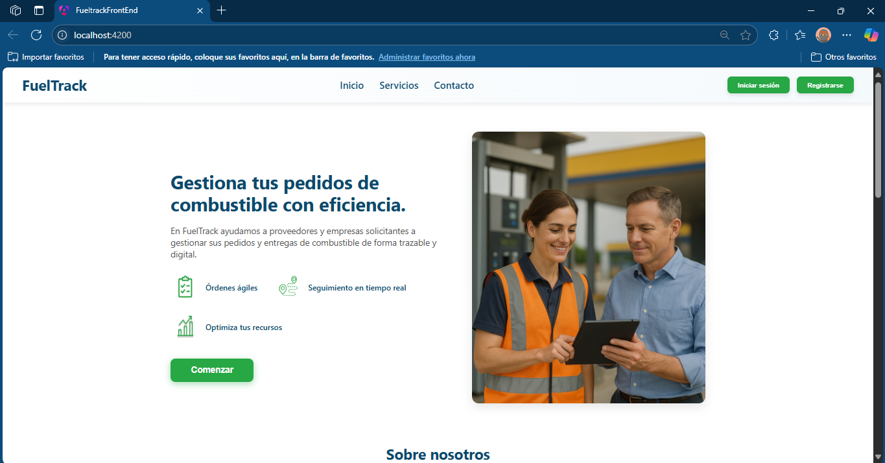
- **Inicio de sesión:** Se muestra la pagina para los usuarios que ya tienen una cuenta, ya sean esto clientes o proveedores

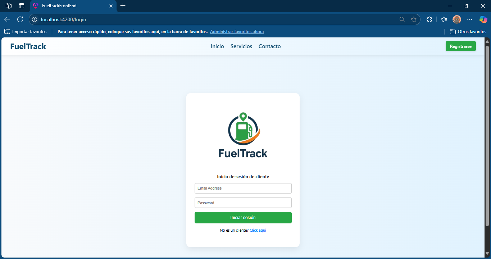

- **Registro:** Una interfaz donde le da la opcion al usuario de registrarse en nuestra pagina como cliente o proveedores

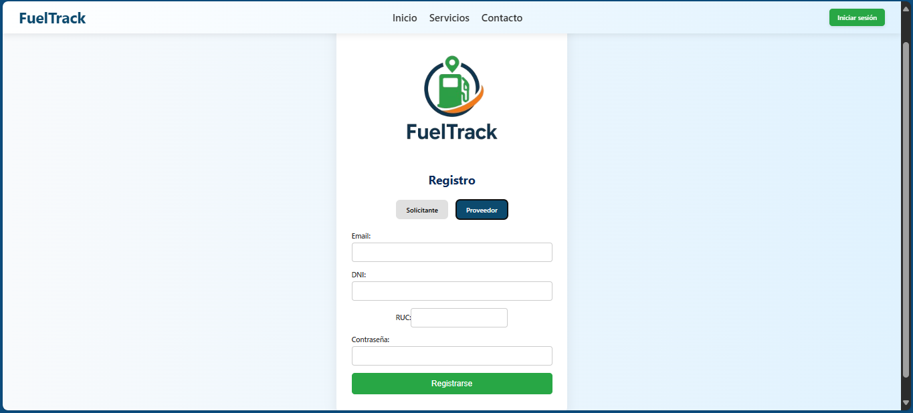

- **Ordenes:** Se muestran las ordenes con sus diferentes estados y la informacion necesaria de cada orden

- **Creación de orden:** Ofrece un formulario para llenar con los datos necesarios para que el proveedor genere la orden de envio.

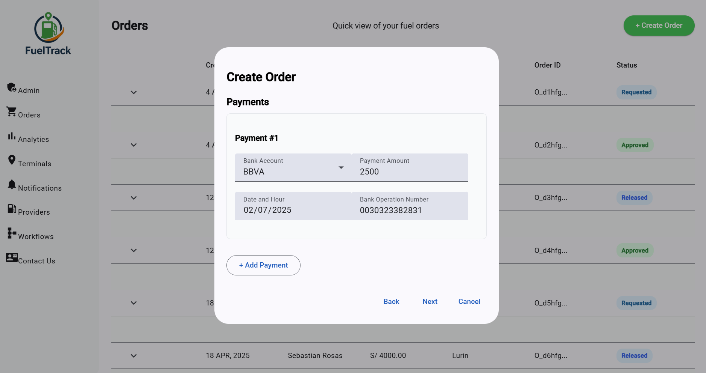
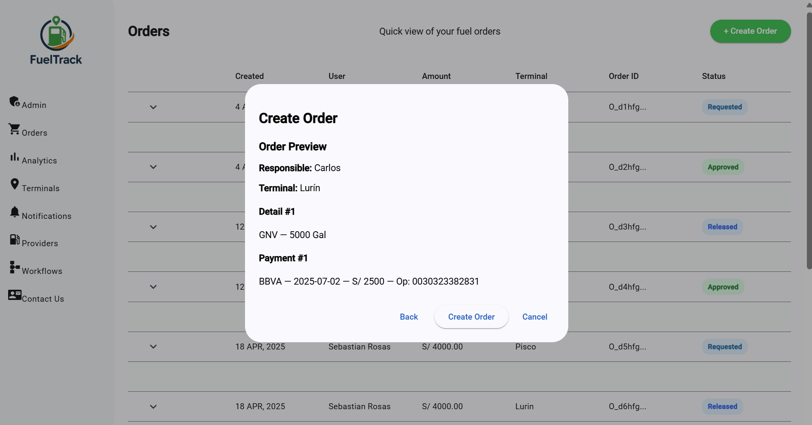

- **Analíticas:** Muestra algunas de las empresas o usuarios que confían en FuelTrack como referencia de credibilidad.

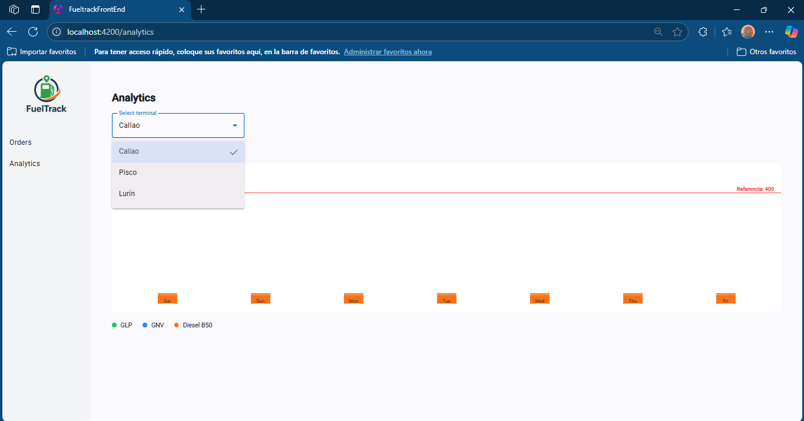

### 5.2.2.6. Services Documentation Evidence for Sprint Review
Durante el Sprint 2, el equipo se enfocó en el desarrollo del frontend inicial de la plataforma FuelTrack, particularmente en la construcción de la Landing Page. En esta etapa se priorizó el diseño visual, la experiencia de usuario y la implementación de la estructura base de la interfaz.

### 5.2.2.7. Software Deployment Evidence for Sprint Review
Durante este Sprint, nos enfocamos en consolidar un proceso de desarrollo y deployment eficiente para el frontend de nuestra plataforma, construido con Angular. Implementamos una estructura modular que facilita la escalabilidad y el mantenimiento del código, apoyándonos en Angular Material para garantizar una interfaz moderna, responsiva y alineada con principios de diseño consistentes.

**Link:** [FuelTrack Front-End](https://fueltrack-f9064.web.app/)

### 5.2.2.8. Team Collaboration Insights during Sprint

Durante el Sprint 2, el equipo demostró una mejora en la colaboración y distribución de tareas. Las reuniones frecuentes ayudaron a coordinar avances, resolver bloqueos técnicos y asegurar que cada miembro comprendiera sus responsabilidades dentro del desarrollo frontend, y los canales de comunicación fueron efectivos para mantener una alineación constante entre los integrantes.

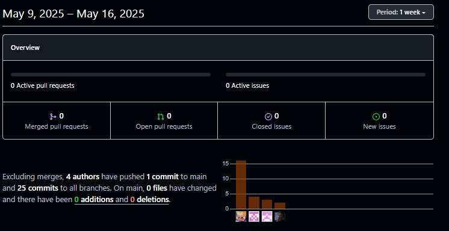

## 5.2.3. Sprint 3

### 5.2.3.1. Sprint Planning 3
<table>
    <tr align="center">
        <td><strong>Sprint #</strong></td>
        <td><strong>Sprint 1</strong></td>
    </tr>
    <tr>
        <td colspan="2" align="center"><strong>Sprint Planning Background</strong></td>
    </tr>
    <tr align="center">
        <td>Date</td>
        <td>02/06/2025</td>
    </tr>
    <tr align="center">
        <td>Time</td>
        <td>7:00 PM</td>
    </tr>
    <tr align="center">
        <td>Location</td>
        <td>Meet</td>
    </tr>
    <tr align="center">
        <td>Prepared by</td>
        <td>Luciana Carolina</td>
    </tr>
    <tr align="center">
        <td>Attendess (to planning meeting)</td>
        <td>
          Adrián Emanuel Valerio Garcia - U202210334 
          Luciana Carolina Choquehuanca Nuñez - U202319431 
          César Augusto Navarro Correa - U202310129 
          Franz Jair La Torre Valle - U202012378 
          Frezzia Eldaa Isabel Espinoza Paredes - U815121
    </tr>
    <tr align="center">
        <td>Sprint 2 Review Summary</td>
        <td>
          - Se realizó la primera versión del Frontend y algunos cambios en la Landing page 
          - Se corrigieron algunas correciones en los User Stories 
          - Se corrigieron la distribución del diseño de la base de datos 
          - Se documentó todo el proceso y evidencias del Sprint 2, se corrigió el Sprint 1 
        </td>
    </tr>
    <tr align="center">
        <td>Sprint 2 Retrospective Summary</td>
        <td>
          - Se desarrollo el API REST, pero no fue desplegado en una Fake API 
          - Se evidenciaron errores gramaticales y datos incoherentes en el informe 
          - Faltaron añadir evidencias visuales del desarrollo del Sprint 2 
        </td>
    </tr>
    <tr>
        <td colspan="2" align="center"><strong>Sprint Goal & User Stories</strong></td>
    </tr>
    <tr align="center">
        <td>Sprint 3 Goal</td>
        <td>En la reunión, se presentó la organización de todas las correciones a tratar en este Sprint
        como lo es el desarrollo final del Frontend y revisión del informe. Por otro lado, se trató como
        debemos realizar la primera versión del backend.</td>
    </tr>
    <tr align="center">
        <td>Sprint 3 Velocity</td>
        <td>21</td>
    </tr>
    <tr align="center">
        <td>Sum of Story Point</td>
        <td>90</td>
    </tr>
</table>

### 5.2.3.2. Aspect Leaders and Collaborators

| Team Member                                  | GitHub Username   | Frontend     | Documentation  | Backend  | Correcciones TB2 |
|----------------------------------------------|-------------------|--------------|----------------|----------|------------------|
| Valerio Garcia, Adrián Emanuel               | adrianvalerio     | C            | C              | C        | C                |
| Choquehuanca Nuñez, Luciana Carolina         | Lucianxaaa        | C            | C              | L        | L                |
| Navarro Correa, César Augusto                | csr555-ui         | C            | L              | C        | C                |
| La Torre Valle, Franz Jair                   | FranzJairLTV      | C            | C              | L        | C                |
| Frezzia Eldaa Isabel Espinoza Paredes        | fflushh           | L            | C              | C        | C                |

### 5.2.3.3. Sprint Backlog 3

<table>
    <tr align="center">
        <td colspan="2"><strong>Sprint #</strong></td>
        <td colspan="6"><strong>Sprint 3</strong></td>
    </tr>
    <tr align="center">
        <td colspan="2"><strong>User Story</strong></td>
        <td colspan="6"><strong>Work-Item / Task</strong></td>
    </tr>
    <tr align="center">
        <td><strong>Id</strong></td>
        <td><strong>Title</strong></td>
        <td><strong>Id</strong></td>
        <td><strong>Title</strong></td>
        <td><strong>Description</strong></td>
        <td><strong>Estimation (Hours)</strong></td>
        <td><strong>Assigned to</strong></td>
        <td><strong>Status (To do / In process / To review / Done)</strong></td>
    </tr>
   <tr align="center">
        <td>US-05</td>
        <td>Registrar nuevo pedido</td>
        <td>W-25</td>
        <td>Implementar formulario de pedido</td>
        <td>Como solicitante, quiero registrar un pedido con tipo y cantidad de combustible para que el proveedor lo procese.</td>
        <td>6</td>
        <td></td>
        <td>To do</td>
    </tr>
    <tr align="center">
        <td>US-06</td>
        <td>Consultar estado del pedido</td>
        <td>W-26</td>
        <td>Crear listado con estados de pedidos</td>
        <td>Como solicitante, quiero ver el estado de mis pedidos para saber si están aprobados, en tránsito o entregados.</td>
        <td>5</td>
        <td></td>
        <td>To do</td>
    </tr>
    <tr align="center">
        <td>US-08</td>
        <td>Registrar información de pago</td>
        <td>W-27</td>
        <td>Implementar sección de registro de pagos</td>
        <td>Como solicitante, quiero ingresar la información de los pagos correspondientes para validar el pedido ante el proveedor.</td>
        <td>4</td>
        <td></td>
        <td>To do</td>
    </tr>
    <tr align="center">
        <td>US-34</td>
        <td>Recibir notificación de aprobación</td>
        <td>W-28</td>
        <td>Desarrollar notificación push/email</td>
        <td>Como solicitante, quiero recibir una notificación cuando un pedido sea aprobado o rechazado para estar informado.</td>
        <td>3</td>
        <td></td>
        <td>To do</td>
    </tr>
    <tr align="center">
        <td>US-35</td>
        <td>Notificación de pedido despachado</td>
        <td>W-29</td>
        <td>Desarrollar notificación de despacho</td>
        <td>Como solicitante, quiero recibir una notificación cuando un pedido haya sido despachado para estar informado.</td>
        <td>3</td>
        <td></td>
        <td>To do</td>
    </tr>
    <tr align="center">
        <td>US-10</td>
        <td>Ver pedidos pendientes</td>
        <td>W-30</td>
        <td>Crear vista de pedidos pendientes para proveedor</td>
        <td>Como proveedor, quiero ver todos los pedidos pendientes para analizarlos y tomar acción.</td>
        <td>4</td>
        <td></td>
        <td>To do</td>
    </tr>
    <tr align="center">
        <td>US-11</td>
        <td>Aprobar pedido</td>
        <td>W-31</td>
        <td>Implementar función de aprobación</td>
        <td>Como proveedor, quiero aprobar pedidos según los depósitos hechos a mis cuentas bancarias.</td>
        <td>4</td>
        <td></td>
        <td>To do</td>
    </tr>
    <tr align="center">
        <td>US-12</td>
        <td>Marcar pedido como despachado</td>
        <td>W-32</td>
        <td>Función para marcar como despachado</td>
        <td>Como proveedor, quiero marcar cuándo un pedido sale a entrega para notificar al cliente.</td>
        <td>3</td>
        <td></td>
        <td>To do</td>
    </tr>
    <tr align="center">
        <td>US-25</td>
        <td>Asignar vehículo a pedido</td>
        <td>W-33</td>
        <td>Diseñar asignación de vehículo</td>
        <td>Como proveedor, quiero asignar un vehículo a un pedido aprobado para organizar la logística.</td>
        <td>5</td>
        <td></td>
        <td>To do</td>
    </tr>
    <tr align="center">
        <td>US-26</td>
        <td>Asignar conductor a pedido</td>
        <td>W-34</td>
        <td>Diseñar asignación de conductor</td>
        <td>Como proveedor, quiero asignar un conductor para completar la información de despacho.</td>
        <td>5</td>
        <td></td>
        <td>To do</td>
    </tr>
    <tr align="center">
        <td>US-27</td>
        <td>Validar disponibilidad de transporte</td>
        <td>W-35</td>
        <td>Mostrar listado de vehículos disponibles</td>
        <td>Como proveedor, quiero saber qué vehículos están disponibles antes de asignarlos para vincularlos correctamente.</td>
        <td>4</td>
        <td></td>
        <td>To do</td>
    </tr>
    <tr align="center">
        <td>US-13</td>
        <td>Cerrar pedido</td>
        <td>W-36</td>
        <td>Implementar función de cierre de pedido</td>
        <td>Como proveedor, quiero cerrar el pedido cuando el cliente confirme la entrega para finalizar el proceso.</td>
        <td>3</td>
        <td></td>
        <td>To do</td>
    </tr>
    <tr align="center">
        <td>US-19</td>
        <td>Ver resumen de pedidos (Proveedor)</td>
        <td>W-37</td>
        <td>Crear vista de resumen de pedidos</td>
        <td>Como proveedor, quiero ver un resumen de pedidos gestionados y pendientes para organizar a los clientes.</td>
        <td>4</td>
        <td></td>
        <td>To do</td>
    </tr>
        <tr align="center">
        <td>US-33</td>
        <td>Filtrar pedidos por estado</td>
        <td>W-38</td>
        <td>Implementar filtros de estado en listado de pedidos</td>
        <td>Como usuario de ambos segmentos, quiero filtrar mis pedidos por estado (pendiente, aprobado, entregado) para facilitar la revisión.</td>
        <td>3</td>
        <td></td>
        <td>To do</td>
    </tr>
        <tr align="center">
        <td>US-09</td>
        <td>Ver historial de pedidos</td>
        <td>W-39</td>
        <td>Diseñar vista de historial de pedidos</td>
        <td>Como solicitante, quiero ver mis pedidos anteriores para tener control sobre mi consumo.</td>
        <td>4</td>
        <td></td>
        <td>To do</td>
    </tr>
    <tr align="center">
        <td>US-18</td>
        <td>Ver resumen de pedidos (Solicitante)</td>
        <td>W-40</td>
        <td>Crear vista de resumen de pedidos</td>
        <td>Como solicitante, quiero ver un resumen de mis pedidos para identificar cuántos están en proceso o completados.</td>
        <td>4</td>
        <td></td>
        <td>To do</td>
    </tr>
    <tr align="center">
        <td>US-38</td>
        <td>Ver gráfico de consumo (Solicitante)</td>
        <td>W-41</td>
        <td>Implementar gráfico de consumo mensual</td>
        <td>Como solicitante, quiero ver un gráfico de mi consumo mensual para tener control sobre el uso del combustible.</td>
        <td>5</td>
        <td></td>
        <td>To do</td>
    </tr>
    <tr align="center">
        <td>US-39</td>
        <td>Ver gráfico de ventas (Proveedor)</td>
        <td>W-42</td>
        <td>Implementar gráfico de ventas mensual</td>
        <td>Como proveedor, quiero ver un gráfico de ventas por mes para monitorear el rendimiento del negocio.</td>
        <td>5</td>
        <td></td>
        <td>To do</td>
    </tr>
    <tr align="center">
        <td>US-40</td>
        <td>Descargar reporte PDF</td>
        <td>W-43</td>
        <td>Implementar exportación de datos a PDF</td>
        <td>Como usuario de ambos segmentos, quiero descargar un resumen de pedidos o ventas en formato PDF para archivarlo o compartirlo.</td>
        <td>4</td>
        <td></td>
        <td>To do</td>
    </tr>
    <tr align="center">
        <td>US-14</td>
        <td>Generar reporte de ventas</td>
        <td>W-44</td>
        <td>Crear función de generación de reportes</td>
        <td>Como proveedor, quiero generar reportes de ventas para tener registro de operaciones realizadas.</td>
        <td>4</td>
        <td></td>
        <td>To do</td>
    </tr>
    <tr align="center">
        <td>US-23</td>
        <td>Endpoint: Crear pedido</td>
        <td>W-45</td>
        <td>Desarrollar endpoint POST</td>
        <td>Como developer, quiero un endpoint para registrar un nuevo pedido de combustible.</td>
        <td>4</td>
        <td></td>
        <td>To do</td>
    </tr>
    <tr align="center">
        <td>US-24</td>
        <td>Endpoint: Consultar pedidos por usuario</td>
        <td>W-46</td>
        <td>Desarrollar endpoint GET</td>
        <td>Como developer, quiero un endpoint para obtener todos los pedidos de un usuario.</td>
        <td>4</td>
        <td></td>
        <td>To do</td>
    </tr>
</table>

### 5.2.3.4. Development Evidence for Sprint Review

<table border="1" cellspacing="0" cellpadding="6">
  <thead>
    <tr>
      <th>Repositorio</th>
      <th>Rama</th>
      <th>ID de Commit</th>
      <th>Mensaje de Commit</th>
      <th>Descripción del Commit</th>
      <th>Fecha de Commit</th>
    </tr>
  </thead>
<tbody>
 <tr>
	<td>1ASI0729-2510-4317-G4-FuelTrack/FuelTrack-front-end</td>
	<td>develop</td>
	<td>a5ad1b6</td>
	<td>feat(dispatch): add dashboard section for dispatch</td>
	<td>-</td>
	<td>14-06-2025</td>
  </tr>
  <tr>
	<td>1ASI0729-2510-4317-G4-FuelTrack/FuelTrack-front-end</td>
	<td>develop</td>
	<td>a5ad1b6</td>
	<td>feat: Add new sections: Admin, Terminals, Notifications, Providers, Workflows, Contact Us for clients</td>
	<td>-</td>
	<td>16-06-2025</td>
  </tr>
<tr>
	<td>1ASI0729-2510-4317-G4-FuelTrack/FuelTrack-back-end</td>
	<td>feature/orders</td>
	<td>cbb52a3</td>
	<td>refactor: add new names for bounded context</td>
	<td>-</td>
	<td>12-06-2025</td>
  </tr>
  <tr>
	<td>1ASI0729-2510-4317-G4-FuelTrack/FuelTrack-back-end</td>
	<td>feature/orders</td>
	<td>31adbc1</td>
	<td>feat(orderStatus): add class for order status</td>
	<td>-</td>
	<td>16-06-2025</td>
  </tr>
  <tr>
	<td>1ASI0729-2510-4317-G4-FuelTrack/FuelTrack-back-end</td>
	<td>feature/orders</td>
	<td>34032fb</td>
	<td>feat(FuelType): add class for fuel type in order</td>
	<td>-</td>
	<td>16-06-2025</td>
  </tr>
  <tr>
	<td>1ASI0729-2510-4317-G4-FuelTrack/FuelTrack-back-end</td>
	<td>feature/orders</td>
	<td>0f9b69d</td>
	<td>feat: add SnakeCase for lower, plural and well written class names</td>
	<td>-</td>
	<td>16-06-2025</td>
  </tr>
  <tr>
	<td>1ASI0729-2510-4317-G4-FuelTrack/FuelTrack-back-end</td>
	<td>feature/orders</td>
	<td>b76971b</td>
	<td>feat(FuelOrder): add FuelOrder class that saves all order infos</td>
	<td>-</td>
	<td>16-06-2025</td>
  </tr>
  <tr>
	<td>1ASI0729-2510-4317-G4-FuelTrack/FuelTrack-back-end</td>
	<td>feature/orders</td>
	<td>2dd17bd</td>
	<td>feat(controller): add REST controller for creating and listing fuel orders</td>
	<td>-</td>
	<td>16-06-2025</td>
  </tr>
  <tr>
	<td>1ASI0729-2510-4317-G4-FuelTrack/FuelTrack-back-end</td>
	<td>feature/orders</td>
	<td>89c3c5f</td>
	<td>feat(orders): implement service logic to handle and store fuel orders in memory</td>
	<td>-</td>
	<td>16-06-2025</td>
  </tr>
  <tr>
	<td>1ASI0729-2510-4317-G4-FuelTrack/FuelTrack-back-end</td>
	<td>feature/orders</td>
	<td>14faf8f</td>
	<td>feat(orders): add FuelOrderCommand to encapsulate fuel order creation data</td>
	<td>-</td>
	<td>16-06-2025</td>
  </tr>
  <tr>
	<td>1ASI0729-2510-4317-G4-FuelTrack/FuelTrack-back-end</td>
	<td>feature/orders</td>
	<td>d323600</td>
	<td>feat(orders): add CreateFuelOrderResource as DTO for incoming fuel order requests</td>
	<td>-</td>
	<td>16-06-2025</td>
  </tr>
  <tr>
	<td>1ASI0729-2510-4317-G4-FuelTrack/FuelTrack-back-end</td>
	<td>feature/orders</td>
	<td>db3e509</td>
	<td>feat(application.properties): add database in h2</td>
	<td>-</td>
	<td>17-06-2025</td>
  </tr>
  <tr>
	<td>1ASI0729-2510-4317-G4-FuelTrack/FuelTrack-back-end</td>
	<td>feature/orders</td>
	<td>8d5587b</td>
	<td>feat(FuelOrder): define class JPA for fuel_orders table</td>
	<td>-</td>
	<td>17-06-2025</td>
  </tr>
  <tr>
	<td>1ASI0729-2510-4317-G4-FuelTrack/FuelTrack-back-end</td>
	<td>feature/orders</td>
	<td>51fe946</td>
	<td>feat(controller): add endpoint mappings using @RequestMapping and REST shortcuts</td>
	<td>-</td>
	<td>17-06-2025</td>
  </tr>
  <tr>
	<td>1ASI0729-2510-4317-G4-FuelTrack/FuelTrack-back-end</td>
	<td>feature/orders</td>
	<td>7430616</td>
	<td>feat(mapper): implement FuelOrderMapper to convert between DTO and domain command</td>
	<td>-</td>
	<td>17-06-2025</td>
  </tr>
  <tr>
	<td>1ASI0729-2510-4317-G4-FuelTrack/FuelTrack-back-end</td>
	<td>feature/orders</td>
	<td>8a5eac2</td>
	<td>feat: add fuel order class resource</td>
	<td>-</td>
	<td>17-06-2025</td>
  </tr>
  <tr>
	<td>1ASI0729-2510-4317-G4-FuelTrack/FuelTrack-back-end</td>
	<td>feature/orders</td>
	<td>d59e7f4</td>
	<td>feat(repository): create FuelOrderRepository interface for JPA access</td>
	<td>-</td>
	<td>17-06-2025</td>
  </tr>
  <tr>
	<td>1ASI0729-2510-4317-G4-FuelTrack/FuelTrack-back-end</td>
	<td>feature/orders</td>
	<td>fb57cab</td>
	<td>feat(service): implement FuelOrderService to handle order creation logic</td>
	<td>-</td>
	<td>17-06-2025</td>
  </tr>
  <tr>
	<td>1ASI0729-2510-4317-G4-FuelTrack/FuelTrack-back-end</td>
	<td>feat/operations</td>
	<td>71d8ecb</td>
	<td>feat(transport): add command and query logic to operation</td>
	<td>-</td>
	<td>14-06-2025</td>
  </tr>
  <tr>
	<td>1ASI0729-2510-4317-G4-FuelTrack/FuelTrack-back-end</td>
	<td>feat/operations</td>
	<td>0d1d7f6</td>
	<td>feat(transport): add services</td>
	<td>-</td>
	<td>14-06-2025</td>
  </tr>
  <tr>
	<td>1ASI0729-2510-4317-G4-FuelTrack/FuelTrack-back-end</td>
	<td>feat/operations</td>
	<td>b8b6c92</td>
	<td>feat(transport): establish database connectivity</td>
	<td>-</td>
	<td>15-06-2025</td>
  </tr>
  <tr>
	<td>1ASI0729-2510-4317-G4-FuelTrack/FuelTrack-back-end</td>
	<td>feat/operations</td>
	<td>57cc6bd</td>
	<td>feat(delivery): add commands and queries</td>
	<td>-</td>
	<td>15-06-2025</td>
  </tr>
  <tr>
	<td>1ASI0729-2510-4317-G4-FuelTrack/FuelTrack-back-end</td>
	<td>feat/operations</td>
	<td>84a233f</td>
	<td>feat(delivery): establish connection to database</td>
	<td>-</td>
	<td>16-06-2025</td>
  </tr>
  <tr>
	<td>1ASI0729-2510-4317-G4-FuelTrack/FuelTrack-back-end</td>
	<td>feat/operations</td>
	<td>b59de8c</td>
	<td>feat(inventory): add JPA repository and service layer with create & update operations</td>
	<td>-</td>
	<td>16-06-2025</td>
  </tr>
</tbody>
</table>

### 5.2.3.5. Execution Evidence for Sprint Review

Durante el Sprint 3 se realizaron mejoras en la estructura del frontend con el objetivo de optimizar su organización y funcionamiento. Asimismo, se completaron e integraron las secciones que habían quedado pendientes en el sprint anterior, garantizando así la continuidad y coherencia del desarrollo de la página web. Estas acciones permitieron avanzar en la consolidación de la interfaz de usuario, asegurando una experiencia más completa y alineada con los requerimientos del proyecto.

Interfaz de los socilitantes:

- Panel de Administrador: Permite a los solicitantes ver la actividad de los usuarios
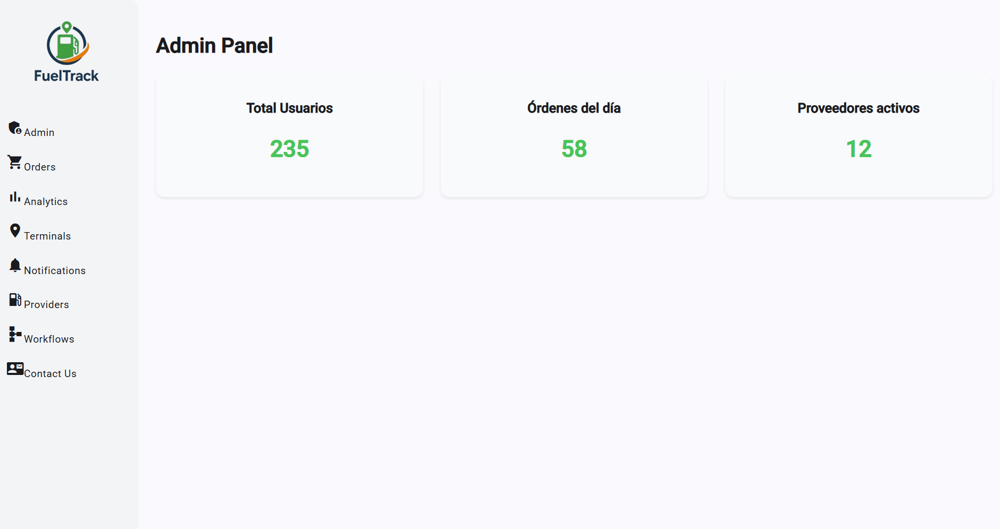

- Terminales: Aquí se gestiona la información relacionada con los terminales conectados al sistema
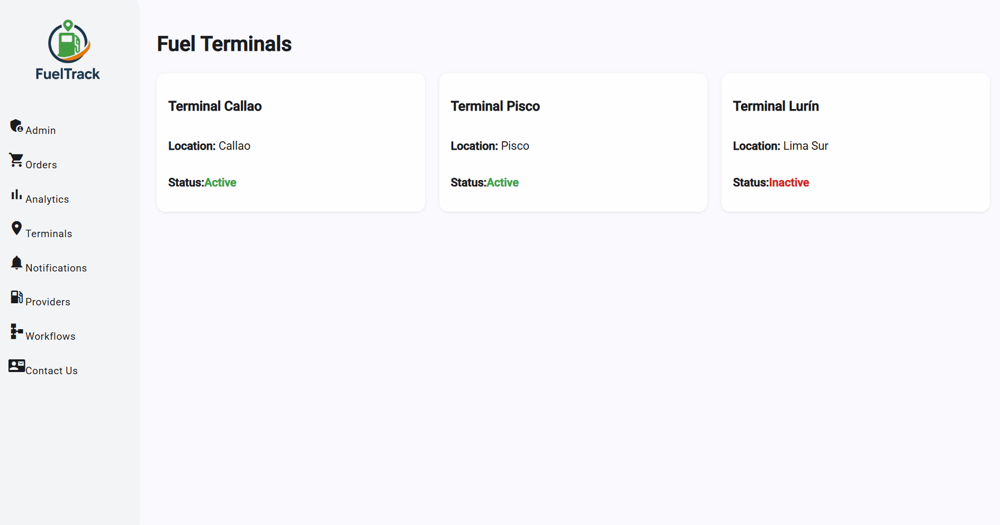

- Notificaciones: Centraliza todas las notificaciones generadas por la plataforma
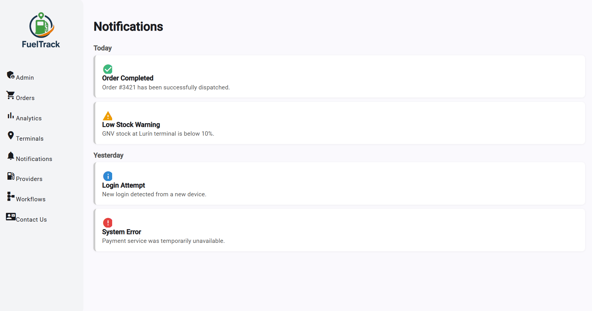

- Proovedores: Administra la información de los proveedores asociados con el solicitante en la plataforma
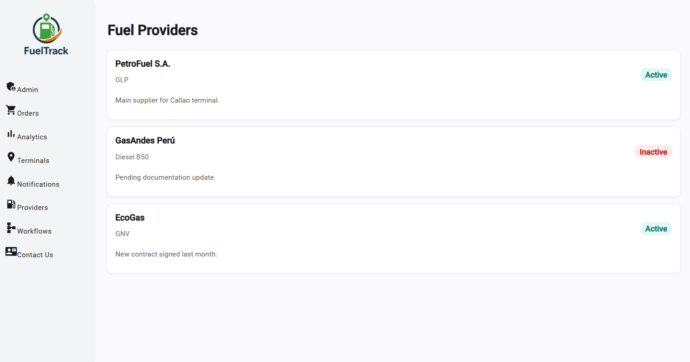

- Contactanos: Ofrece un formulario de contacto
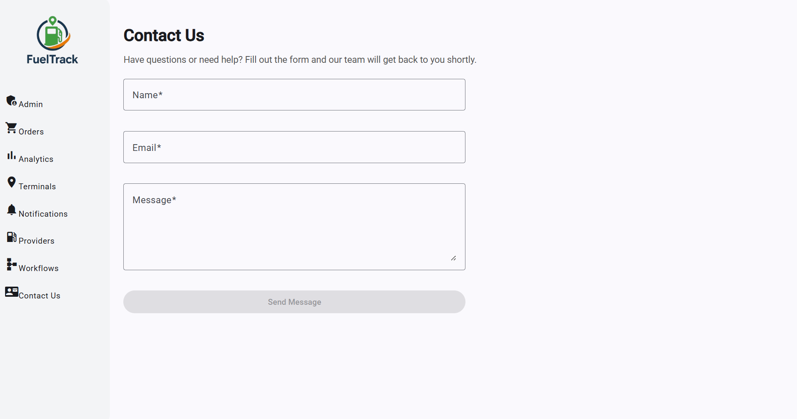

Interfaz de los proovedores:

- Panel de Administrador: Permite a los proovedores ver la actividad de los usuarios

- Conciliaciones: Permite gestionar el pago de los solicitantes

- Despachos: Permite gestionar y aprobar envio de despachos a sus clientes

- Analiticas: Permite ver la actividad del solicitante mediante graficas para evaluar su rendimiento

- Notificaciones: Centraliza todas las notificaciones generadas por la plataforma

- Precios: Permite visualizar los planes de suscripción que ofrece la plataforma

- Clientes: Administra la información de los solicitantes asociados con el proovedor en la plataforma

- Contactanos: Ofrece un formulario de contacto

### 5.2.3.6. Services Documentation Evidence for Sprint Review

### 5.2.3.7. Software Deployment Evidence for Sprint Review

## 5.3. Validation Interviews

### 5.3.1. Diseño de entrevistas

#### Preguntas relacionadas al Landing Page

1. ¿La información presentada en la pagina principal le resulta clara y fácil de entender para su negocio?
2. ¿Cómo calificarías la facilidad de navegación de la plataforma?
3. ¿Consideras que se deberia añadir alguna información adicional?

#### Preguntas relacionadas al Fronted
A. Proveedores de Combustible

1. ¿Consideras que el listado de las secciones principales en el dashboard adecuadas?
2. ¿Te resultó clara la información de pedidos de las empresas solicitantes?
3. ¿Te parecio adecuada la organización de los pagos de los pedidos?
4. ¿El proceso del registro de despachos es lo suficientente intuitiva para usted?
5. ¿La funcionalidad para ver el gráfico de ventas mensuales fue comprensible?
6. ¿Te gustaría recibir notificaciones cuando un pedido de una empresa haya sido aprobado, modificado o cancelado?
7. ¿La información de cada empresa te pareció suficiente para evaluar a tus clientes?
8. ¿Hubo alguna función que esperabas encontrar y que no estaba disponible o no funcionaba como esperabas?

B. Empresas Solicitantes de Combustible:

1. ¿Consideras que el listado de las secciones principales en el dashboard adecuadas?
2. ¿Te resultó clara la información de pedidos realizados como solicitante?
3. ¿Que opina sobre el proceso de registro de nuevas ordenes de pedidos?
4. ¿Considera que la organización de terminales le proporciona los datos suficientes?
5. ¿Considera el gráfico de consumo mensual y volumen total ideal para conocer su actividad?
7. ¿La grafica y el mapa le proporcionan la información adecuada para conocer el flujo de sus ordenes?
8. ¿La información de cada empresa te pareció suficiente para evaluar a tus clientes?
9. ¿Hubo alguna función que esperabas encontrar y que no estaba disponible o no funcionaba como esperabas?

### 5.3.2. Registro de entrevistas

---

#### Entrevista N°1 – Segmento: Proveedores
- Nombres: 
- Apellidos: 
- Edad:
- Distrito:
- URL Entrevista:
- Duración: 
- Resumen:

---

#### Entrevista N°2 – Segmento: Solicitantes
- Nombres: 
- Apellidos: 
- Edad:
- Distrito:
- URL Entrevista:
- Duración: 
- Resumen:

### 5.3.3. Evaluaciones heuristicas

## 5.4. Video About-the-Product

**Link:** 

## Conclusiones 

- El proyecto FuelTrack planteó una solución clara y concreta para optimizar la gestión de pedidos de combustible, basada en una comprensión real del mercado y de las necesidades de los usuarios.

- Se validó la propuesta de valor a través de métodos ágiles como Lean UX, entrevistas y análisis de competencia, logrando definir un producto que resuelve problemas reales de eficiencia y comunicación.

- Se diseñó una experiencia de usuario consistente y accesible, destacando especialmente la *Landing Page*, que comunica de forma clara la oferta del servicio, apoya la conversión mediante call to actions estratégicos y genera confianza a través de testimonios y prueba social.

- El diseño de la plataforma web combinó buenas prácticas de arquitectura de información, navegación intuitiva y guías de estilo que garantizan una imagen profesional y coherente en toda la experiencia digital.

- A nivel técnico, se construyó una base sólida de arquitectura de software y base de datos, asegurando escalabilidad, mantenibilidad y alineación con los objetivos de negocio.

- El desarrollo del producto se organizó mediante una planificación iterativa, permitiendo construir, validar y mejorar de manera progresiva, asegurando que el resultado final responda tanto a las expectativas de los usuarios como a las metas de FuelTrack.

## Bibliografia

Interaction Design Foundation. (s.f.). *A simple introduction to Lean UX*. Recuperado de [https://www.interaction-design.org/literature/article/a-simple-introduction-to-lean-ux](https://www.interaction-design.org/literature/article/a-simple-introduction-to-lean-ux)

Baymard Institute. (s.f.). *The best practices and key principles of UX design*. Recuperado de [https://baymard.com/learn/ux-design-principles](https://baymard.com/learn/ux-design-principles)

Laubheimer, P. (2022, abril 10). *Information architecture: Study guide*. Nielsen Norman Group. Recuperado de [https://www.nngroup.com/articles/ia-study-guide/](https://www.nngroup.com/articles/ia-study-guide/)

UXPin. (2024, agosto). *Design consistency guide: UI and UX best practices*. Recuperado de [https://www.uxpin.com/studio/blog/guide-design-consistency-best-practices-ui-ux-designers/](https://www.uxpin.com/studio/blog/guide-design-consistency-best-practices-ui-ux-designers/)

CareerFoundry. (2023, enero 5). *A beginner’s guide to information architecture in UX*. Recuperado de [https://careerfoundry.com/en/blog/ux-design/a-beginners-guide-to-information-architecture/](https://careerfoundry.com/en/blog/ux-design/a-beginners-guide-to-information-architecture/)

Contentsquare. (2024, octubre). *What is Lean UX? The 3 key phases of Lean UX design*. Recuperado de [https://contentsquare.com/guides/ux/lean/](https://contentsquare.com/guides/ux/lean/)

UX Design Institute. (2022, noviembre 15). *What is Lean UX and why does it matter? A complete guide*. Recuperado de [https://www.uxdesigninstitute.com/blog/what-is-lean-ux/](https://www.uxdesigninstitute.com/blog/what-is-lean-ux/)

Windmill Digital. (2023, septiembre 10). *10 UX best practices for optimal user experience in 2024*. Recuperado de [https://windmill.digital/ten-ux-best-practices-for-optimal-user-experience-in-2024/](https://windmill.digital/ten-ux-best-practices-for-optimal-user-experience-in-2024/)

Smashing Magazine. (2020, julio 21). *Information and information architecture: The big picture*. Recuperado de [https://www.smashingmagazine.com/2020/07/information-architecture-big-picture/](https://www.smashingmagazine.com/2020/07/information-architecture-big-picture/)

UXAX. (2023, junio 18). *The Lean UX process: Streamlining user-centered design*. Recuperado de [https://www.uxax.org/post/the-lean-ux-process-streamlining-user-centered-design](https://www.uxax.org/post/the-lean-ux-process-streamlining-user-centered-design)

## Anexos 

- **Despliegue de la Landing Page:** [https://fueltrack-f9064.web.app/ ](https://fueltrack-f9064.web.app/)

- **Figma - User Flow Diagrams, Wireframes y Mockups:**  
[https://www.figma.com/design/Ikz9yUtR1XthBJ1ViO6gVc/LP-and-CTA?node-id=0-1&t=WJtigb6RJ2HtjPPw-1node-id=401-8424&t=kuv2vsPlXaFzVYvk-0](https://www.figma.com/design/Ikz9yUtR1XthBJ1ViO6gVc/LP-and-CTA?node-id=0-1&t=WJtigb6RJ2HtjPPw-1node-id=401-8424&t=kuv2vsPlXaFzVYvk-0)

- **Exposición del Proyecto (TB1):**  
