

  
  
  <h1>Universidad: Universidad Peruana de Ciencias Aplicadas</h1>
  
<strong>Carrera:</strong> Ingeniería de Software

  
<strong>Ciclo:</strong> 2025-10

  
<strong>Código del Curso y Nombre del Curso:</strong> 1ASI0729 Desarrollo de Aplicaciones Open Source

  
<strong>Sección:</strong> 4317

  
<strong>Profesor:</strong> Alberto Wilmer Sánchez Seña

  <h3>Informe de Trabajo Final</h3>

  
<strong>Startup:</strong> FuelTrack

  
<strong>Nombre del Producto:</strong> FuelTrack

<h3 align="center">Relación de Integrantes:</h3>

  <table>
    <tr>
      <th><strong>Código</strong></th>
      <th><strong>Apellidos y Nombres</strong></th>
    </tr>
    <tr>
      <td>u201817507</td>
      <td>NUEVO</td>
    </tr>
    <tr>
    <tr>
      <td>u202213278</td>
      <td>Adrián Emanuel Valerio Garcia</td>
    </tr>
      <td>u202319431</td>
      <td>Luciana Carolina Choquehuanca Nuñez</td>
    </tr>
    <tr>
      <td>u202012378</td>
      <td>Franz Jair La Torre Valle</td>
    </tr>
    <tr>
      <td>u202310129</td>
      <td>César Augusto Navarro Correa</td>
    </tr>
  </table>

<strong>Mes y Año:</strong> Abril 2025

## Registro de Versiones del Informe

| **Versión** | **Fecha**   | **Autor(es)**                         | **Descripción de Modificación**                |
|-------------|-------------|---------------------------------------|-----------------------------------------------|
| **1.0**     | 2025-04-27  | NUEVO    | **Se incluye:** -Carátula, Registro de versiones, Student Outcome y Contenido de Informe -Estrategias y tácticas frente a competidores -Diseño de entrevistas -Wireflows y Userflows |
| **1.0**     | 2025-04-27  | Adrián Emanuel Valerio Garcia | **Se incluye:** -Chapter I -Diseño de Scenarios As-Is y To-Be Aporte en los style-guid-lines y diagramas de arquitectura y database Edición del video de entrevistas |
| **1.0**     | 2025-04-27  | Luciana Carolina Choquehuanca Nuñez | **Se incluye** -Wireframe y Mockup de Landing Page -Coordinación de equipo -Chapter I -Conclusiones |
| **1.0**     | 2025-04-27  | Franz Jair La Torre Valle | **Se incluye** -User Stories -Product Backlog -Chapter V |
| **1.0**     | 2025-04-27  | César Augusto Navarro Correa | **Se incluye** -User Journey Map -Impact Map -User Personas -Web Applications Prototyping -SEO Tags -Navigations Systems |

---
## Project Report Collaboration Insights

**URL del Repositorio:**  
[https://github.com/1ASI0729-2510-4317-G4-FuelTrack](https://github.com/1ASI0729-2510-4317-G4-FuelTrack/report)

Este informe ha sido desarrollado de forma colaborativa mediante GitHub, empleando GitFlow y Conventional Commits. Cada miembro del equipo ha contribuido con commits y ramas individuales durante el desarrollo del proyecto.

**Participación del equipo:**

| **Integrante**        | **Usuario GitHub**  | **Aportaciones destacadas** |
|-----------------------|---------------------|-----------------------------|
| NUEVO                 | @NUEVO              | TEXTO                        |
| Adrián Valerio        | @adrianvalerio      | Creación de rama Chapter IV. Supervisión de aportes a la rama. |
| Luciana Choquehuanca  | @Lucianxaaa         | Creación de la organización y repositorio contenedor del informe. |
| Franz La Torre        | @FranzJairLTV       | Creación de la rama Chapter V. |
| César Navarro         | @csr555-ui          | Creación de la rama Chapter II. Revisión general de los commits hechos.  |

---

## Contenido

- [Carátula](#carátula)
- [Registro de Versiones del Informe](#registro-de-versiones-del-informe)
- [Project Report Collaboration Insights](#project-report-collaboration-insights)
- [Contenido](#contenido)
- [Student Outcome](#student-outcome)
- [Capítulo I: Introducción](#capítulo-i-introducción)
  - [1.1 Startup Profile](#11-startup-profile)
    - [1.1.1 Descripción de la Startup](#111-descripción-de-la-startup)
    - [1.1.2 Perfiles de integrantes del equipo](#112-perfiles-de-integrantes-del-equipo)
  - [1.2 Solution Profile](#12-solution-profile)
    - [1.2.1 Antecedentes y problemática](#121-antecedentes-y-problemática)
    - [1.2.2 Lean UX Process](#122-lean-ux-process)
      - [1.2.2.1 Lean UX Problem Statements](#1221-lean-ux-problem-statements)
      - [1.2.2.2 Lean UX Assumptions](#1222-lean-ux-assumptions)
      - [1.2.2.3 Lean UX Hypothesis Statements](#1223-lean-ux-hypothesis-statements)
      - [1.2.2.4 Lean UX Canvas](#1224-lean-ux-canvas)
  - [1.3 Segmentos objetivo](#13-segmentos-objetivo)
- [Capítulo II: Requirements Elicitation & Analysis](#capítulo-ii-requirements-elicitation--analysis)
  - [2.1 Competidores](#21-competidores)
    - [2.1.1 Análisis competitivo](#211-análisis-competitivo)
    - [2.1.2 Estrategias y tácticas frente a competidores](#212-estrategias-y-tácticas-frente-a-competidores)
  - [2.2 Entrevistas](#22-entrevistas)
    - [2.2.1 Diseño de entrevistas](#221-diseño-de-entrevistas)
    - [2.2.2 Registro de entrevistas](#222-registro-de-entrevistas)
    - [2.2.3 Análisis de entrevistas](#223-análisis-de-entrevistas)
  - [2.3 Needfinding](#23-needfinding)
    - [2.3.1 User Personas](#231-user-personas)
    - [2.3.2 User Task Matrix](#232-user-task-matrix)
    - [2.3.3 User Journey Mapping](#233-user-journey-mapping)
    - [2.3.4 Empathy Mapping](#234-empathy-mapping)
    - [2.3.5 As-is Scenario Mapping](#235-as-is-scenario-mapping)
  - [2.4 Ubiquitous Language](#24-ubiquitous-language)
-[Capítulo III: Requirements Specification](#capítulo-iii-requirements-specification)
  - [3.1 To-Be Scenario Mapping](#31-to-be-scenario-mapping)
  - [3.2 User Stories](#32-user-stories)
  - [3.3 Impact Mapping](#33-impact-mapping)
  - [3.4 Product Backlog](#34-product-backlog)
-[Capítulo IV: Product Design](#capítulo-iv-product-design)
  - [4.1 Style Guidelines](#41-style-guidelines)
    - [4.1.1 General Style Guidelines](#411-general-style-guidelines)
    - [4.1.2 Web Style Guidelines](#412-web-style-guidelines)
  - [4.2 Information Architecture](#43-information-architecture)
    - [4.2.1 Organization Systems](#421-organization-systems)
    - [4.2.2 Labeling System](#422-labeling-system)
    - [4.2.3 SEO Tags and Meta Tags](#423-seo-tags-and-meta-tags)
    - [4.2.4 Searching Systems](#424-searching-systems)
    - [4.2.5 Navigation System](#425-navigation-system)
  - [4.3 Landing Page UI Design](#43-landing-page-ui-design)
    - [4.3.1 Landing Page Wireframe](#431-landing-page-wireframe)
    - [4.3.2 Landing Page Mock-up](#432-landing-page-mock-up)
  - [4.4 Web Applications UX/UI Design](#44-web-applications-uxui-design)
    - [4.4.1 Web Applications Wireframes](#441-web-applications-wireframes)
    - [4.4.2 Web Applications Mock-ups](#442-web-applications-mock-ups)
    - [4.4.3 Web Applications User Flow Diagrams](#443-web-applications-user-flow-diagrams)
  - [4.5 Web Applications Prototyping](#45-web-applications-prototyping)
  - [4.6 Domain-Driven Software Architecture](#46-domain-driven-software-architecture)
    - [4.6.1 Software Architecture Context Diagram](#461-software-architecture-context-diagram)
    - [4.6.2 Software Architecture Container Diagrams](#462-software-architecture-container-diagrams)
    - [4.6.3 Software Architecture Components Diagrams](#463-software-architecture-components-diagrams)
  - [4.7 Software Object-Oriented Design](#47-software-object-oriented-design)
    - [4.7.1 Class Diagrams](#471-class-diagrams)
    - [4.7.2 Class Dictionary](#472-class-dictionary)
  - [4.8 Database Design](#48-database-design)
    - [4.8.1 Database Diagram](#481-database-diagram)
- [Capítulo V: Product Implementation, Validation & Deployment](#capítulo-v-product-implementation-validation--deployment)
  - [5.1 Software Configuration Management](#51-software-configuration-management)
    - [5.1.1 Software Development Environment Configuration](#511-software-development-environment-configuration)
    - [5.1.2 Source Code Management](#512-source-code-management)
    - [5.1.3 Source Code Style Guide & Conventions](#513-source-code-style-guide--conventions)
    - [5.1.4 Software Deployment Configuration](#514-software-deployment-configuration)
  - [5.2 Landing Page, Services & Applications Implementation](#52-landing-page-services--applications-implementation)
    - [5.2.1 Sprint 1](#521-sprint-1)
      - [5.2.1.1 Sprint Planning](#5211-sprint-planning-1)
      - [5.2.1.2 Aspect Leaders and Collaborators](#5212-aspect-leaders-and-collaborators)
      - [5.2.1.3 Sprint Backlog 1](#5213-sprint-backlog-1)
      - [5.2.1.4 Development Evidence for Sprint Review](#5214-development-evidence-for-sprint-review)
      - [5.2.1.5 Execution Evidence for Sprint Review](#5215-execution-evidence-for-sprint-review)
      - [5.2.1.6 Services Documentation Evidence for Sprint Review](#5216-services-documentation-evidence-for-sprint-review)
      - [5.2.1.7 Software Deployment Evidence for Sprint Review](#5217-software-deployment-evidence-for-sprint-review)
      - [5.2.1.8 Team Collaboration Insights during Sprint](#5218-team-collaboration-insights-during-sprint)
    - [5.2.2 Sprint 2](#522-sprint-2)
      - [5.2.2.1 Sprint Planning](#5221-sprint-planning-2)
      - [5.2.2.2 Aspect Leaders and Collaborators](#5222-aspect-leaders-and-collaborators)
      - [5.2.2.3 Sprint Backlog 2](#5223-sprint-backlog-2)
      - [5.2.2.4 Development Evidence for Sprint Review](#5224-development-evidence-for-sprint-review)
      - [5.2.2.5 Execution Evidence for Sprint Review](#5225-execution-evidence-for-sprint-review)
      - [5.2.2.6 Services Documentation Evidence for Sprint Review](#5226-services-documentation-evidence-for-sprint-review)
      - [5.2.2.7 Software Deployment Evidence for Sprint Review](#5227-software-deployment-evidence-for-sprint-review)
      - [5.2.2.8 Team Collaboration Insights during Sprint](#5228-team-collaboration-insights-during-sprint)
    - [5.2.3 Sprint 3](#523-sprint-3)
      - [5.2.3.1 Sprint Planning 3](#5231-sprint-planning-3)
      - [5.2.3.2 Aspect Leaders and Collaborators](#5232-aspect-leaders-and-collaborators)
      - [5.2.3.3 Sprint Backlog 3](#5233-sprint-backlog-3)
      - [5.2.3.4 Development Evidence for Sprint Review](#5234-development-evidence-for-sprint-review)
      - [5.2.3.5 Execution Evidence for Sprint Review](#5235-execution-evidence-for-sprint-review)
      - [5.2.3.6 Services Documentation Evidence for Sprint Review](#5236-services-documentation-evidence-for-sprint-review)
      - [5.2.3.7 Software Deployment Evidence for Sprint Review](#5237-software-deployment-evidence-for-sprint-review)
      - [5.2.3.8 Team Collaboration Insights during Sprint](#5238-team-collaboration-insights-during-sprint)
    - [5.3. Validation Interviews](#53-validation-interviews)
      - [5.3.1. Diseño de entrevistas](#531-diseño-de-entrevistas)
      - [5.3.2. Registro de entrevistas](#532-registro-de-entrevistas)
      - [5.3.3. Evaluaciones heuristicas](#533-evaluaciones-heuristicas)
    - [5.4. Video About-the-Product](#54-video-about-the-product)
  - [Conclusiones](#conclusiones)
  - [Bibliografia](#bibliografia)
  - [Anexos](#anexos)

---

## Student Outcome

> Criterio: Capacidad de comunicarse efectivamente con un rango de audiencias. En el siguiente cuadro se describe las acciones realizadas y enunciados de conclusiones por parte del grupo, que permiten sustentar el haber alcanzado el logro del ABET – EAC - Student Outcome 3.

| **Criterio Específico** | **Acciones Realizadas** | **Conclusiones**  |
|---|---|---|
| **Comunica oralmente con efectividad a diferentes rangos de audiencia** | **Manuel Sanchez**  TB1: Expongo con efectividad los hallazgos de entrevistas y análisis de usuarios, empleando un lenguaje accesible para transmitir insights clave tanto a perfiles técnicos como no técnicos TP: Me comuniqué con efectividad tanto oral como por escrito en el desarrollo del TP1. Durante las presentaciones, expuse con claridad y adapté mi lenguaje al público. En la elaboración de la landing page, participé en la organización del contenido y en asegurar que el mensaje fuera comprensible para el usuario. También colaboré en la documentación técnica, validando la calidad del contenido escrito. **Franz Jair La Torre Valle** TB1: Comunico de forma clara y estructurada la visión de FuelTrack, el problema que buscamos resolver y los segmentos objetivo, adaptando el nivel de detalle según la audiencia (usuarios, inversionistas o stakeholders). TP: Me expresé con claridad en las presentaciones orales del proyecto, enfocándome en los objetivos de cada entrega. Participé en el desarrollo del front, explicando sus funcionalidades en exposiciones. Además, colaboré en documentos escritos, asegurando que la información técnica fuera precisa y adaptada al público.  **Adrián Emanuel Valerio Garcia** TB1: Presento de manera ordenada y precisa las user stories, el impact mapping y el product backlog, enfocándome en comunicar las prioridades del proyecto según el rol del interlocutor (desarrolladores, gerentes o usuarios finales). TP: Presentó ordenadamente los Sprints del desarrollo de la pagina web y cambios en la base de datos.  **César Augusto Navarro Correa** TB1: Comunico los cambios realizados en el repositorio al grupo. Además, presentó tanto los Prototipos como los User Scenarios correspondientes. TP: En el TP1, me comuniqué de forma efectiva tanto oral como por escrito. Durante las presentaciones, expliqué con claridad las decisiones técnicas. En el desarrollo del front, participé activamente y documenté su estructura, utilizando lenguaje técnico comprensible y coherente para la audiencia.  **Luciana Carolina Choquehuanca Nuñez** TB1: Explico de forma visual y verbal el diseño UX/UI de FuelTrack, incluyendo wireframes y mock-ups, adaptando mi discurso para facilitar la comprensión tanto a diseñadores como a públicos sin experiencia en diseño.Comunico el avance y la evidencia de los sprints de implementación de manera clara, usando métricas, resultados visibles y lenguaje sencillo para conectar con públicos técnicos y de negocio. TP: Me comuniqué de manera efectiva tanto oral como por escrito durante este TP1. En las presentaciones, transmití ideas con claridad y escuché activamente las observaciones. Aporté en el diseño y redacción del contenido de la landing page, asegurando que fuera accesible y entendible. También contribuí en la elaboración de entregables con lenguaje técnico apropiado.  **Frezzia Eldaa Isabel Espinoza Paredes** TB1: Expongo con efectividad los hallazgos de entrevistas y análisis de usuarios, empleando un lenguaje accesible para transmitir insights clave tanto a perfiles técnicos como no técnicos  TP: A lo largo del TP1, me aseguré de comunicar con claridad en presentaciones y entregables. Trabajé en el contenido y estructura de la landing page, adaptando el mensaje al público objetivo. También colaboré en la redacción técnica del proyecto, cuidando el orden y la calidad del lenguaje utilizado.   | TB1: El equipo logró comunicar su propuesta a una problemática expecifica en su video de tal forma que sea alcanzable para cualquier audiencia.  TP: El equipo ha realizado presentaciones claras y estructuradas, enfocando su discurso en los objetivos específicos de cada entrega. Se utilizaron códigos apropiados al contexto académico y técnico, garantizando que el mensaje llegara satisfactoriamente al público objetivo, que incluye docentes y compañeros de clase. Además, se ha promovido la escucha activa en las sesiones de retroalimentación, incorporando las observaciones con actitud crítica y disposición a la mejora, lo que evidencia un proceso de comunicación abierto, objetivo y conciliador.
| **Comunica por escrito con efectividad a diferentes rangos de audiencia** | **Manuel Sanchez** TB1: Redacto documentos claros y persuasivos que describen la visión de FuelTrack, el problema identificado y nuestros segmentos objetivo, adaptando el nivel de formalidad según si el lector es un potencial cliente, un inversionista o un usuario final. TP: Realizó la redacción de los cambios de manera correcta para la realización de una mejor presentación en el informe **Franz Jair La Torre Valle** TB1: Registro de manera estructurada y precisa los hallazgos de entrevistas y análisis de usuarios, redactando informes comprensibles tanto para equipos de desarrollo como para stakeholders no técnicos. TP: Redactó la corrección del Sprint 2 y secciones del capitulo 4 con un lenguaje más claro y formal respecto a la anterior revisión.  **Adrián Emanuel Valerio Garcia** TB1: Escribo especificaciones de requisitos de usuario (user stories, impact mapping, product backlog) utilizando un lenguaje claro, técnico y alineado al nivel de detalle que cada audiencia necesita para su rol en el proyecto. **César Augusto Navarro Correa** TB1: Documento de manera visual y textual los diseños de UX/UI, explicando wireframes, mock-ups y flujos de usuario en formatos accesibles para diseñadores, desarrolladores y usuarios de negocio. TP: Redactó y actualizó las secciones del informe relacionadas con el modelado de la base de datos, explicando de forma clara los cambios realizados y su impacto. **Luciana Carolina Choquehuanca Nuñez** TB1: Redacto reportes de avance de los sprints y documentación de implementación, usando un lenguaje preciso y adaptado para comunicar tanto a perfiles técnicos como a gerenciales los logros, dificultades y resultados del proyecto. TP: Redactó la documentación de diseño y funcionalidad de la interfaz de usuario, así como el resumen del impacto visual y técnico de las mejoras implementadas. **Frezzia Eldaa Isabel Espinoza Paredes** TB1: Elaboro documentos y contenidos escritos, como la descripción de la startup y los segmentos, que comunican información de manera estructurada. Adapto el mensaje de la landing para que fuera relevante para nuestros usuarios finales. Utilizo un lenguaje claro y medios adecuados para asegurarme de que el mensaje fuera fácil de entender y rápido de asimilar por el público objetivo. Al revisar y validar la calidad de los textos, me aseguré de que fueran coherentes y bien escritos. TP: Redactó las secciones del informe relacionadas con la interfaz gráfica y el comportamiento del Frontend, asegurando consistencia en la descripción de funcionalidades y en la presentación final.   | TB1: El equipo logró comunicar sus ideas en el informe, planteando una solución estructurada y detallada a una problematica especifica. TP: El  equipo ha desarrollado entregables que cumplen con los estándares establecidos, tales como el README del repositorio FuelTrack, documentos en formato markdown y diagramas técnicos. En estos se evidencia una síntesis clara de las ideas y conceptos clave, presentados con lenguaje técnico adecuado y adaptado a la audiencia esperada. Además, se han utilizado recursos visuales como esquemas y tablas que complementan el contenido escrito, asegurando así una presentación coherente y empática.   |
---

# Capítulo I: Introducción

## 1.1. Startup Profile

### 1.1.1. Descripción de la Startup

**FuelTrack** es una plataforma digital que busca transformar la manera en que se gestionan los pedidos de combustible entre empresas solicitantes y proveedoras. Su objetivo es reemplazar los canales informales tradicionales como llamadas telefónicas, correos electrónicos y mensajes por WhatsApp mediante una solución integral que ofrezca orden, trazabilidad y eficiencia en cada etapa del proceso, desde la solicitud inicial hasta la entrega final del combustible.
Esta plataforma no solo centraliza y digitaliza las solicitudes, sino que también permite un seguimiento en tiempo real de los pedidos, mejorando la comunicación, reduciendo errores humanos y facilitando la toma de decisiones basada en datos. FuelTrack responde a una necesidad crítica en un sector donde la logística, el tiempo y la seguridad son factores determinantes.
Misión: Digitalizar y optimizar la gestión de pedidos de combustible entre empresas, asegurando orden, trazabilidad y eficiencia.
Visión: Liderar la transformación digital del sector de distribución de combustibles en Latinoamérica.

### 1.1.2. Perfiles de integrantes del equipo

<table>
  <tr>
    <th colspan="2"> Manuel Angel Sanchez Arenas  </th>
  </tr>
  <tr>
    <td>  </td>
    <td> Mi nombre es Manuel Sanchez, tengo 24 años y estudio la carrera de Ingeniería de software. Siempre busco nuevos retos en proyectos enfocados en el backend y asegurarme que mi aporte a estos sean significativos.
    Estoy enfocado en mi desarrollo como profesional de forma técnica, siguiendo las buenas prácticas y principios del desarrollo de software, y actualizándome con las nuevas tecnologías de este ámbito.</td>
  </tr>
  <tr>
    <th colspan="2"> Luciana Carolina Choquehuanca Nuñez </th>
  </tr>
  <tr>
    <td>  </td>
    <td>Mi nombre es Luciana, tengo 19 años y actualmente estudio el quinto ciclo de la carrera de Ingeniería de Software. Me apasionan los proyectos innovadores que buscan mejorar la experiencia del usuario en distintos contextos y me gusta involucrarme en propuestas que representen un reto, especialmente si implican creatividad, diseño centrado en el usuario e impacto real.</td>
  </tr>
  <tr>
    <th colspan="2"> Franz Jair La Torre Valle </th>
  </tr>
    <tr>
    <td>  </td>
    <td> Soy estudiante de la carrera de Ingeniería de Software en la Universidad Peruana de Ciencias Aplicadas. Mi compromiso con el equipo se basa en mantener una participación activa en todas las actividades, estar siempre disponible para resolver dudas y contribuir de manera significativa al desarrollo del proyecto. Busco aportar con soluciones innovadoras, apoyo constante y un aprendizaje continuo para alcanzar los objetivos propuestos. </td>
  </tr>
  <tr>
    <th colspan="2"> César Augusto Navarro Correa </th>
  </tr>
  <tr>
    <td>  </td>
    <td>  Mi nombre es Cesar Navarro, tengo 19 años y soy de la carrera de Ingeniería de Software de la UPC. Me considero una persona creativa en la realización de los trabajos y resiliente en mis actividades. Tengo conocimientos de lenguajes de programación en C++ y Python, pues siempre tuve interés en la computación. </td>
  </tr>
  <tr>
    <th colspan="2"> Adrian Emanuel Valerio Garcia</th>
  </tr>
  <tr>
    <td>  </td>
    <td> Mi nombre es Adrián, tengo 20 años y estudio la carrera de Ingeniería de Software. Me considero una persona honesta, responsable, siempre buscando soluciones creativas y fomentando el trabajo en equipo para alcanzar objetivos comunes. Estoy comprometido con mi desarrollo profesional y siempre busco nuevas oportunidades para crecer y aportar a proyectos innovadores. </td>
  </tr>
  <tr>
    <th colspan="2"> Frezzia Eldaa Isabel Espinoza Paredes </th>
  </tr>
  <tr>
    <td>  </td>
    <td> Mi nombre es Frezzia, estudio Ingeniería de Software en la Universidad Peruana de Ciencias Aplicadas como segunda carrera. </td>
  </tr>
</table>

## 1.2. Solution Profile

**FuelTrack** es una respuesta a la problemática que enfrentan muchas empresas en el sector de distribución de combustibles, donde la gestión de pedidos aún se realiza por canales informales como llamadas telefónicas o mensajes por WhatsApp. Esta situación genera desorganización, errores de comunicación y una limitada trazabilidad del proceso.
La solución propuesta busca digitalizar todo el flujo de trabajo entre empresas solicitantes y proveedoras, optimizando cada etapa del pedido mediante una plataforma centralizada. Esta permite registrar solicitudes, validar pagos, hacer seguimiento en tiempo real y generar reportes históricos, reduciendo errores humanos y mejorando el control operativo.
Inicialmente, el proyecto se enfocará en relaciones comerciales B2B dentro del mercado nacional, con un conjunto mínimo de funcionalidades para validar la solución. En paralelo, se ha aplicado el proceso Lean UX para identificar suposiciones clave, formular hipótesis y alinear el desarrollo con las necesidades reales de los usuarios.

**Misión**: Digitalizar y optimizar la gestión de pedidos de combustible entre empresas, asegurando orden, trazabilidad y eficiencia.

**Visión**: Liderar la transformación digital del sector de distribución de combustibles en Latinoamérica.

### 1.2.1. Antecedentes y problemática

|Las 5w y 2H | Pregunta                           | Descripción |
|------------|------------------------------------|-------------|
| **What?**  | ¿Cuál es el problema?              | La gestión de pedidos de combustible entre empresas que se realiza mediante canales informales como llamadas telefónicas, correos electrónicos o mensajes por WhatsApp, generando desorden, errores en la información, demoras y falta de trazabilidad en el proceso. |
| **When?**  | ¿Cuándo sucede el problema?        | Este problema ocurre en el día a día de la operación logística, especialmente durante la planificación y solicitud de abastecimiento de combustible. Las empresas que operan en sectores que requieren un suministro constante (como minería o construcción) enfrentan estos inconvenientes cada vez que necesitan hacer un nuevo pedido, validar pagos o resolver conflictos logísticos. |
| **Where?** | ¿Dónde sucede el problema?         | Se presenta en empresas de distintos sectores que requieren combustible constantemente, y en las proveedoras que lo distribuyen. Las áreas más afectadas son logística, finanzas y abastecimiento, donde se concentra el intercambio de información no estructurada. |
| **Why?**   | ¿Por qué sucede el problema?       | Debido a la ausencia de herramientas digitales específicas para este proceso. Las empresas no cuentan con soluciones integradas que les permitan registrar, controlar y auditar sus operaciones de forma ordenada, segura y transparente. |
| **Who?**   | ¿Quién está involucrado?           | Participan tanto los solicitantes de combustible como los proveedores. Esto incluye personal de logística, compras, finanzas, operadores de planta y choferes. Todos se ven afectados por la falta de control y coordinación. |
| **How?**   | ¿Cómo se va a llevar a cabo?       | FuelTrack digitaliza y automatiza todo el flujo de gestión: desde la solicitud, validación de pago, control de inventario, hasta la confirmación de entrega. La plataforma centraliza la información, reduce errores y mejora la eficiencia a través de una interfaz intuitiva y trazable. |
| **How much?** | ¿Cuánto costará o qué recursos se necesitarán? | Se requerirán recursos técnicos como un equipo de desarrollo, servidores en la nube, y sistemas de seguridad e integración. A nivel humano, personal para soporte, ventas y atención al cliente. También se considerarán inversiones en marketing, relaciones comerciales, y análisis del sector energético para adaptar la solución al mercado. |

### 1.2.2. Lean UX Process

#### 1.2.2.1. Lean UX Problem Statements

### Solicitantes de Combustible (Empresas Compradoras)

Las empresas de los sectores industriales, mineros y de construcción enfrentan dificultades significativas al coordinar sus pedidos de combustible, debido al uso de canales informales como llamadas telefónicas, correos electrónicos y aplicaciones de mensajería.

Esta falta de formalidad genera desorganización, errores en los pedidos y una notable ausencia de trazabilidad, lo que provoca incertidumbre sobre el estado de los despachos y posibles interrupciones en sus operaciones.

Nuestra solución propone una plataforma digital centralizada que permite a estas empresas registrar y monitorear sus pedidos en tiempo real, asegurando transparencia y eficiencia en todo el proceso.

Sin embargo, la adopción de nuevas tecnologías puede ser un desafío para algunos usuarios si la plataforma no es lo suficientemente intuitiva y alineada con sus procesos actuales.

> **¿Cómo podemos diseñar una experiencia de usuario que permita a los usuarios registrar y monitorear pedidos de combustible en menos de 3 minutos, con una tasa de error inferior al 5% y una adopción del 80% en el primer mes, independientemente de su familiaridad con la tecnología?**

---

### Proveedores de Combustible (Empresas Distribuidoras)

Las empresas distribuidoras de combustible gestionan diariamente múltiples pedidos, conciliaciones bancarias y despachos, lo que representa una carga administrativa considerable y aumenta el riesgo de errores logísticos.

La dependencia de procesos manuales y herramientas dispersas dificulta la eficiencia operativa y la satisfacción del cliente.

Nuestra solución ofrece una plataforma integral que automatiza la gestión de pedidos, desde la solicitud hasta la entrega, incluyendo funciones como conciliación bancaria automática, asignación inteligente de combustible y manejo eficiente de reprogramaciones logísticas.

No obstante, la implementación de un nuevo sistema puede encontrar resistencia si los beneficios no son evidentes y medibles en el corto plazo.

> **¿Cómo podemos demostrar a los proveedores que nuestra plataforma puede reducir el tiempo de gestión de pedidos en un 40%, disminuir los errores logísticos en un 60%, y mejorar la satisfacción del cliente en al menos 1 punto en encuestas de servicio durante los primeros 3 meses de uso?**

---

### Visión Estratégica y del Producto

El mercado latinoamericano de distribución de combustibles carece actualmente de una solución SaaS especializada que ofrezca una gestión integral y trazabilidad completa de los pedidos entre empresas compradoras y proveedoras.

Esta ausencia crea una brecha significativa entre las prácticas operativas actuales, caracterizadas por su informalidad, y la necesidad creciente de procesos más modernos, eficientes y transparentes.

FuelTrack aspira a cerrar esta brecha proporcionando una plataforma escalable y adaptable que se convierta en el estándar digital para la gestión de pedidos de combustible en la región.

Sin embargo, dada la complejidad del ecosistema y la diversidad de actores involucrados, es esencial una estrategia de introducción al mercado cuidadosamente planificada.

> **¿Cómo podemos identificar y abordar un segmento inicial capaz de generar al menos 50 registros activos en el primer mes, con una tasa de retención del 70% y retroalimentación positiva (mínimo 4 de 5 en encuestas de satisfacción), para validar nuestra propuesta de valor y sentar las bases para escalar?**

#### 1.2.2.2. Lean UX Assumptions
### Business Outcomes Assumptions
- Las empresas proveedoras y solicitantes mejorarán su eficiencia operativa al reemplazar los canales informales por una solución digital como FuelTrack.
- La plataforma permitirá una trazabilidad completa del estado de cada pedido, lo que disminuirá errores operativos y pérdidas de inventario.
- Al centralizar el flujo de pedidos y entregas, FuelTrack reducirá la dependencia de operadores humanos, minimizando errores manuales y mejorando la consistencia operativa.
- Los operadores logísticos encontrarán más fácil coordinar entregas y resolver incidencias gracias a una plataforma unificada que les proporciona visibilidad en tiempo real.
- 
### Suppliers Assumptions
- Las empresas proveedoras podrán reducir el tiempo de procesamiento de un pedido en al menos un 20% mediante la automatización que ofrece FuelTrack.
- Los proveedores valorarán el acceso al historial de pedidos, reportes descargables y métricas clave para evaluar su desempeño operativo.
- Si FuelTrack les permite ahorrar tiempo, reducir errores y ofrecer integración con sistemas existentes como contabilidad o GPS, al menos el 30% de los proveedores estarán dispuestos a pagar por funciones premium.

#### 1.2.2.3. Lean UX Hypothesis Statements

1. Plataforma digital para gestión de pedidos
- Creemos que si las empresas cuentan con una plataforma digital para registrar y dar seguimiento a sus pedidos,
- entonces podrán gestionar sus operaciones con mayor rapidez y menos errores.
- Sabremos que hemos tenido éxito
- cuando al menos el 70% de los pedidos se gestionen desde la plataforma y se reduzca en un 30% el tiempo promedio de atención.

2. Seguimiento en tiempo real del pedido
- Creemos que si los usuarios pueden seguir sus pedidos en tiempo real con actualizaciones constantes,
- entonces tendrán mayor tranquilidad y mejorarán su experiencia con el servicio.
- Sabremos que hemos tenido éxito
- cuando más del 75% de los usuarios valoren positivamente el seguimiento en tiempo real en las encuestas post-compra.

3. Panel de gestión para proveedores
- Creemos que si los proveedores tienen acceso a un panel de control de pedidos y entregas,
- entonces podrán planificar mejor su logística y evitar retrasos innecesarios.
- Sabremos que hemos tenido éxito
- cuando se reduzca en un 40% el número de entregas fuera de plazo.

4. Registro histórico y trazabilidad de pedidos
Creemos que si ambas partes (empresa y proveedor) tienen acceso a un historial digital de los pedidos,
 entonces podrán reducir errores, resolver conflictos y facilitar auditorías.
 Sabremos que hemos tenido éxito
 cuando se reduzcan las quejas por errores en pedidos en un 50% y se agilicen los procesos de revisión en más del 60%.

5. Comunicación interna integrada
- Creemos que si se incorpora un canal de mensajería dentro de la plataforma,
- entonces la coordinación entre equipos será más eficiente y se evitará la dispersión en medios externos.
- Sabremos que hemos tenido éxito
- cuando más del 80% de las interacciones se realicen por la plataforma y los usuarios reporten una mejora en la comunicación interna.

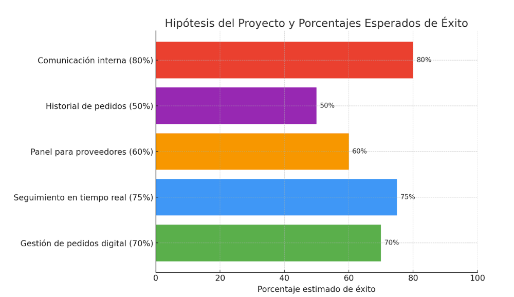

#### 1.2.2.4. Lean UX Canvas.

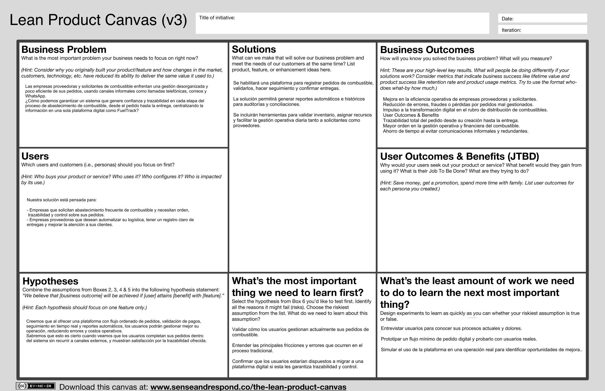

## 1.3. Segmentos objetivo

### A. Empresas solicitantes de combustible

**Descripción general:**  
Empresas medianas y grandes que operan en sectores como minería, construcción, transporte, logística y agroindustria. Estas organizaciones dependen del suministro constante de combustibles para operar maquinaria pesada, flotas vehiculares o generadores. Suelen contar con procesos operativos complejos y plantillas distribuidas geográficamente.

**Características demográficas:**
- **Tamaño:** Medianas y grandes empresas.
- **Ubicación:** Principalmente ubicadas en zonas industriales y regiones alejadas de centros urbanos.
- **Sectores:** Minería, construcción, transporte, agroindustria, manufactura.

**Información estadística de sustento:**
- Según el INEI (2023), el 70% del consumo de diésel en el país es destinado a los sectores de minería y transporte.
- En Perú, existen más de 6,500 empresas medianas y grandes registradas en sectores intensivos en uso de combustible (SUNAT, 2022).
- Más del 60% de estas empresas aún realiza sus pedidos logísticos mediante medios informales como llamadas y correos electrónicos.

**Necesidades:**
- Asegurar el abastecimiento oportuno de combustible sin interrupciones.
- Reducir errores derivados de la informalidad en los procesos actuales.
- Tener una plataforma que facilite la trazabilidad, validación de pagos y seguimiento en tiempo real.
- Mantener constante comunicación con proveedores desde un entorno centralizado.

---

### B. Proveedores de combustible

**Descripción general:**  
Empresas dedicadas a la comercialización y distribución de combustibles líquidos, que atienden principalmente a clientes corporativos o industriales. Su operativa incluye logística compleja, administración de inventario, conciliación financiera y coordinación constante con múltiples clientes.

**Características demográficas:**
- **Tamaño:** Desde pymes hasta grandes distribuidoras con cobertura nacional o regional.
- **Ubicación:** Centrales operativas en Lima y principales ciudades, con capacidad de despacho en zonas industriales.

**Información estadística de sustento:**
- Existen más de 400 empresas registradas como comercializadoras de combustible en el país (OSINERGMIN, 2022).
- Cerca del 50% de los proveedores reporta dificultades operativas asociadas a pedidos mal gestionados y falta de trazabilidad (Estudio interno de mercado, 2023).
- El 65% de empresas proveedoras señala que sus clientes utilizan medios no estructurados para realizar pedidos.

**Motivaciones:**
- Mejorar la experiencia del cliente mediante canales digitales.
- Reducir errores en la entrega por información incompleta o mal gestionada.
- Optimizar la planificación logística y distribución con base en datos en tiempo real.
- Disminuir carga administrativa mediante procesos automatizados.

# Capítulo II: Requirements Elicitation & Analysis 
## 2.1. Competidores.

PetroApp es una plataforma digital que facilita la compra y venta de combustible, principalmente orientada a consumidores finales y estaciones de servicio. Permite ubicar estaciones cercanas, gestionar pagos electrónicos y controlar el consumo desde una app. Esta enfocada principalmente en el uso personal, pero también ofrece soluciones para empresas, con funcionalidades que permiten cierta trazabilidad y control, aunque con menos enfoque en el flujo completo del pedido corporativo.

FuelCloud es una solución tecnológica centrada en el control del despacho de combustible mediante una combinación de hardware y software. Este ofrece monitoreo en tiempo real, control de acceso al combustible, reportes detallados de consumo y ubicación, lo que la hace ideal para empresas con tanques propios. Además, se enfoca más en el control físico del combustible que en la gestión administrativa o logística del pedido entre proveedor y cliente.

Wialon es una plataforma global de gestión de flotas que incluye funcionalidades para el control de combustible, seguimiento de vehículos por GPS, y análisis de consumo. Ofrece herramientas de visualización en tiempo real, alertas automatizadas y reportes avanzados. Si bien no gestiona directamente el flujo de pedidos entre proveedores y solicitantes, es altamente utilizada por empresas distribuidoras y logísticas que transportan combustible, lo que la convierte en un competidor indirecto pero funcionalmente cercano a FuelTrack.

### 2.1.1. Análisis competitivo.

| Competitive Analysis Landscape | 
--------------------------------------------|
| **¿Por qué llevar a cabo este análisis?** |
|Este análisis se está llevando a cabo porque queremos conocer las ventajas y desventajas de nuestra aplicación frente a la competencia, y cómo nos diferenciamos de ellas.

| **Categoría** | **FuelTrack** | **Zavgar** |  **FuelCloud** | **Wialon** |
| ------------- |----------------- |------------------|------------------|------------------------|
| **Overview** | Plataforma web que digitaliza y estructura el proceso completo de pedido de combustible entre empresas y proveedores. | SaaS para la gestión de consumo de combustible de flotas, con enfoque en eficiencia, monitoreo y costos. | Solución con hardware/software para el control físico del despacho de combustible.| Plataforma de gestión de flotas con control de combustible, GPS y reportes operativos. |
| **Ventaja competitiva** | Especialización en el flujo completo de pedido, despacho y análisis; integración de pagos y logística; UI intuitiva. | No requiere hardware; ofrece métricas, control de gastos y reportes sobre consumo. | Control físico preciso del combustible, monitoreo en tiempo real. | Seguimiento en tiempo real, visualización de rutas, integración con sensores de combustible. |
| **¿Qué valor ofrece al cliente?** | Trazabilidad total, eficiencia operativa, reportes de consumo y validación segura de pedidos. | Optimización de costos y control sobre el uso de combustible en flotas. | Seguridad y precisión operativa en el control de combustible. | Trazabilidad de flotas, alertas automáticas, análisis de rutas y consumo de combustible. |
| **Mercado objetivo** | Empresas que solicitan combustible a proveedores. | Empresas con flotas vehiculares que desean monitorear y reducir el consumo de combustible. | Empresas con tanques de combustible propios. | Empresas logísticas, distribuidoras y de transporte de combustible. |
| **Estrategias de marketing**| Alianzas con proveedores, demostraciones de ahorro, marketing de contenido enfocado en eficiencia. | Enfoque digital, contenido técnico, integración con proveedores de tarjetas de combustible. | Ferias industriales, distribuidores, venta consultiva entre empresas. | Alianzas con distribuidores de GPS, marketing técnico, ferias de transporte. |
| **Productos & Servicios** | Plataforma para gestión completa de pedidos, seguimiento, reportes, validación y alertas. | Plataforma web con módulo de abastecimiento, reportes de consumo, integración GPS y tarjetas. | Hardware IoT y software para gestión, y control de combustible. | Plataforma SaaS + app móvil con monitoreo, alertas, mapas y módulos personalizables. |
| **Precios & Costos** | Modelo SaaS con suscripción escalable según volumen y servicios. | SaaS con modelos por flota activa o vehículos monitoreados. | Venta e instalación de hardware + licencias de software. | Modelo SaaS modular, basado en vehículos activos y funcionalidades activadas. |
| **Canales de distribución** | Web app responsive, potencial app móvil futura. | Web app, marketing digital y comunidad de flotas. | Plataforma web + hardware instalado en sitio. | Red de partners global, distribuidores locales e integradores de sistemas GPS. |
| **Fortalezas** | Enfoque especializado, experiencia de usuario optimizada, integraciones clave, análisis avanzado de consumo. | Implementación ágil, sin hardware, fácil adopción en empresas medianas. | Control físico riguroso, solución probada en industrias exigentes.| Plataforma robusta, cobertura internacional, integración con más de 2,400 dispositivos GPS. |
| **Debilidades** | Nueva en el mercado, menor reconocimiento de marca, necesita consolidar confianza. | No gestiona el flujo completo del pedido, enfoque parcial en flotas. | Alto costo, dependencia de hardware, menor adaptabilidad en mercados emergentes. | No gestiona pedidos entre proveedor y solicitante, requiere configuración técnica inicial. |
| **Oportunidades** | Alta informalidad en el sector, digitalización creciente en logística, necesidad de trazabilidad y control. | Mayor conciencia en eficiencia de flotas y digitalización de costos operativos. | Nuevos mercados industriales con enfoque en seguridad y control. | Creciente necesidad de control logístico y monitoreo de distribución en países en desarrollo. |
| **Amenazas**  | Aparición de soluciones similares, resistencia al cambio en empresas tradicionales, competencia ERP. | SaaS especializados con mayor cobertura funcional (ERP, proveedores, logística). | SaaS ágiles y sin hardware físico, que ofrecen soluciones más accesibles. | SaaS más específicos y ligeros, enfocados exclusivamente en la trazabilidad de entregas. |

### 2.1.2. Estrategias y tácticas frente a competidores.

#### a. Diferenciación a través de especialización
Una de las principales estrategias de **FuelTrack** es la **especialización en el flujo completo de pedido de combustible**. A diferencia de soluciones como **Zavgar**, que están orientadas principalmente al control y análisis del consumo de combustible en flotas, nuestra plataforma se enfoca en las **interacciones B2B** entre empresas solicitantes y proveedores. Esto nos permite ofrecer un **control dedicado del pedido**, **gestión de la logística**, y **reportes detallados de consumo y entregas**, lo cual no está presente en la mayoría de las plataformas competidoras.

- **Táctica**: Desarrollar funcionalidades para la **validación automática de pagos**, **gestión de stock en tiempo real** y la **optimización del transporte** logrando la automatización de procesos que solo eran logrados de forma manual. Esto crea una ventaja frente a competidores como **FuelCloud**, que se centran más en el control físico del combustible y menos en la administración a nivel operativo.

#### b. Innovación en la interfaz de usuario y experiencia

El sistema de **FuelTrack** está diseñado para ofrecer una **experiencia de usuario optimizada**, algo que **Wialon**, **FuelCloud** y la propia **OSINERGMIN** no abordan en sus plataformas. Al ser una solución especializada y dirigida a una tarea específica, podemos dedicar más recursos en crear una interfaz intuitiva y procesos bien definidos brindando comodidad y seguridad a nuestros usuarios.

- **Táctica**: Diseñar una **interfaz intuitiva y consistente** que permita a los usuarios acceder a reportes de consumo, validar pedidos y coordinar logística con facilidad. Además, ofrecer **soporte y formación continua** para asegurar que los usuarios aprovechen al máximo todas las funcionalidades del sistema.

#### c. Flexibilidad en precios y modelo SaaS escalable
El modelo de precios de **FuelTrack** ofrece **planes escalables basados en suscripción**, lo que hace que sea más accesible para medianas y grandes empresas. Esto es más competitivo frente a **Wialon**, que puede no ser una opción viable para empresas que solo requieren una solución de pedidos de combustible. También es más asequible que **FuelCloud**, que requiere una inversión considerable en hardware, instalación y mantenimiento.

- **Táctica**: Ofrecer un modelo de suscripción flexible y **precios competitivos**, con **múltiples niveles de suscripción** adaptados a las necesidades de diferentes empresas. Esto permitirá que empresas de menor tamaño puedan acceder a la plataforma sin comprometer su presupuesto, a la vez que se asegura el crecimiento a largo plazo a medida que la empresa crece.

#### d. Aprovechamiento de la digitalización en la logística
El sector de la logística está experimentando una transformación digital acelerada. **FuelTrack** se aprovechará de esta tendencia buscando la integración de la plataforma con otras soluciones logísticas (como los sistemas de gestión de vehículos o flotas). De esta forma podemos ofrecer una solución más completa y eficiente.

- **Táctica**: Colaborar con empresas de **gestión de flotas** para optimizar el proceso de asignación de vehículos, cisternas y choferes. También se considerará la posibilidad de integrar **sensores IoT** en los camiones de reparto para un control más preciso sobre el combustible transportado y la entrega.

#### e. Expansión hacia mercados internacionales
Si bien **FuelTrack** está inicialmente orientada a empresas locales, el modelo de negocio y la flexibilidad de la plataforma la hacen ideal para expandirse a **mercados internacionales**. Competidores como **Wialon** ya tienen presencia en mercados globales, pero su enfoque en empresas grandes y sus altos costos de implementación pueden ser una barrera para empresas de menor tamaño, limitando su alcance.

- **Táctica**: Iniciar la expansión en mercados emergentes donde la digitalización en la logística es una necesidad creciente. Esto incluirá la **localización de la plataforma** (idioma, moneda, regulaciones locales) para facilitar la adaptabilidad de los nuevos mercados.

## 2.2. Entrevistas.
### 2.2.1. Diseño de entrevistas.

Para comprender mejor a nuestros segmentos objetivo y construir arquetipos precisos, se han definido dos entrevistas diferenciadas según el segmento objetivo:
1. Proveedores de combustible
2. Empresas solicitantes con contratos de suministro (clientes corporativos)

##### A. Proveedores de Combustible
- Preguntas principales:
1. ¿Cómo gestionan actualmente los pedidos de las empresas clientes? ¿Utilizan un sistema específico para gestionarlos? ¿Cómo es el flujo desde la solicitud hasta la entrega?
2. ¿Utilizan algún sistema digital para registrar pedidos o todo se maneja de manera manual? ¿Qué herramientas usan actualmente (si aplican)?
3. ¿Cuáles son los pasos que siguen desde que un cliente hace un pedido hasta que se entrega? ¿Cuánto tiempo toma todo el proceso?
4. ¿Cómo controlan que lo despachado coincida con lo solicitado por el cliente? ¿Tienen algún tipo de verificación o control de calidad?
5. ¿Qué tipo de reportes necesitan generar para el seguimiento de pedidos? Ejemplo: volúmenes, facturación, entregas, incidencias, etc.
6. ¿Tienen un sistema para validar el stock antes de preparar el despacho de un pedido? ¿Cómo gestionan las existencias?
7. ¿Cómo hacen el seguimiento de los pedidos? ¿Informan al cliente en tiempo real sobre el estado de su pedido? ¿Qué sistema o metodología usan para actualizar al cliente?
8. ¿Qué problemas suelen ocurrir durante el proceso de atención de pedidos empresariales? Ejemplo: retrasos, errores en la entrega, problemas con la facturación.
9. ¿Cómo se realiza la conciliación de pagos con los clientes? ¿Tienen un proceso automatizado o lo hacen manualmente?
10. ¿Estarían dispuestos a integrar su sistema actual con una plataforma SaaS que unifique y centralice estos procesos? ¿Por qué? ¿Qué beneficios ven en esta integración?

- Preguntas complementarias:
1. ¿Qué canales de comunicación prefieren utilizar (correo, llamadas telefónicas, WhatsApp, etc.)?
2. ¿Qué dispositivos utilizan para gestionar los pedidos (PC, móvil, tablet)?
3. ¿Quién dentro de su equipo gestiona y valida los pedidos y entregas?
4. ¿Qué tan frecuente es el contacto con los clientes para resolver problemas o inquietudes con las entregas?
5. ¿Qué tan abierta están a utilizar una plataforma digital que centralice la gestión de pedidos y la comunicación con los clientes?

##### Datos demográficos y psicográficos a recolectar:
- Demográficos:

  - Edad, género.
  - Distrito o ciudad de operación.
  - Tamaño y cobertura de la empresa.
  - Cargo del entrevistado dentro de la empresa.

- Psicográficos:

  - Nivel de familiaridad con herramientas digitales.
  - Canales de comunicación más usados y preferidos.
  - Frustraciones actuales con el proceso de pedidos.
  - Objetivos operativos y prioridades en el servicio a clientes.
  - Nivel de satisfacción con el sistema actual de gestión de pedidos.
  - Disposición a adoptar nuevas tecnologías.

##### B. Empresas Solicitantes de Combustible
- Preguntas principales:
1. ¿Cómo solicitan actualmente combustible a su proveedor? ¿Qué sistema o canal usan (llamadas, correo, WhatsApp, etc.)?
2. ¿Utilizan algún sistema propio para realizar los pedidos o prefieren canales informales como correo, WhatsApp, etc.? ¿Qué tan eficiente consideran este proceso?
3. ¿Cómo verifican que lo entregado coincida con lo solicitado? ¿Tienen un sistema de control o verificación?
4. ¿Tienen problemas frecuentes con entregas incompletas o fuera de tiempo? ¿Qué impacto tiene esto en su operación?
5. ¿Con qué frecuencia necesitan reportes de consumo, entregas o pagos? ¿Qué tipo de reportes y con qué frecuencia los requieren?
6. ¿Qué tan importante es para ustedes tener trazabilidad de cada entrega (por ejemplo, saber el tiempo de despacho, cantidad exacta entregada)? ¿Qué valor le dan a la trazabilidad en el proceso?
7. ¿Quiénes dentro de su empresa son responsables de validar los pedidos y autorizar los pagos? ¿Es un proceso centralizado o distribuido?
8. ¿Cómo gestionan las reprogramaciones o cancelaciones de pedidos? ¿Cuál es el procedimiento en caso de cambios de último minuto?
9. ¿Qué herramientas utilizan para monitorear el consumo mensual de combustible? ¿Existen sistemas o aplicaciones para monitorear consumo?
10. ¿Qué mejoras desearían ver en el proceso actual de pedidos y seguimiento de entregas? ¿Qué aspectos mejorarían en la trazabilidad, tiempos o comunicación?

- Preguntas complementarias:
1. ¿Qué dispositivos prefieren usar para gestionar los pedidos y pagos (PC, tablet, móvil)?
2. ¿Cuál es su experiencia con plataformas digitales para pedidos o gestión de servicios?
3. ¿Qué canales prefieren para recibir confirmaciones o actualizaciones sobre los pedidos (notificaciones push, correos electrónicos, llamadas, etc.)?
4. ¿Cómo se gestionan internamente los reportes y la facturación del consumo de combustible?
5. ¿Qué tan abiertas están a integrar una nueva solución tecnológica para mejorar la trazabilidad y eficiencia de los pedidos?

##### Datos demográficos y psicográficos a recolectar:
- Demográficos:

  - Edad, género.
  - Distrito o ciudad de operación.
  - Tamaño y cobertura de la empresa.
  - Cargo del entrevistado dentro de la empresa.

- Psicográficos:

  - Nivel de experiencia con herramientas digitales.
  - Canales preferidos para la gestión de pedidos y comunicaciones.
  - Frustraciones actuales con el proceso de solicitud y entrega de combustible.
  - Objetivos operativos a corto y largo plazo (optimización de tiempos, reducción de costos, etc.).
  - Influencia de factores externos en el proceso de compra (presupuesto, normativas, expectativas de los clientes).
  - Disposición a adoptar nuevas tecnologías.

---

### 2.2.2. Registro de entrevistas.

En esta sección se incluyen las fichas de User Persona elaboradas con base en el análisis detallado de las entrevistas realizadas a los segmentos identificados y el estudio de la competencia directa e indirecta. A partir de la información recolectada, se han identificado las principales características objetivas como edad, ocupación, nivel educativo, ubicación geográfica, estado civil, uso de dispositivos tecnológicos, canales de interacción digital y navegadores preferidos; así como características subjetivas como personalidad, habilidades, frustraciones, objetivos, marcas de preferencia e influencias. Estos perfiles representan de forma precisa a los usuarios reales del sistema, permitiendo que las decisiones de diseño, funcionalidades y experiencia de usuario estén enfocadas en resolver sus verdaderas necesidades, comportamientos y motivaciones.

#### Entrevista N°1 – Segmento: Proveedores
 
- Nombres: Jorge Luis
- Apellidos: Binda
- Edad: 27 años
- Distrito: Lima
- URL Entrevista: https://tinyurl.com/EntrevistasGrupo4
- Duración: 00:06:00 minutos - minuto de inicio: 00:00:00
- Resumen: 
    Jorge menciona que tiene más de 10 años de experiencia en el área de logística. Indica que utiliza plataformas como Excel, WhatsApp y Outlook para desempeñar su rol, y de esta manera realiza el seguimiento de los pedidos a sus clientes, aunque no en tiempo real. Jorge también señala algunos problemas que afectan su puesto, como la falta de comunicación con el cliente y fallos en el stock. Además, considera que una plataforma como la nuestra podría reducir los errores y facilitar todo el proceso, siempre y cuando no sea muy complicada de implementar.

---

#### Entrevistado N°2 - Segmento: Empresas solicitantes
 
- Nombre: Javier
- Apellidos: Hernandez
- Edad: 23 años
- Distrito: Lima
- URL Entrevista: https://tinyurl.com/EntrevistasGrupo4
- Duración: 00:07:49 minutos - minuto de inicio: 00:06:00
- Resumen: 
   Javier comenta que trabaja en el área de logística, función en la que se encarga del inventario, así como de organizar el suministro de combustible para las diferentes maquinarias que requiere la empresa. Menciona que no cuentan con un sistema propio y, al tratarse de grandes cantidades de combustible, necesitan que un representante de la empresa esté presente, lo cual retrasa las operaciones. Además, comenta que esto les ha generado problemas legales debido a la falta de confirmación de identidad y de comunicación, por lo que considera que un software de gestión sería de gran ayuda.
---

#### Entrevistado N°3
 
- Nombres: Zahir
- Apellidos: Sanchez
- Edad: 19 años
- Distrito: Lima
- URL Entrevista: https://tinyurl.com/EntrevistasGrupo4
- Duración: 00:05:35 - minuto de inicio: 00:13:50
- Resumen: 
    Zahir es encargado del registro de pedidos de Petromax, que se dedica a la venta de combustible. Maneja los pedidos de forma semimanual ya que estos llegan primero a través de correo y luego su información pasa a su sistema interno. Tiene la necesidad de generar reportes tanto mensualmente como diariamente, y principalmente deben mostrar datos de ventas y consumo. Siente que es un gran problema el registro de pedidos, ya que cuando identifican un error de información, el pedido se encuentra en estado avanzado. Siente que seríal ideal centralizar todos estos procesos, principallmente por el registro y la conciliación de pagos.
    

---

#### Entrevistado N°4
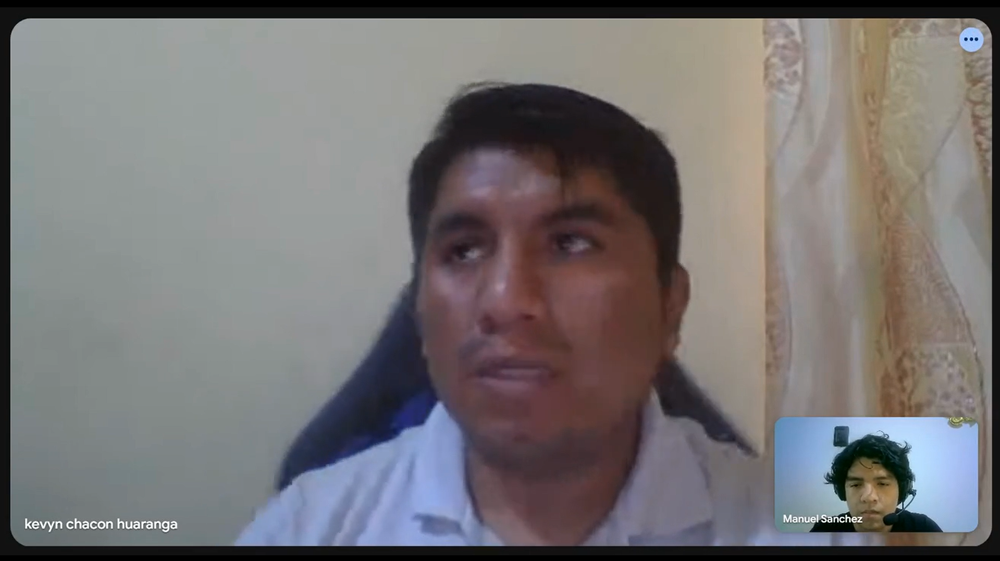 
- Nombres: Kevyn
- Apellidos: Chacon
- Edad: 31 años
- Distrito: Lima
- URL Entrevista: https://tinyurl.com/EntrevistasGrupo4
- Duración: 00:07:06 - minuto de inicio: 00:19:26
- Resumen: 
    Kevyn es un parte del area de operaciones de Energex que utiliza combustible para sus vehículos. Recibe los pedidos por correo y usa Excel para su registro y gestión. Se siente frustrado por la dificultad para hacer una gestión de las solicitudes de combustible. Es necesaria la comunicación con sus clientes para que estén al tanto del despacho de sus pedidos. Cree que una solución como FuelTrack podría ayudar a mejorar la comunicación con los proveedores y optimizar el proceso de pedidos.

---

#### Entrevistado N°5
 
- Nombres: Grover
- Apellidos: Manosalva
- Edad: 33 años
- Distrito: Lima
- URL Entrevista: https://tinyurl.com/EntrevistasGrupo4
- Duración: 00:15:43 - minuto de inicio: 00:26:33
- Resumen: 
    Grover menciona que trabaja en Petroperú y que requieren un suministro constante de combustible para la maquinaria. Explica que actualmente utilizan una plataforma interna para gestionar los pedidos, la cual permite que estos pasen por diferentes etapas de aprobación y seguimiento. Sin embargo, señala que cuando trabaja en provincias, en ocasiones el suministro no llega hasta su lugar de trabajo, lo que genera inconvenientes en las operaciones. A pesar de contar con un sistema, considera que aún hay oportunidades de mejora en cuanto a la logística y cobertura del servicio.

---

#### Entrevistado N°6
 
- Nombres: Aleskha
- Apellidos: Fernandez
- Edad: 32
- Distrito: San Borja
- URL Entrevista: https://tinyurl.com/EntrevistasGrupo4
- Duración: 00:05:09 - minuto de inicio: 00:42:15
- Resumen: 
      Aleskha menciona que utiliza herramientas de Microsoft para realizar su trabajo, apoyándose principalmente en Excel para llevar un control interno. Sin embargo, señala que no cuentan con un sistema propio, por lo que realiza los pedidos a su proveedor mediante WhatsApp. Entre los principales problemas que enfrenta se encuentran la falta de confirmación, los retrasos en los tiempos de entrega y la necesidad de estar constantemente dando seguimiento para obtener los informes. Asimismo, a veces tienen fallos en el contenido del pedido siendo este menos de lo solicitado.
  
---

### 2.2.3. Análisis de entrevistas.

#### <u>SEGMENTO 1: Empresas solicitantes de combustible</u>

#### Características objetivas:

| Variable | Porcentaje | Observaciones |
|----------|------------|---------------|
| Edad entre 30 y 45 años | 100% | Todos los entrevistados tienen entre 33 y 45 años. |
| Cargo relacionado a logística | 100% | Los tres pertenecen a áreas de operaciones o logística. |
| Usa computadora y celular | 100% | Todos usan laptop/PC y móvil para sus actividades. |
| Utiliza WhatsApp para coordinar | 66% | 2 de 3 lo usan como canal principal con el proveedor. |
| Manejo de hojas Excel o Google | 100% | Todos gestionan sus pedidos manualmente en planillas. |
| Nivel medio de familiaridad digital | 100% | Dominan software básico (Drive, correo, hojas de cálculo). |

#### Características subjetivas:

| Variable | Porcentaje | Observaciones |
|----------|------------|---------------|
| Necesita trazabilidad del pedido | 100% | Todos demandan claridad en el estado y avance del pedido. |
| Frustración por depósitos no validados | 66% | 2 de 3 se quejan de retrasos debido a validación manual. |
| Deseo de un sistema unificado | 100% | Los 3 expresaron querer centralizar todo el proceso. |
| Receptividad positiva a tecnología | 100% | Todos están abiertos a soluciones digitales con buena UX. |

#### <u>SEGMENTO 2: Proveedores de combustible</u>

#### Características objetivas:

| Variable | Porcentaje | Observaciones |
|----------|------------|---------------|
| Edad entre 39 y 48 años | 100% | Todos en este rango. |
| Cargo en operaciones/logística | 100% | Incluye jefes de planta, despacho o ventas. |
| Utiliza laptop/PC y celular | 100% | Equipamiento estándar en planta o administración. |
| Nivel de digitalización medio | 66% | 2 de 3 usan sistemas propios o ERPs básicos. |
| Gestión mediante correo y llamadas | 100% | El proceso actual es altamente manual. |

#### Características subjetivas:

| Variable | Porcentaje | Observaciones |
|----------|------------|---------------|
| Problemas con conciliación bancaria | 100% | Todos mencionan validación lenta de pagos como cuello de botella. |
| Necesidad de validar stock antes de liberar | 66% | 2 de 3 destacaron esto como un punto crítico. |
| Dificultades en la asignación de vehículos | 66% | Errores de programación y disponibilidad afectan la entrega. |
| Deseo de automatización de procesos | 100% | Todos visualizan mejoras en eficiencia si se digitalizan etapas clave. |

## 2.3. Needfinding.
### 2.3.1. User Personas.

a. User Persona 1: Empresas solicitantes de combustible
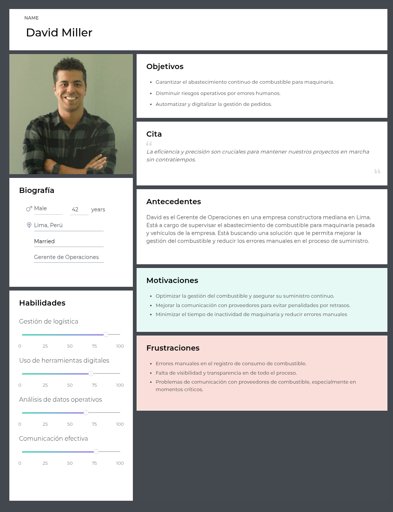

b. User Persona 2: Proveedores de combustible
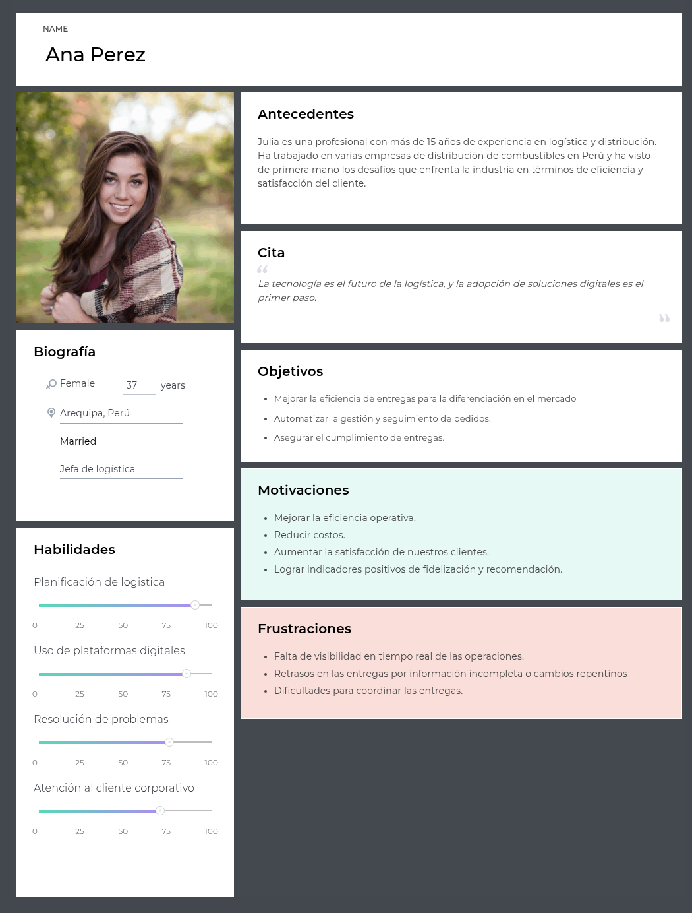

### 2.3.2. User Task Matrix.

| **Tarea**                                      | **David Miller – Frecuencia** | **David Miller – Importancia** | **Ana Pérez – Frecuencia** | **Ana Pérez – Importancia** |
|------------------------------------------------|-------------------------------|---------------------------------|-----------------------------|------------------------------|
| Revisar nivel de stock de combustible          | Alta | Alta | Baja | Baja |
| Realizar pedido de combustible                 | Media | Alta | Alta | Alta |
| Validar confirmación de pedido                 | Alta | Alta | Alta | Alta |
| Hacer seguimiento a la entrega                 | Alta | Alta | Alta | Alta |
| Supervisar descarga y recepción                | Media | Alta | Media | Media |
| Evaluar proceso post-servicio                  | Baja | Media | Alta | Alta |
| Gestionar atención al cliente                  | Media | Alta | Alta | Alta |
| Revisar encuestas o feedback                   | Baja | Media | Media | Alta |

### 2.3.3. User Journey Mapping.

En el caso del **solicitante**, el recorrido empieza con la generación de un pedido por correo o llamada, seguido por la validación manual del depósito, la espera de aprobación por parte del proveedor, la coordinación del despacho, y finalmente el registro manual de la entrega.

En el caso del **proveedor**, el flujo parte desde la recepción del pedido, luego incluye la verificación del estado de cuenta, la aprobación manual, la asignación de planta y vehículo, y en muchos casos, la reprogramación por problemas de disponibilidad.

a. User Persona 1: User Persona 1 - Solicitante de Combustible
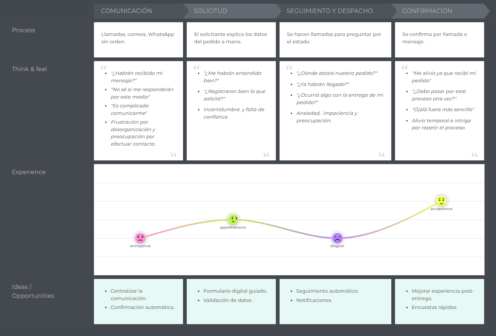

b. User Persona 2: User Persona 2 - Proveedor de Combustible
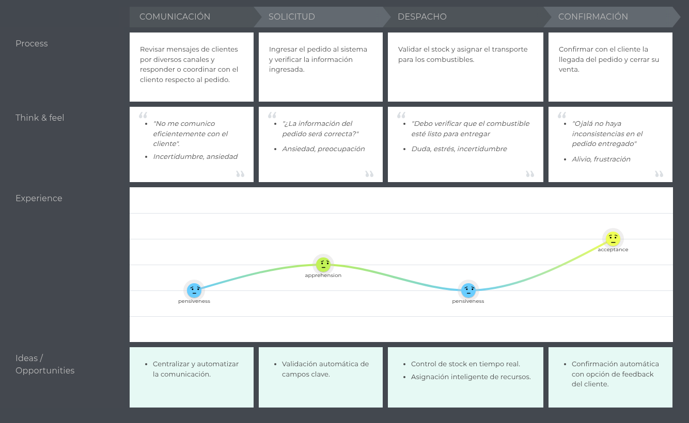

## 2.3.4. Empathy Mapping.

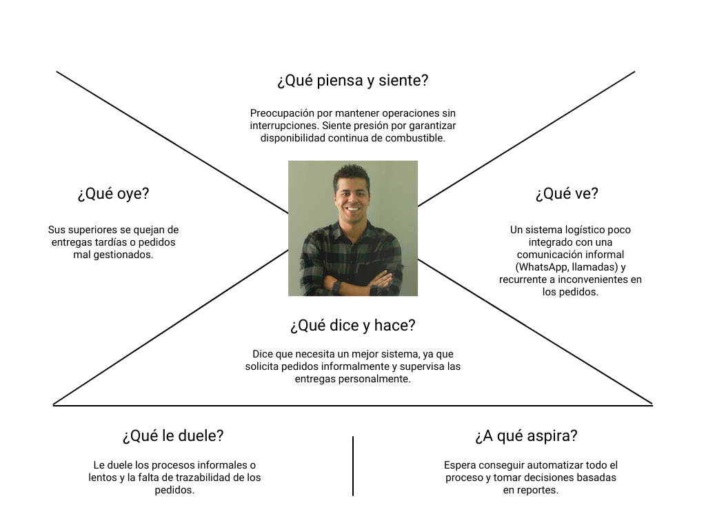
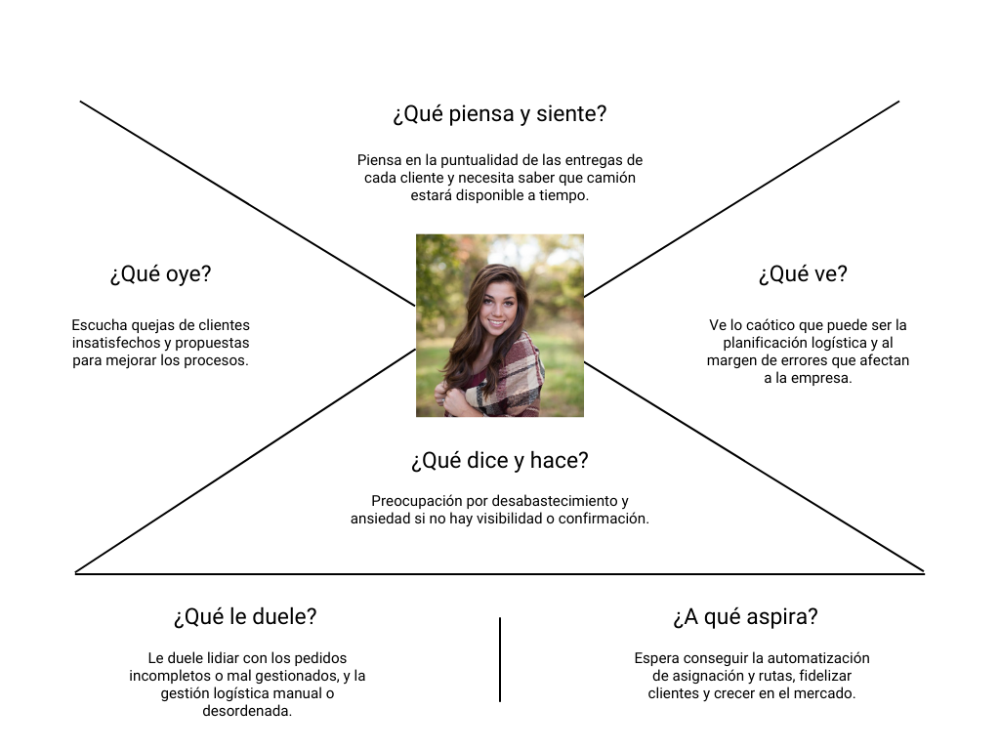

## 2.3.5. As-is Scenario Mapping.

### Escenario As-is (Segmento: proveedor de combustible)
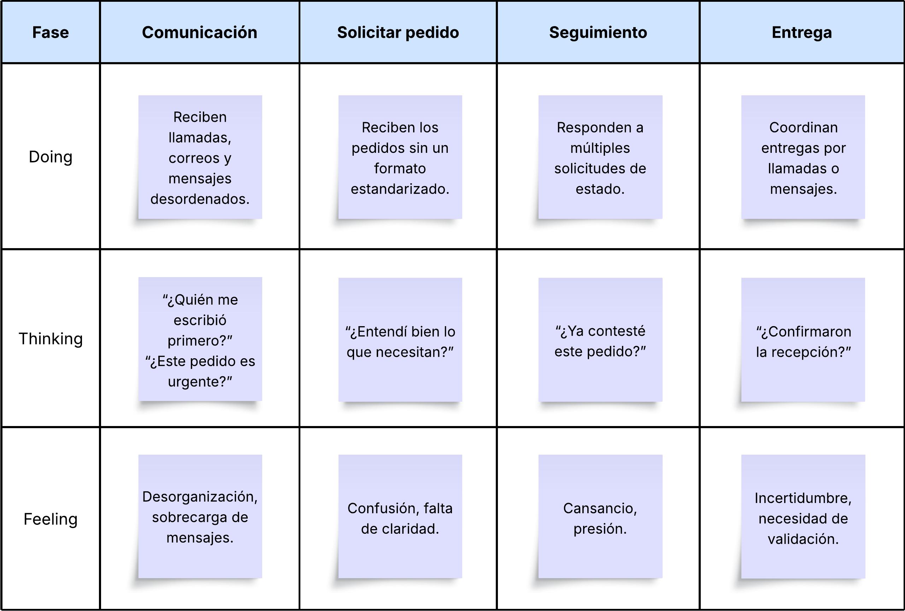

### Escenario As-is (Segmento: empresa solicitante)
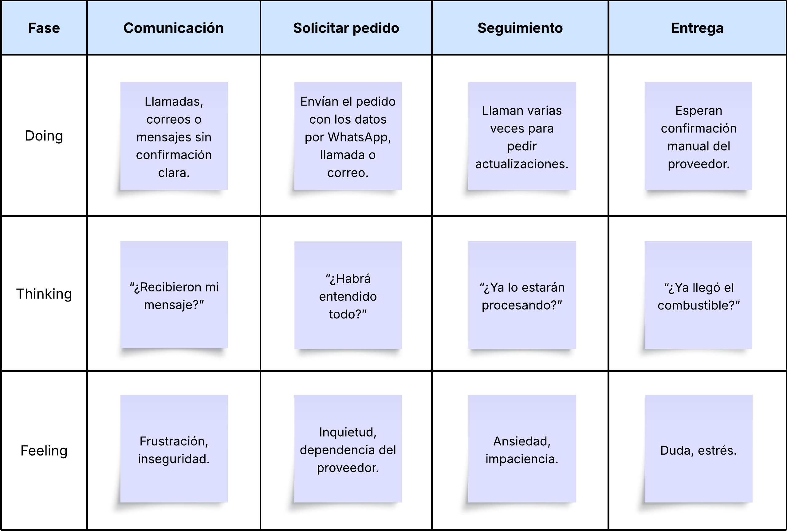

## 2.4. Ubiquitous Language.

| Término | Definición | Segmentos relacionados |
|---------|------------|------------------------|
| **Requester (Solicitante)** | Usuario representante de una empresa requiere abastecimiento de combustible | Solicitante |
| **Supplier (Proveedor)** | Empresa que ofrece combustibles al por mayor y compite mediante precios, descuentos y promociones. | Proveedor |
| **Fuel (Combustible)** | Recurso energético que es ofertado por los proveedores. Ejemplos: gasohol, diésel, GNV. | Solicitante, Proveedor |
| **Plant (Planta)** | Punto de distribución del combustible perteneciente a al proveedor. | Solicitante, Proveedor |
| **Price per gallon (Precio por galón)** | Valor económico que el proveedor establece por cada galón de combustible. Puede variar según planta, tipo de combustible, etc. | Solicitante, Proveedor |
| **Discount (Descuento)** | Reducción aplicada sobre el precio ofrecido, ya sea por volumen, fidelización u otras condicioens. | Solicitante, Proveedor |
| **Quotation (Cotización)** | Propuesta formal que un proveedor genera detallando precios, productos, entre otras condiciones | Solicitante, Proveedor |
| **Price Table (Tabla de precios)** | Grilla o tabla que muestra los precios ofrecidos por planta, proveedor y tipo de combustible. | Solicitante |
| **Negotiation (Negociación)**   | Intercambio de condiciones entre solicitante y proveedor para alcanzar un acuerdo favorable para ambas partes. | Solicitante, Proveedor |
| **Consumption Volume (Volumen de consumo)** | Cantidad de combustible estimada que una empresa solicita regularmente en un periodo determinado. | Solicitante |
| **Purchase History (Historial de compras)** | Registro de cotizaciones y compras o pedidos previos hechos por el solicitante dentro del sistema. | Solicitante |

# Capitulo III: Requirements Specifications
## 3.1 To-Be Scenario Mapping
### Escenario To-Be (Segmento: Proveedor de combustible)
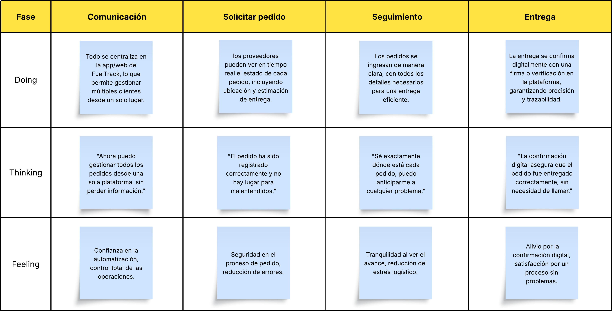

### Escenario To-Be (Segmento: Empresa Solicitante)
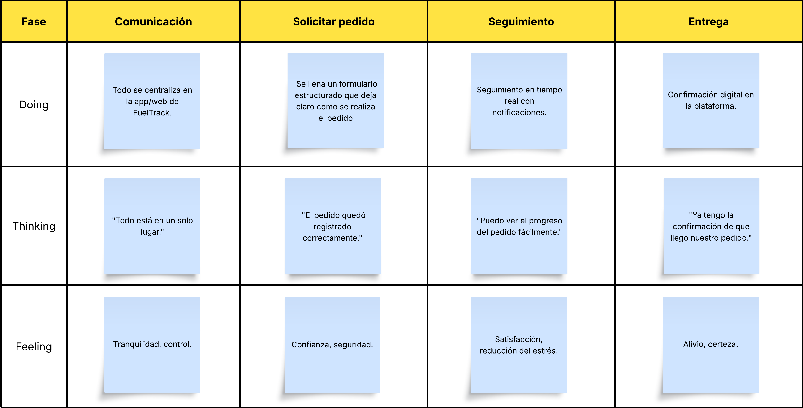

## 3.2 User Stories

| User Story ID | Título                | Descripción                                   | Criterios de Aceptación                                                              | Epic ID |
|---------------|-----------------------|-----------------------------------------------|--------------------------------------------------------------------------------------|---------|
| US01 | Ver sección Home | Como visitante (proveedor), quiero ver una sección de inicio que resuma el valor de FuelTrack para comprender rápidamente el objetivo del sistema. | **Escenario 1: Visualización de resumen del sistema**   Dado que el visitante (proveedor) accede al sitio web, Cuando se encuentra en la sección Home, Entonces puede ver un resumen claro del sistema.   **Escenario 2: Acceso a call to action desde Home**  Dado que el visitante (proveedor) revisa la sección Home, Cuando desliza hacia abajo, Entonces encuentra un botón que lo invita a conocer más sobre FuelTrack.   | EP01 |
| US02 | Ver sección About Us | Como visitante de ambos segmentos, quiero conocer quiénes están detrás de FuelTrack para confiar en el sistema. | **Escenario 1: Información visible del equipo**   Dado que el visitante de ambos segmentos accede a About Us, Cuando se carga la sección, Entonces puede leer una descripción del equipo detrás del sistema.   **Escenario 2: Ver valores o misión**  Dado que el visitante de ambos segmentos revisa la sección completa, Cuando llega al final del contenido, Entonces puede conocer los valores o misión de la empresa.   | EP01 |
| US03 | Ver sección How it works? | Como visitante de ambos segmentos, quiero entender cómo funciona FuelTrack paso a paso para evaluar si se ajusta a mis necesidades. | **Escenario 1: Comprensión del flujo de pedidos**   Dado que el visitante de ambos segmentos accede a How it works?, Cuando lee la sección, Entonces entiende el flujo de pedido desde solicitud hasta entrega.  **Escenario 2: Interacción clara entre usuarios**   Dado que el visitante de ambos segmentos busca claridad, Cuando revisa la sección, Entonces puede comprender cómo interactúan solicitante y proveedor.   | EP01 |
| US04 | Enviar mensaje de contacto | Como visitante de ambos segmentos, quiero enviar un mensaje desde Contact Us para solicitar más información. | **Escenario 1: Envío exitoso de mensaje**   Dado que el visitante de ambos segmentos completa el formulario correctamente, Cuando presiona “Enviar”, Entonces el mensaje es registrado para revisión.  **Escenario 2: Validación de campos obligatorios**   Dado que el visitante de ambos segmentos deja campos vacíos, Cuando intenta enviar el formulario, Entonces el sistema muestra una advertencia.   **Escenario 3: Confirmación visual del envío**   Dado que el visitante de ambos segmentos envía el formulario exitosamente, Cuando el mensaje es registrado, Entonces recibe una confirmación visual o notificación.   | EP01 |
| US05 | Registrar nuevo pedido | Como solicitante, quiero registrar un pedido con tipo y cantidad de combustible para que el proveedor lo procese. | **Escenario 1: Registro exitoso del pedido**   Dado que el solicitante accede al formulario de pedidos, Cuando completa los campos requeridos, Entonces puede enviar un nuevo pedido.  **Escenario 2: Validación de campos**   Dado que el solicitante deja un campo obligatorio vacío, Cuando intenta enviar el pedido, Entonces el sistema muestra un mensaje de error.   **Escenario 3: Confirmación del cambio de estado**   Dado que el solicitante envió el pedido, Cuando el proveedor lo aprueba, Entonces su estado se actualiza automáticamente.   | EP02 |
| US06 | Consultar estado del pedido | Como solicitante, quiero ver el estado de mis pedidos para saber si están aprobados, en tránsito o entregados. | **Escenario 1: Consulta de estado en el panel**   Dado que el solicitante accede a su panel, Cuando revisa la lista de pedidos, Entonces ve el estado actualizado.  **Escenario 2: Actualización dinámica de estado**   Dado que el solicitante está visualizando el panel de pedidos, Cuando el pedido cambia de estado, Entonces el cambio se refleja correctamente al recargar el panel.   | EP02 |
| US07 | Confirmar recepción de pedido | Como solicitante, quiero confirmar que recibí el pedido para que el proveedor lo cierre. | **Escenario 1: Confirmación exitosa de recepción**   Dado que el solicitante recibió el pedido, Cuando lo confirma en el sistema, Entonces su estado cambia a “Despachado”.  **Escenario 2: Prevención de doble confirmación**   Dado que el solicitante ya confirmó la entrega, Cuando intenta volver a confirmar, Entonces el sistema bloquea la acción y notifica al usuario.   | EP02 |
| US08 | Registrar información de pago | Como solicitante, quiero ingresar la información de los pagos correspondientes para validar el pedido ante el proveedor. | **Escenario 1: Registro exitoso de depósitos**   Dado que el solicitante ingresa la información depósitos, Cuando registra el pedido, Estos quedan vinculados a el.  **Escenario 2: Validación del formulario de ingreso de depósitos**   Dado que el solicitante intenta los datos del depósito, Cuando excede el límite de caracteres, Entonces el sistema muestra un mensaje de error.   **Escenario 3: Validación de depósitos ya registrados**   Dado que el solicitante ingresa un depósito con un número de operación repetido Cuando intenta seguir con el registro, Entonces el sistema notifica el error.   | EP02 |
| US09 | Ver historial de pedidos | Como solicitante, quiero ver mis pedidos anteriores para tener control sobre mi consumo. | **Escenario 1: Visualización del historial**   Dado que el solicitante accede al historial, Cuando se listan los pedidos, Entonces puede ver fecha, tipo y estado de cada uno.  **Escenario 2: Historial vacío**   Dado que el solicitante aún no ha realizado pedidos, Cuando accede al historial, Entonces se muestra un mensaje informativo.   **Escenario 3: Acceso a detalles desde historial**   Dado que el solicitante ve la lista de pedidos anteriores, Cuando selecciona uno, Entonces puede revisar sus detalles.   | EP02 |
| US10 | Ver pedidos pendientes | Como proveedor, quiero ver todos los pedidos pendientes para analizarlos y tomar acción. | **Escenario 1: Listado de pedidos pendientes**   Dado que el proveedor accede al panel, Cuando ve los pedidos pendientes, Entonces puede revisar sus detalles básicos.   **Escenario 2: Filtro por fechas o cliente**   Dado que el proveedor tiene muchos pedidos, Cuando aplica filtros por fecha o empresa, Entonces puede localizar los pedidos relevantes.   | EP03 |
| US11 | Aprobar pedido | Como proveedor, quiero aprobar pedidos según los depósitos hechos a mis cuentas bancarias. | **Escenario 1: Aprobación de pedido con depósitos válidos**   Dado que el proveedor tiene el pago completo del pedido, Cuando intenta lo aprueba, Entonces el estado cambia a “Aprobado”.  **Escenario 2: No aprobar el pedido por pago incompleto**   Dado que el proveedor no cuenta con los depósitos suficientes para completar el pago del pedido, Cuando intenta aprobarlo, Entonces se muestra un mensaje indicando que el pedido no fue pagado por completo.   | EP03 |
| US12 | Marcar pedido como despachado | Como proveedor, quiero marcar cuándo un pedido sale a entrega para notificar al cliente. | **Escenario 1: Despacho exitoso de un pedido**   Dado que el proveedor tiene un pedido aprobado, Cuando marca el pedido como despachado, Entonces el estado cambia a “Despachado”.   **Escenario 2: Restricción de despacho sin aprobación previa**   Dado que el proveedor intenta despachar un pedido sin pasar por la liberación correspondiente, Cuando ejecuta la acción, Entonces el sistema impide el cambio de estado y muestra un mensaje.   | EP03 |
| US13 | Cerrar pedido | Como proveedor, quiero cerrar el pedido cuando el cliente confirme la entrega para finalizar el proceso. | **Escenario 1: Cierre correcto del pedido tras confirmación**   Dado que el solicitante ya confirmó la entrega, Cuando el proveedor cierra el pedido, Entonces este no puede modificarse más.  **Escenario 2: Intento de cierre sin confirmación previa**   Dado que el proveedor intenta cerrar el pedido, Cuando el solicitante aún no ha confirmado la entrega, Entonces el sistema impide esta acción.   | EP03 |
| US14 | Generar reporte de ventas | Como proveedor, quiero generar reportes de ventas para tener registro de operaciones realizadas. | **Escenario 1: Generación de reporte con datos disponibles**   Dado que el proveedor selecciona un rango de fechas válido, Cuando solicita el reporte, Entonces se genera un archivo con los datos de ventas.  **Escenario 2: Generación sin datos en el rango**   Dado que el proveedor selecciona un rango sin ventas, Cuando solicita el reporte, Entonces el sistema informa que no hay resultados.   **Escenario 3: Descarga del archivo generado**   Dado que el reporte se genera correctamente, Cuando finaliza el proceso, Entonces el proveedor puede descargar el archivo.   | EP03 |
| US15 | Iniciar sesión | Como usuario registrado, quiero iniciar sesión con correo y contraseña para acceder a mi cuenta. | **Escenario 1: Inicio de sesión exitoso**   Dado que el usuario registrado ingresa credenciales válidas, Cuando presiona iniciar sesión, Entonces accede a su dashboard.  **Escenario 2: Error por credenciales incorrectas**   Dado que el usuario registrado ingresa datos incorrectos, Cuando intenta iniciar sesión, Entonces el sistema muestra un mensaje de error.   **Escenario 3: Validación de campos vacíos**   Dado que el usuario deja campos vacíos, Cuando intenta iniciar sesión, Entonces el sistema solicita completar los campos.   | EP04 |
| US16 | Recuperar contraseña | Como usuario registrado, quiero recuperar mi contraseña para volver a acceder si la olvidé. | **Escenario 1: Envío de enlace de recuperación**   Dado que el usuario registrado ingresa su correo válido, Cuando solicita recuperación, Entonces recibe un enlace al correo.  **Escenario 2: Error por correo no registrado**   Dado que el usuario ingresa un correo inexistente, Cuando solicita recuperación, Entonces se le informa que el correo no está registrado.   **Escenario 3: Validación de campo vacío**   Dado que el usuario no completa el campo de correo, Cuando intenta enviar la solicitud, Entonces el sistema solicita completarlo.   | EP04 |
| US17 | Cerrar sesión | Como usuario registrado, quiero poder cerrar sesión para mantener segura mi cuenta. | **Escenario 1: Cierre exitoso de sesión**   Dado que el usuario está autenticado, Cuando selecciona “Cerrar sesión”, Entonces la sesión se finaliza y es redirigido al login.   **Escenario 2: Confirmación de cierre de sesión**   Dado que el usuario cierra sesión, Cuando termina la acción, Entonces el sistema muestra un mensaje de despedida o confirmación.   | EP04 |
| US18 | Ver resumen de pedidos (Solicitante) | Como solicitante, quiero ver un resumen de mis pedidos para identificar cuántos están en proceso o completados. | **Escenario 1: Visualización de resumen con datos disponibles**   Dado que el solicitante tiene pedidos registrados, Cuando accede a su dashboard, Entonces visualiza los KPIs por estado: pendientes, aprobados, despachados, finalizados y rechazados.  **Escenario 2: Sin pedidos registrados**   Dado que el solicitante no tiene pedidos, Cuando accede al dashboard, Entonces ve un mensaje informando “No hay pedidos registrados”.  **Escenario 3: Error al cargar datos del resumen**   Dado que el solicitante accede al dashboard, Cuando ocurre un error de carga, Entonces el sistema muestra un mensaje e intenta recargar los datos automáticamente.   | EP05 |
| US19 | Ver resumen de pedidos (Proveedor) | Como proveedor, quiero ver un resumen de pedidos gestionados y pendientes para organizar a los clientes. | **Escenario 1: Visualización de KPIs con datos**   Dado que el proveedor tiene pedidos registrados, Cuando accede a su dashboard, Entonces ve KPIs de pedidos: pendientes, aprobados, rechazados, despachados y finalizados.  **Escenario 2: Sin datos registrados**   Dado que no hay pedidos registrados, Cuando se carga el dashboard, Entonces los KPIs se muestran con valor cero y un mensaje informativo.  **Escenario 3: Fallo en la carga del resumen**   Dado que el proveedor accede al dashboard, Cuando hay un error de conexión, Entonces se muestra una alerta con opción para reintentar.   | EP05 |
| US20 | Endpoint: Login | Como developer, quiero un endpoint para autenticar usuarios. | **Escenario 1: Autenticación exitosa**   Dado que el developer incluye credenciales válidas en el request, Cuando lo envía al endpoint de autenticación, Entonces recibe un token JWT y un status 200 como respuesta.  **Escenario 2: Credenciales inválidas**   Dado que el developer incluye credenciales incorrectas en el request, Cuando se procesa la solicitud, Entonces se retorna status 401 con un mensaje de error.  **Escenario 3: Error interno del servidor**   Dado que el developer realiza un request y ocurre un problema en el backend, Cuando se procesa la autenticación, Entonces se retorna status 500 con un mensaje genérico de error.   | EP06 |
| US21 | Endpoint: Recuperar contraseña | Como developer, quiero un endpoint para que permita enviar correo de recuperación. | **Escenario 1: Solicitud válida**   Dado que el developer envía un request con un correo que existe en la base de datos, Cuando el request llega al endpoint de recuperación, Entonces el sistema genera un token y envía el correo de recuperación.  **Escenario 2: Correo inexistente**   Dado que el developer envía un request con un correo no registrado, Cuando se procesa la solicitud, Entonces se retorna status 404 y no se envía ningún correo.  **Escenario 3: Error en el envío del correo**   Dado que el developer ejecuta la acción y ocurre un fallo en el servicio de correo, Cuando se intenta enviar el mensaje, Entonces se retorna status 500 y se registra el error en los logs del servidor.   | EP06 |
| US22 | Endpoint: Logout | Como developer, quiero un endpoint para cerrar sesión. | **Escenario 1: Logout exitoso**   Dado que el developer envía un token de sesión válido, Cuando llama al endpoint de logout, Entonces la sesión se invalida y se retorna status 200.  **Escenario 2: Token inválido o expirado**   Dado que el developer incluye un token no válido o expirado, Cuando se llama al endpoint de logout, Entonces se retorna status 401 y no se realiza ninguna acción.  **Escenario 3: Falla del servidor**   Dado que el developer realiza un request y ocurre un error interno en el servidor, Cuando se procesa el logout, Entonces se retorna status 500 con un mensaje genérico.   | EP06 |
| US23 | Endpoint: Crear pedido | Como developer, quiero un endpoint para registrar un nuevo pedido de combustible. | **Escenario 1: Petición con datos completos**   Dado que el developer envía una petición con todos los campos requeridos, Cuando se procesa el POST, Entonces se retorna status 201 con el ID del nuevo pedido.  **Escenario 2: Petición incompleta**   Dado que el developer envía una petición con campos obligatorios faltantes, Cuando se procesa la solicitud, Entonces se retorna status 400 con un mensaje de validación.   | EP07 |
| US24 | Endpoint: Consultar pedidos por usuario | Como developer, quiero un endpoint para obtener todos los pedidos de un usuario. | **Escenario 1: Usuario con pedidos registrados**   Dado que el usuario tiene pedidos en el sistema, Cuando se llama al endpoint, Entonces retorna un array con sus pedidos y status 200.  **Escenario 2: Usuario sin pedidos**   Dado que el usuario no ha realizado pedidos, Cuando se ejecuta la solicitud, Entonces retorna un array vacío con status 200.   | EP07 |
| US25 | Asignar vehículo a pedido | Como proveedor, quiero asignar un vehículo a un pedido aprobado para organizar la logística. | **Escenario 1: Asignación válida**   Dado que el proveedor tiene un pedido aprobado y un vehículo libre disponible, Cuando selecciona el vehículo para asignarlo, Entonces queda asignado correctamente al pedido.  **Escenario 2: Vehículo ocupado**   Dado que el proveedor intenta asignar un vehículo que ya está ocupado, Cuando realiza la acción, Entonces el sistema muestra un mensaje indicando que el vehículo no está disponible.  **Escenario 3: Falla durante la asignación**   Dado que el proveedor intenta asignar un vehículo y ocurre un error en el backend, Cuando se ejecuta la asignación, Entonces se muestra un mensaje de error y no se vincula ningún vehículo.   | EP08 |
| US26 | Asignar conductor a pedido | Como proveedor, quiero asignar un conductor para completar la información de despacho. | **Escenario 1: Conductor disponible**   Dado que el proveedor tiene un pedido con vehículo asignado y el conductor está libre, Cuando selecciona al conductor, Entonces este se vincula correctamente al pedido.  **Escenario 2: Conductor ya asignado en misma franja horaria**   Dado que el conductor está asignado a otro pedido en el mismo horario, Cuando se intenta asignarlo, Entonces el sistema bloquea la acción y muestra un mensaje de conflicto.  **Escenario 3: Error al guardar**   Dado que el proveedor intenta guardar la asignación y ocurre una falla técnica, Cuando realiza la acción, Entonces se muestra un mensaje de error y no se realiza el vínculo.   | EP08 |
| US27 | Validar disponibilidad de transporte | Como proveedor, quiero saber qué vehículos están disponibles antes de asignarlos para vincularlos correctamente. | **Escenario 1: Vehículo no disponible por superposición**   Dado que el proveedor visualiza el listado de vehículos, Cuando un vehículo está asignado a otro pedido para la misma fecha y hora estimada, Entonces el sistema lo muestra como no disponible.  **Escenario 2: Vehículo disponible**   Dado que el proveedor visualiza un vehículo sin conflictos de agenda, Cuando se carga el listado de vehículos, Entonces dicho vehículo se muestra como seleccionable.  **Escenario 3: Conflicto en tiempo real**   Dado que el proveedor intenta seleccionar un vehículo que fue asignado recientemente por otro usuario, Cuando realiza la acción, Entonces el sistema bloquea la selección y muestra un mensaje de actualización.   | EP08 |
| US28 | Ver perfil de usuario | Como usuario registrado, quiero ver mis datos de perfil para revisar mi información registrada. | **Escenario 1: Visualización exitosa del perfil**   Dado que el usuario tiene sesión activa, Cuando accede a su perfil, Entonces ve su nombre, correo y rol.  **Escenario 2: Error en la carga de datos**   Dado que el usuario accede a su perfil y ocurre un error al obtener los datos, Cuando se carga la vista, Entonces se muestra un mensaje de error y se sugiere reintentar.  **Escenario 3: Restricción de datos de otros usuarios**   Dado que el usuario tiene sesión activa, Cuando intenta ver otro perfil, Entonces el sistema restringe el acceso y muestra su propia información.   | EP09 |
| US29 | Editar datos de perfil | Como usuario registrado, quiero editar mis datos para mantener mi información actualizada. | **Escenario 1: Edición y guardado exitoso**   Dado que el usuario modifica uno o más campos del formulario, Cuando la información ingresada es válida, Entonces el sistema guarda los cambios correctamente.  **Escenario 2: Campo obligatorio vacío**   Dado que el usuario deja un campo obligatorio vacío, Cuando intenta guardar, Entonces el sistema muestra un mensaje de validación indicando el campo requerido.  **Escenario 3: Error del servidor al guardar**   Dado que el usuario intenta guardar y ocurre un fallo en el servidor, Cuando se realiza la acción, Entonces se muestra un mensaje de error y los datos ingresados permanecen visibles.   | EP09 |
| US30 | Ver sección de preguntas frecuentes | Como visitante de ambos segmentos, quiero acceder a una sección de preguntas frecuentes para resolver dudas rápidamente. | **Escenario 1: Visualización de preguntas comunes**   Dado que el visitante accede a la sección, Cuando se carga el contenido, Entonces puede leer las preguntas y respuestas más frecuentes.  **Escenario 2: Organización por categorías**   Dado que el visitante accede a la sección de preguntas frecuentes con muchas entradas, Cuando navega por la sección, Entonces puede visualizarlas clasificadas en categorías.  **Escenario 3: Error al cargar FAQs**   Dado que el visitante accede a la sección y ocurre un fallo en la carga, Cuando intenta visualizar las preguntas frecuentes, Entonces se muestra un mensaje de error o un contenido informativo alternativo.   | EP10 |
| US31 | Acceder a información de contacto rápido | Como usuario de ambos segmentos, quiero ver datos de contacto directo (teléfono o correo) para hacer consultas urgentes. | **Escenario 1: Visualización de datos de contacto**   Dado que el usuario accede a la sección de soporte, Cuando se carga la página, Entonces puede visualizar claramente el correo de soporte y número telefónico.  **Escenario 2: Acceso al correo de cliente**   Dado que el usuario hace clic en la dirección de correo, Cuando tiene una app de correo configurada, Entonces se abre automáticamente su aplicación de correo predeterminada.  **Escenario 3: Falla en la configuración de contacto**   Dado que el usuario accede a la página y los datos de contacto no están bien configurados, Cuando se carga la sección de contacto, Entonces el sistema muestra un mensaje genérico invitando a intentar más tarde.   | EP10 |
| US32 | Buscar pedido por código | Como usuario de ambos segmentos, quiero buscar un pedido específico por su código para encontrarlo rápidamente. | **Escenario 1: Pedido encontrado**   Dado que el usuario escribe un código válido, Cuando existe un pedido con ese código, Entonces se muestra el resultado correspondiente.  **Escenario 2: Pedido no encontrado**   Dado que el usuario digita un código no correspondiente a ningún pedido, Cuando finaliza la búsqueda, Entonces el sistema muestra un mensaje de que no hay coincidencias.   | EP11 |
| US33 | Filtrar pedidos por estado | Como usuario de ambos segmentos, quiero filtrar mis pedidos por estado (pendiente, aprobado, entregado) para facilitar la revisión. | **Escenario 1: Aplicar filtro correctamente**   Dado que el usuario selecciona un estado, Cuando se aplica el filtro, Entonces solo se muestran los pedidos con ese estado.   **Escenario 2: No hay pedidos en ese estado**   Dado que el usuario selecciona un estado que no tiene coincidencias, Cuando ejecuta el filtro, Entonces se muestra un mensaje indicando que no hay pedidos para ese estado.   | EP11 |
| US34 | Recibir notificación de aprobación | Como solicitante, quiero recibir una notificación cuando un pedido sea aprobado o rechazado para estar informado. | **Escenario 1: Visualización de notificación**   Dado que el proveedor cambia el estado del pedido, Cuando el solicitante inicia sesión, Entonces ve una notificación del evento.   **Escenario 2: Pedido actualizado desde otra sesión**   Dado que el solicitante aún no ha leído la notificación, Cuando actualiza la interfaz, Entonces la notificación se mantiene visible hasta que sea marcada como leída.   | EP12 |
| US35 | Notificación de pedido despachado | Como solicitante, quiero recibir una notificación cuando un pedido haya sido despachado para estar informado. | **Escenario 1: Pedido marcado como despachado**   Dado que el proveedor marca el pedido como despachado, Cuando el solicitante consulta su cuenta, Entonces puede ver la notificación correspondiente.   **Escenario 2: Visualización posterior del evento**   Dado que el pedido fue despachado anteriormente, Cuando el solicitante accede en otro momento, Entonces la notificación sigue disponible hasta ser archivada o leída.   | EP12 |
| US36 | Ver listado de empresas | Como proveedor, quiero ver una lista de empresas solicitantes para identificar a mis clientes frecuentes. | **Escenario 1: Visualización del listado**   Dado que el proveedor accede al módulo de empresas, Cuando se carga el listado, Entonces se muestran nombre, pedidos activos y total histórico por empresa.   **Escenario 2: Lista vacía o sin datos**   Dado que el proveedor accede al módulo y no hay empresas registradas, Cuando se carga la vista, Entonces se muestra un mensaje indicando que no hay empresas disponibles.   | EP13 |
| US37 | Ver detalles de empresa | Como proveedor, quiero ver información detallada de una empresa solicitante para analizar su historial de pedidos. | **Escenario 1: Acceso a detalle de empresa**   Dado que el proveedor selecciona una empresa, Cuando se carga el detalle, Entonces visualiza pedidos realizados, cantidades solicitadas y fechas.   **Escenario 2: Empresa sin historial de pedidos**   Dado que el proveedor selecciona una empresa que aún no ha realizado pedidos, Cuando se accede a su perfil, Entonces se muestra un mensaje indicando que no hay historial disponible.   | EP13 |
| US38 | Ver gráfico de consumo (Solicitante) | Como solicitante, quiero ver un gráfico de mi consumo mensual para tener control sobre el uso del combustible. | **Escenario 1: Gráfico con datos disponibles**   Dado que el solicitante ha realizado pedidos, Cuando accede al módulo de reportes, Entonces se visualiza un gráfico con galones consumidos por mes.   **Escenario 2: Sin datos de consumo**   Dado que el solicitante no ha hecho pedidos aún, Cuando accede al gráfico, Entonces se muestra un mensaje de que no hay datos suficientes.   | EP14 |
| US39 | Ver gráfico de ventas (Proveedor) | Como proveedor, quiero ver un gráfico de ventas por mes para monitorear el rendimiento del negocio. | **Escenario 1: Datos disponibles para graficar**   Dado que el proveedor ha despachado pedidos, Cuando accede al módulo de reportes, Entonces se visualiza un gráfico con las ventas mensuales totales.   **Escenario 2: Sin pedidos registrados**   Dado que el proveedor no ha realizado ventas aún, Cuando accede al gráfico, Entonces se muestra un mensaje de que no hay datos suficientes.   | EP14 |
| US40 | Descargar reporte PDF | Como usuario de ambos segmentos, quiero descargar un resumen de pedidos o ventas en formato PDF para archivarlo o compartirlo. | **Escenario 1: Generación de PDF con datos**   Dado que el usuario hace clic en "Descargar", Cuando hay datos en el periodo seleccionado, Entonces se genera un archivo PDF descargable.  **Escenario 2: No hay datos en el periodo seleccionado**   Dado que el usuario no tiene registros en el periodo seleccionado, Cuando se solicita la descarga, Entonces el sistema notifica que no hay contenido para exportar.   **Escenario 3: Falla en la generación del PDF**   Dado que el usuario intenta descargar el archivo y ocurre un error en el backend al generar el PDF, Cuando hace clic en el botón de descargar, Entonces se muestra un mensaje de error sin afectar la sesión.   | EP14 |
| US41 | Ver sección Main Suppliers | Como visitante de ambos segmentos, quiero conocer los principales proveedores de combustible que trabajan con FuelTrack para confiar en la plataforma. | **Escenario 1: Visualizar proveedores principales**   Dado que el visitante de ambos segmentos accede a la sección "Main Suppliers", Cuando visualiza los logos de los proveedores, Entonces puede identificar a los proveedores principales que están asociados con FuelTrack.  **Escenario 2: Ver proveedores actualizados**   Dado que el visitantes de ambos segmentos accede a la sección, Cuando observa la lista de proveedores actualizada, Entonces ve los proveedores más recientes con sus respectivas actualizaciones.   | EP01 |
| US42 | Ver sección Our Clients | Como visitante de ambos segmentos, quiero conocer a las empresas que utilizan FuelTrack para tener confianza en la plataforma y saber que otras empresas ya la están usando. | **Escenario 1: Ver testimonios de clientes**   Dado que el visitante de ambos segmentos está interesado en los comentarios de los clientes, Cuando accede a la sección, Entonces puede leer un breve testimonio sobre experiencias usando FuelTrack.  **Escenario 2: Visualizar testimonios recientes**   Dado que el visitante de ambos segmentos accede a la sección y esta se actualiza regularmente, Cuando se carga la información, Entonces visualiza las últimos testimonios que se han unido a FuelTrack.   | EP01 |
| US43 | Ver sección Are You A Fuel Requester? | Como visitante (solicitante), quiero saber si cumplo con los requisitos de solicitante de combustible para poder iniciar un proceso de registro o solicitud. | **Escenario 1: Ver información sobre ser solicitante de combustible**   Dado que el visitante (solicitante) entra a la sección "Are you a fuel requester?", Cuando visualiza el mensaje y call to action, Entonces entiende que debe registrarse como solicitante para comenzar el proceso.  **Escenario 2: Realizar acción para ser solicitante**   Dado que el visitante (solicitante) está interesado en convertirse en solicitante, Cuando hace clic en el call to action para solicitantes, Entonces es redirigido a la página de registro de solicitantes.   | EP01 |
| US44 | Cambiar idioma | Como visitante de ambos segmentos, quiero poder cambiar entre inglés y español para entender la plataforma en mi idioma preferido. | **Escenario 1: Cambiar idioma a español**   Dado que el visitante de ambos segmentos está viendo la página en inglés, Cuando selecciona la opción de español, Entonces toda la interfaz de la página se muestra en español.  **Escenario 2: Cambiar idioma a inglés**   Dado que el visitante está viendo la página en español, Cuando selecciona la opción de inglés, Entonces toda la interfaz de la página se muestra en inglés.   | EP01 |

## 3.3 Impact Mapping
Solicitantes:

Proveedores:

## 3.4 Product Backlog

| #Orden |   ID   | Título | Descripción | Story Points |
|--------|--------|--------|-------------|--------------|
| 01 | US-01 | Ver sección Home | Como visitante (proveedor), quiero ver una sección de inicio que resuma el valor de FuelTrack para comprender rápidamente el objetivo del sistema | 3 |
| 02 | US-02 | Ver sección About Us | Como visitante de ambos segmentos, quiero conocer quiénes están detrás de FuelTrack para confiar en el sistema | 2 |
| 03 | US-03 | Ver sección How it works? | Como visitante de ambos segmentos, quiero entender cómo funciona FuelTrack paso a paso para evaluar si se ajusta a mis necesidades | 3 |
| 04 | US-41 | Ver sección Main Suppliers | Como visitante de ambos segmentos, quiero conocer los principales proveedores de combustible que trabajan con FuelTrack para confiar en la plataforma | 1 |
| 05 | US-42 | Ver sección Our Clients | Como visitante de ambos segmentos, quiero conocer a las empresas que utilizan FuelTrack para tener confianza en la plataforma y saber que otras empresas ya la están usando | 3 |
| 06 | US-43 | Ver sección Are You A Fuel Requester? | Como visitante (solicitante), quiero saber si cumplo con los requisitos de solicitante de combustible para poder iniciar un proceso de registro o solicitud | 5 |
| 07 | US-44 | Cambiar idioma | Como visitante de ambos segmentos, quiero poder cambiar entre inglés y español para entender la plataforma en mi idioma preferido | 8 |
| 08 | US-04 | Enviar mensaje de contacto | Como visitante de ambos segmentos, quiero enviar un mensaje desde Contact Us para solicitar más información | 5 |
| 09 | US-30 | Ver sección de preguntas frecuentes | Como visitante de ambos segmentos, quiero acceder a una sección de preguntas frecuentes para resolver dudas rápidamente | 3 |
| 10 | US-31 | Acceder a información de contacto rápido | Como usuario de ambos segmentos, quiero ver datos de contacto directo (teléfono o correo) para hacer consultas urgentes | 2 |
| 11 | US-05 | Registrar nuevo pedido | Como solicitante, quiero registrar un pedido con tipo y cantidad de combustible para que el proveedor lo procese | 5 |
| 12 | US-06 | Consultar estado del pedido | Como solicitante, quiero ver el estado de mis pedidos para saber si están aprobados, en tránsito o entregados | 3 |
| 13 | US-09 | Ver historial de pedidos | Como solicitante, quiero ver mis pedidos anteriores para tener control sobre mi consumo | 3 |
| 14 | US-18 | Ver resumen de pedidos (Solicitante) | Como solicitante, quiero ver un resumen de mis pedidos para identificar cuántos están en proceso o completados | 5 |
| 15 | US-34 | Recibir notificación de aprobación | Como solicitante, quiero recibir una notificación cuando un pedido sea aprobado o rechazado para  estar informado | 2 |
| 16 | US-35 | Notificación de pedido despachado | Como solicitante, quiero recibir una notificación cuando un pedido haya sido despachado para estar informado | 2 |
| 17 | US-08 | Subir comprobante de pago | Como solicitante, quiero subir el comprobante para validar el pedido ante el proveedor | 3 |
| 18 | US-07 | Confirmar recepción de pedido | Como solicitante, quiero confirmar que recibí el pedido para que el proveedor lo cierre | 2 |
| 19 | US-10 | Ver pedidos pendientes | Como proveedor, quiero ver todos los pedidos pendientes para analizarlos y tomar acción | 2 |
| 20 | US-11 | Aprobar o rechazar pedido | Como proveedor, quiero aceptar o rechazar pedidos según el stock disponible para evitar conflictos de distribución | 5 |
| 21 | US-12 | Marcar pedido como despachado | Como proveedor, quiero marcar cuándo un pedido sale a entrega para notificar al cliente | 2 |
| 22 | US-13 | Cerrar pedido | Como proveedor, quiero cerrar el pedido cuando el cliente confirme la entrega para finalizar el proceso | 3 |
| 23 | US-25 | Asignar vehículo a pedido | Como proveedor, quiero asignar un vehículo a un pedido aprobado para organizar la logística | 5 |
| 24 | US-26 | Asignar conductor a pedido | Como proveedor, quiero asignar un conductor para completar la información de despacho | 5 |
| 25 | US-27 | Validar disponibilidad de transporte | Como proveedor, quiero saber qué vehículos están disponibles antes de asignarlos para vincularlos correctamente | 8 |
| 26 | US-19 | Ver resumen de pedidos (Proveedor) | Como proveedor, quiero ver un resumen de pedidos gestionados y pendientes para organizar a los clientes | 5 |
| 27 | US-14 | Generar reporte de ventas | Como proveedor, quiero generar reportes de ventas para tener registro de operaciones realizadas | 3 |
| 28 | US-36 | Ver listado de empresas | Como proveedor, quiero ver una lista de empresas solicitantes para identificar a mis clientes frecuentes | 3 |
| 29 | US-37 | Ver detalles de empresa | Como proveedor, quiero ver información detallada de una empresa solicitante para analizar su historial de pedidos | 3 |
| 30 | US-38 | Ver gráfico de consumo (Solicitante) | Como solicitante, quiero ver un gráfico de mi consumo mensual para tener control sobre el uso del combustible | 5 |
| 31 | US-39 | Ver gráfico de ventas (Proveedor) | Como proveedor, quiero ver un gráfico de ventas por mes para monitorear el rendimiento del negocio | 5 |
| 32 | US-40 | Descargar reporte PDF | Como usuario de ambos segmentos, quiero descargar un resumen de pedidos o ventas en formato PDF para archivarlo o compartirlo | 3 |
| 33 | US-32 | Buscar pedido por código | Como usuario de ambos segmentos, quiero buscar un pedido específico por su código para encontrarlo rápidamente | 2 |
| 34 | US-33 | Filtrar pedidos por estado | Como usuario de ambos segmentos, quiero filtrar mis pedidos por estado (pendiente, aprobado, entregado) para facilitar la revisión | 2 |
| 35 | US-28 | Ver perfil de usuario | Como usuario registrado, quiero ver mis datos de perfil para revisar mi información registrada | 2 |
| 36 | US-29 | Editar datos de perfil | Como usuario registrado, quiero editar mis datos para mantener mi información actualizada | 3 |
| 37 | US-15 | Iniciar sesión | Como usuario registrado, quiero iniciar sesión con correo y contraseña para acceder a mi cuenta | 3 |
| 38 | US-16 | Recuperar contraseña | Como usuario registrado, quiero recuperar mi contraseña para volver a acceder si la olvidé | 3 |
| 39 | US-17 | Cerrar sesión | Como usuario registrado, quiero poder cerrar sesión para mantener segura mi cuenta | 1 |
| 40 | US-20 | Endpoint: Login | Como developer, quiero un endpoint para autenticar usuarios | 3 |
| 41 | US-21 | Endpoint: Recuperar contraseña | Como developer, quiero un endpoint para que permita enviar correo de recuperación | 3 |
| 42 | US-22 | Endpoint: Logout | Como developer, quiero un endpoint para cerrar sesión | 2 |
| 43 | US-23 | Endpoint: Crear pedido | Como developer, quiero un endpoint para registrar un nuevo pedido de combustible | 3 |
| 44 | US-24 | Endpoint: Consultar pedidos por usuario | Como developer, quiero un endpoint para obtener todos los pedidos de un usuario | 3 |

# Capítulo IV: Product Design
En la realización de este capitulo, abordaremos el diseño integral de la startup, cubriendo aspectos clave como el estilo visual, los diagramas C4 para la arquitectura del sistema, los diagramas de clases, y los modelos de base de datos, proporcionando una visión clara y estructurada de la infraestructura y el funcionamiento del proyecto.

## 4.1. Style Guidelines
En esta sección se presentan los estándares que definen el formato y el diseño de la solución, asegurando la calidad en su implementación.

### 4.1.1. General Style Guidelines
Con estas decisiones en el diseño visual buscamos reflejar innovación que incentive a la formalidad en los procesos de comercialización, es asi como demostramos modernidad y calidad, valores que van alineados a nuestro proyecto

**Color**

Seleccionamos esta gama de colores porque armoniza con el diseño del logo y refleja la temática de nuestra aplicación, asegurando la identidad de la marca.

**Tipografia**

Seleccionamos esta tipografía por su excelente legibilidad en diversos entornos, lo que nos permite diferenciarnos frente a la competencia y aportar una identidad única a nuestra marca.

**Branding**

El nombre de nuestro producto es FuelTrack, contamos con un logo que representa claramente nuestro rubro, dandole un toque moderno y simple, ademas usar colores que seran caractristicos en nuestra empresa y amigables a la vista de nuestros clientes

### 4.1.2. Web Style Guidelines
Nuestra página web ha sido diseñada para brindar una navegación cómoda y accesible desde cualquier dispositivo. Para lograrlo, utilizamos un diseño basado en el patrón en Z, el cual dirige de forma natural la atención del usuario hacia los elementos más importantes de la interfaz, facilitando la comprensión rápida de la información clave.

## 4.2. Information Architecture
La arquitectura de información se diseñó para guiar al usuario de forma lógica a través de las funciones esenciales de FuelTrack, facilitando la navegación y reduciendo la curva de aprendizaje.

### 4.2.1. Organization Systems
El Sistema de Organización de FuelTrack tiene como objetivo facilitar la interacción fluida entre los usuarios (compradores y proveedores) y la plataforma mediante una **jerarquía visual clara**. Esta jerarquía destaca las funciones clave —como la **gestión de pedidos de combustible**, el **registro de depósitos** y la **carga de documentos**— permitiendo que los usuarios accedan rápidamente a las acciones más importantes desde la pantalla principal.

- **Agrupación lógica de funciones**: Las funcionalidades están organizadas por bloques temáticos (“Record Deposits”, “Upload Documents”, “Track Orders”), lo que permite a los usuarios identificar rápidamente las opciones disponibles y su propósito.
  
- **Accesibilidad inmediata**: La interfaz principal resalta las opciones más utilizadas mediante una disposición vertical y centrada, optimizada tanto para escritorio como para dispositivos móviles.
  
- **Menú de navegación**: Se mantiene fijo en la parte superior para facilitar el acceso constante a secciones clave como "How it Works", "Pricing" y "Sign Up".
  
- **Reducción de fricción**: Al minimizar la cantidad de clics necesarios para ejecutar acciones comunes, el sistema organiza la información de forma que prioriza la eficiencia y la experiencia del usuario.

Este sistema organizativo asegura que tanto usuarios nuevos como recurrentes puedan navegar por FuelTrack con facilidad, incrementando la productividad y reduciendo los errores de operación.

### 4.2.2. Labeling Systems
### 4.2.3. SEO Tags and Meta Tag

Landing Page:
- Title (SEO Tag): FuelTrack | Simplify Fuel Order Management
- Description (Meta Tag): Optimize your fuel ordering process with FuelTrack — a centralized platform for buyers and suppliers to record deposits, upload documents, and track orders.
- Keywords (Meta Tag): Fuel, Track, Ordering, Fuel management, Supplier platform, Track fuel orders, Fuel deposits, Order management software
- Author (Meta Tag): FuelTrack Team

Web Application:
- Title (SEO Tag): FuelTrack | Manage Fuel Orders and Deposits
- Description (Meta Tag): Access your dashboard to record deposits, manage documents, and monitor fuel order status in real time.
- Keywords (Meta Tag): Fuel order tracking, Deposit management, Supplier dashboard, Fuel logistics, FuelTrack Web App
- Author (Meta Tag): FuelTrack Team

### 4.2.4. Searching Systems
Para garantizar una navegación fluida y centrada de nuestra plataforma, vamos a implementar las siguientes acciones y técnicas tanto para la pagina como la aplicación web:

- Menú de navegación: En la pagina, utilizaremos el Navigation Bar donde contiene enlaces visibles a las secciones más importantes de la plataforma, principalmente de sus caracteristicas y para el registro o ingreso de la cuenta. De esta forma, los nuevos usuarios se informarán rápidamente y a los usuarios existentes les permitirán acceder a sus cuentas fácilmente.
- Navegación Visual Guiada: El contenido está organizado en bloques visuales de las secciones determinadas en la barra principal, permitiendo al usuario desplazarse verticalmente para descubrir las funcionalidades de manera fluida.
- Responsive Design: Esta será construida para que se adapte al tipo de dispositivos del usuario. Por ejemplo, la resolución de la pagina estará optimizada según como sea redimensionada, tendrá compatibilidad tanto en dispositivos de escritorio como en portatiles. De esta forma, los usuarios realizarán sus tareas sin que el cambio de maquina sea un problema.

### 4.2.5. Navigation Systems
Para la plataforma, implementamos un sistema de búsqueda por texto y por categorias para que los usuarios, especialmente para los proveedores, puedan localizar los pedidos que sean realizado o se están llevando a cabo. Se incluirá filtros de la siguiente manera:

Busqueda por texto: El usuario tendrá una tabla de pedidos donde en cada categoria, razón social, numero de pedido, nombre de banco y demás, del pedido tendra un mini buscador estandár para buscar sus pedidos registrados o pendientes y entregará los resultados según el tipo de información que detecte automaticamente. Además, habrá un boton llamado "Busqueda avanzada" donde se realizará una busqueda más especifica siempre y cuando complete todas las categorias.

Busqueda por categoris: El usuario se le brindará un sistema automatico de filtro de datos de las categorias ya existentes para que pueda optimizar su tiempo en tareas de mayor importancia. Por ejemplo, el sistema se encargará de filtrar todas las ubicaciones detectadas de tus pedidos registrados o pendientes y se podrá seleccionar las que quieras aplicar.

## 4.3. Landing Page UI Design

En esta sección se detalla la estructura y el diseño de la landing page. Se analizan los principales componentes que la conforman, como encabezados, botones, imágenes y formularios, explicando su función dentro del recorrido del usuario.

Además, se revisa cómo cada elemento contribuye a que la navegación sea clara, rápida y eficiente, con el fin de facilitar que el usuario complete una acción específica. Se hace especial énfasis en la organización visual y la disposición estratégica de los contenidos para mejorar la experiencia general de uso.

### 4.3.1. Landing Page Wireframe

El wireframe de la landing page de **FuelTrack** es una representación simplificada de la estructura de la página, que permite visualizar cómo se dispondrán los elementos clave para optimizar la experiencia del usuario. A continuación, se detallan las secciones del diseño:

### Primera Pantalla: Encabezado Principal

En esta sección se ubican los elementos de navegación y la propuesta principal de la página. Se incluye el **logo de FuelTrack**, el **menú de navegación** y una **llamada a la acción (CTA)** clara para captar la atención del usuario.  

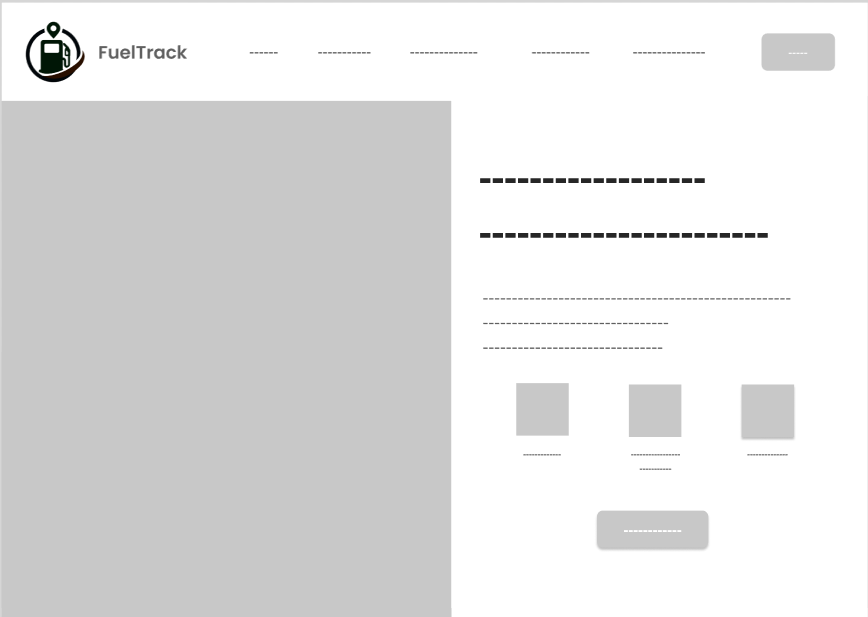

### Segunda Pantalla: Sobre Nosotros

Esta sección proporciona información general sobre **FuelTrack**, destacando lo que ofrece la empresa y sus características clave. El diseño busca crear una conexión con el usuario mediante un mensaje claro y conciso.  

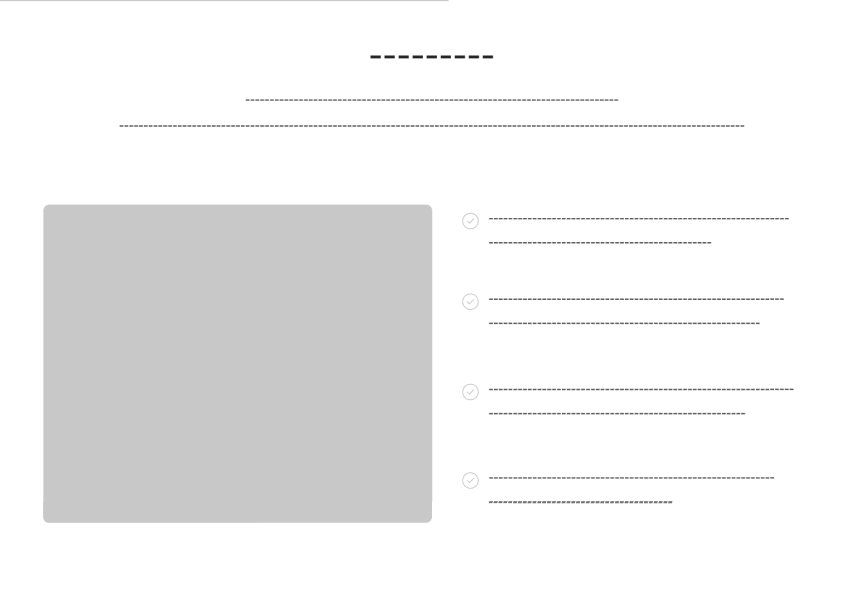

### Tercera Pantalla: ¿Qué Ofrecemos?

Aquí se detallan los principales servicios ofrecidos por FuelTrack. Se utilizan iconos o elementos visuales sencillos para resaltar las ventajas y características de cada servicio, con un botón de llamada a la acción para incentivar la interacción.  

### Cuarta Pantalla: Principales Proveedores

Se presenta una serie de **logos de los proveedores principales** de FuelTrack, distribuidos de forma ordenada para transmitir solidez y confiabilidad.  

### Quinta Pantalla: Nuestros Clientes

Sección dedicada a mostrar **testimonios de clientes**. Cada testimonio está acompañado por una imagen de perfil del cliente y una cita breve que refuerza la credibilidad de FuelTrack.  

### Sexta Pantalla: Invitación a Solicitantes de Combustible

En esta sección se invita a los usuarios a unirse a FuelTrack, proporcionando un espacio con una **llamada a la acción** clara para captar nuevos clientes interesados en solicitar combustible.

### Séptima Pantalla: Formulario de Contacto

Se incluye un formulario básico que permite a los usuarios realizar consultas o solicitudes. El formulario está compuesto por campos sencillos como **nombre**, **correo electrónico** y **mensaje**.  

### Pie de Página

En esta última sección se agrupan los enlaces de navegación adicionales, los **datos de contacto** y los **enlaces a redes sociales**, presentados de forma accesible y organizada para facilitar la interacción del usuario.  

## Nota

También se incluye la versión mobile correspondiente para cada sección mostrada, siguiendo el mismo orden y adaptándose a las dimensiones y experiencia de uso en dispositivos móviles.

Para una mejor visualización de los wireframe (versión desktop y mobile), se adjunta el siguiente enlace de Figma:  
[https://www.figma.com/design/Ikz9yUtR1XthBJ1ViO6gVc/LP-and-CTA?node-id=0-1&t=WJtigb6RJ2HtjPPw-1](https://www.figma.com/design/Ikz9yUtR1XthBJ1ViO6gVc/LP-and-CTA?node-id=0-1&t=WJtigb6RJ2HtjPPw-1)

### 4.3.2. Landing Page Mock-up

## PANTALLA 1

La primera pantalla presenta un encabezado claro con logo, menú de navegación y un botón de "Contact us" destacado, mostrando una jerarquía visual efectiva y buena arquitectura de información. La sección hero combina una imagen de trabajadores del sector industrial y un mensaje directo sobre la eficiencia en la gestión de pedidos de combustible. El primer call to action es visible y contrasta bien, guiando al usuario de forma intuitiva. Se aplican principios de alineamiento y énfasis para centrar la atención en la propuesta de valor.

## PANTALLA 2

Aquí se presenta la sección "About us" con un texto breve y claro que explica los objetivos de la empresa. Se complementa con una imagen de profesionales en reunión, que refuerza el mensaje de confianza y colaboración. Se utiliza la proximidad para agrupar visualmente la información importante y los íconos de bullet points facilitan la lectura rápida, manteniendo una estructura limpia y accesible.

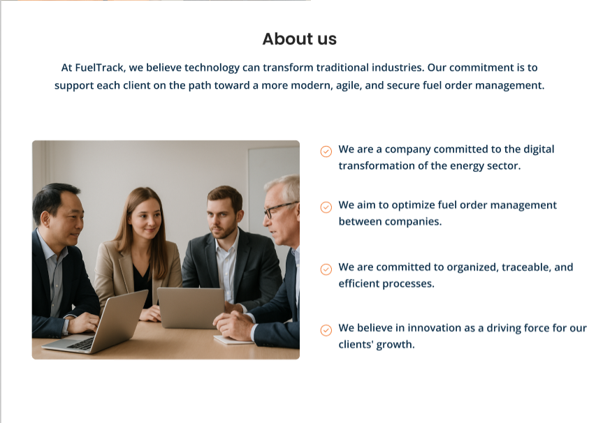

## PANTALLA 3

La sección "How it works?" muestra de manera sencilla los pasos del proceso mediante pestañas destacadas y un apoyo visual de un camión cisterna, reforzando la temática de la industria de combustibles. La arquitectura de la información facilita la comprensión del proceso paso a paso. Adicionalemnte se invita al usuario a ver un video explicativo para mayor comprensión.

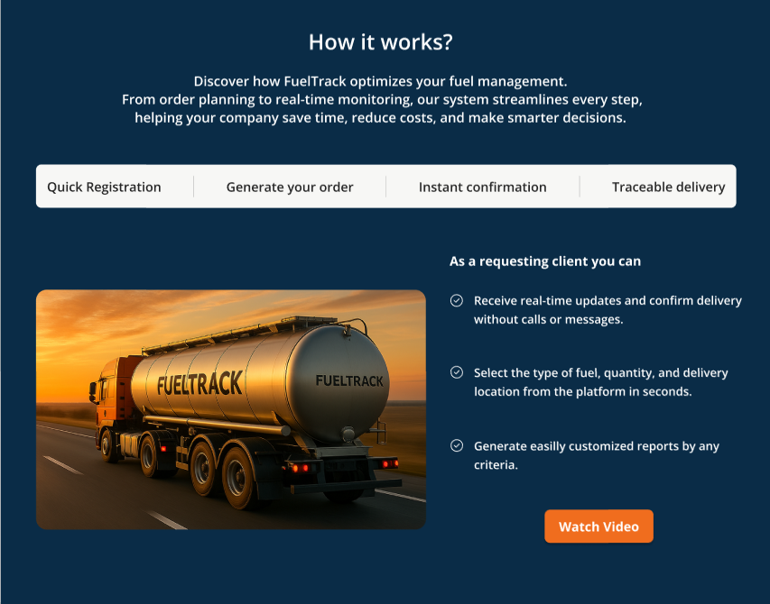

## PANTALLA 4

Se presentan los logotipos de los principales proveedores (REPSOL, Shell, BR, Exxon) en una sección limpia y espaciosa. El uso de espacio negativo permite que cada logo se distinga de manera clara, transmitiendo confianza mediante prueba social. El formato minimalista facilita una lectura rápida y genera credibilidad.

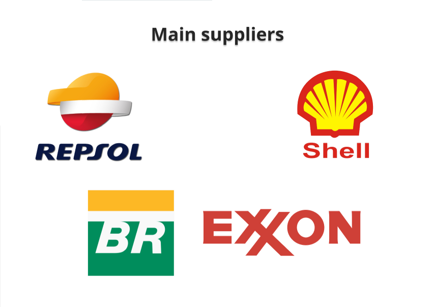

## PANTALLA 5

La sección "Our clients" muestra testimonios de clientes en tarjetas individuales, incluyendo imagen de la persona, nombre, y un breve comentario sobre su experiencia. El diseño aplica proximidad y alineación para facilitar la lectura, y las fotos aportan autenticidad y diversidad. Esto fortalece la credibilidad del servicio y conecta emocionalmente con el visitante.

## PANTALLA 6

En esta pantalla se invita a los solicitantes de combustible a unirse, usando una imagen de dos trabajadores estrechando la mano en señal de acuerdo. El mensaje es claro y profesional, reforzado por el diseño visual que destaca nuevamente un llamado a la acción. La jerarquía visual dirige la atención de inmediato hacia la invitación a registrarse.

## PANTALLA 7

Aquí se presenta un formulario de contacto sencillo bajo el título "Contact us", solicitando datos básicos como nombre, correo y mensaje. El formulario es de fácil acceso, y su diseño es limpio y funcional, pensado para una experiencia sin barreras. Esta sección se integra con el pie de página, que ofrece enlaces de navegación, redes sociales y el resumen corporativo de la empresa, cerrando la experiencia de navegación de manera coherente y accesible.

## Nota

También se incluye la versión mobile correspondiente para cada sección mostrada, siguiendo el mismo orden y adaptándose a las dimensiones y experiencia de uso en dispositivos móviles.

Para una mejor visualización de los mock up (versión desktop y mobile), se adjunta el siguiente enlace de Figma:  
[https://www.figma.com/design/Ikz9yUtR1XthBJ1ViO6gVc/LP-and-CTA?node-id=0-1&t=WJtigb6RJ2HtjPPw-1](https://www.figma.com/design/Ikz9yUtR1XthBJ1ViO6gVc/LP-and-CTA?node-id=0-1&t=WJtigb6RJ2HtjPPw-1)

## 4.4. Web Applications UX/UI Design
### 4.4.1. Web Applications Wireframes

### **Wireframes - Segmento Cliente**
- Descripción: Vista diseñada exclusivamente para mostrar las ordenes de la empresa solicitante. Para ello optamos por una grilla que muestra fácilmente los atributos de cada orden.

  

- Descripción: Para mostrar losdetalles de cada pedido, optamos por una vista desplegable en cada fila de la grilla. De esta forma, el usuario podrá observar los detalles de cada uno, como el producto solicitado, la cantidad y el monto total.

  

- Descripción: Para la creación del pedido, decidimos usar un modal que se muestra al hacer clic en el botón "Crear nuevo pedido". En este modal, el usuario podrá crear sus pedidos paso a paso con un  stepper implementado. El primer paso es llenar los detalles del nuevo pedido como el producto, cantidad, etc.

  

- Descripción: Para el segundo paso, usamos una lista desplegable de detalles, donde en cada uno de ellos el usuario podrá asignar información de pagos a cada detalle del pedido, como el monto, la cuenta bancaria y el número de operación, todo mediante un pequeño formulario.

  

- Descripción: Para el paso final, mostramos toda la información del pedido, incluyendo sus detalles y la información de los pagos. El usuario podrá revisar todo antes de confirmar el pedido.

### **Wireframes - Segmento Proveedor**
- Descripción: Esta vistafue diseñada para darle protagonismo a los pedidos y sus detalles meidante una grilla. Además, facilitamos la clasificación de los pedidos por estado a través de etiquetas ubicadas en la parte superior de la grilla que expone los pedidos.

  

- Descripción: En el segundo modulo de nuestro sistema, ubicamos una vistade conciliaciones que muestra una tabla con registros seleccionables. Aquí, la información principal es la de los pagos realizados a los pedidos. Para ello, el proveedor cuenta con un botón en la parte superior para subir una lista de movimientos de cuentas bancarias.

  

- Descripción: Diseñamos un modal muy sencillo que permite subir multiples archivos con movimientos de cuentas bancarias. Una vez subidos, el proveedor solo debe hacer click en el botón comparar y el sistema se encargará de hacer la conciliación con los pedidos realizados por los clientes.
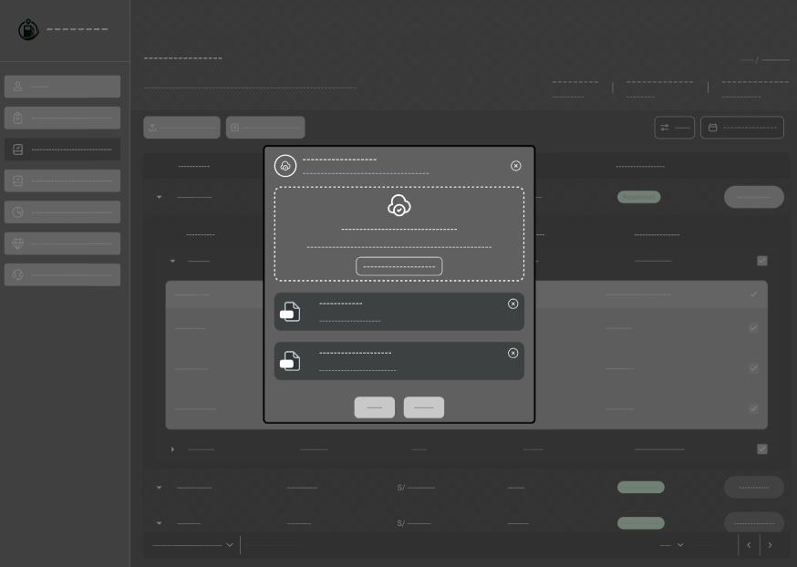
  

- Descripción: Para el utlimo modulo principal, presentamos la vista de Despacho. Aqui podremos configurar la información de despacho a través de un botón de configuración en cada fila de la grilla, que representa un pedido. Una vez con información válida de despacho, el pedido será marcado con un check, dando a entender al usuario que el pedido está listo para ser liberado. Para ayudar al usuario, también facilitamos chekcboxes para seleccionar los pedidos que se desean liberar, si es que son varios.

  

- Descripción: Al hacer click en el botón de configuración, se abrirá un modal donde el proveedor podrá llenar la información de despacho del pedido. El proveedor podrá seleccionar el vehiculo, el chofer y la cisterna que se utilizará para el despacho del pedido.

  

- Descripción: La tabla para asignar compartimientos a los detalles del pedido se desbloquea unavez que la información del transporte es validada. En esta tabla, el proveedor podrá asignar los compartimientos de la cisterna a cada detalle del pedido.
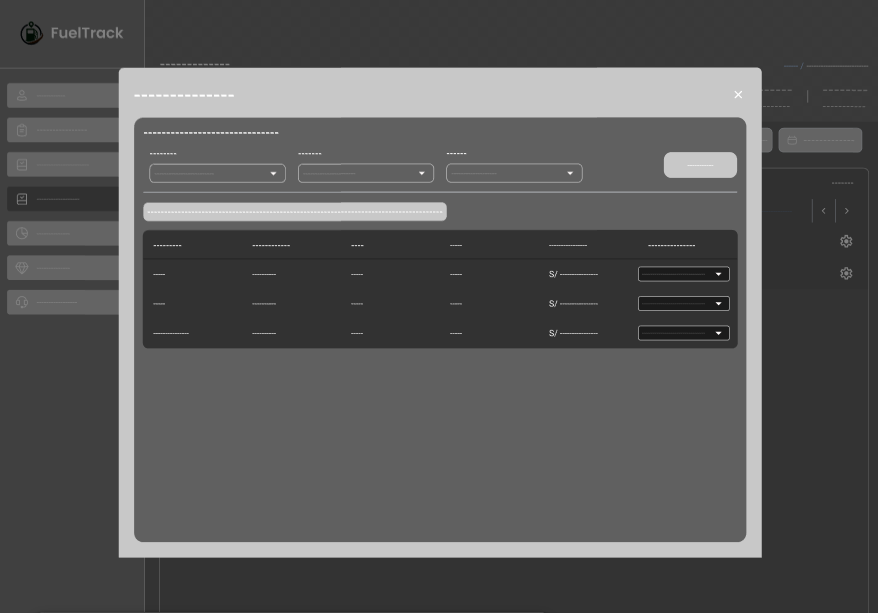
  

### 4.4.2. Web Applications Wireflow Diagrams

### **Wireflow 1**
- User Persona: Solicitante de combustible
- User Goal: Como solicitante de combustible, deseo registrar un nuevo pedido de combustible. Para ello, debo llenar la información del pedido y los detalles de pago.

### **Wireflow 2**
- User Persona: Solicitante de combustible
- User Goal: Como solicitante de combustible, quiero poder visualizar la información de mis pedidos organizada en dashboards.

### **Wireflow 3**
- User Persona: Proveedor de combustible
- User Goal: Como proveedor de combustible, deseo gestionar los pedidos, iniciando por la conciliación de los pagos. Para ello, debo subir una lista de movimientos de cuentas bancarias y el sistema se encargará de hacer la conciliación con los pedidos realizados por los clientes.

### **Wireflow 4**
- User Persona: Proveedor de combustible
- User Goal: Como proveedor de combustible, debo liberar los pedidos para su despacho. Para ello, debo seleccionar pedidos que tengan información de despacho válida, como placa de vehículo, cisterna y chofer.
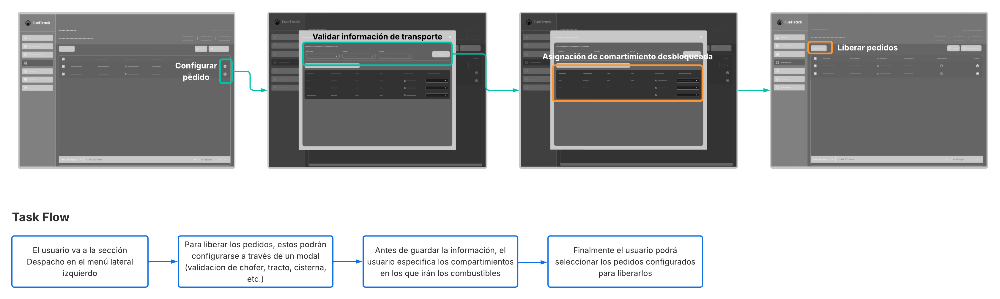

### **Wireflow 5**
- User Persona: Proveedor de combustible | Solicitante de combustible
- User Goal: Como proveedor y solicitante de combustible, debo ser capaz de aplicar filtros a mis pedidos por diferentes criterios y ordenarlos por diferentes atributos.

### 4.4.3. Web Applications Mock-ups
---

- Objetivo: Vista general de las ordenes de la empresa solicitante, donde se puede ver el estado de cada pedido y la opción de crear un nuevo pedido.
---

- Objetivo: Desplegamos cada pedido para observar los detalles de cada uno, como el producto solicitado, la cantidad y el monto total.
---

- Objetivo: Mostramos el modal para registrar un nuevo pedido, donde el usuario puede especificar los detalles del nuevo pedido como el producto, cantidad, etc.
---

- Objetivo: En el segundo paso del registro de un nuevo pedido, el usuario puede asignar información de pagos a cada detalle del pedido, como el monto, la cuenta bancaria y el número de operación.
---
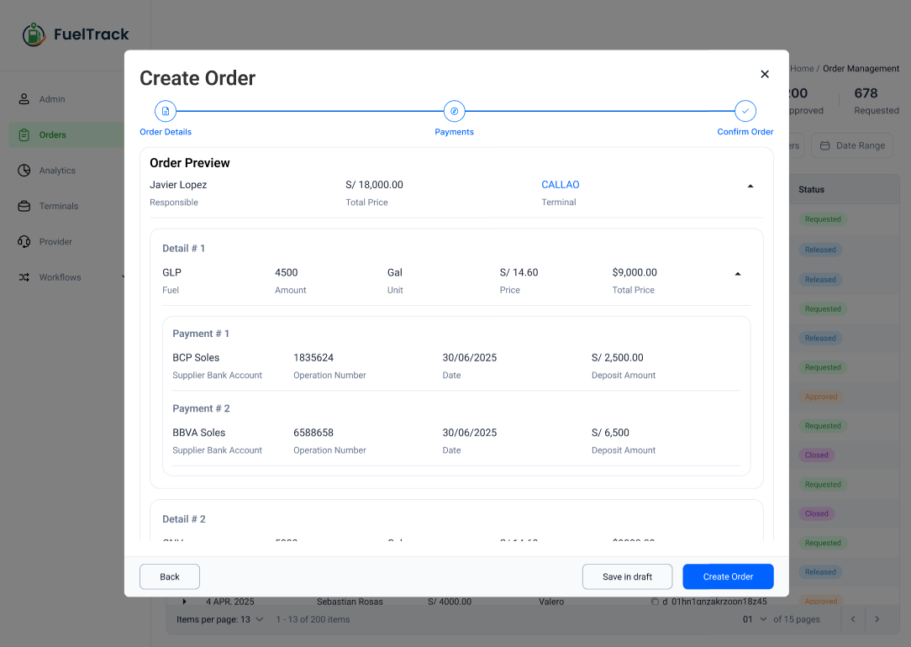
- Objetivo: Finalmente mostraremos la vista previa de todo el pedido, donde el usuario puede revisar todos los detalles antes de confirmar el pedido.
---

- Objetivo: Vista general de las ordenes de los clientes del proveedor, donde se puede ver el estado de cada pedido y observar los detalles de cada uno. Es posible filtrar por estado de pedido, cliente o fecha.
---

- Objetivo: Mostramos una vista para conciliaciones. Es decir, podremos subir una lista de movimientos de cuentas bancarias y el sistema se encargará de hacer la conciliación con los pedidos realizados por los clientes.
---

- Objetivo: Mostramos el modal para subir los archivos de los movimientos. Una vez hechas las conciliaciones, el sistema pasará el pedido a la siguiente fase: Aprobación.
---

- Objetivo: Vista de despacho. En esta vista los pedidos deberán ser liberados. Para ello, el proveedor deberá seleccionar pedidos que tengan información de despacho válida, como placa de vehículo, cisterna, y chofer
---

- Objetivo: Mostramos el modal para llenar la información de despacho del pedido. El proveedor podrá seleccionar el vehiculo, el chofer y la cisterna que se utilizará para el despacho del pedido. Para su confirmación, el sistema deberpa validar esta información evaluando su disponibilidad. Hasta no llenarse, no podremos asignar compartimientos a los detalles del pedido.
---

- Objetivo: Con la información del transporte validada, podremos asignar los compartimientos de la cisterna a cada detalle del pedido.
---
### 4.4.4. Web Applications User Flow Diagrams

### **Userflow 1**
- User Persona: Solicitante de combustible
- User Goal: Como solicitante de combustible, deseo registrar un nuevo pedido de combustible. Para ello, debo llenar la información del pedido y los detalles de pago.
- Happy Paths:
    - El sistema muestra un mensaje indicando que el pedido fue creado exitosamente.
    - El sistema guarda automáticamente la información del registro en un borrador que también puede realizar el usuario manualmente.
- Unhappy Paths:
    - El sistema muestra un mensaje indicando que el pedido no fue registrado.

### **Userflow 2**
- User Persona: Proveedor de combustible
- User Goal: Como proveedor de combustible, deseo gestionar los pedidos, iniciando por la conciliación de los pagos. Para ello, debo subir una lista de movimientos de cuentas bancarias y el sistema se encargará de hacer la conciliación con los pedidos realizados por los clientes.
- Happy Paths:
    - El sistema habilita la selección automáticamente los pedidos cuyos depósitos coinciden con el estado de cuenta del proveedor.
- Unhappy Paths:
    - El sistema muestra un listado de pedidos si no se encuentra pagos para ciertos pedidos con una antigüedad específica.

### **Userflow 3**
- User Persona: Proveedor de combustible
- User Goal: Como proveedor de combustible, debo liberar los pedidos para su despacho. Para ello, debo seleccionar pedidos que tengan información de despacho válida, como placa de vehículo, cisterna y chofer.
- Happy Paths:
    - El sistema muestra un mensaje indicando que el transporte es válido para el pedido.
    - El sistema desbloquea la tabla de asignación de compartimientos.
- Unhappy Paths:
    - El sistema muestra un mensaje indicando la indisponibilidad de transporte, cisterna o chofer.

## 4.5. Web Applications Prototyping

#### Desktop Web Application ####

Link: https://upcedupe-my.sharepoint.com/:v:/g/personal/u202310129_upc_edu_pe/Edy1alDH_alNlZjFMNxoDc8BBoMO6nXS4bQS2VoDvZNCXw?e=koelSR&nav=eyJyZWZlcnJhbEluZm8iOnsicmVmZXJyYWxBcHAiOiJTdHJlYW1XZWJBcHAiLCJyZWZlcnJhbFZpZXciOiJTaGFyZURpYWxvZy1MaW5rIiwicmVmZXJyYWxBcHBQbGF0Zm9ybSI6IldlYiIsInJlZmVycmFsTW9kZSI6InZpZXcifX0%3D

#### Mobile Web Application ####

Link: https://upcedupe-my.sharepoint.com/:v:/g/personal/u202310129_upc_edu_pe/ERIXuDHFrCZFr14xw48-U18BI1lKdcBvtNsYy7u5GATkqw?e=Qw4caQ&nav=eyJyZWZlcnJhbEluZm8iOnsicmVmZXJyYWxBcHAiOiJTdHJlYW1XZWJBcHAiLCJyZWZlcnJhbFZpZXciOiJTaGFyZURpYWxvZy1MaW5rIiwicmVmZXJyYWxBcHBQbGF0Zm9ybSI6IldlYiIsInJlZmVycmFsTW9kZSI6InZpZXcifX0%3D
## 4.6. Domain-Driven Software Architecture
Esta sección expone la arquitectura de software orientada al dominio, una metodología que enfoca el diseño y desarrollo del sistema en el conocimiento profundo del entorno de negocio. Este enfoque busca lograr una mayor coherencia entre el software y los procesos empresariales, promoviendo una comunicación más efectiva entre los desarrolladores y los especialistas del dominio. Seguidamente, se describen los distintos diagramas y contextos delimitados que estructuran la arquitectura del proyecto.

### 4.6.1. Software Architecture Context Diagram
El diagrama de contexto del sistema muestra la relación entre el sistema y los actores externos, proporcionando una visión general de la arquitectura del sistema y sus interacciones con el entorno externo.

### 4.6.2. Software Architecture Container Diagrams
Los diagramas de contenedores representan los distintos elementos que conforman el sistema, como aplicaciones web, bases de datos o microservicios, y muestran cómo se relacionan entre ellos. Ofrecen una perspectiva general de la arquitectura, resaltando las funciones de cada contenedor y la forma en que interactúan.

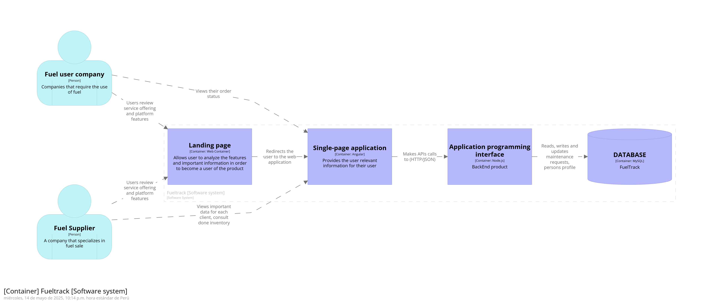

### 4.6.3. Software Architecture Components Diagrams
En esta sección, se presentan los diagramas de componentes de la arquitectura de software. Estos diagramas detallan los diferentes componentes que conforman el sistema, sus responsabilidades y cómo interactúan entre sí.

#### Bounded Context: Analytics

Este bounded context contiene todo lo relacionado al control y seguimiento de los pedidos, asimismo como el estados de los pedidos

#### Bounded Context: Control

Este bounded context separa todo lo relacionado con el control de producto que en este caso es combustible de los diferentes proveedores, por lo que el feature de inventario de los proveedores está considerado dentro de este bounded context.

#### Bounded Context: Planning

Este bounded context sirve para alojar el feature de ordenes que se realicen, este feature requiere de instrucciones y analisis de recursos por lo cual está alojado dentro de este bounded context.

#### Bounded Context: Sales

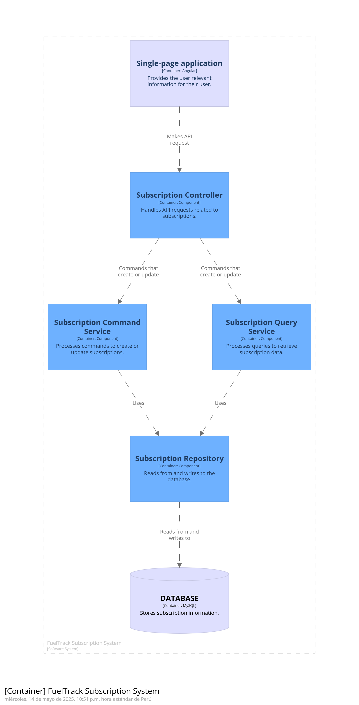

Dentro de este bounded context se alojará nuestro sistema de suscripción el cual seria la principal fuente de ingresos, donde tanto los solicitantes como los proveedores tendran que estar suscritos a nuestra pagina web

## 4.7. Software Object-Oriented Design
### 4.7.1. Class Diagrams

#### Inventory

Este diagrama de clases modela la estructura del sistema de inventario de FuelTrack. La clase InventoryItem representa cada unidad o tipo de combustible almacenado, incluyendo atributos como cantidad, tipo y ubicación. La clase InventoryRepository actúa como capa de acceso a datos, permitiendo operaciones de consulta, almacenamiento y actualización de los items en la base de datos. Por su parte, InventoryService encapsula la lógica de negocio del sistema, gestionando operaciones como validación de stock, actualización de cantidades y coordinación con otros módulos del sistema. Las relaciones entre estas clases reflejan una arquitectura basada en responsabilidades separadas, facilitando el mantenimiento, la escalabilidad y las pruebas del sistema.

#### Order

Este diagrama de clases representa la estructura del módulo de gestión de pedidos en FuelTrack. La clase OrderDetails almacena la información principal de cada pedido, incluyendo datos como el cliente solicitante, el tipo y la cantidad de combustible, así como la fecha y estado del pedido. La clase OrderPayment gestiona los aspectos relacionados al pago del pedido, como el monto, el método de pago y la validación del mismo. Finalmente, OrderService actúa como la capa de lógica de negocio, orquestando la creación de pedidos, el procesamiento de pagos y la validación de reglas del sistema. Las relaciones entre estas clases reflejan una arquitectura bien definida, que permite una gestión eficiente y controlada del ciclo completo de una orden, desde su creación hasta su confirmación y pago.

### 4.7.2. Class Dictionary
### Clase: deliveries

Descripción: Registra la información de las entregas de pedidos.
- id (int, PK)
- delivery_at (datetime2)
- received_by (varchar)
- location (varchar)
- orders_id (int, FK)
- transports_id (int, FK)

### Clase: orders

Descripción: Gestiona los pedidos realizados por los clientes.
- id (int, PK)
- unit (varchar)
- price (decimal)
- quantity (decimal)
- status (varchar)
- request_at (datetime2)
- users_id (int, FK)

### Clase: monitoring

Descripción: Lleva el control de actualizaciones del estado de los pedidos.
- id (int, PK)
- status_update (varchar)
- time (datetime2)
- orders_id (int, FK)

### Clase: clients

Descripción: Almacena la información de los clientes.
- id (int, PK)
- name (varchar)
- address (varchar)
- contact (varchar)

### Clase: suppliers

Descripción: Contiene los datos de los proveedores.
- id (int, PK)
- name (varchar)
- ruc (varchar)
- address (varchar)
- contact (varchar)

### Class: clients_users
Descripcion: Relación de datos entre las clases clientes y usuarios
- id (int, PK)
- clients_id (int, FK)
- users_id (int, FK)

### Class: suppliers_users
Descripcion: Relación de datos entre las clases proveedores y usuarios
- id (int, PK)
- suppliers_id (int, FK)
- users_id (int, FK)

### Clase: inventory

Descripción: Administra el inventario de combustibles.
- id (int, PK)
- fuel_type (varchar)
- available_qt (decimal)
- last_update (datetime2)
- suppliers_id (int, FK)

### Clase: transactions

Descripción: Registra las transacciones de pagos de pedidos.
- id (int, PK)
- amount (decimal)
- method (varchar)
- operation_n (int)
- status (varchar)
- processed_at (datetime2)
- orders_id (int, FK)

### Clase: users

Descripción: Guarda la información de los usuarios que acceden al sistema.
- id (int, PK)
- name (varchar)
- email (varchar)
- password_hash (varchar)
- created_at (datetime2)
- profiles_id (int, FK)

### Clase: notifications

Descripción: Administra las notificaciones enviadas a los usuarios.
- id (int, PK)
- message (text)
- already_read (bit)
- created_at (datetime2)
- users_id (int, FK)
- orders_id (int, FK)

### Clase: profiles

Descripción: Define los perfiles de usuario y sus permisos.
- id (int, PK)
- permissions (text)
- rol (varchar)

### Clase: transports

Descripción: Contiene los datos de los transportes encargados del pedido
- id (int, PK)
- plate (varchar)
- driver (varchar)
- tank (varchar)

## 4.8. Database Design
### 4.8.1. Database Diagram

# 5.1. Software Configuration Management
## 5.1.1. Software Development Environment Configuration

### Project Management
- **WhatsApp**: Aplicación de mensajería instantánea propiedad de Meta, utilizada para coordinar tareas del equipo, facilitar el intercambio de ideas y brindar soporte continuo durante el desarrollo del proyecto.
- **Google Meet**: Herramienta de videoconferencias de Google empleada para mantener una comunicación verbal y directa, permitiendo la planificación colaborativa de actividades y la toma de decisiones en tiempo real.
- **Google Drive**: Servicio de almacenamiento en la nube que facilita el intercambio de archivos de gran tamaño e información relevante entre los miembros del equipo.
- **Notion**: Plataforma utilizada para la organización, asignación y seguimiento de tareas, centralizando la gestión de actividades y documentación del proyecto.

### Requirements Management
- **UXPressia**: Herramienta utilizada para la elaboración de User Personas, User Journey Maps e Impact Maps, lo que permite comprender mejor las necesidades de los usuarios y definir funcionalidades centradas en ellos.
- **Zoom**: Aplicación empleada para la realización de entrevistas a potenciales usuarios, facilitando la recopilación de información valiosa para la definición y validación de requisitos.

### Product UX/UI Design
- **Figma**: Plataforma colaborativa utilizada para el diseño de wireframes, wireflows, mockups y prototipos interactivos, garantizando una visión clara y alineada de la interfaz del producto.

### Software Development
- **Vertabelo**: Herramienta empleada para el diseño del modelo de base de datos, permitiendo una representación visual y estructurada de las entidades y sus relaciones.
- **Google Chrome**: Navegador utilizado para la ejecución de pruebas de visualización y funcionalidad de la landing page y el frontend, asegurando su correcto comportamiento en entornos reales.
- **JetBrains WebStorm**: Entorno de desarrollo integrado empleado para la implementación del frontend de la aplicación.
- **JetBrains IntelliJ IDEA**: Entorno de desarrollo integrado utilizado para la implementación y gestión del backend de la aplicación.

### Software Deployment
- **GitHub Pages**: Servicio de hosting utilizado para el despliegue de la landing page del proyecto.

### Software Documentation
- **Google Docs**: Herramienta de edición colaborativa utilizada para documentar de manera detallada informes, decisiones y avances del proyecto.
- **Structurizr**: Plataforma empleada para la creación de diagramas C4, permitiendo representar visualmente la arquitectura del software en distintos niveles de abstracción.
- **GitHub**: Plataforma utilizada para la gestión de repositorios de código y documentación del proyecto, incluyendo la landing page, el frontend, el backend y los documentos técnicos, facilitando el trabajo colaborativo y el control de versiones.

### Gestión de Versiones con Git y GitFlow

En el proyecto, utilizamos GitHub como repositorio central para gestionar y estructurar los avances del desarrollo. Para mantener un flujo de trabajo organizado, colaborativo y seguro, aplicamos el modelo de trabajo **GitFlow**, propuesto por Vincent Driessen. Este modelo nos permite gestionar versiones, trabajar en paralelo y mantener el control sobre cada fase del desarrollo.

#### Estructura de ramas utilizada

- **`main`**: Contiene la versión estable del sistema en producción. Solo se actualiza tras haber pasado por pruebas en otras ramas.
- **`develop`**: Rama principal de integración donde se concentran las funcionalidades antes de pasar a producción.
- **`feature/*`**: Ramas creadas desde `develop` para trabajar en funcionalidades específicas.  
  Ejemplos: `feature/login`, `feature/perfil-usuario`, `feature/ajuste-filtro`.
- **`release/*`**: Ramas creadas antes de una entrega importante para realizar pruebas finales, ajustes y validaciones.  
  Ejemplo: `release/v1.0.0`.
- **`hotfix/*`**: Ramas creadas desde `main` para solucionar errores críticos en producción de forma inmediata.  
  Ejemplo: `hotfix/arreglo-footer`.

#### Flujo de trabajo aplicado

1. Cada nueva funcionalidad se desarrolla en una rama `feature/nombre-funcionalidad` a partir de `develop`.
2. Al finalizar, se realiza un Pull Request para fusionarla nuevamente en `develop`, previa revisión.
3. Antes de cada entrega oficial, se crea una rama `release/` desde `develop` para realizar pruebas finales.
4. Una vez validada, la `release/` se fusiona a `main` (producción) y a `develop` (para mantener consistencia).
5. En caso de errores críticos detectados en producción, se crea una rama `hotfix/` desde `main`, se corrige, y se hace merge a `main` y `develop`.

#### Uso de Conventional Commits

Empleamos el estándar de **Conventional Commits** para mantener un historial claro y comprensible. Este formato permite identificar rápidamente el tipo de cambio realizado (funcionalidad, corrección, refactorización, etc.), facilitando la trazabilidad y automatización del proyecto.

Ejemplo:
- `feat: agregar formulario de registro`
- `fix: corregir error de navegación en el login`

#### Evidencia del uso de GitFlow

Durante el desarrollo se ha aplicado GitFlow de forma progresiva en todos los repositorios. El historial de ramas, commits y Pull Requests puede verificarse directamente en la pestaña de ramas y solicitudes de extracción del repositorio. Esta implementación ha permitido un trabajo más ordenado, seguro y colaborativo entre todos los integrantes del equipo.

## 5.1.3. Source Code Style Guide & Conventions
Nuestro equipo adoptó las siguientes convenciones y guías de estilo para garantizar un código fuente coherente, legible y mantenible en los diferentes lenguajes y tecnologías utilizados en nuestra solución. Estas prácticas permiten una colaboración eficiente entre desarrolladores, reducen la deuda técnica y facilitan la escalabilidad de la plataforma.

**HTML:**

Seguimos las convenciones descritas en la guía oficial HTML Style Guide and Coding Conventions para fomentar una estructura limpia, semántica y predecible:

- Usar nombres de elementos en minúsculas.
- Cerrar todos los elementos HTML, incluso los que son opcionales.
- Usar nombres de atributos en minúsculas.
- Incluir siempre los atributos requeridos en elementos clave, especialmente en imágenes (alt) y formularios (name, id, etc.).
- Evitar líneas de código largas para mejorar la legibilidad.
- Utilizar sintaxis simplificada y estándar para hojas de estilo (link) y scripts externos (script).

**CSS:**

Aplicamos las siguientes convenciones para lograr un estilo consistente, ordenado y fácil de mantener:

- Usar minúsculas y guiones para los nombres de clases y selectores.
- Escribir un espacio después de los dos puntos y cerrar cada declaración con punto y coma.
- Agrupar reglas CSS relacionadas y separarlas con una línea en blanco para mejorar la claridad visual.
- Utilizar nombres de clases descriptivos, que reflejen la función o apariencia del elemento.
- Organizar el CSS por bloques lógicos o módulos.

**JavaScript:**

Definimos las siguientes convenciones para asegurar un código robusto, eficiente y comprensible:

- Declarar las variables al inicio del ámbito correspondiente, evitando la redeclaración innecesaria.
- Preferir el uso de const y let en lugar de var para controlar mejor el ámbito y la mutabilidad de las variables.
- Incluir comentarios descriptivos para explicar la funcionalidad de componentes, servicios, validaciones y lógica compleja.
- Mantener las funciones pequeñas y con una única responsabilidad.
- Aplicar principios de programación funcional y reactiva, así como patrones de diseño adecuados.

## 5.1.4. Software Deployment Configuration
#### Entorno de Desarrollo

Tecnologías utilizadas:

- HTML5
- CSS3
- Angular

Gestor de paquetes:

- npm para Angular

#### Estrategia de Deployment

- GitHub Pages
- Repositorio principal en GitHub

Flujo Gitflow:

- main: rama principal de producción
- develop: rama de integración principal
- feature/*: desarrollo de nuevas funcionalidades sobre develop
- Pull Requests se realizan desde feature/* hacia develop

# 5.2. Landing Page, Services & Applications Implementation
## 5.2.1. Sprint 1
En este primer sprint se desarrolló el landing page.

### 5.2.1.1. Sprint Planning 1
<table>
    <tr align="center">
        <td><strong>Sprint #</strong></td>
        <td><strong>Sprint 1</strong></td>
    </tr>
    <tr>
        <td colspan="2" align="center"><strong>Sprint Planning Background</strong></td>
    </tr>
    <tr align="center">
        <td>Date</td>
        <td>10/04/2025</td>
    </tr>
    <tr align="center">
        <td>Time</td>
        <td>11:00 PM</td>
    </tr>
    <tr align="center">
        <td>Location</td>
        <td>Meet</td>
    </tr>
    <tr align="center">
        <td>Prepared by</td>
        <td>Manuel Sanchez</td>
    </tr>
    <tr align="center">
        <td>Attendess (to planning meeting)</td>
        <td>
          Manuel Angel Sanchez Arenas - U201817507 
          Adrián Emanuel Valerio Garcia - U202210334 
          Luciana Carolina Choquehuanca Nuñez - U202319431 
          César Augusto Navarro Correa - U202310129 
          Franz Jair La Torre Valle - U202012378 
          Frezzia Eldaa Isabel Espinoza Paredes - U815121
        </td>
    </tr>
    <tr align="center">
        <td>Sprint 0 Review Summary</td>
        <td>No hubo sprint previo</td>
    </tr>
    <tr align="center">
        <td>Sprint 0 Retrospective Summary</td>
        <td>No hubo sprint previo</td>
    </tr>
    <tr>
        <td colspan="2" align="center"><strong>Sprint Goal & User Stories</strong></td>
    </tr>
    <tr align="center">
        <td>Sprint 1 Goal</td>
        <td>Desarrollar una landing page funcional y visualmente clara que comunique efectivamente la propuesta de valor de FuelTrack a nuestros dos segmentos clave de usuarios: proveedores de combustible y solicitantes de combustible. La página debe incluir secciones estratégicas como: 
•	Home, con un call to action para captar proveedores interesados. 
•	Are you a fuel requester?, con un call to action dirigido a potenciales solicitantes. 
•	Secciones informativas como About Us y How it works?, para explicar el funcionamiento del sistema. 
•	Secciones de validación social como Main Suppliers y Our Clients, para generar confianza mostrando empresas reales que ya usan el servicio. 
•	Una sección de contacto directo (Contact Us) para atención inmediata. 
•	Soporte de idioma bilingüe (español e inglés) para mayor accesibilidad.
</td>
    </tr>
    <tr align="center">
        <td>Sprint 1 Velocity</td>
        <td>12</td>
    </tr>
    <tr align="center">
        <td>Sum of Story Point</td>
        <td>22</td>
    </tr>
</table>

### 5.2.1.2. Aspect Leaders and Collaborators

| Team Member                                 | GitHub Username    | Landing Page  | Documentation  |
|---------------------------------------------|--------------------|---------------|----------------|
| Manuel Angel Sanchez Arenas                 | manuels7a          | C             | C              |
| Adrián Emanuel Valerio Garcia               | adrianvalerio      | C             | C              |
| Luciana Carolina Choquehuanca Nuñez         | Lucianxaaa         | C             | L              |
| César Augusto Navarro Correa                | csr555-ui          | L             | C              |
| Franz Jair La Torre Valle                   | FranzJairLTV       | C             | C              |
| Frezzia Eldaa Isabel Espinoza Paredes       | fflushh            | C             | C              |

### 5.2.1.3. Sprint Backlog 1
<table>
    <tr align="center">
        <td colspan="2"><strong>Sprint #</strong></td>
        <td colspan="6"><strong>Sprint 1</strong></td>
    </tr>
    <tr align="center">
        <td colspan="2"><strong>User Story</strong></td>
        <td colspan="6"><strong>Work-Item / Task</strong></td>
    </tr>
    <tr align="center">
        <td><strong>Id</strong></td>
        <td><strong>Title</strong></td>
        <td><strong>Id</strong></td>
        <td><strong>Title</strong></td>
        <td><strong>Description</strong></td>
        <td><strong>Estimation (Hours)</strong></td>
        <td><strong>Assigned to</strong></td>
        <td><strong>Status (To do / In process / To review / Done)</strong></td>
    </tr>
    <tr align="center">
        <td>US-01</td>
        <td>Ver sección Home</td>
        <td>W-01</td>
        <td>Sección Home</td>
        <td>Como visitante (proveedor), quiero ver una sección de inicio que resuma el valor de FuelTrack para comprender rápidamente el objetivo del sistema</td>
        <td>5 horas</td>
        <td>Frezzia</td>
        <td>Done</td>
    </tr>
    <tr align="center">
        <td>US-02</td>
        <td>Ver sección About Us</td>
        <td>W-02</td>
        <td>Sección About Us</td>
        <td>Como visitante de ambos segmentos, quiero conocer quiénes están detrás de FuelTrack para confiar en el sistema</td>
        <td>4 horas</td>
        <td>Franz</td>
        <td>Done</td>
    </tr>
    <tr align="center">
        <td>US-03</td>
        <td>Ver sección How it Works?</td>
        <td>W-03</td>
        <td>Sección How it works?</td>
        <td>Como visitante de ambos segmentos, quiero entender cómo funciona FuelTrack paso a paso para evaluar si se ajusta a mis necesidades</td>
        <td>5 horas</td>
        <td>César</td>
        <td>Done</td>
    </tr>
    <tr align="center">
        <td>US-41</td>
        <td>Ver sección Main Suppliers</td>
        <td>W-04</td>
        <td>Sección Main Suppliers</td>
        <td>Como visitante de ambos segmentos, quiero conocer los principales proveedores de combustible que trabajan con FuelTrack para confiar en la plataforma</td>
        <td>4 horas</td>
        <td>Luciana</td>
        <td>Done</td>
    </tr>
    <tr align="center">
        <td>US-42</td>
        <td>Ver sección Our Clients</td>
        <td>W-05</td>
        <td>Sección Our Clients</td>
        <td>Como visitante de ambos segmentos, quiero conocer a las empresas que utilizan FuelTrack para tener confianza en la plataforma y saber que otras empresas ya la están usando</td>
        <td>6 horas</td>
        <td>Frezzia</td>
        <td>Done</td>
    </tr>
    <tr align="center">
        <td>US-04</td>
        <td>Enviar mensaje de contacto</td>
        <td>W-06</td>
        <td>Contacto</td>
        <td>Como visitante de ambos segmentos, quiero enviar un mensaje desde Contact Us para solicitar más información</td>
        <td>5 horas</td>
        <td>Adrián</td>
        <td>In Process</td>
    </tr>
    <tr align="center">
        <td>US-43</td>
        <td>Ver sección Are You A Fuel Requester?</td>
        <td>W-07</td>
        <td>Are You A Fuel Requester?</td>
        <td>Como visitante (solicitante), quiero saber si cumplo con los requisitos de solicitante de combustible para poder iniciar un proceso de registro o solicitud</td>
        <td>6 horas</td>
        <td>Manuel</td>
        <td>Done</td>
    </tr>
    <tr align="center">
        <td>US-44</td>
        <td>Cambiar idioma</td>
        <td>W-08</td>
        <td>Idioma</td>
        <td>Como visitante de ambos segmentos, quiero poder cambiar entre inglés y español para entender la plataforma en mi idioma preferido</td>
        <td>8 horas</td>
        <td>César</td>
        <td>In Process</td>
    </tr>
</table>

### 5.2.1.4. Development Evidence for Sprint Review
Durante el Sprint 1, el equipo de desarrollo de FuelTrack avanzó en la construcción de la Landing Page, cumpliendo con las User Stories priorizadas. Se trabajó en la maquetación de las secciones principales, implementación de estilos CSS, diseño responsive para diferentes dispositivos y subida de los cambios al repositorio grupal. Los commits fueron realizados en ramas feature/ y luego integrados a la rama develop mediante Pull Requests.

<table border="1" cellspacing="0" cellpadding="6">
  <thead>
    <tr>
      <th>Repositorio</th>
      <th>Rama</th>
      <th>ID de Commit</th>
      <th>Mensaje de Commit</th>
      <th>Descripción del Commit</th>
      <th>Fecha de Commit</th>
    </tr>
  </thead>
<tbody>
  <tr><td>1ASI0730-2510-4374-G4-FuelTrack/landing-page</td><td>main</td>
  <td>9182d59</td>
  <td>First version of landing page</td>
  <td>-</td>
  <td>27/04/2025</td></tr>
  <tr><td>1ASI0730-2510-4374-G4-FuelTrack/landing-page</td><td>main</td>
  <td>9182d59</td>
  <td>fix(landing page): feat update navbar</td>
  <td>-</td>
  <td>27/04/2025</td></tr>
</tbody>

</table>

### 5.2.1.5. Execution Evidence for Sprint Review
En el sprint 1 se diseñó el primer modelo de la landing page. Esta cuenta con diferentes secciones para acceso de los usuarios. Algunas evidencias son:
- **Home:** Presenta de manera rápida el propósito y valor de FuelTrack para captar la atención del visitante.

- **About Us:** Explica quiénes somos y nuestra misión para generar confianza.

- **How it works?:** Describe de forma sencilla y visual el funcionamiento de FuelTrack paso a paso.

- **Our Clients:** Muestra algunas de las empresas o usuarios que confían en FuelTrack como referencia de credibilidad.

- **Join:** Invita a nuevos usuarios o empresas a registrarse o solicitar información para unirse a FuelTrack.

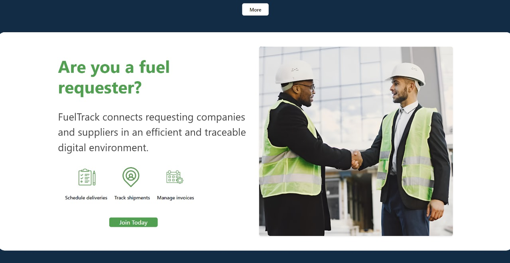
- **Contact Us:** Ofrece un formulario y datos de contacto directo para resolver dudas o solicitar soporte.

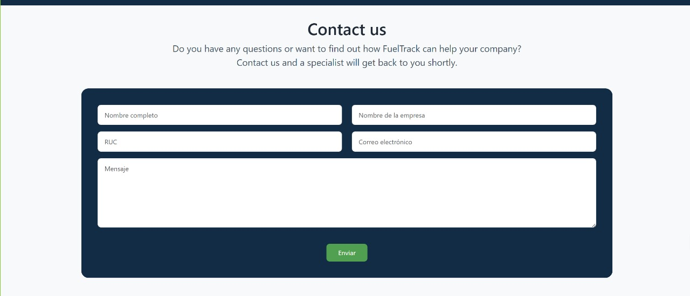
- **Footer:** Contiene información adicional como redes sociales y enlaces de interés.

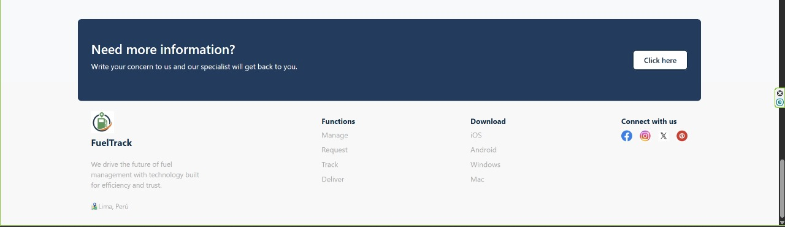

### 5.2.1.6. Services Documentation Evidence for Sprint Review
Durante el Sprint 1, el equipo se enfocó en el desarrollo del Landing Page de FuelTrack, por lo cual no se implementaron ni documentaron endpoints relacionados a Web Services. Los trabajos de desarrollo backend, integración de API y documentación con OpenAPI están planificados para Sprints posteriores.

### 5.2.1.7. Software Deployment Evidence for Sprint Review
Durante este Sprint, nos enfocamos en asegurar un proceso de Deployment eficiente y efectivo, tanto para nuestra aplicación principal como para la Landing Page asociada y los Web Services que soportan la infraestructura de la aplicación. Este enfoque no solo buscó mejorar la experiencia de usuario final, sino también optimizar nuestro flujo de trabajo de desarrollo y despliegue continuo.

**Link:** 

### 5.2.1.8. Team Collaboration Insights during Sprint
Dividimos las tareas según las secciones acordadas durante las reuniones de planificación, ello nos permitió trabajar de manera eficiente y centrarnos en áreas específicas para optimizar el tiempo y los recursos. Dicha participación de los miembros del equipo se ve reflejado en los commits realizados en el repositorio de trabajo.

## 5.2.2. Sprint 2
En este segundo sprint se desarrollo el frontend para nuestra pagina web

### 5.2.2.1. Sprint Planning 2
En esta siguiente etapa de proyecto, nuestra principal objetivo sera desarrollar el frontend de nuestra pagina web mediante WebStorm como nuestro entorno de desarrollo

Repositorio Github: https://github.com/1ASI0729-2510-4317-G4-FuelTrack/FuelTrack-front-end

<table>
    <tr align="center">
        <td><strong>Sprint #</strong></td>
        <td><strong>Sprint 2</strong></td>
    </tr>
    <tr>
        <td colspan="2" align="center"><strong>Sprint Planning Background</strong></td>
    </tr>
    <tr align="center">
        <td>Date</td>
        <td>8/05/2025</td>
    </tr>
    <tr align="center">
        <td>Time</td>
        <td>8:00 PM</td>
    </tr>
    <tr align="center">
        <td>Location</td>
        <td>Discord</td>
    </tr>
    <tr align="center">
        <td>Prepared by</td>
        <td>Adrian Emanuel Valerio Garcia</td>
    </tr>
    <tr align="center">
        <td>Attendess (to planning meeting)</td>
        <td>
          Manuel Angel Sanchez Arenas - U201817507 
          Adrián Emanuel Valerio Garcia - U202210334 
          Luciana Carolina Choquehuanca Nuñez - U202319431 
          César Augusto Navarro Correa - U202310129 
          Franz Jair La Torre Valle - U202012378 
          Frezzia Eldaa Isabel Espinoza Paredes - U815121
        </td>
    </tr>
    <tr align="center">
        <td>Sprint 1 Review Summary</td>
        <td>En este primer sprint se desarrolló el landing page y el informe</td>
    </tr>
    <tr align="center">
        <td>Sprint 1 Retrospective Summary</td>
        <td>En este primer sprint se desarrolló el landing page y el informe</td>
    </tr>
    <tr>
        <td colspan="2" align="center"><strong>Sprint Goal & User Stories</strong></td>
    </tr>
    <tr align="center">
        <td>Sprint 2 Goal</td>
        <td>Desarrollar el FrontEnd para agregarlo al repositorio</td>
    </tr>
    <tr align="center">
        <td>Sprint 2 Velocity</td>
        <td>16</td>
    </tr>
    <tr align="center">
        <td>Sum of Story Point</td>
        <td>76</td>
    </tr>
</table>

### 5.2.2.2. Aspect Leaders and Collaborators

| Team Member                                 | GitHub Username    | Landing Page | Documentation  | Frontend | Correcciones TB1 |
|---------------------------------------------|--------------------|--------------|----------------|----------|------------------|
| Manuel Angel Sanchez Arenas                 | manuels7a          | C            | C              | C        | L                |
| Adrián Emanuel Valerio Garcia               | adrianvalerio      | C            | C              | L        | C                |
| Luciana Carolina Choquehuanca Nuñez         | Lucianxaaa         | C            | L              | C        | L                |
| César Augusto Navarro Correa                | csr555-ui          | L            | C              | C        | C                |
| Franz Jair La Torre Valle                   | FranzJairLTV       | C            | C              | L        | C                |
| Frezzia Eldaa Isabel Espinoza Paredes       | fflushh            | C            | C              | C        | C                |

### 5.2.2.3. Sprint Backlog 2

<table>
    <tr align="center">
        <td colspan="2"><strong>Sprint #</strong></td>
        <td colspan="6"><strong>Sprint 2</strong></td>
    </tr>
    <tr align="center">
        <td colspan="2"><strong>User Story</strong></td>
        <td colspan="6"><strong>Work-Item / Task</strong></td>
    </tr>
    <tr align="center">
        <td><strong>Id</strong></td>
        <td><strong>Title</strong></td>
        <td><strong>Id</strong></td>
        <td><strong>Title</strong></td>
        <td><strong>Description</strong></td>
        <td><strong>Estimation (Hours)</strong></td>
        <td><strong>Assigned to</strong></td>
        <td><strong>Status (To do / In process / To review / Done)</strong></td>
    </tr>
    <tr align="center">
        <td>US-04</td>
        <td>Enviar mensaje de contacto</td>
        <td>W-09</td>
        <td>Implementar formulario de contacto</td>
        <td>Como visitante de ambos segmentos, quiero enviar un mensaje desde Contact Us para solicitar más información.</td>
        <td>5 horas</td>
        <td>Frezzia</td>
        <td>Done</td>
    </tr>
   <tr align="center">
        <td>US-05</td>
        <td>Registrar nuevo pedido</td>
        <td>W-10</td>
        <td>Crear formulario de registro de pedido</td>
        <td>Como solicitante, quiero registrar un pedido con tipo y cantidad de combustible para que el proveedor lo procese.</td>
        <td>6 horas</td>
        <td>Cesar</td>
        <td>Done</td>
    </tr>
    <tr align="center">
        <td>US-06</td>
        <td>Consultar estado del pedido</td>
        <td>W-11</td>
        <td>Mostrar estado de pedidos del usuario</td>
        <td>Como solicitante, quiero ver el estado de mis pedidos para saber si están aprobados, en tránsito o entregados.</td>
        <td>4 horas</td>
        <td>Adrián</td>
        <td>Done</td>
    </tr>
    <tr align="center">
        <td>US-07</td>
        <td>Confirmar recepción de pedido</td>
        <td>W-12</td>
        <td>Confirmar recepción desde interfaz</td>
        <td>Como solicitante, quiero confirmar que recibí el pedido para que el proveedor lo cierre.</td>
        <td>5 horas</td>
        <td>Franz</td>
        <td>Done</td>
    </tr>
    <tr align="center">
        <td>US-08</td>
        <td>Registrar información de pago</td>
        <td>W-13</td>
        <td>Formulario de ingreso de pagos</td>
        <td>Como solicitante, quiero ingresar la información de los pagos correspondientes para validar el pedido ante el proveedor.</td>
        <td>4 horas</td>
        <td>Luciana</td>
        <td>Done</td>
    </tr>
    <tr align="center">
        <td>US-09</td>
        <td>Ver historial de pedidos</td>
        <td>W-14</td>
        <td>Mostrar el listado de pedidos y su información</td>
        <td>Como solicitante, quiero ver mis pedidos anteriores para tener control sobre mi consumo.</td>
        <td>4 horas</td>
        <td>Frezzia</td>
        <td>Done</td>
    </tr>
    <tr align="center">
        <td>US-10</td>
        <td>Ver pedidos pendientes</td>
        <td>W-15</td>
        <td>Mostrar pedidos pendientes al proveedor</td>
        <td>Como proveedor, quiero ver todos los pedidos pendientes para analizarlos y tomar acción.</td>
        <td>4 horas</td>
        <td>Cesar</td>
        <td>Done</td>
    </tr>
    <tr align="center">
        <td>US-11</td>
        <td>Aprobar pedido</td>
        <td>W-16</td>
        <td>Aprobar pedidos desde panel proveedor</td>
        <td>Como proveedor, quiero aprobar pedidos según los depósitos hechos a mis cuentas bancarias.</td>
        <td>4 horas</td>
        <td>Adrian</td>
        <td>In Process</td>
    </tr>
    <tr align="center">
        <td>US-15</td>
        <td>Iniciar sesión</td>
        <td>W-17</td>
        <td>Implementar el ingreso de usuarios</td>
        <td>Como usuario registrado, quiero iniciar sesión con correo y contraseña para acceder a mi cuenta.</td>
        <td>5 horas</td>
        <td>Frezzia</td>
        <td>Done</td>
    </tr>
    <tr align="center">
        <td>US-16</td>
        <td>Recuperar contraseña</td>
        <td>W-18</td>
        <td>Formulario de recuperación de clave por correo</td>
        <td>Como usuario registrado, quiero recuperar mi contraseña para volver a acceder si la olvidé.</td>
        <td>5 horas</td>
        <td>Luciana</td>
        <td>In Process</td>
    </tr>
    <tr align="center">
        <td>US-17</td>
        <td>Cerrar sesión</td>
        <td>W-19</td>
        <td>Funcionalidad de cierre de sesión</td>
        <td>Como usuario registrado, quiero poder cerrar sesión para mantener segura mi cuenta.</td>
        <td>5 horas</td>
        <td>Franz</td>
        <td>In Process</td>
    </tr>
    <tr align="center">
        <td>US-18</td>
        <td>Ver resumen de pedidos (Solicitante)</td>
        <td>W-20</td>
        <td>Mostrar resumen de pedidos enviados del solicitante</td>
        <td>Como solicitante, quiero ver un resumen de mis pedidos para identificar cuántos están en proceso o completados.</td>
        <td>5 horas</td>
        <td>Luciana</td>
        <td>Done</td>
    </tr>
    <tr align="center">
        <td>US-19</td>
        <td>Ver resumen de pedidos (Proveedor)</td>
        <td>W-21</td>
        <td>Mostrar resumen de pedidos gestionados del proveedor</td>
        <td>Como proveedor, quiero ver un resumen de pedidos gestionados y pendientes para organizar a los clientes.</td>
        <td>5 horas</td>
        <td>Franz</td>
        <td>Done</td>
    </tr>
    <tr align="center">
        <td>US-38</td>
        <td>Ver gráfico de consumo (Solicitante)</td>
        <td>W-22</td>
        <td>Generar gráfico de consumo mensual</td>
        <td>Como solicitante, quiero ver un gráfico de mi consumo mensual para tener control sobre el uso del combustible.</td>
        <td>5 horas</td>
        <td>Adrián</td>
        <td>Done</td>
    </tr>
    <tr align="center">
        <td>US-39</td>
        <td>Ver gráfico de ventas (Proveedor)</td>
        <td>W-23</td>
        <td>Generar gráfico de ventas mensuales</td>
        <td>Como proveedor, quiero ver un gráfico de ventas por mes para monitorear el rendimiento del negocio.</td>
        <td>5 horas</td>
        <td>Franz</td>
        <td>Done</td>
    </tr>
</table>

### 5.2.2.4. Development Evidence for Sprint Review
Durante el Sprint 2, el equipo de desarrollo frontend de FuelTrack avanzó en la implementación de interfaces clave de la plataforma, cumpliendo con las User Stories priorizadas. Se trabajó en el diseño y maquetación de la página de login, así como en las vistas correspondientes a la creación de órdenes, desarrolladas inicialmente como pantallas estáticas para definir la estructura y la navegación del sistema.

Se aplicaron estilos CSS personalizados y componentes de Angular Material para asegurar una apariencia moderna, coherente y responsive en distintos dispositivos. Además, se estableció una estructura de carpetas modular dentro del proyecto Angular para mantener una organización clara del código.

<table border="1" cellspacing="0" cellpadding="6">
  <thead>
    <tr>
      <th>Repositorio</th>
      <th>Rama</th>
      <th>ID de Commit</th>
      <th>Mensaje de Commit</th>
      <th>Descripción del Commit</th>
      <th>Fecha de Commit</th>
    </tr>
  </thead>
<tbody>
<tr><td>1ASI0730-2510-4374-G4-FuelTrack/FuelTrack-front-end</td>
  <td>develop</td>
  <td>34ff8c2</td>
  <td>Initial commit - frontend Angular</td>
  <td>-</td>
  <td>14/05/2025</td></tr>
<tr>
  <td>1ASI0730-2510-4374-G4-FuelTrack/FuelTrack-front-end</td>
  <td>develop</td>
  <td>0b8c5bd</td>
  <td>feat(footer): add footer component</td>
  <td>the content shown is download column, connect with us column, functions column</td>
  <td>14/05/2025</td>
</tr>
<tr>
  <td>1ASI0730-2510-4374-G4-FuelTrack/FuelTrack-front-end</td>
  <td>develop</td>
  <td>10e3ccd</td>
  <td>feat(header): add header component</td>
  <td>add toolbar that shows navigation and login</td>
  <td>14/05/2025</td>
</tr>
<tr>
  <td>1ASI0730-2510-4374-G4-FuelTrack/FuelTrack-front-end</td>
  <td>develop</td>
  <td>55b866e</td>
  <td>feat(app): add imports</td>
  <td>
added header component, footer component

changed to standalone
</td>
  <td>14/05/2025</td>
</tr>
<tr>
  <td>1ASI0730-2510-4374-G4-FuelTrack/FuelTrack-front-end</td>
  <td>develop</td>
  <td>0ee6d75</td>
  <td>refactor(app.html): erase default content html and add components imported</td>
  <td>-</td>
  <td>14/05/2025</td>
</tr>
<tr>
  <td>1ASI0730-2510-4374-G4-FuelTrack/FuelTrack-front-end</td>
  <td>develop</td>
  <td>f66a88c</td>
  <td>refactor(components): remove header and footer files</td>
  <td>-</td>
  <td>14/05/2025</td>
</tr>
<tr>
  <td>1ASI0730-2510-4374-G4-FuelTrack/FuelTrack-front-end</td>
  <td>develop</td>
  <td>7feed79</td>
  <td>feat(assets): add images in assets file</td>
  <td>-</td>
  <td>14/05/2025</td>
</tr>
<tr>
  <td>1ASI0730-2510-4374-G4-FuelTrack/FuelTrack-front-end</td>
  <td>develop</td>
  <td>f7432c7</td>
  <td>feat(pages): add register page</td>
  <td>add standalone file for register that shows method for client or supplier</td>
  <td>14/05/2025</td>
</tr>
<tr>
  <td>1ASI0730-2510-4374-G4-FuelTrack/FuelTrack-front-end</td>
  <td>develop</td>
  <td>2ec138b</td>
  <td>feat(pages): add login page</td>
  <td>add standalone file for login that shows login method for client or supplier</td>
  <td>14/05/2025</td>
</tr>
<tr>
  <td>1ASI0730-2510-4374-G4-FuelTrack/FuelTrack-front-end</td>
  <td>develop</td>
  <td>455a6df</td>
  <td>feat(pages): add home page</td>
  <td>add standalone file for home screen before login or registration, shows images and text</td>
  <td>14/05/2025</td>
</tr>
<tr>
  <td>1ASI0730-2510-4374-G4-FuelTrack/FuelTrack-front-end</td>
  <td>develop</td>
  <td>fa150c9</td>
  <td>feat(app): modified app files for new files in pages</td>
  <td>import new dependencies for news files home, login and register</td>
  <td>14/05/2025</td>
</tr>
<tr>
  <td>1ASI0730-2510-4374-G4-FuelTrack/FuelTrack-front-end</td>
  <td>develop</td>
  <td>d7ef2b7</td>
  <td>feat(angular.json): add assets file</td>
  <td>-</td>
  <td>14/05/2025</td>
</tr>
<tr>
  <td>1ASI0730-2510-4374-G4-FuelTrack/FuelTrack-front-end</td>
  <td>develop</td>
  <td>ce9e433</td>
  <td>feat(home): modified css</td>
  <td>-</td>
  <td>14/05/2025</td>
</tr>
<tr>
  <td>1ASI0730-2510-4374-G4-FuelTrack/FuelTrack-front-end</td>
  <td>develop</td>
  <td>a13cbbf</td>
  <td>feat(login): modify css</td>
  <td>-</td>
  <td>14/05/2025</td>
</tr>
<tr>
  <td>1ASI0730-2510-4374-G4-FuelTrack/FuelTrack-front-end</td>
  <td>develop</td>
  <td>34ea6f0</td>
  <td>feat(register): modify css</td>
  <td>-</td>
  <td>14/05/2025</td>
</tr>
<tr>
  <td>1ASI0730-2510-4374-G4-FuelTrack/FuelTrack-front-end</td>
  <td>develop</td>
  <td>0670564</td>
  <td>feat: implement orders dashboard with expandable rows and status chips</td>
  <td>-</td>
  <td>15/05/2025</td>
</tr>
<tr>
  <td>1ASI0730-2510-4374-G4-FuelTrack/FuelTrack-front-end</td>
  <td>develop</td>
  <td>d50bd3b</td>
  <td>Implement order creation wizard with improved steps and design</td>
  <td>-</td>
  <td>16/05/2025</td>
</tr>
<tr>
  <td>1ASI0730-2510-4374-G4-FuelTrack/FuelTrack-front-end</td>
  <td>develop</td>
  <td>e82277c</td>
  <td>feat: Adds analytics view with basic activity graph</td>
  <td>-</td>
  <td>16/05/2025</td>
</tr>
<tr>
  <td>1ASI0730-2510-4374-G4-FuelTrack/FuelTrack-front-end</td>
  <td>develop</td>
  <td>2a41156</td>
  <td>Adding layout for orders-management page</td>
  <td>-</td>
  <td>16/05/2025</td>
</tr>
<tr>
  <td>1ASI0730-2510-4374-G4-FuelTrack/FuelTrack-front-end</td>
  <td>develop</td>
  <td>d8135c6</td>
  <td>Adding configuration for project deployment</td>
  <td>-</td>
  <td>16/05/2025</td>
</tr>
<tr>
  <td>1ASI0730-2510-4374-G4-FuelTrack/FuelTrack-front-end</td>
  <td>develop</td>
  <td>db579f6</td>
  <td>fix: resolve issue in spec.ts</td>
  <td>-</td>
  <td>16/05/2025</td>
</tr>
<tr>
  <td>1ASI0730-2510-4374-G4-FuelTrack/FuelTrack-front-end</td>
  <td>develop</td>
  <td>5b7da7b</td>
  <td>fix: resolve issue in app.config.server.ts</td>
  <td>-</td>
  <td>16/05/2025</td>
</tr>
<tr>
  <td>1ASI0730-2510-4374-G4-FuelTrack/FuelTrack-front-end</td>
  <td>develop</td>
  <td>c5a5ae6</td>
  <td>fix: resolve issue in app.routes.ts</td>
  <td>-</td>
  <td>16/05/2025</td>
</tr>
<tr>
  <td>1ASI0730-2510-4374-G4-FuelTrack/FuelTrack-front-end</td>
  <td>develop</td>
  <td>add8ce8</td>
  <td>feat: Express-based server to support Angular</td>
  <td>-</td>
  <td>16/05/2025</td>
</tr>
</tbody>
</table>

### 5.2.2.5. Execution Evidence for Sprint Review
En el sprint 2 se diseñó el primer modelo del frontEnd con seccion para la navegacion tanto de cliente como de proveedor. Algunas evidencias son:

- **Home:** Presenta de manera rápida el propósito y valor de FuelTrack para captar la atención del visitante.

- **Inicio de sesión:** Se muestra la pagina para los usuarios que ya tienen una cuenta, ya sean esto clientes o proveedores

- **Registro:** Una interfaz donde le da la opcion al usuario de registrarse en nuestra pagina como cliente o proveedores

Interfaz de solicitantes:

- **Ordenes:** Se muestran las ordenes con sus diferentes estados y la informacion necesaria de cada orden

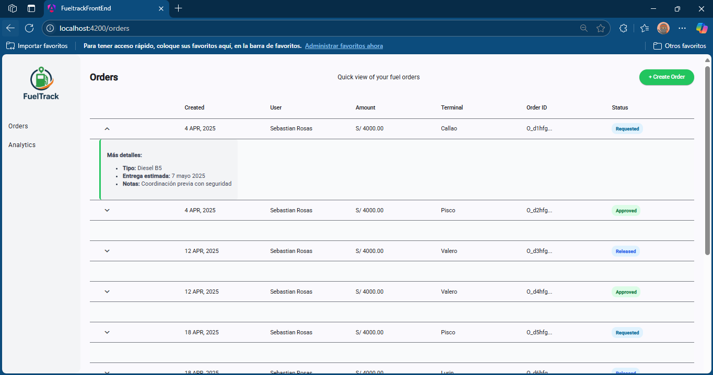
- **Creación de orden:** Ofrece un formulario para llenar con los datos necesarios para que el proveedor genere la orden de envio.

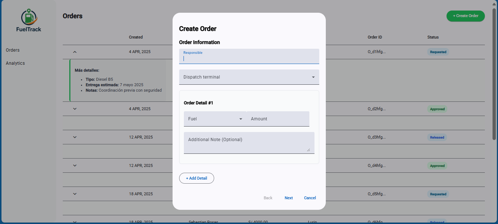
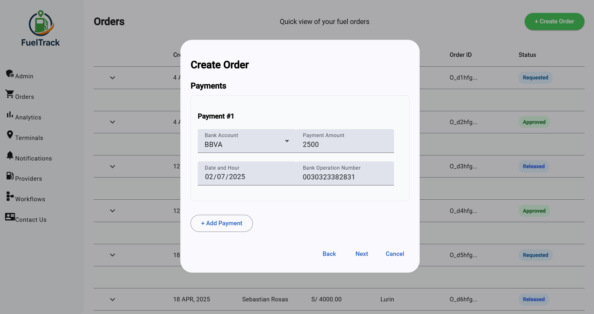

- **Analíticas:** Muestra algunos usuarios que confían en FuelTrack como referencia de credibilidad.

Interfaz de proovedor:

- **Manejo de ordenes:** Visualiza un listado de ordenes de los clientes del proovedor

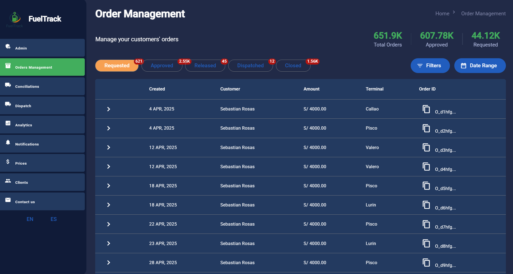

### 5.2.2.6. Services Documentation Evidence for Sprint Review
Durante el Sprint 2, el equipo se enfocó en el desarrollo del frontend inicial de la plataforma FuelTrack, particularmente en la construcción de la Landing Page. En esta etapa se priorizó el diseño visual, la experiencia de usuario y la implementación de la estructura base de la interfaz.

### 5.2.2.7. Software Deployment Evidence for Sprint Review
Durante este Sprint, nos enfocamos en consolidar un proceso de desarrollo y deployment eficiente para el frontend de nuestra plataforma, construido con Angular. Implementamos una estructura modular que facilita la escalabilidad y el mantenimiento del código, apoyándonos en Angular Material para garantizar una interfaz moderna, responsiva y alineada con principios de diseño consistentes.

**Link:** [FuelTrack Front-End](https://fueltrack-f9064.web.app/)

### 5.2.2.8. Team Collaboration Insights during Sprint

Durante el Sprint 2, el equipo demostró una mejora en la colaboración y distribución de tareas. Las reuniones frecuentes ayudaron a coordinar avances, resolver bloqueos técnicos y asegurar que cada miembro comprendiera sus responsabilidades dentro del desarrollo frontend, y los canales de comunicación fueron efectivos para mantener una alineación constante entre los integrantes.

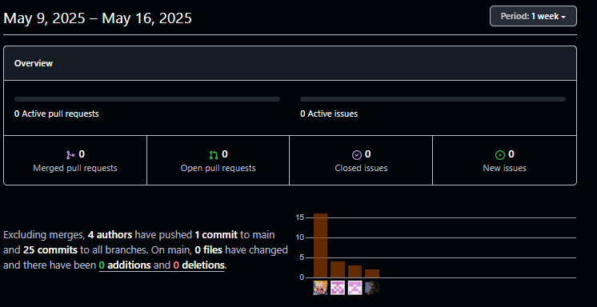

## 5.2.3. Sprint 3

### 5.2.3.1. Sprint Planning 3
<table>
    <tr align="center">
        <td><strong>Sprint #</strong></td>
        <td><strong>Sprint 3</strong></td>
    </tr>
    <tr>
        <td colspan="2" align="center"><strong>Sprint Planning Background</strong></td>
    </tr>
    <tr align="center">
        <td>Date</td>
        <td>02/06/2025</td>
    </tr>
    <tr align="center">
        <td>Time</td>
        <td>7:00 PM</td>
    </tr>
    <tr align="center">
        <td>Location</td>
        <td>Meet</td>
    </tr>
    <tr align="center">
        <td>Prepared by</td>
        <td>Luciana Carolina</td>
    </tr>
    <tr align="center">
        <td>Attendess (to planning meeting)</td>
        <td>
          Adrián Emanuel Valerio Garcia - U202210334 
          Luciana Carolina Choquehuanca Nuñez - U202319431 
          César Augusto Navarro Correa - U202310129 
          Franz Jair La Torre Valle - U202012378 
          Frezzia Eldaa Isabel Espinoza Paredes - U815121
    </tr>
    <tr align="center">
        <td>Sprint 2 Review Summary</td>
        <td>
          - Se realizó la primera versión del Frontend y algunos cambios en la Landing page 
          - Se corrigieron algunas correciones en los User Stories 
          - Se corrigieron la distribución del diseño de la base de datos 
          - Se documentó todo el proceso y evidencias del Sprint 2, se corrigió el Sprint 1 
        </td>
    </tr>
    <tr align="center">
        <td>Sprint 2 Retrospective Summary</td>
        <td>
          - Se desarrollo el API REST, pero no fue desplegado en una Fake API 
          - Se evidenciaron errores gramaticales y datos incoherentes en el informe 
          - Faltaron añadir evidencias visuales del desarrollo del Sprint 2 
        </td>
    </tr>
    <tr>
        <td colspan="2" align="center"><strong>Sprint Goal & User Stories</strong></td>
    </tr>
    <tr align="center">
        <td>Sprint 3 Goal</td>
        <td>En la reunión, se presentó la organización de todas las correciones a tratar en este Sprint
        como lo es el desarrollo final del Frontend y revisión del informe. Por otro lado, se trató como
        debemos realizar la primera versión del backend.</td>
    </tr>
    <tr align="center">
        <td>Sprint 3 Velocity</td>
        <td>21</td>
    </tr>
    <tr align="center">
        <td>Sum of Story Point</td>
        <td>90</td>
    </tr>
</table>

### 5.2.3.2. Aspect Leaders and Collaborators

| Team Member                                  | GitHub Username   | Frontend     | Documentation  | Backend  | Correcciones TB2 |
|----------------------------------------------|-------------------|--------------|----------------|----------|------------------|
| Valerio Garcia, Adrián Emanuel               | adrianvalerio     | C            | C              | C        | C                |
| Choquehuanca Nuñez, Luciana Carolina         | Lucianxaaa        | C            | C              | L        | L                |
| Navarro Correa, César Augusto                | csr555-ui         | C            | L              | C        | C                |
| La Torre Valle, Franz Jair                   | FranzJairLTV      | C            | C              | L        | C                |
| Frezzia Eldaa Isabel Espinoza Paredes        | fflushh           | L            | C              | C        | C                |

### 5.2.3.3. Sprint Backlog 3

| **User Story** | **Work-Item / Task**                                                                 | **Id**  | **Description**                                                                                              | **Estimation (Hours)** | **Assigned to**                    | **Status** |
|----------------|--------------------------------------------------------------------------------------|---------|--------------------------------------------------------------------------------------------------------------|------------------------|------------------------------------|------------|
| US-05          | Desarrollar POST /api/v1/orders para crear pedido de combustible.                    | Tk-25   | Creación del endpoint POST para la recepción de pedidos de combustible.                                        | 6                      | Adrian                             | Done       |
| US-05          | Validaciones de stock y tipo de combustible en pedido nuevo.                         | Tk-26   | Implementación de validaciones para asegurarse que el stock y el tipo de combustible sean correctos.          | 6                      | Adrian                             | Done       |
| US-06          | Desarrollar endpoint GET /api/v1/orders para consultar estado de pedidos.            | Tk-27   | Desarrollo del endpoint GET para consultar el estado de los pedidos realizados.                               | 5                      | Adrian                             | Done       |
| US-06          | Crear listado con estados de pedidos                                                | Tk-28   | Generación de un listado con todos los estados de los pedidos realizados.                                     | 5                      | Freezia                            | Done       |
| US-08          | Desarrollar endpoint POST /api/v1/transactions para registrar pagos.                | Tk-29   | Creación del endpoint POST para registrar pagos realizados en la plataforma.                                 | 4                      | Luciana                            | Done       |
| US-08          | Registrar información de pago asociada a un pedido en la entidad Transaction.       | Tk-30   | Implementación para registrar la información del pago en la entidad Transaction relacionada con los pedidos.   | 4                      | Freezia                            | Done       |
| US-34          | Configurar notificación por correo para cambios de estado de pedido.                 | Tk-31   | Implementación de la notificación por correo cuando haya cambios en el estado de un pedido.                   | 3                      | Luciana                            | Done       |
| US-35          | Implementar notificación automática de despacho.                                    | Tk-32   | Desarrollo de notificación automática para informar sobre el despacho de pedidos.                            | 3                      | Luciana                            | Done       |
| US-10          | Listar pedidos pendientes para análisis del proveedor desde entidad FuelOrder.      | Tk-33   | Implementación de una función que liste los pedidos pendientes para análisis por parte del proveedor.        | 4                      | Adrian                             | Done       |
| US-11          | Desarrollar un endpoint PUT /api/v1/orders del estado de pedido.                     | Tk-34   | Creación del endpoint PUT para modificar el estado de los pedidos.                                           | 4                      | Luciana                            | Done       |
| US-11          | Implementar función de aprobación                                                   | Tk-35   | Implementación de la función para aprobar pedidos tras la validación de los pagos.                           | 4                      | Franz                              | Done       |
| US-11          | Actualizar estado de pedido a Aprobado si validación de pago es correcta.           | Tk-36   | Desarrollo de la lógica para cambiar el estado del pedido a aprobado una vez validado el pago.               | 4                      | Luciana                            | Done       |
| US-12          | Función para marcar como despachado                                                | Tk-37   | Implementación de la función para marcar un pedido como despachado.                                           | 3                      | Luciana                            | Done       |
| US-12          | Desarrollar endpoint GET /api/v1/deliveries                                         | Tk-38   | Desarrollo de un endpoint GET para obtener información sobre las entregas realizadas.                        | 3                      | Luciana                            | Done       |
| US-25          | Desarrollar endpoint /api/v1/transport para cambiar el vehiculo.                    | Tk-39   | Creación del endpoint para modificar el vehículo asignado a un pedido.                                       | 5                      | Luciana                            | Done       |
| US-25          | Diseñar asignación de vehículo                                                      | Tk-40   | Diseño de la asignación de vehículo para los pedidos en el sistema.                                          | 5                      | Franz                              | Done       |
| US-26          | Desarrollar endpoint /api/v1/transport para asignar el conductor.                   | Tk-41   | Implementación del endpoint para asignar un conductor a los pedidos.                                          | 5                      | Luciana                            | Done       |
| US-26          | Diseñar asignación de conductor                                                     | Tk-42   | Diseño del proceso de asignación de conductor a los pedidos dentro del sistema.                              | 5                      | Adrian                             | Done       |
| US-27          | Desarrollar endpoint GET en /api/v1/transports para validar disponibilidad.         | Tk-43   | Creación del endpoint GET para validar la disponibilidad de transportes.                                      | 4                      | Adrian                             | Done       |
| US-13          | Desarrollar endpoint PUT /api/v1/orders para cerrar pedido.                         | Tk-44   | Desarrollo del endpoint PUT para cerrar un pedido.                                                           | 3                      | Luciana                            | Done       |
| US-19          | Desarrollar endpoint GET /api/v1/orders para el resumen de pedidos para proveedor   | Tk-45   | Creación del endpoint GET para obtener el resumen de pedidos de un proveedor.                                | 4                      | Franz                              | Done       |
| US-33          | Agregar filtros por estado de pedido en /api/v1/orders.                             | Tk-46   | Implementación de filtros adicionales para consultar pedidos por estado en el endpoint /api/v1/orders.      | 3                      | Luciana                            | Done       |
| US-09          | Desarrollar endpoint GET para obtener una cantidad de pedidos.                      | Tk-47   | Creación del endpoint GET para obtener la cantidad total de pedidos en el sistema.                          | 4                      | Adrian                             | Done       |
| US-18          | Desarrollar endpoint GET /api/v1/orders para el resumen de pedidos para solicitante | Tk-48   | Implementación del endpoint GET para obtener el resumen de pedidos solicitados por un solicitante específico. | 4                      | Adrian                             | Done       |
| US-38          | Implementar la funcionalidad del gráfico de ventas a través de los datos del backend | Tk-49   | Implementación de un gráfico que visualice las ventas utilizando los datos extraídos del backend.            | 5                      | Luciana                            | Done       |
| US-39          | Implementar la funcionalidad gráfico de consumo mensual a través de los datos del backend | Tk-50 | Desarrollo de un gráfico de consumo mensual utilizando datos provenientes del backend.                       | 5                      | Luciana                            | Done       |
| US-40          | Implementar exportación de datos a PDF                                             | Tk-51   | Implementación de la exportación de datos a formato PDF desde el sistema.                                    | 4                      | Franz                              | Done       |
| US-14          | Crear función retornable de datos del backend para la generación del reporte        | Tk-52   | Creación de una función que devuelva datos del backend para generar reportes específicos.                    | 4                      | Adrian                             | Done       |
| US-23          | Crear ordenes por /api/v1/orders.                                                   | Tk-53   | Creación del endpoint para la creación de órdenes a través de la API.                                        | 4                      | Luciana                            | Done       |
| US-24          | Obtener pedidos por usuario por /api/v1/orders/user/{id}                           | Tk-54   | Implementación del endpoint para obtener los pedidos de un usuario a través de su ID.                       | 4                      | Luciana                            | Done       |

### 5.2.3.4. Development Evidence for Sprint Review

<table border="1" cellspacing="0" cellpadding="6">
  <thead>
    <tr>
      <th>Repositorio</th>
      <th>Rama</th>
      <th>ID de Commit</th>
      <th>Mensaje de Commit</th>
      <th>Descripción del Commit</th>
      <th>Fecha de Commit</th>
    </tr>
  </thead>
<tbody>
<tr>
	<td>1ASI0729-2510-4317-G4-FuelTrack/FuelTrack-front-end</td>
	<td>develop</td>
	<td>a5ad1b6</td>
	<td>feat(dispatch): add dashboard section for dispatch</td>
	<td>-</td>
	<td>14-06-2025</td>
</tr>
<tr>
	<td>1ASI0729-2510-4317-G4-FuelTrack/FuelTrack-front-end</td>
	<td>develop</td>
	<td>a5ad1b6</td>
	<td>feat: Add new sections: Admin, Terminals, Notifications, Providers, Workflows, Contact Us for clients</td>
	<td>-</td>
	<td>16-06-2025</td>
</tr>
<tr>
	<td>1ASI0729-2510-4317-G4-FuelTrack/FuelTrack-back-end</td>
	<td>feature/orders</td>
	<td>cbb52a3</td>
	<td>refactor: add new names for bounded context</td>
	<td>-</td>
	<td>12-06-2025</td>
  </tr>
<tr>
	<td>1ASI0729-2510-4317-G4-FuelTrack/FuelTrack-back-end</td>
	<td>feature/orders</td>
	<td>31adbc1</td>
	<td>feat(orderStatus): add class for order status</td>
	<td>-</td>
	<td>16-06-2025</td>
</tr>
<tr>
	<td>1ASI0729-2510-4317-G4-FuelTrack/FuelTrack-back-end</td>
	<td>feature/orders</td>
	<td>34032fb</td>
	<td>feat(FuelType): add class for fuel type in order</td>
	<td>-</td>
	<td>16-06-2025</td>
</tr>
<tr>
	<td>1ASI0729-2510-4317-G4-FuelTrack/FuelTrack-back-end</td>
	<td>feature/orders</td>
	<td>0f9b69d</td>
	<td>feat: add SnakeCase for lower, plural and well written class names</td>
	<td>-</td>
	<td>16-06-2025</td>
</tr>
<tr>
	<td>1ASI0729-2510-4317-G4-FuelTrack/FuelTrack-back-end</td>
	<td>feature/orders</td>
	<td>b76971b</td>
	<td>feat(FuelOrder): add FuelOrder class that saves all order infos</td>
	<td>-</td>
	<td>16-06-2025</td>
</tr>
<tr>
	<td>1ASI0729-2510-4317-G4-FuelTrack/FuelTrack-back-end</td>
	<td>feature/orders</td>
	<td>2dd17bd</td>
	<td>feat(controller): add REST controller for creating and listing fuel orders</td>
	<td>-</td>
	<td>16-06-2025</td>
</tr>
<tr>
	<td>1ASI0729-2510-4317-G4-FuelTrack/FuelTrack-back-end</td>
	<td>feature/orders</td>
	<td>89c3c5f</td>
	<td>feat(orders): implement service logic to handle and store fuel orders in memory</td>
	<td>-</td>
	<td>16-06-2025</td>
</tr>
<tr>
	<td>1ASI0729-2510-4317-G4-FuelTrack/FuelTrack-back-end</td>
	<td>feature/orders</td>
	<td>14faf8f</td>
	<td>feat(orders): add FuelOrderCommand to encapsulate fuel order creation data</td>
	<td>-</td>
	<td>16-06-2025</td>
</tr>
<tr>
	<td>1ASI0729-2510-4317-G4-FuelTrack/FuelTrack-back-end</td>
	<td>feature/orders</td>
	<td>d323600</td>
	<td>feat(orders): add CreateFuelOrderResource as DTO for incoming fuel order requests</td>
	<td>-</td>
	<td>16-06-2025</td>
</tr>
<tr>
	<td>1ASI0729-2510-4317-G4-FuelTrack/FuelTrack-back-end</td>
	<td>feature/orders</td>
	<td>db3e509</td>
	<td>feat(application.properties): add database in h2</td>
	<td>-</td>
	<td>17-06-2025</td>
</tr>
<tr>
	<td>1ASI0729-2510-4317-G4-FuelTrack/FuelTrack-back-end</td>
	<td>feature/orders</td>
	<td>8d5587b</td>
	<td>feat(FuelOrder): define class JPA for fuel_orders table</td>
	<td>-</td>
	<td>17-06-2025</td>
</tr>
<tr>
	<td>1ASI0729-2510-4317-G4-FuelTrack/FuelTrack-back-end</td>
	<td>feature/orders</td>
	<td>51fe946</td>
	<td>feat(controller): add endpoint mappings using @RequestMapping and REST shortcuts</td>
	<td>-</td>
	<td>17-06-2025</td>
</tr>
<tr>
	<td>1ASI0729-2510-4317-G4-FuelTrack/FuelTrack-back-end</td>
	<td>feature/orders</td>
	<td>7430616</td>
	<td>feat(mapper): implement FuelOrderMapper to convert between DTO and domain command</td>
	<td>-</td>
	<td>17-06-2025</td>
</tr>
<tr>
	<td>1ASI0729-2510-4317-G4-FuelTrack/FuelTrack-back-end</td>
	<td>feature/orders</td>
	<td>8a5eac2</td>
	<td>feat: add fuel order class resource</td>
	<td>-</td>
	<td>17-06-2025</td>
</tr>
<tr>
	<td>1ASI0729-2510-4317-G4-FuelTrack/FuelTrack-back-end</td>
	<td>feature/orders</td>
	<td>d59e7f4</td>
	<td>feat(repository): create FuelOrderRepository interface for JPA access</td>
	<td>-</td>
	<td>17-06-2025</td>
</tr>
<tr>
	<td>1ASI0729-2510-4317-G4-FuelTrack/FuelTrack-back-end</td>
	<td>feature/orders</td>
	<td>fb57cab</td>
	<td>feat(service): implement FuelOrderService to handle order creation logic</td>
	<td>-</td>
	<td>17-06-2025</td>
</tr>
<tr>
	<td>1ASI0729-2510-4317-G4-FuelTrack/FuelTrack-back-end</td>
	<td>feat/operations</td>
	<td>71d8ecb</td>
	<td>feat(transport): add command and query logic to operation</td>
	<td>-</td>
	<td>14-06-2025</td>
</tr>
<tr>
	<td>1ASI0729-2510-4317-G4-FuelTrack/FuelTrack-back-end</td>
	<td>feat/operations</td>
	<td>0d1d7f6</td>
	<td>feat(transport): add services</td>
	<td>-</td>
	<td>14-06-2025</td>
</tr>
<tr>
	<td>1ASI0729-2510-4317-G4-FuelTrack/FuelTrack-back-end</td>
	<td>feat/operations</td>
	<td>b8b6c92</td>
	<td>feat(transport): establish database connectivity</td>
	<td>-</td>
	<td>15-06-2025</td>
</tr>
<tr>
	<td>1ASI0729-2510-4317-G4-FuelTrack/FuelTrack-back-end</td>
	<td>feat/operations</td>
	<td>57cc6bd</td>
	<td>feat(delivery): add commands and queries</td>
	<td>-</td>
	<td>15-06-2025</td>
</tr>
<tr>
	<td>1ASI0729-2510-4317-G4-FuelTrack/FuelTrack-back-end</td>
	<td>feat/operations</td>
	<td>84a233f</td>
	<td>feat(delivery): establish connection to database</td>
	<td>-</td>
	<td>16-06-2025</td>
</tr>
<tr>
	<td>1ASI0729-2510-4317-G4-FuelTrack/FuelTrack-back-end</td>
	<td>feat/operations</td>
	<td>b59de8c</td>
	<td>feat(inventory): add JPA repository and service layer with create & update operations</td>
	<td>-</td>
	<td>16-06-2025</td>
</tr>
<tr>
	<td>1ASI0729-2510-4317-G4-FuelTrack/FuelTrack-back-end</td>
	<td>orders</td>
	<td>4741c4a</td>
	<td>feat(Controller): add complete payment fuction</td>
	<td>-</td>
	<td>21-06-2025</td>
</tr>
<tr>
      <td>1ASI0729-2510-4317-G4-FuelTrack/FuelTrack-back-end</td>
      <td>orders</td>
      <td>d7701cf</td>
      <td>feat(service): add logic processing order</td>
      <td>-</td>
      <td>21-06-2025</td>
    </tr>
<tr>
      <td>1ASI0729-2510-4317-G4-FuelTrack/FuelTrack-back-end</td>
      <td>orders</td>
      <td>bd4e372</td>
      <td>feat: add class for paymentorder</td>
      <td>-</td>
      <td>21-06-2025</td>
</tr>
<tr>
      <td>1ASI0729-2510-4317-G4-FuelTrack/FuelTrack-back-end</td>
      <td>orders</td>
      <td>09a0016</td>
      <td>feat: add status for payment</td>
      <td>-</td>
      <td>21-06-2025</td>
</tr>
<tr>
      <td>1ASI0729-2510-4317-G4-FuelTrack/FuelTrack-back-end</td>
      <td>orders</td>
      <td>c567f39</td>
      <td>feat: add resource for payment</td>
      <td>-</td>
      <td>21-06-2025</td>
</tr>
<tr>
      <td>1ASI0729-2510-4317-G4-FuelTrack/FuelTrack-back-end</td>
      <td>orders</td>
      <td>ab05487</td>
      <td>feat: add payment repository</td>
      <td>-</td>
      <td>21-06-2025</td>
</tr>
<tr>
      <td>1ASI0729-2510-4317-G4-FuelTrack/FuelTrack-back-end</td>
      <td>orders</td>
      <td>0fe6980</td>
      <td>feat: add logic for aditional note on orders</td>
      <td>-</td>
      <td>21-06-2025</td>
</tr>
<tr>
      <td>1ASI0729-2510-4317-G4-FuelTrack/FuelTrack-back-end</td>
      <td>orders</td>
      <td>b43baee</td>
      <td>feat: add creation time to fuel_orders table</td>
      <td>-</td>
      <td>21-06-2025</td>
</tr>
<tr>
      <td>1ASI0729-2510-4317-G4-FuelTrack/FuelTrack-back-end</td>
      <td>operations</td>
      <td>025bd4a</td>
      <td>refactor: reorganize operations structure</td>
      <td>-</td>
      <td>20-06-2025</td>
</tr>
<tr>
      <td>1ASI0729-2510-4317-G4-FuelTrack/FuelTrack-back-end</td>
      <td>operations</td>
      <td>343ecb0</td>
      <td>feat:add validation context</td>
      <td>-</td>
      <td>22-06-2025</td>
</tr>
</tbody>
</table>

### 5.2.3.5. Execution Evidence for Sprint Review

Durante el Sprint 3 se realizaron mejoras en la estructura del frontend, con el objetivo de optimizar su organización y funcionamiento. También se completaron e integraron las secciones que habían quedado pendientes en el sprint anterior, garantizando la continuidad y coherencia en el desarrollo de la página web.

-El backend desplegado de forma local 

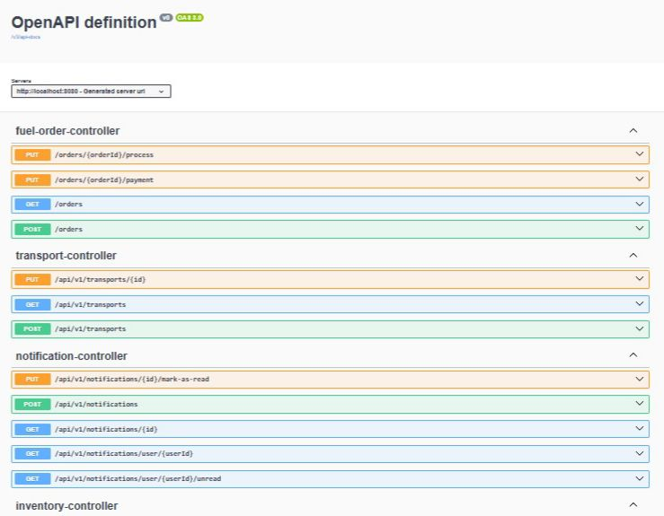
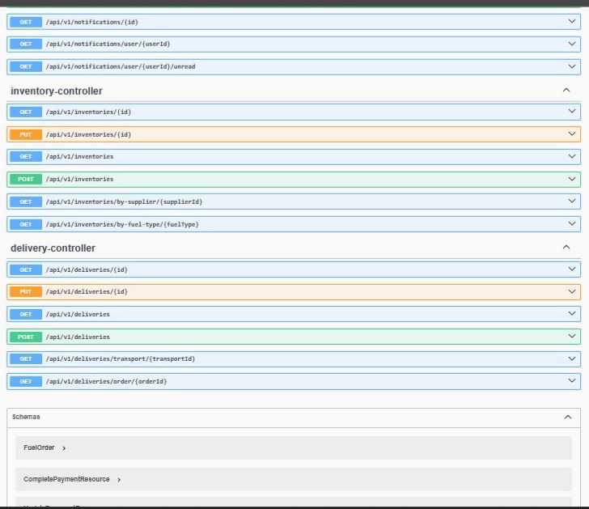

- Panel de Administrador: Permite a los usuarios ver la actividad de los usuarios
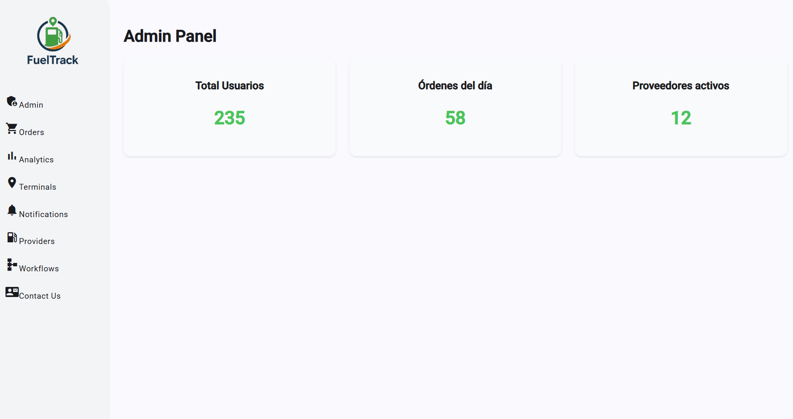

- Terminales: Aquí se gestiona la información relacionada con los terminales conectados al sistema

- Notificaciones: Centraliza todas las notificaciones generadas por la plataforma

- Proovedores: Administra la información de los proveedores asociados con el solicitante en la plataforma
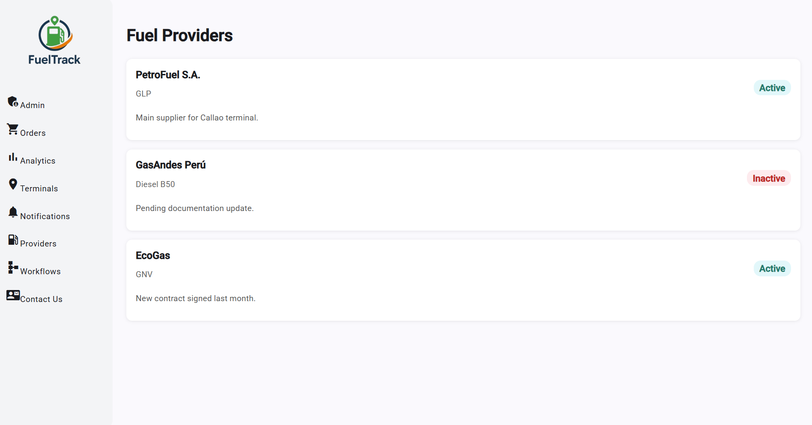

- Contactanos: Ofrece un formulario de contacto
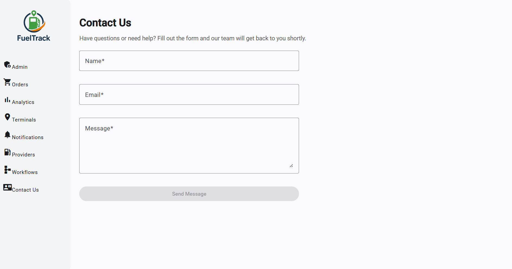

Adicionalmente, se llevó a cabo el desarrollo integral de los datos de la aplicación, estructurándolos según los bounded contexts definidos: Analytics, Logistics, Operations, Orders, Reports y Validations. Si bien se lograron avances en todos ellos, se priorizó el desarrollo de los componentes esenciales para el correcto funcionamiento del módulo de pedidos en ambos segmentos.

### 5.2.3.6. Services Documentation Evidence for Sprint Review

Durante el Sprint 3 se completó la documentación de los Web Services correspondientes a las funcionalidades de gestión de pedidos y autenticación de usuarios. En esta sección se describen los endpoints implementados, las operaciones soportadas, y el alcance funcional previsto conforme a la especificación OpenAPI, acompañados de evidencias visuales que muestran el resultado de las pruebas realizadas con datos de ejemplo:

<table border="1" cellspacing="0" cellpadding="6" style="border-collapse: collapse; text-align: center;">
  <thead style="background-color: #f5e8b0;">
    <tr>
      <th>Endpoint Simulado (Fake API)</th>
      <th>Operaciones CRUD Soportadas</th>
      <th>Futuro Alcance con OpenAPI</th>
    </tr>
  </thead>
  <tbody>
    <tr>
      <td>/api/v1/users/</td>
      <td>GET, POST, PUT, DELETE</td>
      <td>Gestión de los usuarios: creación y registro de perfiles, modificación de datos, eliminación de la cuenta</td>
    </tr>
    <tr>
      <td>/api/v1/orders/</td>
      <td>GET, POST, PUT, DELETE</td>
      <td>Gestión completa de pedidos: creación, consulta, edición de estado y productos, eliminación de órdenes canceladas.</td>
    </tr>
    <tr>
      <td>/api/v1/notifications</td>
      <td>GET, POST</td>
      <td>Gestión de notificaciones: generación de acciones realizadas, cambios en las ordenes y otros recordatorios.</td>
    </tr>
    <tr>
      <td>/api/v1/transports</td>
      <td>GET, POST</td>
      <td>Gestión de flota: registro de nuevos camiones, actualización de estado y capacidad, baja de unidades inoperativas.</td>
    </tr>
    <tr>
      <td>/api/v1/inventories</td>
      <td>GET, POST</td>
      <td>Catálogo de combustibles: adición de nuevos tipos, actualización de precios, retiro de productos descontinuados.</td>
    </tr>
    <tr>
      <td>/api/v1/deliveries</td>
      <td>GET, POST</td>
      <td>Asignación y actualización de transporte a pedidos, consulta de estado en ruta, eliminación de asignaciones obsoletas.</td>
    </tr>
  </tbody>
</table>

Adicionalmente, se desplego la estructura de los Web Services mediante la herramienta Swagger UI, lo que permitió validar la definición y comportamiento de los endpoints simulados:

  

### 5.2.3.7. Software Deployment Evidence for Sprint Review

Este proyecto utilizó diversas herramientas para el desarrollo del backend de la aplicación web, así como para la actualización del frontend:

- **Git**: Sistema de control de versiones utilizado para gestionar el código.
- **GitFlow**: Flujo de trabajo colaborativo implementado en el desarrollo del proyecto.
- **GitHub Desktop**: Herramienta gráfica que facilitó la interacción con nuestro repositorio en GitHub.
- **GitHub**: Plataforma colaborativa donde se almacenó y gestionó el código fuente de nuestro proyecto.
- **Netlify**: Plataforma de implementación y alojamiento web que facilita el despliegue de sitios estáticos y aplicaciones web modernas.
- **Firebase**:Plataforma de desarrollo de aplicaciones móviles y web creada por Google, que proporciona una variedad de herramientas y servicios como bases de datos en tiempo real.

Enlaces de despliegue:
- **Landing Page**: [FuelTrack Landing Page](https://fueltrack-f9064.web.app/)
- **FrontEnd**: [FuelTrack FrontEnd](https://fueltrackapp.netlify.app)
- **Backend**: [FuelTrack Backend]()

### 5.2.3.8. Team Collaboration Insights during Sprint

En el Sprint 3, el equipo estructuró el desarrollo del backend y la corrección del frontend de la aplicación web mediante el uso de ramas dedicadas a cada funcionalidad, adhiriéndose a las convenciones de GitFlow. Este método permitió a los desarrolladores trabajar de forma autónoma en diversas partes del proyecto, mejorando la colaboración y el manejo del código.

A continuación se presentarán los gráficos con los insights obtenidos durante el sprint:

  

  

  

### **5.2.4. Sprint 4**
#### **5.2.4.1. Sprint Planning 4**

| **Sprint #** | Sprint 4 |
|---|---|
| **Sprint Planning Background** |  |
| **Date** | 2025-07-05 |
| **Time** | 04:00 PM |
| **Location** | Discord meeting |
| **Prepared By** | Choquehuanca Núñez, Luciana Carolina |
| **Attendees (to planning meeting)** | Adrián Emanuel Valerio Garcia / Luciana Carolina Choquehuanca Nuñez / Franz Jair La Torre Valle / César Augusto Navarro Correa |
| **Sprint 1 – 4 Review Summary** | En el Sprint 3 se progresó en la integración de los endpoints para la administración de perfiles de empresas e influencers, la documentación de la API en Swagger, el despliegue en Azure y la integración inicial con el frontend. |
| **Sprint 1 – 4 Retrospective Summary** | Se detectó la necesidad de optimizar la cobertura de las pruebas, la validación de datos y la trazabilidad de las acciones. Además, se notó que algunas tareas técnicas se llevaron a cabo antes de ser documentadas, lo que dio lugar a la necesidad de refactorizar y mejorar la coherencia del backend. |
| **Sprint Goal & User Stories** |  |
| **Sprint 4 Goal** | El objetivo de este sprint es mejorar la gestión de pedidos, la seguridad del backend y la integración con el frontend. Se abordarán los siguientes puntos:  - Implementar endpoints para crear, listar, editar y cerrar pedidos. - Mejorar autenticación con JWT y control de roles. - Optimizar validación de pagos y seguimiento de pedidos. - Integrar logs para trazabilidad de acciones. - Actualizar documentación en Swagger. - Avanzar en pruebas automáticas e integración frontend-backend. |
| **Sprint 4 Velocity** | 18 Story Points |
| **Sum of Story Points** | 20 |

#### **5.2.4.2. Aspect Leaders and Collaborators**

| Team Member                                  | GitHub Username   | Frontend     | Documentation  | Backend  | Correcciones Generales |
|----------------------------------------------|-------------------|--------------|----------------|----------|------------------|
| Valerio Garcia, Adrián Emanuel               | adrianvalerio     | C            | C              | C        | C                |
| Choquehuanca Nuñez, Luciana Carolina         | Lucianxaaa        | C            | C              | L        | L                |
| Navarro Correa, César Augusto                | csr555-ui         | C            | L              | C        | C                |
| La Torre Valle, Franz Jair                   | FranzJairLTV      | C            | C              | L        | C                |
| Frezzia Eldaa Isabel Espinoza Paredes        | fflushh           | L            | C              | C        | C                |

#### **5.2.4.3. Sprint Backlog 4**

| User Story Id | User Story Title               | Task Id | Task Title                         | Description                                                                 | Estimation (Hours) | Assigned To       | Status |
|---------------|---------------------------------|---------|-------------------------------------|-----------------------------------------------------------------------------|-------------------|-------------------|--------|
| US05          | Registrar nuevo pedido         | TK01    | Crear endpoint de pedido           | Desarrollar endpoint para registrar un nuevo pedido de combustible.         | 5                 | Valerio Garcia     | Todo   |
| US05          | Registrar nuevo pedido         | TK02    | Validación de datos en el pedido  | Implementar validación de campos en el formulario de pedido.                | 3                 | Adrián Emanuel     | Todo   |
| US06          | Consultar estado del pedido    | TK03    | Endpoint para consultar estado    | Crear endpoint que permita consultar el estado actualizado del pedido.     | 3                 | Luciana Carolina   | Todo   |
| US06          | Consultar estado del pedido    | TK04    | Actualización dinámica de estado  | Implementar lógica para mostrar cambios en el estado del pedido en tiempo real. | 3                 | César Augusto      | Todo   |
| US08          | Registrar información de pago  | TK05    | Crear endpoint de pago             | Desarrollar endpoint para registrar la información de pago asociada al pedido. | 4                 | Franz Jair         | Todo   |
| US08          | Registrar información de pago  | TK06    | Validación de depósito             | Validar que los datos del depósito sean correctos y no se repitan.         | 3                 | Valerio Garcia     | Todo   |
| US10          | Ver pedidos pendientes          | TK07    | Listar pedidos pendientes          | Crear endpoint para listar pedidos pendientes de los proveedores.          | 4                 | Adrián Emanuel     | Todo   |
| US10          | Ver pedidos pendientes          | TK08    | Filtros para búsqueda de pedidos   | Implementar filtros de búsqueda por fecha o cliente.                        | 3                 | Luciana Carolina   | Todo   |

#### **5.2.4.4. Development Evidence for Sprint Review.**

| **Repositorio** | **Rama** | **ID de Commit** | **Mensaje de Commit** | **Descripción del Commit** | **Fecha de Commit** |
|---|---|---|---|---|---|
| FuelTrack | develop | - | fix: fix MANIFEST.MF for deploy | - | 03-07-2025 |
| FuelTrack | develop | - | deployable version with render database | - | 03-07-2025 |
| FuelTrack | develop | - | feat: add Dockerfile for deploy | - | 03-07-2025 |
| FuelTrack | develop | - | fix: java 24 for Dockerfile | - | 03-07-2025 |
| FuelTrack | develop | - | fix: dependencies and cleanup in pom.xml | - | 03-07-2025 |
| FuelTrack | main | - | Merge pull request #8 from 1ASI0729-2510-4317-G4-FuelTrack/main | - | 05-07-2025 |
| FuelTrack | develop | - | Merge pull request #9 from 1ASI0729-2510-4317-G4-FuelTrack/develop | - | 05-07-2025 |
| FuelTrack | feature/orders | - | refactor: move file FuelOrderCommand into application/commands | - | 06-07-2025 |
| FuelTrack | feature/orders | - | feat: add CORS global for frontend | - | 08-07-2025 |
| FuelTrack | feature/orders | - | feat: CORS changes for testing | - | 08-07-2025 |
| FuelTrack | feature/orders | - | fix: fix route for connection | - | 08-07-2025 |
| FuelTrack | feature/orders | - | feat(orders): add delete endpoint for orders | - | 08-07-2025 |
| FuelTrack | feature/orders | - | Merge pull request #11 from 1ASI0729-2510-4317-G4-FuelTrack/feature/o… | - | 08-07-2025 |
| FuelTrack | feature/orders | - | Merge pull request #12 from 1ASI0729-2510-4317-G4-FuelTrack/develop | - | 08-07-2025 |
| FuelTrack | feature/orders | - | fix(orders): fix delete endpoint | - | 08-07-2025 |
| FuelTrack | feature/orders | - | Merge pull request #13 from 1ASI0729-2510-4317-G4-FuelTrack/feature/o… | - | 08-07-2025 |
| FuelTrack | feature/orders | - | fix(orders): fix delete endpoint, final fix | - | 09-07-2025 |
| FuelTrack | feature/orders | - | Merge pull request #14 from 1ASI0729-2510-4317-G4-FuelTrack/feature/o… | - | 09-07-2025 |
| FuelTrack | feature/orders | - | feat(order payment): add endpoints for payments | - | 09-07-2025 |
| FuelTrack | feature/orders | - | Merge pull request #15 from 1ASI0729-2510-4317-G4-FuelTrack/feature/o… | - | 09-07-2025 |
| FuelTrack | feature/orders | - | feat(order payment): add restriction to endpoint for minimum price pe… | - | 09-07-2025 |
| FuelTrack | feature/orders | - | Merge pull request #16 from 1ASI0729-2510-4317-G4-FuelTrack/feature/o… | - | 09-07-2025 |
| FuelTrack | feature/orders | - | fic(fueltype): fix fueltypes name for good conexion in frontend | - | 09-07-2025 |
| FuelTrack | feature/orders | - | fix(payment): fix price per gallon in payment | - | 09-07-2025 |
| FuelTrack | feature/orders | - | Merge pull request #17 from 1ASI0729-2510-4317-G4-FuelTrack/feature/o… | - | 09-07-2025 |
| FuelTrack | iam | - | feat: add iam bounded files | - | 09-07-2025 |
| FuelTrack | iam | - | feat: add openapi doc and security scheme | - | 09-07-2025 |
| FuelTrack | iam | - | feat: configure jwt auth properties | - | 09-07-2025 |
| FuelTrack | iam | - | fix: delete iam files temporaly | - | 09-07-2025 |
| FuelTrack | iam | - | fix: delete openapi config temporaly | - | 09-07-2025 |

#### **5.2.4.5. Execution Evidence for Sprint Review.**
En este sprint, el equipo de FuelTrack logró implementar y desplegar exitosamente la plataforma digital para la gestión de pedidos en Azure Web Services, utilizando MySQL for Azure como base de datos, garantizando un entorno seguro y escalable para gestionar los datos de las empresas solicitantes y proveedoras.

Además, se lanzó una actualización de la plataforma, mejorando la experiencia del usuario y habilitando funciones clave como el registro de solicitudes, validación de pagos, seguimiento en tiempo real y generación de reportes históricos. También se agregaron materiales informativos sobre el producto y sus ventajas.

Este despliegue establece una base sólida para el funcionamiento de FuelTrack, preparando la plataforma para futuras integraciones y expansión conforme el proyecto crezca y se adapte.

La API de la plataforma está documentada en Swagger, lo que facilita el acceso a los endpoints para el equipo de desarrollo y colaboradores futuros.

Enlace a la documentación de la API en Swagger:

Landing Page Desplegada: https://fueltrack-f9064.web.app/

Front Web Applications Desplegado: https://fueltrackapp.netlify.app/

Backend Desplegado: https://fueltrack-back-end.onrender.com/swagger-ui/index.html

#### **5.2.4.6. Services Documentation Evidence for Sprint Review.**

En el Sprint 4 de FuelTrack, nos enfocamos en solucionar problemas en el backend, corrigiendo errores en algunos endpoints. También logramos completar la integración total entre el backend y el frontend, asegurando una comunicación eficiente y sin interrupciones entre ambos.

En este sprint, se llevó a cabo la documentación de los servicios web utilizando Swagger, lo que facilita el acceso a la API y mejora la comprensión de los endpoints disponibles para los desarrolladores y colaboradores.

La documentación abarca:

Detalles de los endpoints corregidos y mejorados para gestionar las solicitudes de pedidos y pagos.

Integración total entre el frontend y el backend, implementado en Azure.

Este enfoque garantiza que todo el equipo comparta un entendimiento común de la API, lo cual es fundamental para el progreso y la colaboración efectiva en FuelTrack. Con las correcciones realizadas y la integración completada, el equipo está listo para avanzar hacia las siguientes etapas de desarrollo y la implementación de nuevas funcionalidades.

#### **5.2.4.7. Software Deployment Evidence for Sprint Review.**
Se incluye evidencia del despliegue del backend, con el siguiente enlace: https://fueltrack-back-end.onrender.com/swagger-ui/index.html

Captura del despliegue del backend en Swagger:

  

  

#### **5.2.4.8. Team Collaboration Insights during Sprint.**

## 5.3. Validation Interviews

### 5.3.1. Diseño de entrevistas

#### Preguntas relacionadas al Landing Page

1. ¿La información presentada en la pagina principal le resulta clara y fácil de entender para su negocio?
2. ¿Cómo calificarías la facilidad de navegación de la plataforma?
3. ¿Consideras que se deberia añadir alguna información adicional?

#### Preguntas relacionadas al Fronted
A. Proveedores de Combustible

1. ¿Consideras que el listado de las secciones principales en el dashboard adecuadas?
2. ¿Te resultó clara la información de pedidos de las empresas solicitantes?
3. ¿Te parecio adecuada la organización de los pagos de los pedidos?
4. ¿El proceso del registro de despachos es lo suficientente intuitiva para usted?
5. ¿La funcionalidad para ver el gráfico de ventas mensuales fue comprensible?
6. ¿Te gustaría recibir notificaciones cuando un pedido de una empresa haya sido aprobado, modificado o cancelado?
7. ¿La información de cada empresa te pareció suficiente para evaluar a tus clientes?
8. ¿Hubo alguna función que esperabas encontrar y que no estaba disponible o no funcionaba como esperabas?

B. Empresas Solicitantes de Combustible:

1. ¿Consideras que el listado de las secciones principales en el dashboard adecuadas?
2. ¿Te resultó clara la información de pedidos realizados como solicitante?
3. ¿Que opina sobre el proceso de registro de nuevas ordenes de pedidos?
4. ¿Considera que la organización de terminales le proporciona los datos suficientes?
5. ¿Considera el gráfico de consumo mensual y volumen total ideal para conocer su actividad?
7. ¿La grafica y el mapa le proporcionan la información adecuada para conocer el flujo de sus ordenes?
8. ¿La información de cada empresa te pareció suficiente para evaluar a tus clientes?
9. ¿Hubo alguna función que esperabas encontrar y que no estaba disponible o no funcionaba como esperabas?

### 5.3.2. Registro de entrevistas

---

#### Entrevista N°1 – Segmento: Proveedores
- Nombres: Henry Ismael
- Apellidos: Ubica Pacheco
- Edad: 28
- Distrito: SJL
- URL Entrevista: [https://youtu.be/RYrcK_EstdA](https://youtu.be/RYrcK_EstdA)
- Duración: 5:24
- Resumen: Henry considera que la plataforma transmite confianza gracias a su diseño profesional y buena organización. Valoró la facilidad de navegación, aunque notó que el botón de login para proveedores es poco visible. Destacó la claridad en la presentación de pedidos y pagos, pero sugirió mejorar la guía para subir archivos PDF. Considera útil incluir un historial de contacto con clientes y valoraría recibir notificaciones automáticas. También propuso un apartado de preguntas frecuentes para proveedores y la integración con sistemas de facturación electrónica.

#### Entrevista N°2 – Segmento: Proveedores
- Nombres: Jamil Iván
- Apellidos: Calista de Lázaro
- Edad: 25
- Distrito: VMT
- URL Entrevista: [https://youtu.be/_QAcHVgNgwI](https://youtu.be/_QAcHVgNgwI)
- Duración: 5:29
- Resumen: Jamil destacó la claridad del dashboard y la facilidad para registrar despachos. Mencionó que la sección de despachos debería estar más visible y que la distribución de información en la aprobación de cargos podría ordenarse mejor. Sugirió incorporar filtros avanzados en el gráfico de ventas y comparativas mensuales. También señaló la utilidad de notificaciones automáticas y de alertas visuales en la sección de pagos. Extrañó contar con medios de contacto directo con las empresas y con la opción de exportar datos a Excel para análisis y reportes.

  
---

#### Entrevista N°2 – Segmento: Solicitantes
- Nombres: Marcelo 
- Apellidos: Binda
- Edad: 24
- Distrito: Surquillo
- URL Entrevista: [https://youtu.be/JOrO-Q-i-TQ](https://youtu.be/JOrO-Q-i-TQ)
- Duración: 5:59
- Resumen: Marcelo considera que la landing page del sistema transmite una imagen profesional y está bien organizada para empresas que buscan monitorear el suministro de combustible. Le pareció intuitiva, aunque notó que la sección de contacto podría mejorarse. Sugirió incluir un video explicativo para facilitar la comprensión del sistema. En el frontend, valoró el diseño simple del dashboard, la claridad en los pedidos realizados y la utilidad de los gráficos y mapas para el control logístico. Destacó la necesidad de una opción para duplicar pedidos anteriores y mejorar la guía al llenar campos de dirección.

### 5.3.3. Evaluaciones heuristicas

En esta sección, describe la evaluación de la experiencia de usuario de la propuesta, aplicando un análisis heurístico integral que considera principios de usabilidad, arquitectura de información e inclusive design. La evaluación tiene como objetivo identificar problemas potenciales en la interacción usuario-sistema antes de su desarrollo o implementación final.

#### ESCALA DE SEVERIDAD:

<table border="1" cellspacing="0" cellpadding="6">
    <thead>
        <tr align="center">
          <td><strong>Nivel</strong></td>
          <td><strong>Descripción</strong></td>
        </tr>
    </thead>
    <tbody>
        <tr>
            <td>1</td>
            <td>Problema superficial: puede ser fácilmente superado por el usuario u ocurre con muy poca frecuencia. No necesita ser arreglado a no ser que exista disponibilidad de tiempo.</td>
        </tr>
        <tr>
            <td>2</td>
            <td>Problema menor: puede ocurrir un poco más frecuentemente o es un poco más difícil de superar para el usuario. Se le debería asignar una prioridad baja resolverlo de cara al siguiente reléase</td>
        </tr>
        <tr>
            <td>3</td>
            <td>Problema mayor: ocurre frecuentemente o los usuarios no son capaces de resolverlos. Es importante que sean corregidos y se les debe asignar una prioridad alta.</td>
        </tr>
        <tr>
            <td>4</td>
            <td>Problema muy grave: un error de gran impacto que impide al usuario continuar con el uso de la herramienta. Es imperativo que sea corregido antes del lanzamiento.</td>
        </tr>
    </tbody>
</table>

#### TABLA RESUMEN:

<table border="1" cellspacing="0" cellpadding="6">
    <thead>
        <tr align="center">
          <td><strong>#</strong></td>
          <td><strong>Problema</strong></td>
          <td><strong>Escala de severidad</strong></td>
          <td><strong>Heurística/Principio violada(o)</strong></td>
        </tr>
    </thead>
    <tbody>
        <tr>
            <td>1</td>
            <td>Falta de opciones para comparar ventas con el mes anterior o filtrar gráficos por periodos (trimestre, año fiscal) para proveedores.</td>
            <td>2</td>
            <td>Flexibilidad y Eficiencia de Uso</td>
        </tr>
        <tr>
            <td>2</td>
            <td>Imposibilidad de exportar el listado de empresas a Excel para proveedores.</td>
            <td>3</td>
            <td>Control y Libertad del Usuario</td>
        </tr>
        <tr>
            <td>3</td>
            <td>Falta de testimonios del publico objetivo.</td>
            <td>2</td>
            <td>Relación entre el Sistema y el Mundo Real</td>
        </tr>
        <tr>
            <td>4</td>
            <td>Falta de integración de mensajes de errores</td>
            <td>3</td>
            <td>Ayuda a los Usuarios a Reconocer, Diagnosticar y Recuperarse de Errores</td>
        </tr>
        <tr>
            <td>5</td>
            <td>Ausencia de notificaciones automáticas generadas</td>
            <td>2</td>
            <td>Visibilidad del Estado del Sistema</td>
        </tr>
    </tbody>
</table>

#### DESCRIPCIÓN DE PROBLEMAS:

---

*PROBLEMA #1: Falta de opciones para comparar ventas con el mes anterior o filtrar gráficos por periodos (trimestre, año fiscal) para proveedores.*

*Severidad: 3*

*Heurística violada: Flexibilidad y Eficiencia de Uso.* 

*Problema:* 

*En la seccion de analiticas, el gráfico mostrado a los usuarios es comprensible pero carece de funcionalidades de análisis avanzado, como la comparación mensual o filtros por periodos más amplios, lo cual limita la utilidad para la toma de decisiones.*

*Recomendación:*

*Añadir funcionalidades de comparación de periodos ( vs. mes anterior) y filtros de tiempo como trimestral, anual) a los gráficos de ventas para un análisis más profundo*

---

*PROBLEMA #2: Imposibilidad de exportar el listado de empresas a Excel para proveedores.*

*Severidad: 2*

*Heurística violada: Control y Libertad del Usuario.* 

*Problema:* 

*Para algunos usuarios, es necesario exportar los datos generados, como lo son los pedidos y los despachos en hojas de cálculo para sus reportes internos, una funcionalidad que actualmente no está disponible.*

*Recomendación:*

*Añadir un botón de "Exportar a Excel", por ejemplo el listado de pedidos para permitir generar sus reportes internos.*

---

*PROBLEMA #3: Falta de testimonios del publico objetivo.*

*Severidad: 2*

*Heurística violada: elación entre el Sistema y el Mundo Real.* 

*Problema:* 

*A pesar de incluir a los proveedores asosciados en la pagina, los usuarios, especialmente las empresas solicitantes, buscan confirmación de la confianza y capacidad del sistema a través de testimonios de empresas de su envergadura.*

*Recomendación:*

*Incluir testimonios de  grandes empresas (mineras, industriales, etc.) que utilicen el sistema en la Landing Page para solicitantes*

---

*PROBLEMA #4: Falta de integración de mensajes de errores.*

*Severidad: 3*

*Heurística violada: Ayuda a los Usuarios a Reconocer, Diagnosticar y Recuperarse de Errores.* 

*Problema:* 

*La presencia de los mensajes de error son genéricos o no están presentes en los formularios de la pagina, dificultando al usuario identificar y corregir los problemas específicos.*

*Recomendación:*

*Proporcionar mensajes de error específicos y accionables en un texto en rojo, indicando claramente qué campo o acción requiere corrección.*

---

*PROBLEMA #5: Ausencia de notificaciones automáticas generadas*

*Severidad: 2*

*Heurística violada: Visibilidad del Estado del Sistema.* 

*Problema:* 

*Tanto proveedores como solicitantes expresan el deseo de recibir notificaciones automáticas en la pagina o el aplicativo cuando un pedido cambia de estado, es cancelado o se mueve en el flujo logístico, evitando la necesidad de revisar manualmente.*

*Recomendación:*

*Implementar un sistema robusto de notificaciones automáticas para alertar a los usuarios sobre cambios críticos en los pedidos. Por ejemplo, si se generá un cambio en el flujo logístico, entonces se genera en la pagina una pequeña alerta resumida de la notificación.*

---

## 5.4. Video About-the-Product

**Link:** [https://youtu.be/UAANwxgY9bs](https://youtu.be/UAANwxgY9bs)
## 5.5. Video About-the-Team

**Link:** [https://youtu.be/kMGdPKqfl28](https://youtu.be/kMGdPKqfl28)

## Conclusiones 

- El proyecto FuelTrack planteó una solución clara y concreta para optimizar la gestión de pedidos de combustible, basada en una comprensión real del mercado y de las necesidades de los usuarios.

- Se validó la propuesta de valor a través de métodos ágiles como Lean UX, entrevistas y análisis de competencia, logrando definir un producto que resuelve problemas reales de eficiencia y comunicación.

- Se diseñó una experiencia de usuario consistente y accesible, destacando especialmente la *Landing Page*, que comunica de forma clara la oferta del servicio, apoya la conversión mediante call to actions estratégicos y genera confianza a través de testimonios y prueba social.

- El diseño de la plataforma web combinó buenas prácticas de arquitectura de información, navegación intuitiva y guías de estilo que garantizan una imagen profesional y coherente en toda la experiencia digital.

- A nivel técnico, se construyó una base sólida de arquitectura de software y base de datos, asegurando escalabilidad, mantenibilidad y alineación con los objetivos de negocio.

- El desarrollo del producto se organizó mediante una planificación iterativa, permitiendo construir, validar y mejorar de manera progresiva, asegurando que el resultado final responda tanto a las expectativas de los usuarios como a las metas de FuelTrack.
  
- En este sprint, se planificaron tareas clave como la finalización del frontend, la revisión del informe y la creación de la primera versión del backend. El equipo definió las User Stories y asignó responsabilidades, con un total de 90 puntos de historia y una velocidad de Sprint de 21.
  
- Se desarrollaron varios endpoints para gestionar pedidos, pagos, notificaciones y transportes. Además, se mejoraron las funcionalidades de la plataforma, como los gráficos de ventas y consumo mensual.
  
- El frontend se desplegó en Netlify y Firebase, y el backend se desplegó localmente para pruebas. También se actualizó el Panel de Administrador y se integró la documentación de los Web Services con Swagger UI.
  
- Se identificaron problemas de usabilidad, como la falta de comparaciones de ventas y la imposibilidad de exportar datos a Excel. Se sugirieron mejoras como filtros avanzados en gráficos y mensajes de error más claros.

## Bibliografia

Interaction Design Foundation. (s.f.). *A simple introduction to Lean UX*. Recuperado de [https://www.interaction-design.org/literature/article/a-simple-introduction-to-lean-ux](https://www.interaction-design.org/literature/article/a-simple-introduction-to-lean-ux)

Baymard Institute. (s.f.). *The best practices and key principles of UX design*. Recuperado de [https://baymard.com/learn/ux-design-principles](https://baymard.com/learn/ux-design-principles)

Laubheimer, P. (2022, abril 10). *Information architecture: Study guide*. Nielsen Norman Group. Recuperado de [https://www.nngroup.com/articles/ia-study-guide/](https://www.nngroup.com/articles/ia-study-guide/)

UXPin. (2024, agosto). *Design consistency guide: UI and UX best practices*. Recuperado de [https://www.uxpin.com/studio/blog/guide-design-consistency-best-practices-ui-ux-designers/](https://www.uxpin.com/studio/blog/guide-design-consistency-best-practices-ui-ux-designers/)

CareerFoundry. (2023, enero 5). *A beginner’s guide to information architecture in UX*. Recuperado de [https://careerfoundry.com/en/blog/ux-design/a-beginners-guide-to-information-architecture/](https://careerfoundry.com/en/blog/ux-design/a-beginners-guide-to-information-architecture/)

Contentsquare. (2024, octubre). *What is Lean UX? The 3 key phases of Lean UX design*. Recuperado de [https://contentsquare.com/guides/ux/lean/](https://contentsquare.com/guides/ux/lean/)

UX Design Institute. (2022, noviembre 15). *What is Lean UX and why does it matter? A complete guide*. Recuperado de [https://www.uxdesigninstitute.com/blog/what-is-lean-ux/](https://www.uxdesigninstitute.com/blog/what-is-lean-ux/)

Windmill Digital. (2023, septiembre 10). *10 UX best practices for optimal user experience in 2024*. Recuperado de [https://windmill.digital/ten-ux-best-practices-for-optimal-user-experience-in-2024/](https://windmill.digital/ten-ux-best-practices-for-optimal-user-experience-in-2024/)

Smashing Magazine. (2020, julio 21). *Information and information architecture: The big picture*. Recuperado de [https://www.smashingmagazine.com/2020/07/information-architecture-big-picture/](https://www.smashingmagazine.com/2020/07/information-architecture-big-picture/)

UXAX. (2023, junio 18). *The Lean UX process: Streamlining user-centered design*. Recuperado de [https://www.uxax.org/post/the-lean-ux-process-streamlining-user-centered-design](https://www.uxax.org/post/the-lean-ux-process-streamlining-user-centered-design)

## Anexos 
### Anexo A. Products Deployed.

Landing Page Desplegada: https://fueltrack-f9064.web.app/

Front Web Applications Desplegado: https://fueltrackapp.netlify.app/

Backend Desplegado: https://fueltrack-back-end.onrender.com/swagger-ui/index.html

### Anexo B. Web tools

- **Figma - User Flow Diagrams, Wireframes y Mockups:**  
[https://www.figma.com/design/Ikz9yUtR1XthBJ1ViO6gVc/LP-and-CTA?node-id=0-1&t=WJtigb6RJ2HtjPPw-1node-id=401-8424&t=kuv2vsPlXaFzVYvk-0](https://www.figma.com/design/Ikz9yUtR1XthBJ1ViO6gVc/LP-and-CTA?node-id=0-1&t=WJtigb6RJ2HtjPPw-1node-id=401-8424&t=kuv2vsPlXaFzVYvk-0)

### Anexo C. Github Repositories

Link de la Organización FUELTRACK: https://github.com/1ASI0729-2510-4317-G4-FuelTrack

| Repositorios                  | Enlace al Respositorio                                  |
|-------------------------------|---------------------------------------------------------|
| Fueltrack Project Report      | https://github.com/1ASI0729-2510-4317-G4-FuelTrack/report |
| Fueltrack Landing Page        | https://github.com/1ASI0729-2510-4317-G4-FuelTrack/landing-page |
| Fueltrack FrontEnd            | https://github.com/1ASI0729-2510-4317-G4-FuelTrack/FuelTrack-front-end |
| Fueltrack Backend             | https://github.com/1ASI0729-2510-4317-G4-FuelTrack/FuelTrack-back-end |

